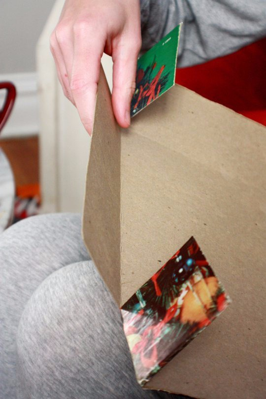
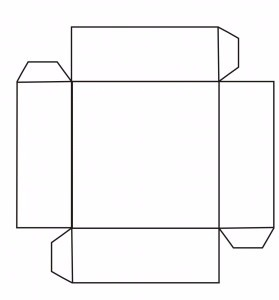
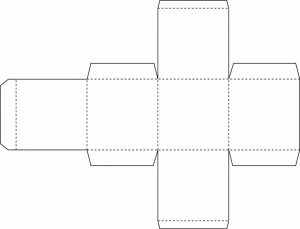
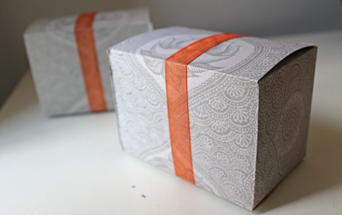

# DIY: Reaproveite qualquer papelão para fazer caixas

Se você é daquelas pessoas que fica com dó de jogar fora (mesmo que você recicle) qualquer tipo de papelão, caixa de embalagem ou objetos diversos com esse material, agora pode aproveitá-los para criar caixas que podem ser usadas na organização da sua casa, para guardar objetos pequenos, ou para fazer embalagens de presente com ar mais rústico. Veja como:

Imagem: Apartment Therapy

### Você vai precisar de:

- 1 estilete
- 1 superfície para cortar o papelão sem danificar sua mesa
- 1 régua de metal
- 1 material de papelão a ser reaproveitado (sugestão: capa de disco antiga)
- 1 lápis
- 1 tesoura
- 1 grampeador

Na Internet, você consegue encontrar moldes para todos os tipos de caixas. Eu trouxe aqui dois modelos para caixas quadradas – com e sem tampa. Clique nas imagens para ampliá-las e conseguir imprimir:

### Como fazer:

1. Imprima o molde que quer usar e corte com a tesoura para que ele fique no formato correspondente.
2. Passe a cola em sua superfície e, depois, cole no papelão que deseja reaproveitar. Atenção: cole no verso do lado do papelão que quer que apareça. O molde será a parte interna.
3. Depois de colar o molde no papelão, corte ao redor dele com o estilete, seguindo o formato.
4. Siga a marcação do molde para dobrar o papelão nas partes necessárias.
5. Nas abas, passe cola e junte firmemente. Se quiser, você pode usar o grampeador para deixar ainda mais firme.

Imagem: Woodenbee

Prontinho! Agora é só colocar a caixa em alguma estante ou gaveta ou usá-la como embalagem para algum presente. Se fizer isso, use fitas com aparência mais rústica ou sisal, para complementar o efeito.
