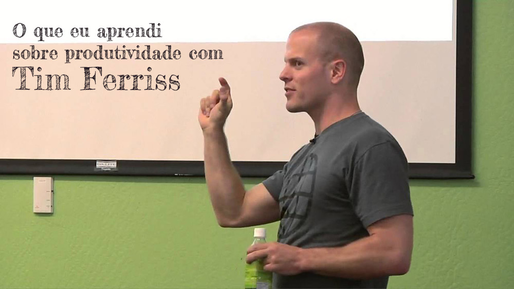

# O que eu aprendi sobre produtividade com Tim Ferriss – Parte 5

Esta é uma série que foi iniciada no blog [Vida Organizada](http://www.vidaorganizada.com/), mas trouxe para cá porque tem mais a ver com o conteúdo daqui. Trata-se de uma série de posts onde conto um pouco sobre o que aprendi sobre produtividade com Tim Ferriss através de seus três livros: Trabalhe 4 horas por semana, O corpo de 4 horas e The 4-hour chef (ainda sem versão em português).

## Excesso de informação

Não é novidade para ninguém que hoje sofremos com o excesso de informações. O Tim diz que não assiste mais noticiários (estou com ele), porque não acrescentam em nada e são pura perda de tempo. Se for algo importante, você ouvirá alguém comentando e pode exercitar seu poder de relacionamento conversando com ela e deixando que ela explique o que houve. Você também pode aproveitar, quando passar em frente a uma banca de jornal, para dar uma olhada nas manchetes de capa, e isso é o suficiente.

Antes mesmo do Tim, eu já vinha fazendo isso. Primeiro, porque percebi que as notícias são sempre ruins e me fazem ficar meio sem esperança com relação ao mundo e os seres humanos. Percebi que não estava me agregando em nada. Segundo, que perde-se tempo consumindo esse tipo de conteúdo. Quando você vê, se envolveu tanto que está escrevendo textão no Facebook. Eu não tenho interesse nisso. Acho que é de fundamental importância estarmos informados sobre o nosso trabalho, o nosso mercado, mas isso são informações de nicho que podemos fazer acompanhando feeds que nos interessam na Internet, por exemplo. Agora, ler ou assistir um jornal do começo ao fim como meu avô fazia, isso eu não faço há muito tempo.

O Tim diz que a gente tem que cultivar a ignorância seletiva. “A maior parte das informações gasta o seu tempo, é negativa, irrelevante para os seus objetivos e fora do seu âmbito de influência”, diz ele.

## Emergências no trabalho

Tim checa seus e-mails de trabalho às segundas-feiras, durante o período de uma hora. E só. Ele já orientou as pessoas que trabalham para ele que não quer saber de urgências – então as urgências são resolvidas sem chegar até ele. Ele diz que ou as urgências pararam de acontecer, ou o pessoal está dando conta do recado. Nós ficamos muito dependentes dessas urgências no dia a dia, justificando o uso do celular na praia, viajando com a família, ou mesmo de noite, depois do horário de trabalho. Via de regra, muitos problemas se resolvem sozinhos mas as pessoas ficam desesperadas demais para esperar isso acontecer ou resolverem por si mesmas, e começam a contatar todo mundo ao redor. O Tim diz que a gente tem que se eliminar sempre que possível como gargalo de informações e delegar o máximo que puder.

Tem muito a ver com o GTD quando a gente para e se pergunta se é a melhor pessoa para fazer aquela atividade. Se você já se pegou no dia a dia executando uma tarefa que sabe que poderia ser feita de maneira muito melhor por outra pessoa, por que você está fazendo? Não se trata de ser mimado e fazer apenas o que gosta, mas de investir seu tempo, talento e energia de forma correta.

## Leituras

Adoro quando ele fala sobre leituras, porque existe uma espécie de culto ao intelecto que, de verdade, é maravilhoso se o seu negócio for acadêmico. Para quem trabalha com negócios, o Tim define dois tipos de leituras necessárias: a leitura de trabalho, voltada para resultados, e a leitura para relaxar. Basicamente, a leitura voltada para resultados é aquela que você lê o que te interessa. Não precisa ler o livro do começo ao fim – leia os capítulos que precisa, rabisque, pesquise, alterne entre uma ideia e outra. Ele acha absurdo alguém ler um livro chato ou desnecessário apenas para dizer que leu o livro inteiro! “Começar alguma coisa não significa automaticamente que você tem que terminá-la”, diz. “Desenvolva o hábito de não acabar o que for chato ou improdutivo, a menos que seu chefe mande você terminar”.

Leitura para relaxar, no entanto, é aquela que você faz sem compromisso – senta no sofá e curte o que está lendo, sem pressa.

Ele tem até um roteiro sobre como aprender alguma coisa super bem sendo autodidata. Na verdade, o livro 4-hour chef é inteiro sobre esse assunto, mas no Trabalhe 4 horas ele também fala um pouco, que é:

1 – Se você quer aprender a fazer algo, não vá atrás de livros “como fazer isso”. Encontre os melhores do mundo que fizeram o que você quer aprender e leia seus relatos auto-biográficos.

2 – Utilize o livro para gerar perguntas inteligentes e específicas, contate os autores via telefone e e-mail e bata um papo. Ele disse que conseguiu sucesso em 80% dos casos.

3 – Leia apenas as partes do livro que forem relevantes para os passos imediatamente próximos, o que leva cerca de 2 horas. Ele já tinha um modelo (que criou) para contatar os autores tanto via e-mail quanto via telefone.

## Dicas finais

- Entre em jejum de mídia durante uma semana.
- Não leia jornais, revistas.
- Não ouça audiobooks ou rádios que não sejam musicais. Música é ok.
- Não assista TV, a não ser um filme, para se distrair.
- Não leia livros, a não ser algum de ficção antes de dormir, para se distrair.
- Não navegue na Internet enquanto estiver trabalhando.
- Todos os dias, na hora do almoço, pergunte a um colega ou ao garçom do restaurante se aconteceu alguma coisa importante hoje no mundo, porque você não conseguiu ler o jornal. Pare de fazer isso assim que perceber que a resposta não afeta em nada a sua vida.

Faça o teste durante uma semana e depois me conte como se sentiu. Spoiler: você ficará chocado como conseguirá trabalhar mais e ter tempo, além de não ficar tão cansado mentalmente. Experimente!
