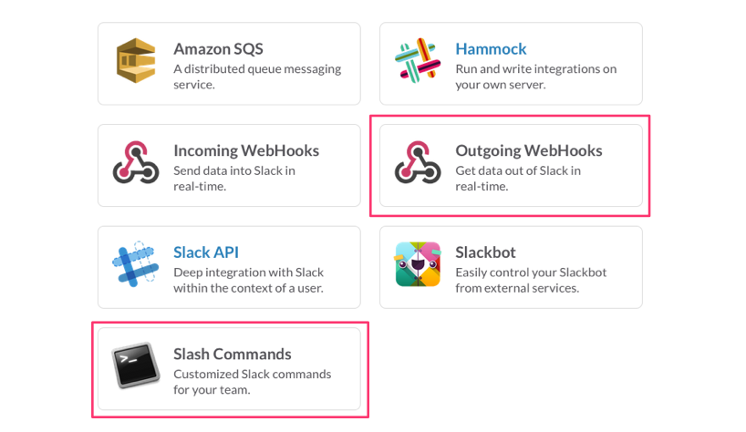
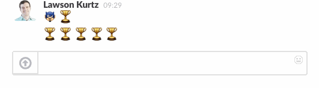
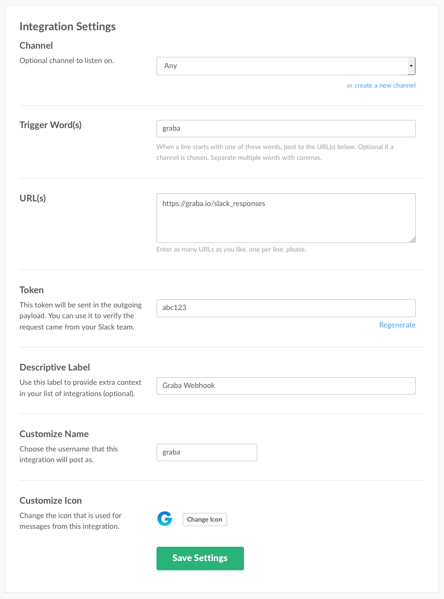
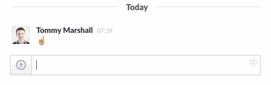
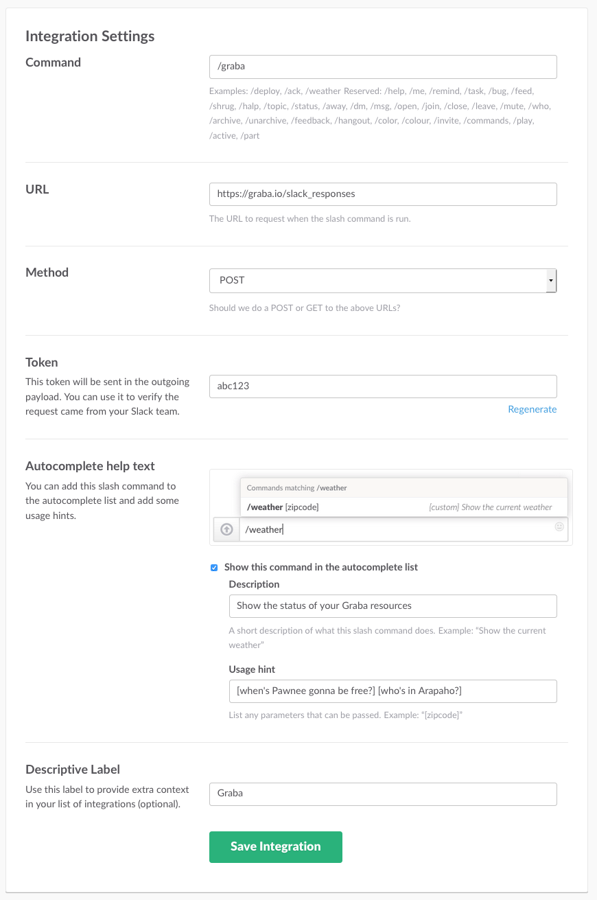

# Slack on Rails

Back in the days of [Campfire](https://campfirenow.com/), [Hubot](https://hubot.github.com/) was an essential companion to the company chatroom. Hubot was great for the automation of some simple tasks, but the performance of more complex tasks involving external services often seemed more complicated than necessary. And the performance of private tasks was completely impossible. Campfire simply doesn't allow for a better solution.

Now it's 2015 and [Slack](https://slack.com/) fever is in full tilt. Slack offers numerous advantages over Campfire, but without question, the most powerful is a greatly enhanced ability to use the chatroom as an interface to other services through its powerful integrations.

Writing custom service integrations for your chatroom is easier than ever before. At Viget, we use Slack as an interface to a few of our internal apps. In this post you'll discover exactly how easy it is to build these integrations into an existing Ruby on Rails app.

## Creating a Rails Slack Service

### Choosing Your Integration Methods

Slack offers a number of ways to interact with your company's chat data.

[](https://camo.githubusercontent.com/4bd601451f8a3fcc1b7025a85607e321e7897134/68747470733a2f2f73332e616d617a6f6e6177732e636f6d2f6b7572747a6b6c6f75642e636f6d2f73732f53637265656e5f53686f745f323031352d30322d32345f61745f30382e31362e33312e706e67)

For the purposes of a simple command-and-response service (an app that listens to your coworkers' commands, performs some action, and replies with handy info), Slash Commands and Outgoing WebHooks are perfect.

Let's take a closer look at each of these types of integrations.

### Outgoing WebHooks

Outgoing WebHooks allow your app to receive Slack messages, and respond publicly to the channel (the responses are visible to all users in the channel).

#### Example Outgoing WebHook Interaction

[](https://camo.githubusercontent.com/0e0cea384f696d57bfd6b5c2f7f6118d9c86d1ff/68747470733a2f2f73332e616d617a6f6e6177732e636f6d2f6b7572747a6b6c6f75642e636f6d2f5f64656d6f732f67726162612d736c61636b2d64656d6f2d322e676966)

#### Slack Configuration

Choose to receive either A) messages beginning with a trigger word from any channel, or B) all messages from a particular channel.

[](https://camo.githubusercontent.com/6eb42d13215986894ba7544a32e8f293451c9480/68747470733a2f2f73332e616d617a6f6e6177732e636f6d2f6b7572747a6b6c6f75642e636f6d2f5f64656d6f732f67726162612d776562686f6f6b2d636f6e6669672e706e67)

#### Receiving

Slack will make a POST request with a payload similar to the following:

```
1. tokena1b23c4d5e6f7g
2. team_idT1234
3. channel_idC1234567890
4. channel_name
5. timestamp1355517523.000005
6. user_idU1234567890
7. user_name
8. graba who's on first?
9. trigger_wordgraba
```

#### Responding

Respond as JSON, with your message at the key `text`.

```
1. This is my response.
```

### Slash Commands

Slash Commands allow your service to receive command messages (invisible to other users) and respond privately to the user issuing the command.

#### Example Slash Command Interaction

[](https://camo.githubusercontent.com/fbe908e5873de32acf1fbd29d35d9e1da2032e84/68747470733a2f2f73332e616d617a6f6e6177732e636f6d2f6b7572747a6b6c6f75642e636f6d2f5f64656d6f732f67726162612d736c61636b2d64656d6f2e676966)

#### Slack Configuration

[](https://camo.githubusercontent.com/d2a27b8e282813075b573d3fe9816817d32d6ad3/68747470733a2f2f73332e616d617a6f6e6177732e636f6d2f6b7572747a6b6c6f75642e636f6d2f5f64656d6f732f67726162612d736c6173682d636f6d6d616e642d636f6e6669672e706e67)

#### Receiving

Slack will make a POST request with a payload similar to the following:

```
1. tokena1b23c4d5e6f7g
2. team_idT1234
3. channel_idC1234567890
4. channel_name
5. user_idU1234567890
6. user_name
7. command/graba
8. book me something slick
```

#### Responding

Text response will be relayed to the user as the command response. (No JSON.)

### Updating Your Rails App for Slack

Once the Slack configuration is complete, the easy part begins. Adding Slack integration endpoints to an existing Rails app is a trivial affair.

#### config/initializers/slack.rb

First we'll add our Slack integration tokens to our app so that we'll be able to authenticate requests made to our service's Slack endpoint.

You could also put this in `config/secrets.yml` if you'd prefer. It's your world; I'm just blogging in it.

We're reading the tokens from `ENV`, so be sure to actually set that environment variable (e.g. `SLACK_TOKENS=a1b23c4d5e6f7g,a9b8c7d6e5f4g3`).

```
1. moduleSlack
2. TOKENSfetchSLACK_TOKENSsplit
```

#### config/routes.rb

```
1. resources slack_responsescreate
```

#### app/controllers/slack\_responses\_controller.rb

Now Slack message and command POSTs are flowing into our `SlackResponsesController`. In this controller we only need to account for the required response difference between Slash Commands and normal Slack messages. (We can do this by checking for a `:command` parameter in the POST. We delegate all responsibility for creating the response to a `Responder`.

```
1. classSlackResponsesControllerApplicationController
2. skip_before_filter verify_authenticity_token
3. before_filter verify_slack_token
4. create
5. render nothingstatusreturnunless responderrespond
6. # Respond differently to Slash Command vs Webhook POSTs
7. # See `Responding` sections above for the require difference.
8. paramscommandpresent
9. render  responderresponse
10. render  responderresponse
11. private
12. responder
13. @responderSlackResponderparams
14. verify_slack_token
15. render nothingstatusforbiddenreturnunlessSlackTOKENSincludeparamstoken
```

#### lib/slack/responder.rb

This is where the magic happens. It's up to you to turn the Slack message into a useful reply within `#response`. (If your service needs more information than the message, simply pass the additional info into the responder object during instantiation.)

```
1. classSlackResponder
2. initializemessage
3. @message message
4. respond
5. responsepresent
6. response
7. @responseYou asked: message
8. private
9. attr_readermessage
```

[This](https://gist.github.com/ltk/8bfa829729fb2ddca155) is what our responder looks like for Viget's conference room management service [Graba](http://graba.io/).

---

That's it! Adding Slack integrations to your existing Rails services is straightforward and makes everyone's life easier. So what are you waiting for? Happy Slacking.
