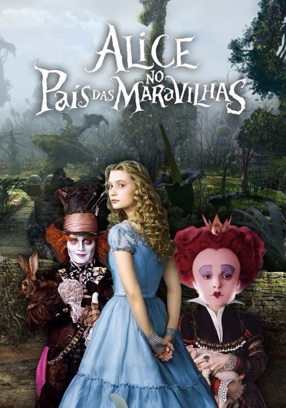
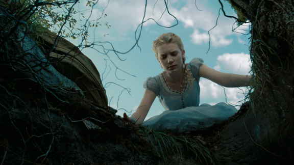
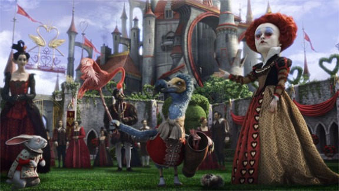
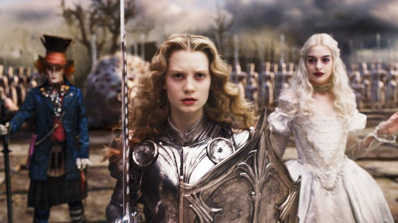

# [Crítica] Alice no País das Maravilhas

O conceito de re-conto permeia toda a produção do filme da **Disney** encabeçado por **Tim Burton**, não só pelas dezenas de outras adaptações do romance de **Lewis Carroll**, mas também por apresentar a personagem-título vivendo outros paradigmas, que não só os de discutir os devaneios que teve ao ter contato com o mágico mundo visitado em sua infância. Aproximadamente dez anos após os eventos do livro, Alice (**Mia Wasikowska**) não se lembra da viagem ácida que fez no passado, sempre relegando estes eventos a lembranças de sonhos, destacando um ou outro elemento enquanto frequenta uma festa pomposa, repleta de socialites.

Já próxima da fase adulta, Alice vê em si a responsabilidade de salvar sua família da crise financeira que a acometeu desde que sua mãe (**Lindsay Duncan**) ficou viúva, restando à garota um casamento forçado com uma figura efeminada, que certamente não supriria quaisquer de suas necessidades maritais, factoide este aplacado, claro, pelo fato desta obra ser uma fábula infantil.

Para Alice, mais interessante é dar vazão à perseguição ao Coelho. A busca pela clarividência dos fatos esquecidos pela personagem principal ocorre em meio a um grotesco cenário, com uma paleta de cores que não tem identidade, nem ser clara o suficiente para remeter aos desenhos animados dos tempos áureos de **Walt Disney**, mas não tão escura o suficiente para reproduzir o barroco comum da filmografia de **Burton**. É curioso como a completa falta de espírito alastra-se na fita tanto quanto com a representação de sua heroína, fazendo se perguntar se o erro não é proposital, desconsiderando a costumeira incompetência do diretor em apresentar histórias simples.

Os desencontros seguem com uma enorme gama de personagens descartáveis e sem carisma, praticamente proibindo qualquer rastro de empatia com a jornada. O script de **Linda Woolverton** é banguela, sem qualquer possibilidade de uma digestão saudável por parte do público. Tudo é motivado pelo péssimo e enorme conjunto de falhas e incongruências que fazem discutir a culpabilidade da ruim qualidade da obra, se da roteirista ou do diretor. **Burton** costuma transformar bons textos em apresentações demasiadamente incongruentes, fator que faz pesar a responsabilidade, uma vez que Woolverton coleciona muito menos pecados filmográficos que o cineasta.

 O Chapeleiro Louco de **Johnny Depp** nem é tão irritante se comparado ao pastiche do ator através dos anos com a saturação de Jack Sparrow, [Tonto](http://www.vortexcultural.com.br/cinema/critica-o-cavaleiro-solitario-2/), seu personagem em [**Sombras da Noite**](http://www.vortexcultural.com.br/cinema/critica-sombras-da-noite/) – também de **Burton** –, e, claro, se confrontado com o porre causado pela Rainha de Copas de **Helena Bonham Carter**. O grotesco da maquiagem e as colocações verbais não conseguem ofuscar todo o equívoco que é sua performance dramática, certamente um dos mais lamentáveis aspectos do já combalido filme.

Outra infeliz coincidência de erro dentro da trama é a aleatoriedade do tamanho de Alice, que em muitos momentos tomava algum tipo de poção que a fazia aumentar e diminuir de tamanho, uma tentativa óbvia de exibir que, para uma adulta, aquele mundo louco já não era cabível, tornando a inadequação o ponto máximo do incômodo que é terminar de assistir à película. Evidencia-se, assim, o quão banal é toda aquela caracterização grotesca e descabida, que serve quase que somente para desvirtuar os rumos dos personagens clássicos de **Lewis Carroll**. A falta de resolução de tamanhos também remete à dificuldade de propor uma identidade do filme, que demonstra problemas em demonstrar o variável entre pesado e/ou infantil, sendo enfadonho em ambos os aspectos.

O ponto de partida, onde o roteiro poderia finalmente ser maduro, é completamente ignorado, dando lugar a uma pífia batalha épica, que seria comum no futuro em outros filmes semelhantes – a lembrar-se de **Branca de Neve e o Caçador** – jogando por terra qualquer possibilidade de discussão minimamente interessante, tudo para apelar ao óbvio *hype* de [**Game of Thrones**](http://www.vortexcultural.com.br/tv/review-game-of-thrones-2a-temporada/) que tomava as noites da **HBO**.

De todas as criaturas birutas que habitam aquele cenário, Absolem (voz de **Alan Rickman**), que, assim como Alice, também está em fase de maturação, tornando física – também igual à personagem-título – sua transformação em algo maior. A máscara de mentor lhe serve perfeitamente, pois é no drama que Alice perceberá que são necessários uma movimentação maior e um desprendimento das certezas pseudo-amadurecidas que tem, tendo no encontro com a forma em casulo do seu mestre a ciência de tudo que viveu quando ainda era muito jovem.

Basicamente, o roteiro demoniza os deformados, mostrando-os como seres ressentidos e amargurados, que têm sua dor causada pela rejeição, uma vez que a tirania é vazada a partir de um deles. O pretenso crescimento espiritual da protagonista é interrompida por dancinhas constrangedoras com a intenção de quebrar o decoro da forçada cordialidade dos nobres presentes no mundo real, mas que, em essência, só ridicularizam a nova postura da personagem. **Mia Wasokwska**, aliás, não parece inspiradora mesmo quando consegue vencer os preconceitos que a cercam. A versão de **Burton** acerta em poucos aspectos, tendo uma trilha sonora acertada, mas que nem incorre como deveria. A sensação da análise final é de que **Alice no País das Maravilhas** é um equívoco completo: bobo, patético e deslocado.

Nota:
