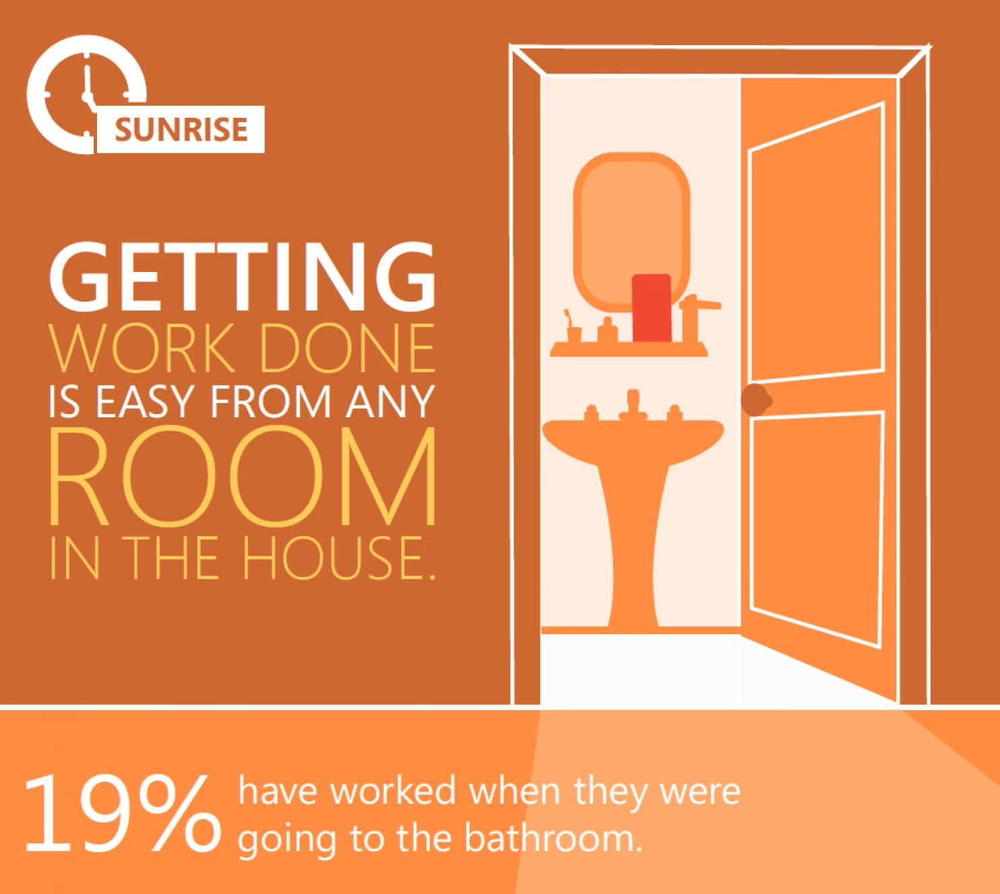
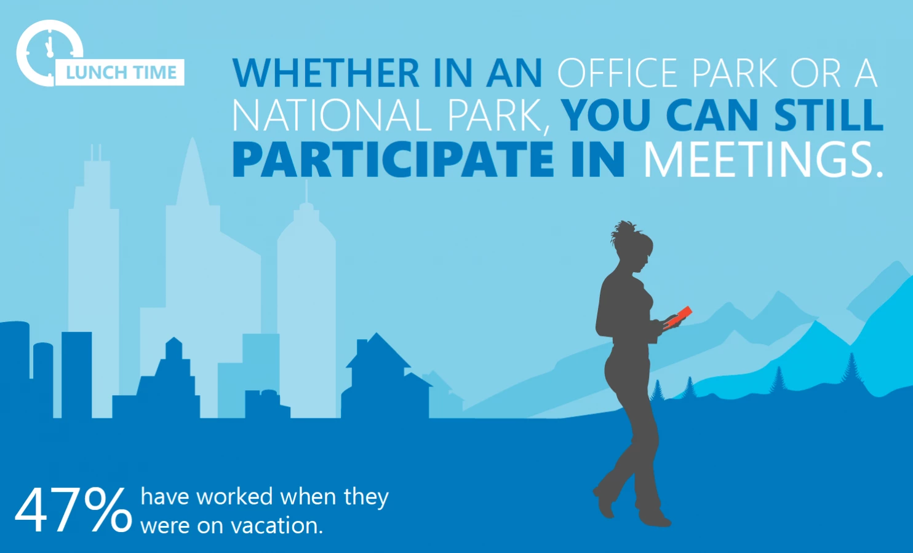
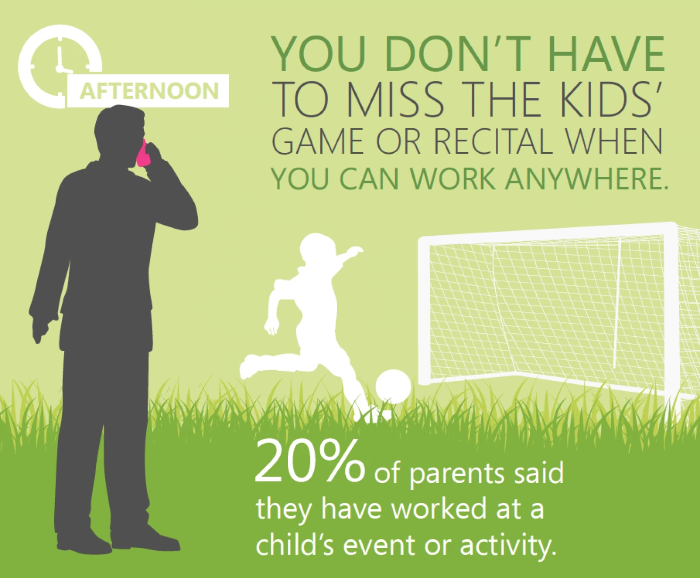
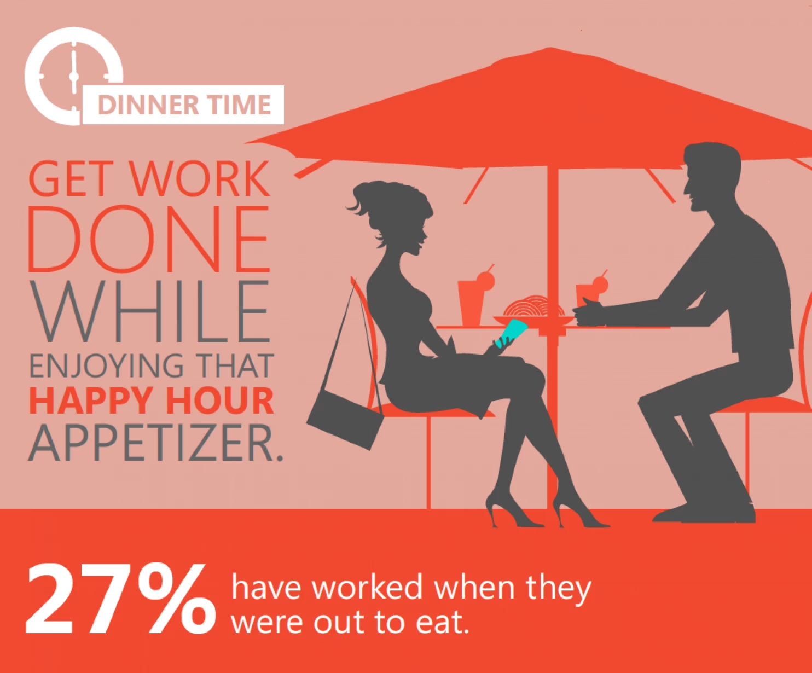
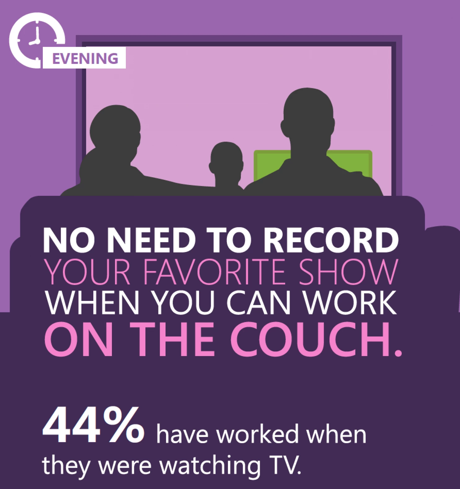
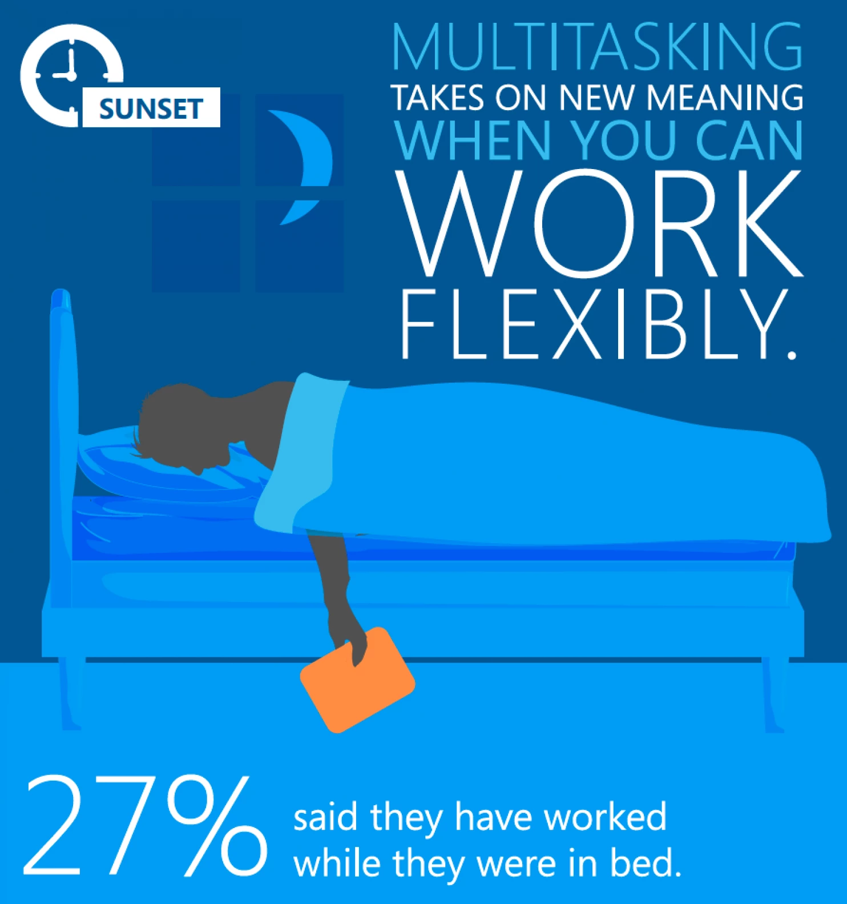

# This Microsoft ad paints a terrifying future where employees are working literally 24 hours a day

"#GetItDone: Office workers want technology to help them get things done anywhere, sunrise to sunset." That's the chipper headline of [a Microsoft infographic](https://www.microsoft.com/enterprise/newsletters/bi-newsletter/articles/december2013.aspx#fbid=70hCql5HtqN) that's currently [going viral on social media](https://twitter.com/JasonCross00/status/590993300892463106), although not for the reasons the company intended.

The ad pairs findings from a poll of employees' remote-work habits with vignettes about all the ways you can stay productive outside of the office, 24/7/365. For instance, you could be getting work done on the john like 19 percent of your colleagues, according to Microsoft.

Microsoft

On vacation? "You can still participate in meetings," the ad reminds you -- even while at a national park! No trip to the Grand Canyon is complete without a quick update from the sales team via video conference.

Microsoft

Starting to get worried about "work-life" balance? Fret not: "you don't have to miss the kids' game or recital when you can work anywhere." Just look at the World's Greatest Dad here, on the phone with his boss while his kid scores a soccer goal.

Microsoft

You can do work at dinner.

Microsoft

You can work from the couch.

Microsoft

You can even *work in your sleep* -- just look at this model employee passed out in bed, tablet in hand.

Microsoft

I have to assume that a final pane showing a worker dead in a coffin, arms crossed peacefully over a Surface Pro, was only omitted due to space considerations.

Kidding aside, this is an unhealthy, unproductive way to live. For instance, a recent study found that more people than ever are [trading sleep for work](http://www.washingtonpost.com/blogs/wonkblog/wp/2014/12/15/americans-are-trading-sleep-for-work-and-its-literally-killing-us/), and to the extent that less sleep is linked to myriad health problems, that bargain is killing us.

Exhausted workers -- like who have been up all night filling out Excel sheets in bed -- are [more likely to lie and cheat on the job](http://www.washingtonpost.com/blogs/wonkblog/wp/2014/07/22/science-were-more-likely-to-lie-and-cheat-when-were-tired/). And [study](http://www.theatlantic.com/business/archive/2014/09/science-tells-you-how-many-minutes-should-you-take-a-break-for-work-17/380369/) after [study](https://hbr.org/2010/05/for-real-productivity-less-is) has shown that [well-rested workers are more productive](http://www.nytimes.com/2013/02/10/opinion/sunday/relax-youll-be-more-productive.html?_r=0) and [perform better at their jobs](http://www.entrepreneur.com/article/237446). Ditto for workers [who take vacations](http://www.theatlantic.com/business/archive/2012/08/the-case-for-vacation-why-science-says-breaks-are-good-for-productivity/260747/) -- especially if they leave their work at home. Your brain needs downtime -- and if you're working at the dinner table, you're probably not getting it.

Microsoft frames never-ending labor and connectivity as a way to "[help balance life's demands](http://news.microsoft.com/2013/11/07/get-it-done-day-and-office-365-help-balance-lifes-demands/)." I'd counter that if you're writing earnings reports on the toilet, your work-life balance needs more life and less work.

Christopher Ingraham writes about politics, drug policy and all things data. He previously worked at the Brookings Institution and the Pew Research Center.
