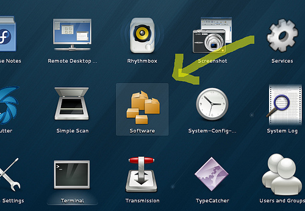
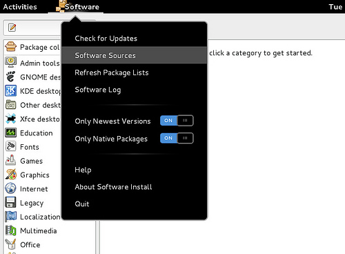
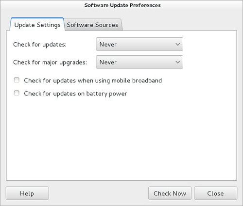

# [How to fix yum errors on CentOS, RHEL or Fedora](http://xmodulo.com/how-to-fix-yum-errors-on-centos-rhel-or-fedora.html "Permalink to How to fix yum errors on CentOS, RHEL or Fedora")

[Yum](http://yum.baseurl.org/) is a package management tool for installing, updating and removing rpm packages on RedHat-based systems. When you try to install a package with yum command, you may encounter errors for various reasons. In this post, I will describe under what situations yum errors can occur, and explain **how to fix yum errors**.

## 1. Fix 404 errors

**Symptom:** When you try to install a package with yum, yum complains that the URLs for repositories are not found, and throws 404 errors, as shown below.

```
Loaded plugins: fastestmirror
base                                                     | 3.7 kB     00:00
base/primary_db                                          | 4.4 MB     00:09
extras                                                   | 3.5 kB     00:00

http://mirror.steadfast.net/centos/6.4/extras/x86_64/repodata/e0e507c76dc5e5aa66c1f32632b9dc0a9759d97031ab5a028562a7cb7be6e294-primary.sqlite.bz2:

[Errno 14] PYCURL ERROR 22 - "The requested URL returned error: 404
Not Found"
Trying other mirror.

http://mirrors.seas.harvard.edu/centos/6.4/extras/x86_64/repodata/e0e507c76dc5e5aa66c1f32632b9dc0a9759d97031ab5a028562a7cb7be6e294-primary.sqlite.bz2:

[Errno 14] PYCURL ERROR 22 - "The requested URL returned error: 404
Not Found"
Trying other mirror.
```

You can get these 404 errors when the metadata downloaded by yum has become obsolete.

To repair yum 404 errors, clean yum metadata as follows.

$ sudo yum clean metadata

Or you can clear the whole yum cache:

$ sudo yum clean all

## 2. Fix connection failure errors

**Symptom:** You get "network is unreachable" or "couldn't connect to host" errors while running yum command.

```
Loaded plugins: fastestmirror, presto
Loading mirror speeds from cached hostfile
Could not retrieve mirrorlist
http://mirrorlist.centos.org/?release=6&arch=x86_64&repo=os error was
14: PYCURL ERROR 7 - "Failed to connect to
2a02:2498:1:3d:5054:ff:fed3:e91a: Network is unreachable"
Error: Cannot find a valid baseurl for repo: base

http://mirror.nexcess.net/CentOS/6.4/os/x86_64/repodata/repomd.xml:

[Errno 14] PYCURL ERROR 7 - "couldn't connect to host"
Trying other mirror.

http://mirrordenver.fdcservers.net/centos/6.4/os/x86_64/repodata/repomd.xml:

[Errno 14] PYCURL ERROR 7 - "couldn't connect to host"
Trying other mirror.

http://mirrors.cmich.edu/centos/6.4/os/x86_64/repodata/repomd.xml:

[Errno 14] PYCURL ERROR 7 - "couldn't connect to host"
Trying other mirror.
```

The error means that you cannot properly connect to repository servers for some reason. If you can still ping the servers without any problem, check if your system is behind a proxy. If you are running yum behind a proxy, but have not specified the proxy in the yum configuration, you will get connection failure errors like the above.

To configure a proxy in the yum configuration:

$ sudo vi /etc/yum.conf

```
[main]
proxy=http://proxy.com:8000
```

## 3. Fix metadata checksum errors

**Symptom:** You get "Metadata file does not match checksum" while running yum command.

```
epel/pkgtags                                             | 466 kB     00:14     
http://mirror.steadfast.net/epel/6/x86_64/repodata/pkgtags.sqlite.gz: [Errno -1] Metadata file does not match checksum
Trying other mirror.
```

You can get the metadata checksum errors when the metadata downloaded by yum has become outdated.

To repair yum checksum errors, clean yum metadata:

$ sudo yum clean metadata

## 4. Fix yum lock errors

**Symptom:** When you run yum on Fedora, you get the errors saying that "Another app is currently holding the yum lock."

```
Loaded plugins: langpacks, presto, refresh-packagekit
Existing lock /var/run/yum.pid: another copy is running as pid 1880.
Another app is currently holding the yum lock; waiting for it to exit...
  The other application is: PackageKit
    Memory : 178 M RSS (586 MB VSZ)
    Started: Tue Jul  9 09:43:17 2013 - 00:12 ago
    State  : Sleeping, pid: 1880
```

The culprit for this error is PackageKit which is responsible for auto updates on Fedora. The PackageKit process gets automatically started upon boot, holding the yum lock.

To fix the error, disable auto update checks on Fedora. In order to do so, click on "Software" on Fedora desktop to open software update preferences.

[](http://www.flickr.com/photos/xmodulo/9303261697/)

Then click on "Software Sources" menu like the following.

[](http://www.flickr.com/photos/xmodulo/9303261623/)

In the software update preferences, set "Never" for "Check for updates".

[](http://www.flickr.com/photos/xmodulo/9303261601/)

Once you reboot your desktop, you will no longer get yum lock errors.

## 5. Fix repository database read errors

**Symptom:** When you install a package with yum, you get the errors saying that "compressed file ended before the logical end-of-stream was detected"

```
Loaded plugins: langpacks, refresh-packagekit
Error: Error reading from file /var/cache/yum/x86_64/20/rpmfusion-free-updates/1461ed771601e7963990534c16584ab963d9c9f4eea94348ba357b93ab3c621f-primary.sqlite.bz2: compressed file ended before the logical end-of-stream was detected
```

This error can happen when yum command has been interrupted while it was downloading a repository database. So the saved database is incomplete, and considered corrupted.

To solve this problem, clean up yum database by running:

$ sudo yum clean metadata

## 6. Fix repository metadata read errors

**Symptom:** When you install or search for any package with yum, you get the following errors:

```
removing mirrorlist with no valid mirrors: /var/cache/yum/i386/6/updates/mirrorlist.txt
Error: Cannot find a valid baseurl for repo: updates
```

This error can happen due to yum metadata issues. To fix this problem, clean up yum data including metadata and local cache.

$ sudo yum clean all

### 311c95329ed03f5a3d4c092d5ff3cfc7.png Subscribe to Xmodulo

Do you want to receive **Linux FAQs, detailed tutorials and tips** published at Xmodulo? Enter your email address below, and we will deliver our Linux posts straight to your email box, for free. Delivery powered by Google Feedburner.

The following two tabs change content below.

#### [Dan Nanni](http://xmodulo.com/)

Dan Nanni is the founder and also a regular contributor of Xmodulo.com. He is a Linux/FOSS enthusiast who loves to get his hands dirty with his Linux box. He likes to procrastinate when he is supposed to be busy and productive. When he is otherwise free, he likes to watch movies and shop for the coolest gadgets.

Your name can also be listed here. [Write for us](http://xmodulo.com/write-us) as a freelancer.
