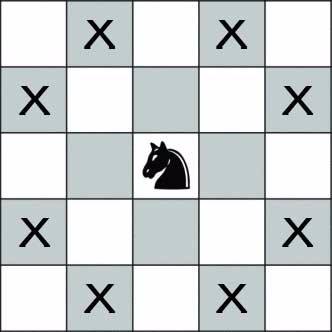
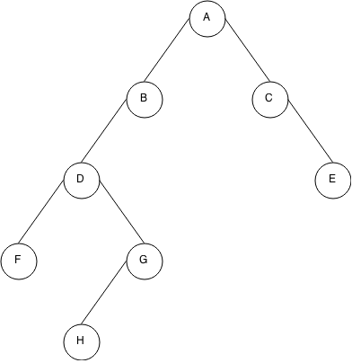
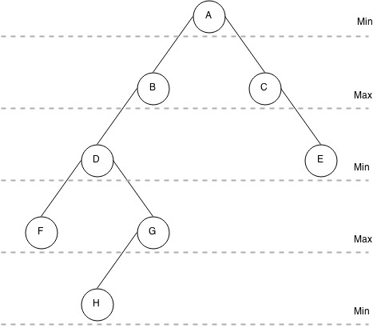
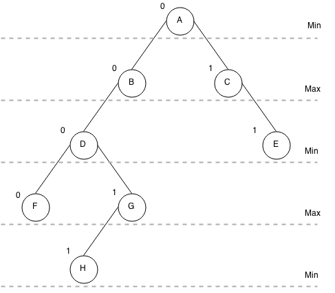

# Ruby and recursion - find out all possible chess knights movements using minimax algorithm

While at high school, I had been assigned to make a two person game in Artificial Intelligence studies based on chess figure - knight, where one player is human and other is computer on 4x4 field. Also, you can’t step on the same field where you or computer has already been. At first, I had to do that by hand - get all possible moves. After that, I needed to make a working example and I did it in Ruby.

In this article I’ll be explaining basic things, such as:

- how knight can move
- basic information about A.I.
- the beast called recursion
- what is minimax algorithm
- loading start game grid
- generating movement tree
- printing for visibility
- making basic moves

## The theory part

I will start off by explaining some essential theory which you might already know, if so - skip to next chapter.

---

### How does chess knight move?

If you ever have played chess, then you know that knight can be very powerful and dangerous piece on your chess table. From all chess pieces, knight moves the most unusual way. It can move to a square that is two squares horizontally and one square vertically, or two squares vertically and one square horizontally. So, if knight has the space, it can move 8 different squares from its current position.



---

### Basic information about Artificial Intelligence

Lets start by explaining each word as it is. Artificial means not real, fake, made or produced, that is mostly self explanatory. Intelligence, on the other hand, has quite harder explanation. It could mean huge knowledge, capability to learn something, it is associated with secret agencies and government itself and so on. But how these words are combined in IT science? In my opinion, Artificial Intelligence is capability of non-living things to think, learn, analyze and then act based on information and/or situation.

Nowadays, you can see movies full of A.I. robots, planes and other things which can do amazing things, but situation in real life is quite opposite, at least in full-scale robotics. There are self automated cars and planes, but making human-like robot is only in future. That is because, first of all, robots should be able to learn - and how do you learn? By experimenting, doing things and so on. But what makes you understand that you have learned/succeeded? It is the result itself. For example, you see fire, you touch it and it is hot, it burns you and you decide not to touch it again. But how would robot know that? It doesn’t feel the pain, doesn’t have conscious to tell good and bad aside. That is why A.I. needs some kind of data to be based on.

Why am I telling all this? Quite simple, to play against computer, it should know what to do, how to react on your moves and decide best possible move. That is why we, the programmers of new world, need to write some gibberish code to guide our fellow computer friend in the world of unknown. But then raises a question - hey, you programmed it, that doesn’t make it A.I. - self-thinking. That is true, but think of your favorite FPS game where computer could play against you, it is the same, but they act like humans, don’t they? It is how you programmed it - make it very complex, evolve the code and maybe, someday it will start writing code for himself(itself). So, to play against my knight-computer we need to tell it how to play. In my assignment I needed to use minimax algorithm for computer decision making process.

---

### Few words about recursion

Recursion is programming concept, which, by its idea, lets function call itself. It is pretty easy to understand, however, implementing such concept can get you some headache, because it has high chance you will go in infinite loop and get stack level too deep error. To avoid this, you clearly need to know what you want to do, what is the next step for function and, more importantly, what is the stopping condition/point. For me, the ending point was the hardest part while I was learning LISP programming language.

###### Example factorial function:

```
fact(n)  
   n > 
    n * fact(n - )
    # puts n

    # In theory, that puts is only executed when deepest level -1 of recursion is reached,
    # that is, when fact returns 1 and steps back.
    # In this example it would break recursion because fact works on returned values, puts returns nil
```

As you can see, I have condition check for **n** which would decide if it is stopping point or next function call **(n - 1)**. What recursion also means is that it goes to deepest possible level (end point you decide) and goes back level by level returning value from deeper level so you can intercept value. As useful as recursion is, it shouldn’t be used when simple loop can do the thing simpler.

---

### What is minimax algorithm?

Minimax algorithm tries to minimize the risk of losing. In short, computer will play at it’s best to not let you win. For minimax algorithm to work, game needs a tree of all\* possible moves for computer to decide which route through tree to take.

> \*All possible moves in this game because it is short, but in such games like standard chess it is not possible because of the huge scaling - [10^120 possible variations], so most of the times tree is being generated dynamically.



Tree generating happens by code (game conditions) itself and it doesn’t involve algorithm directly but while tree is being generated, algorithm starts its work by setting first nodes state(min/max). In next levels of tree (deeper ones) state is based on previous levels state(oposite of it).

###### Example:

> If we set first nodes state as **min**, next level nodes must be **max**, after that level, **min** and so on.



While tree is being generated, algorithm is searching for deepest level, when found, it sets that nodes rank (**0/1**) based on nodes state. If state is **min**, rank will be **1**, if **max** then **0**. After that, tree generation continues by backing up one level (because of recursion), algorithm checks if there are all child nodes with rank set (which means it is looked), if so, algorithm sets rank based on state (min/max). If there are any child nodes without rank set, algorithm follows tree generation process (it will go deeper due recursion), and repeats it self. When all those children have rank set and algorithm is at point where parent has 2 or more children, it choses rank between children rank values based on current levels state.

###### Example

> Lets do this step by step:
>
> - Algorithm finds all end nodes (H, F, E) and sets their value based on state: min=1, max=0
> - Next step on E branch, algorithm moves back to C, checks for all children ranks and picks maximum of them, so [1].max is 1.
> - Moving to A, algorithm finds that B node is missing rank, lets find it.
> - H is 1, so G must be 1 too, because it has only one child ([1].max)
> - F is 0, but what about D? It has min state, so: [0, 1].min means that D is 0.
> - Now, we can get B, which is 0 because D is 0 too. ([0].max)
> - Finally, we can get A which has child’s B and C, so [0, 1].min is 0.



When all that is done, first node should have **0** or **1** as rank. Based on that rank, computer will determine the best move in each position.

---

## The programming part

For this blog post, I'll be using reduced and cleaner code as it was for actual game. Program will consist of 3 files:

- *main.rb* which will launch this simple application.
- *grid.rb* for Grid class and manipulations with grid.
- *tree.rb* for Tree class that will generate tree and implement minimax algorithm.

---

Comments in code are self explanatory

```
class   
  # Some constants for easier use
  PLAYER_1 = 
  PLAYER_2 = 

  CURRENT_POSITION = 
  CURRENT_X = 
  CURRENT_Y = 

  # Creates some default 4x4 game grid with 2D arrays
  make_grid
    grid = [
      [, , , ],
      [, , , ],
      [, , , ],
      [, , , ]
    ]

    # Players location [player_info1, player_info2] where player_info[index, x, y], last even and odd values from grid
    players = [[, , ], [, , ]]

    # Creates first game grid
    grid_object = .new(grid, players[PLAYER_1], players[PLAYER_2])
    # Prints out starting grid
    print_grid(grid_object.grid)
    # Generates tree
    tree_object = .new.generate(grid_object.grid, players[PLAYER_1], players[PLAYER_2])
    # Prints full tree
    print_tree(tree_object)
  

  private
  # Helper printing methods, fugly.
  print_grid(grid, right = )
    grid.each  |i|
      val = 
      i.each  |j|
        val = val + "[#{j >  ? j.to_s.rjust(, )  }] "
      
      puts "#{right}#{val}"
    
    puts "#{right}-------------------"
    
  

  print_tree(tree_object, right = )
    (tree_object)
      print_grid(tree_object.grid, right)
      right = right + 
      tree_object.moves.each  |node|
        print_tree(node, right)
      
    
  

# Game initializer
require_relative 'tree'  
require_relative 'grid'

.new.make_grid
```

---

Comments in code are self explanatory

```
class    
  # So we access from outside
  attr_accessor :grid, :moves, :state, :rank

  # Sets default values for object
  initialize(grid_array, player1_info, player2_info)
    # Needs to_s and eval because for some reason Ruby keeps it by reference even if I dup or clone
    @grid = eval(grid_array.to_s)
    # Will hold all possible moves based on current grid
    @moves = []
    # State - min/max
    @state = 
    # Rank - 0/1
    @rank = -

    # Sets both player locations on grid, player_info = [index, x, y]
    @players = [player1_info, player2_info]
    set_player_coords(player1_info)
    set_player_coords(player2_info)
  

  # Helper methods
  # Get player info - [index, x, y]
  player_info(player)
    @players[player]
  

  # Finds who's move it is
  current_player
    @players[PLAYER_1][CURRENT_POSITION] < @players[PLAYER_2][CURRENT_POSITION] ? PLAYER_1  PLAYER_2
  

  # Changes current players info
  current_player_set(array)
    @players[current_player] = array
  

  # Finds current players index
  current_index
    @players[current_player][CURRENT_POSITION]
  

  # Finds current players x
  current_x
    @players[current_player][CURRENT_X]
  

  # Finds current players y
  current_y
    @players[current_player][CURRENT_Y]
  

  # Determines best next move for computer
  find_best_way
     @state == 'max'
      way = moves.max{ |a, b| a.rank <=> b.rank }
    elsif @state == 'min'
      way = moves.min{ |a, b| a.rank <=> b.rank }
    
  

  # Sets state based on previous state
  set_state(prev_state)
     prev_state == 'max'
      @state = 'min'
    elsif prev_state == 'min'
      @state = 'max'
    
  

  # Sets rank based on current state
  set_rank
    ranks = @moves.collect{ |x| x.rank }
     @state == 'max'
      @rank = ranks.max
    elsif @state == 'min'
      @rank = ranks.min
    
  

  # Finds all possible moves from current move in specific grid
  .find_valid_movement(grid, x, y)
    valid_coordinates = [
      [-,-],[-,-],[ ,-],[ ,-],
      [-, ],[-, ],[ , ],[ , ]
    ]
    move_to = []

    valid_coordinates.each  |array|
      x_coordinate = array[] + x
      y_coordinate = array[] + y
        outside_area?(x_coordinate, y_coordinate)
      move_to << [x_coordinate, y_coordinate]  grid[x_coordinate][y_coordinate] == 
    

    move_to
  

  # Helper method to check coords
  .outside_area?(x, y)
    x <  || y <  || x >  || y > 
  

  private

  set_player_coords(player_array)
    position = player_array[CURRENT_POSITION]
    x = player_array[CURRENT_X]
    y = player_array[CURRENT_Y]

    @grid[x][y] = position
```

---

Comments in code are self-explanatory

```
class    
  # Generates tree from given grid and locations, first state is max, returns full tree
  generate(grid, player_1, player_2)
    new_grid_object = .new(grid, player_1, player_2)
    new_grid_object.set_state('max')
    generate_moves(new_grid_object)
    new_grid_object
  

  # Recursive function
  generate_moves(grid_object)
    # Finds all possible moves based on current grid
    move_to = .find_valid_movement(grid_object.grid, grid_object.current_x, grid_object.current_y)

    # Iterates through all possible next moves
    move_to.each_index  |i|
      # Determines where to put next move based if next_position is odd or not
      next_position = grid_object.current_index+
      new_player_info = [next_position, move_to[i][], move_to[i][]]
      player_1 = next_position.odd? ? new_player_info  grid_object.player_info(PLAYER_1)
      player_2 = next_position.odd? ? grid_object.player_info(PLAYER_2)  new_player_info

      # Creates new grid based on new moves
      new_grid_object = .new(grid_object.grid, player_1, player_2)
      # Adds new grid to old grids moves array
      grid_object.moves << new_grid_object
      # Sets new grids state based on previous state
      new_grid_object.set_state(grid_object.state)
      # Goes deeper in recursion with newly created grid
      generate_moves(new_grid_object)
      # When recursion has come back (reached deepest level), old grid gets rank based on childs it has
      grid_object.set_rank
    

    # When reached deepest level of tree, sets rank based on state
    set_last_rank(grid_object)  move_to.empty?
  

  private

  set_last_rank(grid_object)
     grid_object.state == 'min'
      grid_object.rank = 
     grid_object.state == 'max'
      grid_object.rank =
```

---

### Launching tree generator

Write **ruby main.rb** where you have save main.rb and output should be same as this: [example output]

---

### How to play?

Well, this example isn't completely playable because it doesn't have the functionality. I won't be talking about that in here, but if you wish, you can visit [GitHub page] and download little bit messier and undocumented full code.

---

[10^120 possible variations](http://en.wikipedia.org/wiki/Solving_chess)

[example output](https://gist.githubusercontent.com/GuskiS/ffc30779d6ba9a6142ee/raw/4765bb1b9437df8f9f98480348bac11919c46d17/gistfile1.txt)

[GitHub page](https://github.com/GuskiS/2person-knight-s-tour-game-in-ruby)
