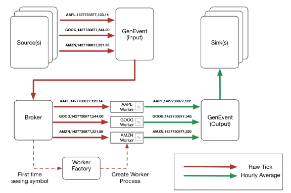

# A Simple CEP Processor in Elixir

[CEP](http://en.wikipedia.org/wiki/Complex_event_processing) is the term used to describe systems that process streams of events. In this post, we will use the the data structures created in a [previous post](http://blog.jonharrington.org/simple-sliding-windows-in-elixir/) and a GenEvent server to create a simple CEP processor in Elixir.

### Introduction

The application we are creating is going to recieve stock quotes ("ticks") for different stock symbols and output hourly average prices for each stock. Rather than connect to a live stock feed we will simulate a real time stock feed using random data. Our application design is as follows:



A GenEvent server receives events and passes them on to any process that has registered as a handler. Every registered handler receives every message (we can't subscribe to a subset of topics like you can with message queues) so our application has two GenEvent servers, one that recieves input tick events from our "sources" and one that recieves output average events from our workers and passes them on to our "sinks".

Our broker recieves ticks from the input GenEvent server. It then looks up the pid of the process registered for that tick symbol, if it finds it passes the event on to the worker, otherwise it passes it on to the worker factory.

Our worker factory recieves tick events and starts a new worker process to handle the event. Finally, our workers have a timed window data structure that they update every time they recieve an event. They then pass on the 60 minute average to the output GenEvent server. Ok, lets see some code.

(All the code can be found in the [GitHub repo](http://github.com/prio/excep) but I recommended typing the code as you go and only referencing the repo if you get stuck.)

**Note** You will need to add the code from a [previous blog post](http://blog.jonharrington.org/simple-sliding-windows-in-elixir/) and [timex](https://github.com/bitwalker/timex) to your dependencies.

```
  defp deps 
    [{:window, github: "prio/exwindow"},
     {:timex, github: "bitwalker/timex"}]
```

### A Source

Our source just generates random data to test our application so I won't go into it in any detail. A real world source would read this data from a feed or a file (if you were doing backtesting for example). It gets passed the input GenEvent process on startup and after every "interval" period, it sends it a tick event.

```
defmodule Source   
   GenServer
   Timex

  def start_link(events, interval, symbol) 
    GenServer.start_link(__MODULE__, {events, interval, symbol})
  

  def price 
    :random.seed(:erlang.())
    :random.uniform() + 
  

  def start_timer(state) 
    :erlang.send_after(state.interval, self(),
                       {:tick, {state.symbol, state., price()}})
  

  def init({events, interval, symbol}) 
    state = %{events: events, symbol: symbol,
              : trunc(.to_secs(.)), interval: interval}
    start_timer(state)
    {:ok, state}
  

  def handle_info(event, state) 
    GenEvent.sync_notify(state.events, event)
    ups = %{ state | : state. + state.interval/}
    start_timer(ups)
    {:noreply, ups}
```

### The Factory

```
defmodule WorkerFactory   
   GenServer

   start_link(events) 
    GenServer.start_link(__MODULE__, events)
  

   handle_cast(event = {:tick, {symbol,  }, events) 
    {, pid} = Worker.start_link(events, symbol)
    Process.register(pid, symbol)
    GenServer.cast(pid, event)
    {:noreply, events}
```

### The Broker

Our broker is the process that will recieve tick events and decide where to send them.

```
defmodule Broker   
   GenEvent

   (factory) 
    {, factory}
  

   handle_event(event = {:tick, {symbol,  }, factory) 
     Process.whereis(symbol) 
       -> GenServer.cast(factory, event)
      pid -> GenServer.cast(pid, event)
    
    {, factory}
```

Our Broker recieves the factory process on start up and sends events to it if it can't find the correct worker process.

### The Workers

Our worker code, will be fairly simple. One startup it creates a new timed window, every time it recieves a raw tick it adds it to the timed window and then sends the hourly average to the ouput GenEvent process.

```
defmodule Worker   
   GenServer

  def start_link(events, symbol) 
    GenServer.start_link(__MODULE__, {events, symbol})
  

  def init({events, symbol}) 
    window = Window.timed()
    {:ok, %{symbol: symbol, events: events, window: window}}
  

  def handle_cast({:tick, {symbol, timestamp, value}}, state) 
     w = Window.(state.window, {timestamp, value})
      = Enum.(w)/Enum.count(w)
     GenEvent.sync_notify(state.events, {:, {symbol, timestamp, }})
     {:noreply, %{ state | window: w}}
```

### The Sink

Like the source module, our sink module is just a simple dummy useful for development. In real life you would probably use a sink to store the data to a database or a file (or both).

```
defmodule Sink   
   GenEvent
   Timex

  def handle_event({:, {symbol, timestamp, value}}, factory) 
     = .(timestamp, :secs) |> DateFormat.format!("{RFC1123}")
    IO.puts("#{date}: #{symbol} average: #{value}")
    {:ok, factory}
  

  def handle_event(_, factory) 
    {:ok, factory}
  
  

### Tieing it  together

 that  our code  inplace we need  tied everything together  start our processes, we  this  our Application module.
```

defmodule Cep do   
use Application

def start(\_type, \_args) do
import Supervisor.Spec, warn: false

```
{, input} = GenEvent.start_link
{, output} = GenEvent.start_link
{, factory} = WorkerFactory.start_link(output)
GenEvent.add_handler(input, Broker, factory)
GenEvent.add_handler(output, , )

children = [
  worker(Source, [input, , :aapl],  "apple"),
  worker(Source, [input, , :amzn],  "amazon"),
  worker(Source, [input, , :goog],  "google"),
]

opts = [strategy: :one_for_one, name: .Supervisor]
Supervisor.start_link(children, opts)
```

end
end   
```

### Running it

Ok, with everything in place we should now be able to test our application. If you run

```
 -S mix
```

and after 5 seconds you should start seeing averages being printed to the console. Play around with variables in the application module and see how hard you can make your CPU work :)

## Conclusion

We have seen how using GenEvent servers can decouple consumers/workers and producers. In the future this would allow us to easily add more "tick" consumers without having to modify the existing sources or sinks.

26 May 2015
on [elixir](http://blog.jonharrington.org/tag/elixir/), [erlang](http://blog.jonharrington.org/tag/erlang/), [cep](http://blog.jonharrington.org/tag/cep/), [genevent](http://blog.jonharrington.org/tag/genevent/)

Share this post on  
[Reddit](http://www.reddit.com/submit?url=http://blog.jonharrington.org/a-simple-cep-processor-in-elixir/&title=A%20Simple%20CEP%20Processor%20in%20Elixir)
[Twitter](https://twitter.com/share?text=A%20Simple%20CEP%20Processor%20in%20Elixir&url=http://blog.jonharrington.org/a-simple-cep-processor-in-elixir/)
[Facebook](https://www.facebook.com/sharer/sharer.php?u=http://blog.jonharrington.org/a-simple-cep-processor-in-elixir/)
[Google+](https://plus.google.com/share?url=http://blog.jonharrington.org/a-simple-cep-processor-in-elixir/)
