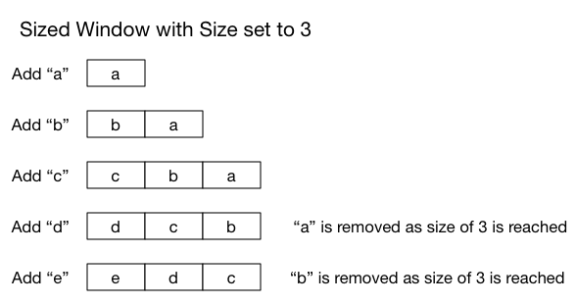
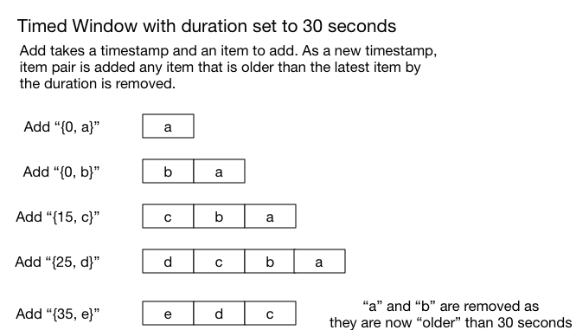

# Simple Sliding Windows in Elixir

## Custom data structures in Elixir

As part of some research I have been doing I wanted a sliding window data structure and thought it would be interesting to see how to implement custom data structures in Elixir.

**Note:** What follows is a very naive implementation, I was more focused on the interface and learning Elixir over performance but I would be very interested in more sophisticated implementations, so please comment.

### A sized sliding window

The first data structure I looked at is a sized sliding Window. The idea here is that we set the Window to a fixed sized and any new items added once the sized as been reached push the oldest item out of the Window.



Since the data structure is very close to a FIFO queue, we will base our implementation on on the erlang queue data structure.

Lets start off by writing a few tests to define our interface. We are going to call our structure Window.Sized.

```
defmodule Window.SizedTest   
   ExUnit.

  test "i can create a window" 
    w = %Window.Sized{ :  }
    assert w. == 
  

  test "i can add items to window" 
    w =  %Window.Sized{ :  } |>
         Window.Sized.() |>
         Window.Sized.() |>
         Window.Sized.() |>
         Window.Sized.() |>
         Window.Sized.()
    assert :queue.(w.items) == 
  

  test "a window slides" 
    w = %Window.Sized{ :  } |>
         Window.Sized.() |>
         Window.Sized.() |>
         Window.Sized.() |>
         Window.Sized.() |>
         Window.Sized.() |>
         Window.Sized.()
    assert :queue.(w.items) ==
```

So from experimenting with our tests we can see we can get by with just one function, add, but a user needs to know we are using a queue internally to process whats stored in the Window. This obviously needs to be improved and we will revisit it shortly.

```
defmodule Window.Sized   
  defstruct size: , items: :queue.new()

   (window = %Window.Sized{size: size, items: items}, item) 
    if :queue.len(items) == size 
      { q} = :queue.out_r(items)
      %{ window | items: :queue.in_r(item, q)}
    else
      %{ window | items: :queue.in_r(item, items)}
```

### A timed sliding window

A timed sliding Window works similarly to a sized Window, but rather than removing items once a size threshold has been reached we remove items based on a "time".



To keep things flexible, the definition of "time" and the resolution that is used is up to the end user. Lets write some tests to tease out the API.

```
defmodule Window.TimedTest   
   ExUnit.

  test "i can create a window" 
    w = %Window.Timed{ duration:  }
    assert w.duration == 
  

  test "i can add items to window" 
    w =  %Window.Timed{ duration:  } |>
         Window.Timed.({, }) |>
         Window.Timed.({, }) |>
         Window.Timed.({, }) |>
         Window.Timed.({, }) |>
         Window.Timed.({, })
    assert :queue.(w.items) == 
  

  test "a window slides" 
    w = %Window.Timed{ duration:  } |>
        Window.Timed.({, }) |>
        Window.Timed.({, }) |>
        Window.Timed.({, }) |>
        Window.Timed.({, }) |>
        Window.Timed.({, }) |>
        Window.Timed.({, })
    assert :queue.(w.items) ==
```

Yet again we see we need only an add function (that has the same signature as our Window.Sized), and yet again, we need to exposing the internal queue.

```
defmodule Window.Timed   
  defstruct duration: , items: :queue.new()

   (window = %Window.Timed{duration: duration, items: items}, {time, item}) 
    start = time - duration
    left = Enum.take_while(:queue.to_list(items), ({t, ) -> t > start )
    %{ window | items: :queue.in_r({time, item}, :queue.from_list(left))}
```

## Review (and Refactor)

So far our data structures are very simple, but the API is cumbersome and a user needs to know we are using a queue internally to process the data. It would also be nice for our end user to not care which type of Window they are using when they are writing algorithms to process a Windows data. In an object oriented language we would normally use an interface or base class to solve this, but in Elixir we can use protocols.

First, lets create some tests to help us focus on our API.

```
defmodule WindowTest   
   ExUnit.
  doctest Window

  test "i can create a sized window" 
      w = Window.sized()
      assert w. == 
  

  test "i can create a timed window" 
      w = Window.timed()
      assert w.duration == 
  

  test "a sized window slides" 
    w = Window.sized() |>
        Window.() |>
        Window.() |>
        Window.() |>
        Window.() |>
        Window.() |>
        Window.()
    assert Enum.count(w) == 
  

  test "a timed window slides" 
    w = Window.timed() |>
        Window.({, }) |>
        Window.({, }) |>
        Window.({, }) |>
        Window.({, }) |>
        Window.({, }) |>
        Window.({, })
    assert Enum.(w) ==
```

Ok, so not only have we now hidden the Window type once it has been created, we have also decided to make a Window Enumerable. We could have added our own count, sum etc. methods to our Window module, but why bother when Enum provides these functions already, and behaving like an Enumerable means we can take advantage of many other third party Elixir libraries.

So now that we know what we want our Window API to look like, lets create our Windowable protocol.

```
defprotocol Windowable   
    add(window, item)
    items(window)
```

Our Windowable protocol is very simple, and only requires a structure to implement two functions to participate. The first one of these, add, is obvious but we have also decided to require an items function. This will allow a structure to return its contents while hiding its internal implementation.

Next we will create our Window module, the module that actually works on Windowable structures.

```
defmodule Window   
   sized(size) 
    %Window.Sized{ size: size }
  

   timed(duration) 
    %Window.Timed{ duration: duration }
  

   (window, item) 
    Windowable.add(window, item)
```

Next, we need to go back and modify our structures so they behave as Windowable structures. We can also tidy up our unit tests but I will leave that as an exercise to the reader (you can see the tidied up tests in the [github](https://github.com/prio/exwindow) repo).

Lets create an implementation of Windowable for Window.Sized

```
defmodule Window.Sized   
  defstruct size: , items: :queue.new()

defimpl Windowable,  Window.Sized   
   (window = %Window.Sized{size: size, items: items}, item) 
    if :queue.len(items) == size 
      { q} = :queue.out_r(items)
      %{ window | items: :queue.in_r(item, q)}
    else
      %{ window | items: :queue.in_r(item, items)}
    
  

   items(window) 
    :queue.to_list(window.items)
```

and for Window.Timed.

```
defmodule Window.Timed   
  defstruct duration: , items: :queue.new()

defimpl Windowable,  Window.Timed 

   (window = %Window.Timed{duration: duration, items: items}, {time, item}) 
    start = time - duration
    left = Enum.take_while(:queue.to_list(items), ({t, ) -> t > start )
    %{ window | items: :queue.in_r({time, item}, :queue.from_list(left))}
  

   items(%Window.Timed{items: items}) 
    Enum.map(:queue.to_list(items),  { i} -> i )
```

and finally we need to create our Enumerable implementation for our two Window types

```
defimpl Enumerable,  [Window.Sized, Window.Timed]   
   count(window)    
    {, length(Window.items(window))}
  

   member?(window, value)    
    {, Enum.member?(Window.items(window), value)}
  

   reduce(      {:halt, acc}, _fun),    {:halted, acc}   reduce(window, {:suspend, acc}, fun),  {:suspended, acc, &reduce(window, &, fun)}   reduce(window = %Window.Sized{ items: items}, {:cont, acc}, fun) 
    if :queue.len(items) ==  
      {:done, acc}
    else
      h = :queue.head(items)
      reduce(%{ window | items: :queue.tail(items)}, fun.(h, acc), fun)
    
  
   reduce(window = %Window.Timed{ items: items }, {:cont, acc}, fun) 
    if :queue.len(items) ==  
      {:done, acc}
    else
      { h} = :queue.head(items)
      reduce(%{ window | items: :queue.tail(items)}, fun.(h, acc), fun)
```

## Conclusion

For an Elixir newcomer there is quiet a bit to digest here and I recommend typing in the code yourself to fully understand all the pieces. We have seen how to create simple data structures in Elixir and how to create our own protocols to provide a unified API to these structures. We have also seen how to provide an implementation for the built in Enumerable protocol so our data structures can be used by many standard and third party Elixir functions.

Structures and protocols are very powerful abstraction and provide a great way for us to write reusable code with familiar APIs without the need for classes, interfaces or inheritance.

01 Apr 2015
on [elixir](http://blog.jonharrington.org/tag/elixir/), [erlang](http://blog.jonharrington.org/tag/erlang/), [data structure](http://blog.jonharrington.org/tag/data-structure/), [cep](http://blog.jonharrington.org/tag/cep/)

Share this post on  
[Reddit](http://www.reddit.com/submit?url=http://blog.jonharrington.org/simple-sliding-windows-in-elixir/&title=Simple%20Sliding%20Windows%20in%20Elixir)
[Twitter](https://twitter.com/share?text=Simple%20Sliding%20Windows%20in%20Elixir&url=http://blog.jonharrington.org/simple-sliding-windows-in-elixir/)
[Facebook](https://www.facebook.com/sharer/sharer.php?u=http://blog.jonharrington.org/simple-sliding-windows-in-elixir/)
[Google+](https://plus.google.com/share?url=http://blog.jonharrington.org/simple-sliding-windows-in-elixir/)
