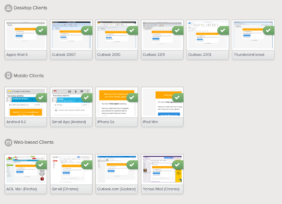

# Transactional HTML Email Templates

by Lee Munroe on August 13 2014

Transactional HTML emails often get neglected.

**Styling HTML email is painful**. Tables, inline CSS, unsupported CSS, desktop clients, web clients, mobile clients, various devices, various providers. All these things have to be thought about and tested. It’s no surprise developers don’t want to deal with this when there is a backlog of more important priorities.

We’ve tried to remove some of the pain for you and open-sourced a collection of common templates for transactional email.

- [Action emails](http://mailgun.github.io/transactional-email-templates/action.html) e.g. activate your account, reset your password
- [Email alerts](http://mailgun.github.io/transactional-email-templates/alert.html) e.g. reaching a limit, there was a problem
- [Billing emails](http://mailgun.github.io/transactional-email-templates/billing.html) e.g. monthly receipts and invoices

Each template is **responsive** and each has been **tested** in all the **popular email clients**.

[View on GitHub.](https://github.com/mailgun/transactional-email-templates)

## Inline CSS

Before sending HTML emails **you should inline your CSS**. We recommend using something like [Premailer](http://premailer.dialect.ca/) to accomplish this. There are libraries that do this for each of the popular languages ([Ruby](https://github.com/premailer/premailer), [Node](https://github.com/JedWatson/node-premailer), [PHP](https://github.com/onassar/PHP-Premailer), [Python](https://pypi.python.org/pypi/premailer), [Grunt](https://github.com/dwightjack/grunt-premailer)) or you can manually inline your CSS [here](http://premailer.dialect.ca/).

Our templates include media queries for responsive design. It is important that **media queries are not inlined** (Premailer handles this for you).

Our repo contains both the original templates with a separate CSS stylesheet, as well as templates with CSS already inlined. See the `/inlined` folder.

## Responsive design with media queries

These templates are responsive for mobile devices and use media queries to optimize the design for smaller screens.

As of July 2014 [~50% of emails](http://emailclientmarketshare.com/) are opened on mobile devices. So it’s important that your emails look good and are usable on small screens.

Be aware that as of writing this, **only a handful of email clients support media queries**. This includes iOS Mail, Android 4.X and Windows Phone 7.5 native email apps.

## Email client rendering test results

We’ve tested these email templates across all the major desktop, web and mobile clients, using Litmus. [See the test results.](https://litmus.com/pub/3a573b5/screenshots)

## Email design workflow with Grunt

You also might be interested in this [Grunt task for compiling and testing html emails](https://github.com/leemunroe/grunt-email-design). This is what we used to design and test our transactional emails. It’s a good way to manage your **email layouts, compile SCSS, inline CSS and send out a preview** to your inbox.

## Download the email templates

[Download templates as a zip](https://github.com/mailgun/transactional-email-templates/archive/master.zip) or [view on GitHub](https://github.com/mailgun/transactional-email-templates).[📎 transactional-email-templates-master.zip](blog-mailgun-com--transactional-html-email-templates/4322adb537e084f59207d73a895c0680.zip)

These are free and open-sourced. Feel free to use them as you wish.

If you do use them, **we’d love to know about it**. Leave us a link in the comments to your product or service.

[Discuss on Hacker News](https://news.ycombinator.com/item?id=8173520)

### Lee Munroe

Product Design @ Mailgun

#### About us

Mailgun is a simple and powerful API that enables you to send, receive, and track email effortlessly.

[Visit Mailgun](http://mailgun.com/)
