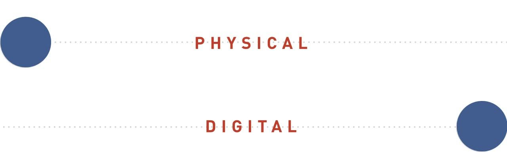
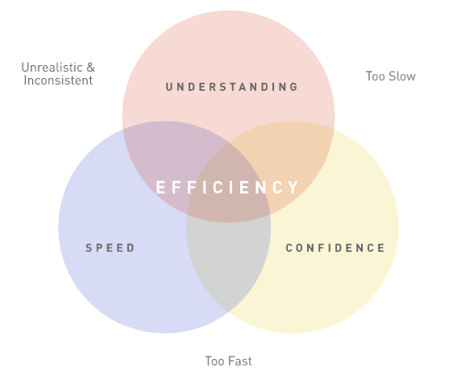
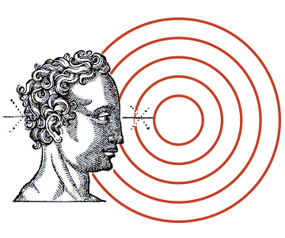
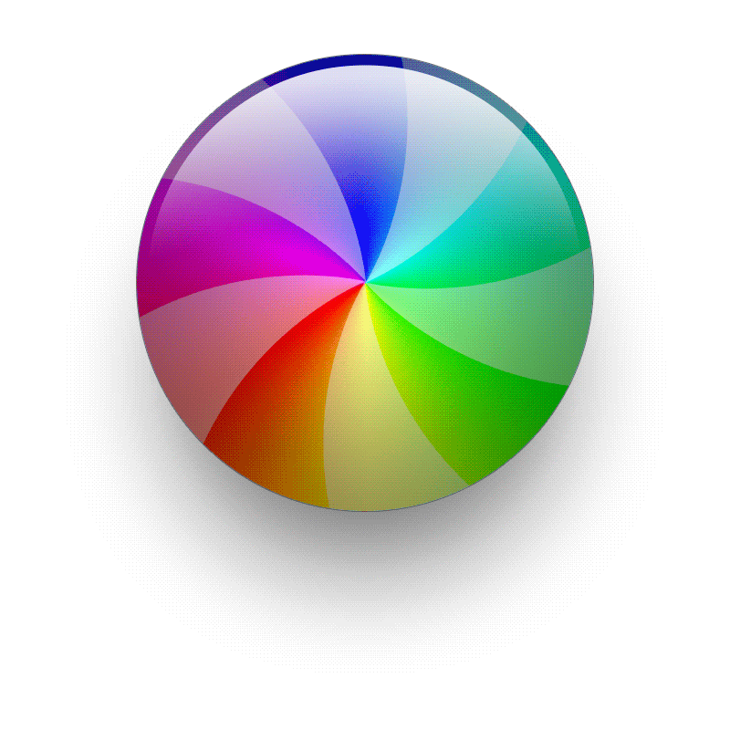
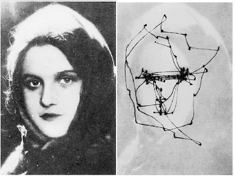
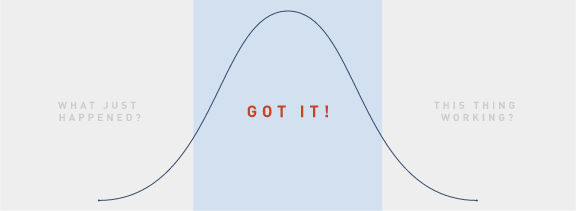

# Guidelines for Animation Timing

## Why great design feels right

May 11, 2015 [Design](http://blog.percolatestudio.com/category/design/)

In 1991 there was one website for five billion people. Today, there is one website for every seventh. Massive internet proliferation brought on by 25 years of iteration has given us a growing vocabulary of human computer interactions. Despite the web’s ubiquity, human propensity to [copy](http://www.apa.org/monitor/oct05/mirror.aspx), and the ease of digital reproduction, I became curious about why user experience inequality still exists and why *great design feels right*. Given two apps with nearly identical interfaces, what are the differentiating factors that lead to more engaged users?

Interaction design describes what happens in-between states. Unlike other disciplines, it’s focused on the change in state and not the state itself. Since the components of interaction are *movement* and *time*, it isn’t inherently suited for static artifacts like sitemaps, mockups, and visual treatments. Adjusting just one of these components has a great affect on what feels right. Today, I’ll explore how time changes user perception.

##### Airbnb and Yoox’s mobile menus have a comparable effects yet, due to timing, they feel quite different. Airbnb’s menu appears snappy and Yoox’ sluggish.

#### Visualizing Danger

Humans are the product of hundreds of thousands of years of evolution. Our species existence is a testament to an ability to recognize danger. Sight is among the key factors in determining how safe we feel. Visual properties like contrast, scale, movement and position allow us to make sense of our surroundings. Understanding timing —how long it takes for visual properties to change— helps us identify unnatural elements in our environment. Imagine walking through the forest and a branch rustles in your periphery. We’ve evolved to register changes (e.g., movement) whose timing doesn’t match our expectations as potentially dangerous. Whether the branch’s motion is the result of a predator or a gust of wind, the momentary unease we end up feeling is the same.

Where does our sense of timing come from? The laws of physics: gravitational acceleration, conservation of momentum and the theory of relativity. Because the physical world is our first ‘user interface’ we’ve developed expectations of how things should act through trial and error. When interfacing with computers, ideas of what’s ‘natural’ are no longer automatic. Immense processing power nullifies the laws of physics for screens and gives digital designers unprecedented control over the cadence of each change or animation and with it the user’s confidence in a digital environment.

##### A ball on screen is not limited by the same properties of a real ball.

#### A Designer’s Intent

Design services efficiency. It is a balance of speed, understandability and confidence. Hasty interactions are difficult to notice and understand. Plodding interactions frustrate the ability to move through a system. Inconsistent interactions cannot instill confidence. To help people accomplish their goals efficiently, we must discover the fastest time where a user retains the ability to understand what’s going on and remain confident in the system.

It’s peculiar that, despite large differences in styling and functionality, popular applications like Gmail, Airbnb, and Dropbox are comparably efficient. Through repeated testing and iteration, their designers determined animation timings that feel good to hundreds of millions of people. We look to the process of human sight to articulate why these experiences work well.

#### The Journey of an Image

The journey from image to thought is a linear path that involves the phenomena of *attention* and *awareness*.

- Attention is a selective process where visual inputs are processed that have a chance of producing or influencing a response. It’s the act of noticing.
- Awareness is the ability to interpret attention. Whereas attention activates the visual part of the brain, awareness leverages the entire brain to draw connections and provoke understanding.

Attention is unconscious. The brain prevents stimulus overload by conveniently ignoring certain things. Visuals must trigger the signs we’ve evolved to process like contrast, scale, position, and repetition to have the best chance of being noticed. All of this takes place in the first 60–80ms. Once the visual is noticed it enters the awareness phase. Here pattern recognition and contextualization with needs and goals occurs. However, the event has yet to reach consciousness. You can be ‘aware’ of things and not know it. Awareness occurs at the 100–150ms mark. By the time the event surfaces in consciousness, 150–200ms was spent noticing and understanding.[1]

#### Limits of Human Cognition

Though the digital medium defies what is physically possible, we must contend with the limits of human cognition –the biomechanics of how we see and think. There is a minimum amount of time necessary for people to process and understand what they see. Just because designers are able to instantly render interfaces doesn’t mean users will be able to notice or understand what’s been rendered. The more time users have to understand animation the greater chance it has to penetrate consciousness. Where efficiency is concerned, the minimum time to understand stimuli hovers around **150ms**.

#### Waiting Game

How long are users willing to wait on animation? Anecdotal and research-backed studies suggest lengthy wait times precipitate abandonment. When an experience feels unnaturally long it gives the subtle impression of being broken. Folks are historically used to software hanging and have thus developed an acute sensitivity for experiences that are ‘not quite right’.

The eye shifts its gaze about three times per second. Humans and most animals assess their environment by tracing a mental map of a scene with their eyes. Since we’re biologically programmed to avoid danger, we don’t have conscious control over the speed or frequency of eye movement. The eye moves as fast as it can and each *fixation* takes about 350ms[2]. It’s incredible that in one third of a second people notice, understand, and contextualize stimuli then do it all over again and again.

If our goal is to keep users focussed on their current train of thought, then **350ms** is a maximum limit before natural instincts encourage the user’s focus to move onto something else. Every extra millisecond not only wastes time but also risks disengagement & distrust.

#### Managing Perception

The quantity of machine effort doesn’t always correspond to how fast people expect products to be. Google combs trillions of data points to deliver the most relevant search results –an incredible feat– yet folks expect pages to appear in less than a second. 99% of sites do far less in more time and no one is up in arms about their performance. How long users will wait is as much about managing the perception of doing work as the actual work itself.

There will be times when data won’t be ready in 150–350ms. Utilizing intermediate states like [loading screens & skeleton templates](http://blog.percolatestudio.com/design/design-for-realtime/) help reassure the user that the app is working on their behalf.

##### From a users perspective, rapid change is difficult to notice while lengthier change breeds impatience.

#### Conclusion

Software consists of countless interactions and animations. Those that ‘feel right’ embody an optimal balance of speed, understandability, and confidence. Ideal animation timing is not a single number, but rather a range that accounts for the biomechanical & psychological factors of a diverse population. While every use case has its own challenges, let the range of 150ms to 350ms serve as a guideline when timing your product’s animations.

**Read more**  
[1] Lamme: [Why Visual Attention and Awareness are Different](http://www.cisi.unito.it/neuropsicologia/didattica/materiali/approfondimenti/attenzione/2003/lamme.pdf) (2003)  
[2] Carpenter, R. H. S., [Movements of the Eyes](http://books.google.com/books/about/Movements_of_the_eyes.html?id=i9dqAAAAMAAJ), Pion Ltd, 2nd ed. (1988)  
Nielsen: [When the UI is too fast](http://www.nngroup.com/articles/too-fast-ux/)  
Nielsen: [Powers of 10 Time Scales](http://www.nngroup.com/articles/powers-of-10-time-scales-in-ux/)  
Lindgaard: [Attention web designers: You have 50 milliseconds to make a good first impression!](http://www.anaandjelic.typepad.com/files/attention-web-designers-2.pdf)  
Google’s [1000/100/6/50ms UI responsiveness guidelines](https://docs.google.com/document/d/1bYMyE6NdiAupuwl7pWQfB-vOZBPSsXCv57hljLDMV8E)

Get the Newsletter
