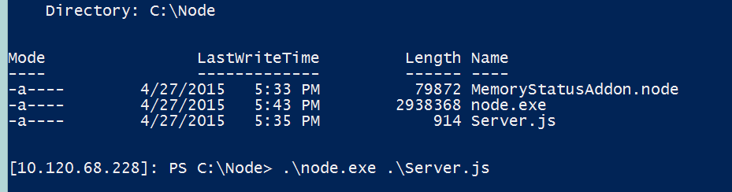
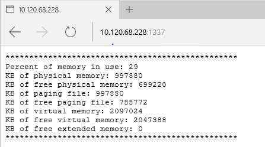
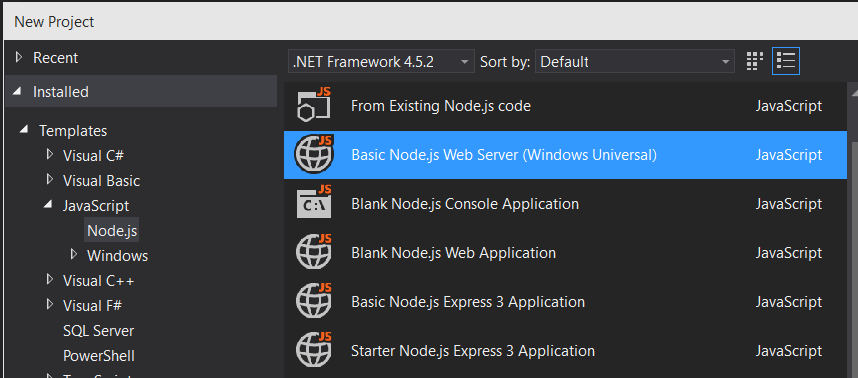
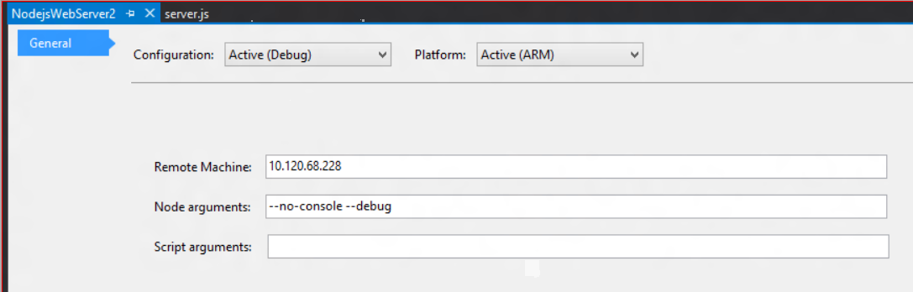
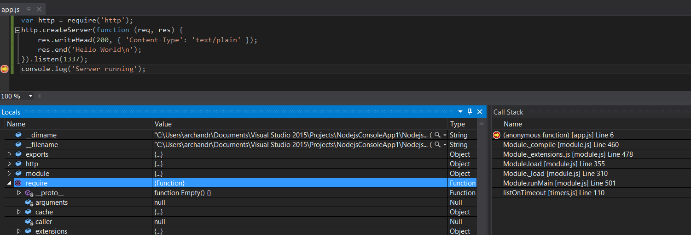

# Bringing Node.js to Windows 10 IoT Core

*This blog was written by Arunesh Chandra, Chakra Senior Program Manager, and Gaurav Seth, Chakra Principal PM Manager.*

Microsoft is making big [investments](http://blogs.windows.com/bloggingwindows/2015/03/18/windows-10-iot-powering-the-internet-of-things/) in the Internet of Things (IoT). Windows 10 IoT will power a range of intelligent, connected IoT devices. From small devices like gateways, to mobile point-of-sale to powerful industry devices like robotics and specialty medical devices. At the //build developer conference, we announced the availability of [Windows 10 IoT Core Insider Preview](http://ms-iot.github.io/content/Downloads.htm) with support for Raspberry Pi 2 and Intel’s Minnowboard Max, and [talked](http://channel9.msdn.com/Events/Build/2015/3-752) about using Node.js for building IoT solutions on Window 10 IoT Core. There is an emerging trend of developers using Node.js for IoT scenarios, and we want to meet developers where they’re at and provide them the tools they need to be successful on the Windows 10 IoT Core platform.

Developers are currently unable to use Node.js on devices running Windows on ARM (WoA), which leaves a gap in their ability to target the entire family of Windows devices. We decided to fill this gap by allowing Node.js to take advantage of running with the [Chakra JavaScript engine](http://blogs.msdn.com/b/ie/archive/2014/10/09/announcing-key-advances-to-javascript-performance-in-windows-10-technical-preview.aspx), which is part of the OS on Windows 10 and has been optimized to run efficiently on WoA devices since its inception. The use of built-in Chakra engine not only reduces the disk footprint impact when executing Node.js apps, but also enables us to bring first-class [Universal Windows Platform (UWP)](https://msdn.microsoft.com/library/windows/apps/dn894631.aspx) support to Node.js apps.

The project to bring this support to Windows 10 is in early stages of development. For now, the path we’ve chosen is to create a wrapper between the [JSRT hosting APIs](https://msdn.microsoft.com/en-us/library/dn249552(v=vs.94).aspx) exposed by Chakra and the V8 hosting APIs that are currently used by Node.js (v0.12). The code for this wrapper is available publicly at [github](https://github.com/Microsoft/node/). These changes enable:

- Node.js to run as a Classic Windows application on any device running Windows 10
- Node.js to be hosted inside a Universal Windows application, which can run on all Windows10 devices
- Full access to [UWP APIs](https://msdn.microsoft.com/en-us/library/windows/apps/br211377.aspx) from Node.js applications
- Visual Studio debugging of Node.js applications on Windows 10

We will be submitting a pull request to Node.js after stabilizing this code, fixing key gaps and responding to early community feedback.

The [current set of changes](https://github.com/Microsoft/node/) not only enable developers to use Node.js on all devices running Windows 10, but also provide them an option to choose their preferred app model – Classic Windows v/s Universal Windows apps. Going forward, we plan to work closely with the Node Foundation, the Node.js Technical Committee(s), IO.js contributors and the community to discuss and participate in conversations around creating JavaScript engine agnostic hosting APIs for Node.js, which provide developers a choice of JavaScript engine that they would want to use in their Node.js workflow – all with the goal of making Node.js succeed across all platforms and devices.

#### Getting started with Node.js development on Windows IoT Core

The following section provides an overview of how to setup your development environment and pointers to sample code to help you get started with the [changes to Node.js](https://github.com/Microsoft/node/) discussed above.

#### Setting up your development environment

Please make sure that you have signed up with our program on [Microsoft Connect](http://ms-iot.github.io/content/Downloads.htm) to get access to some of the downloads below.

#### Developing a Classic Windows application using Node.js

Classic Windows applications like a Win32 console application for Node.js are based on the typical Node.js programming model, which is known and familiar to Node.js developers today. This application model is probably the easiest way for current Node.js developers to try out Windows 10 IoT Core using their existing code.

Following is an example of a console application using Node.js to display memory usage of the system. The app uses a native addon to make low level system calls. While the details about building this sample can be found [here](http://ms-iot.github.io/content/win10/samples/Nodejs.htm), at a high level, it works just like any typical Node.js app.

Create a new file “server.js,” with the following content:

```
var addon = require("./MemoryStatusAddon");
 var http = require('http');
```

```
http.createServer(function (req, res) {
 var memObj = addon.GlobalMemoryStatusEx();
 res.writeHead(200, { 'Content-Type': 'text/plain' });
 res.write('*************************************************\n');
 res.write('Percent of memory in use: ' + memObj.load + '\n');
 res.write('KB of physical memory: ' + memObj.physKb + '\n');
 res.write('KB of free physical memory: ' + memObj.freePhysKb + '\n');
 res.write('KB of paging file: ' + memObj.pageKb + '\n');
 res.write('KB of free paging file: ' + memObj.freePageKb + '\n');
 res.write('KB of virtual memory: ' + memObj.virtualKb + '\n');
 res.write('KB of free virtual memory: ' + memObj.freeVirtualKb + '\n');
 res.write('KB of free extended memory: ' + memObj.freeExtKb + '\n');
 res.end('*************************************************\n');
 }).listen(1337);
```

Now on the remote PowerShell session run the following command:

[](http://az648995.vo.msecnd.net/win/2015/05/Node1.png)

The above command creates and starts an HTTP server on the device, which can be accessed over the network using a browser and the IP address of the device. The result looks like below:

[](http://az648995.vo.msecnd.net/win/2015/05/Node2.png)

#### Developing a Universal Windows application using Node.js

Universal Windows applications allow Windows developers to build an app once and target a large variety of Windows 10 devices including PCs, Tablets, Mobile Phones, XBox, HoloLens, IoT devices etc. [NTVS IoT Extension Beta](http://aka.ms/ntvsiot_installer) provides a Visual Studio template, which can be used to build Universal Windows apps using Node.js. This extension will also install the version of Node.js that uses the Chakra JavaScript engine and the [uwp npm package](http://aka.ms/npm-uwp).

Using this template developers can build, deploy and remotely run the app on an IoT device all from within Visual Studio.

[](http://az648995.vo.msecnd.net/win/2015/05/Node3.png)

More detailed instructions on how to create a basic Universal Windows webserver using Node.js are available in this [sample](http://ms-iot.github.io/content/win10/samples/NodejsWU.htm).

#### Accessing Universal Windows Platform in Node.js applications

Universal Windows apps are incomplete without full access to underlying native UWP APIs that are a part of the Windows10 platform. By using the npm module called [uwp](http://aka.ms/npm-uwp), developers can use the ‘require’ pattern to enable access to UWP namespace from inside of Node.js. The [NTVS IoT Extension Beta](http://aka.ms/ntvsiot_installer) installs the [uwp npm module](http://aka.ms/npm-uwp) by default, but the usual npm install syntax is sufficient to install the uwp module separately, if node.exe is using Chakra JS Engine.

The code below shows the use of UWP APIs inside a Node.js application to toggle the LEDs on or off with each request made to the server via the browser. Detailed instructions to setup the IoT device with breadboard and LEDs and see this code in action are available in the [Blinky sample](http://ms-iot.github.io/content/win10/samples/Blinky.htm).

```
var http = require('http');
 var uwp = require("uwp");
 uwp.projectNamespace("Windows.Devices");
```

```
var gpioController = Windows.Devices.Gpio.GpioController.getDefault();
 var pin = gpioController.openPin(6);
 pin.setDriveMode(Windows.Devices.Gpio.GpioPinDriveMode.output)
 var currentValue = Windows.Devices.Gpio.GpioPinValue.high;
 pin.write(currentValue);
```

```
http.createServer(function (req, res) {
 if (currentValue == Windows.Devices.Gpio.GpioPinValue.high) {
 currentValue = Windows.Devices.Gpio.GpioPinValue.low;
 } else {
 currentValue = Windows.Devices.Gpio.GpioPinValue.high;
 }
 pin.write(currentValue);
 res.writeHead(200, { 'Content-Type': 'text/plain' });
 res.end('LED value: ' + currentValue + '\n');
 }).listen(1337);
```

The sample above uses uwp.projectNamespace(“Windows.Devices”) to include a scoped UWP namespace. If several namespaces need to be accessed in the same script, one can always use a higher level namespace like uwp.projectNamespace(“Windows”).

#### Visual Studio debugging support

One of main efforts for this project has been to bring the power of Visual Studio debugging to Node.js apps running with Chakra on Windows 10. With the work that has been done in Chakra, it’s as simple as ensuring –debug flag is set, setting break points in their Node.js script and start debugging in Visual Studio using F5. Once the breakpoint hits, developers have access to all the usual debug information like local variables, call stack etc. One of the key highlights of the support available is the remote debugging feature, which also works out of the box without any extra setup. Windows 10 IoT Core comes preconfigured to allow remote debugging using Visual Studio.

To remote debug, specify the IP address of your IoT device in the Visual Studio project settings pane:

[](http://az648995.vo.msecnd.net/win/2015/05/Node4.png)

Hit F5 to build / deploy / launch the app on the device with debugger attached:

[](http://az648995.vo.msecnd.net/win/2015/05/Node5.png)

#### What’s next?

We are excited to bring Node.js to Windows 10 IoT Core and eager get your feedback. Given that this is early work, certain things do not work as expected for now. Some known issues are related to incomplete support for VM module and npm packages like serialport, firmata etc. Also, developers have to go through multiple steps listed in the [readme.md](http://aka.ms/github-ms-node-readme) to setup the node environment to build from raw sources.

In coming weeks and months, we will continue to enable more Node.js scenarios and will be working towards higher npm package compatibility, smoothing out the developer workflow, improving performance, supporting io.js and working with the Technical Committee and community for a JavaScript engine agnostic interface for Node.js. We will be sharing more details on our ongoing efforts as they become available. We are excited to have embarked on this journey and are eager to listen and learn from the community. We are seeking feedback on this effort and are committed to drive towards making Node.js on Windows to be the best in class. You can share your feedback in the comments section below or open an issue at our [repo on github](https://github.com/Microsoft/node). You can also connect with us on twitter at [@wpdev](https://twitter.com/wpdev) and tell us what you think about #ChakraNode.

We can’t wait to see what you will make.
