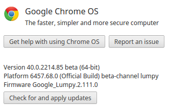
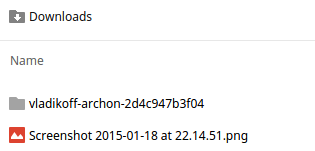
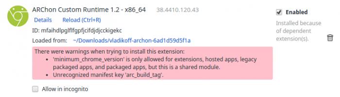
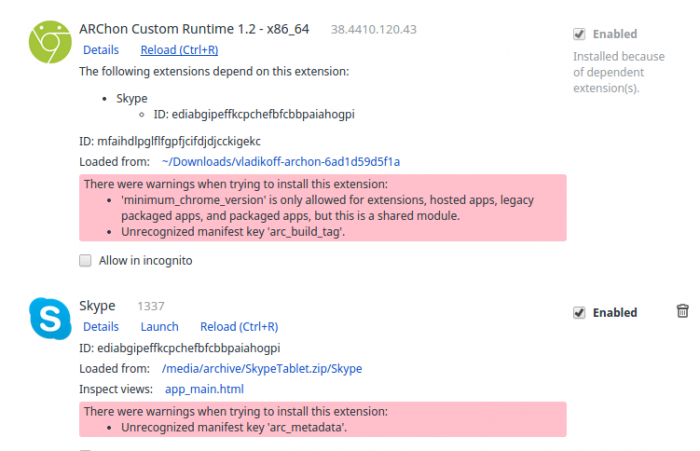
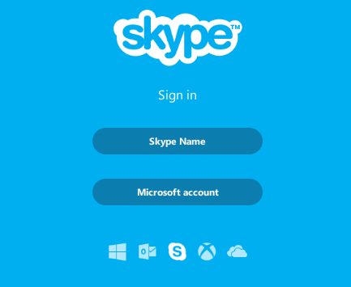
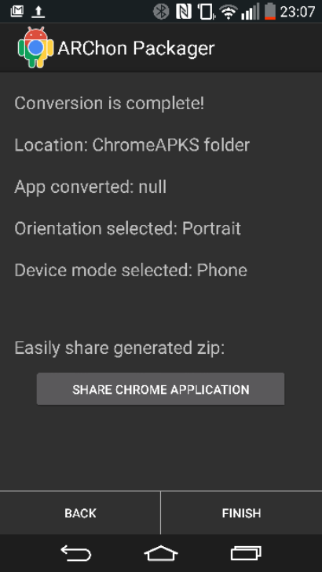

# Skype on a Chromebook in 10 easy steps

A [few months ago I posted a method of getting Skype on a Chromebook](http://www.coolsmartphone.com/2014/10/13/skype-on-a-chromebook-here-fixed-that-for-you/). Recently I found that this older method [didn’t actually work any more](http://www.coolsmartphone.com/2015/01/15/skype-on-a-chromebook-things-have-changed/), so here’s a new way of doing it which does. I’ll do this step-by-step to make it easy, because I know that this single is one that many complain that the Chromebook just doesn’t have and I’ve had *so many questions*about this subject…

**1** – Go into your Chromebook “burger” menu……then into Settings. Click “About Chrome OS”. It should give you an indication here about whether you’re running 32-bit or 64-bit…

**2** – the appropriate ARChon Runtime zip file. I’ve linked these below..  
 [32-Bit](http://www.coolsmartphone.com/skype/v1.2-x86_32.zip) / [64-Bit](http://www.coolsmartphone.com/skype/v1.2-x86_64.zip) / [ARM](http://www.coolsmartphone.com/skype/v1.2-ARM.zip)

**3** – Once downloaded, open up the Zip file. Do this by going to your File Manager, and double-clicking the ZIP file. It’ll show you a folder called “vladikoff-archon…”. Now right-click (by double-fingering your mouse pad) and choose “Copy”. Now Paste into your “” folder. You should end up with this..

**4** – Download the relevant Skype APK from the below links. This depends on your preference really..

[Skype for smartphones (portrait)](http://www.coolsmartphone.com/skype/Skype.zip)  
 [Skype for tablet (landscape)](http://www.coolsmartphone.com/skype/SkypeTablet.zip)

**5** – Once downloaded, hop into your File Manager and click “Open” on “SkypeTablet.zip” or “Skype.zip” (whichever one you downloaded). This will open the Zip for use in a moment.

**6** – Now hit your hamburger menu button, but go to “More Tools->Extensions”.

**7** – Tick “ Mode”

**8** – Click “Load unpacked extension” and find the folder you unpacked, which should be called “vladikoff-archon…”. **Single click it and then click “Open”**

**9** – As you can see, quite a few red errors and all manner of gubbins will appear. **DO NOT WORRY**

**10** – Click “Load unpacked extension” again and go into the “Skype.zip” or “SkypeTablet.zip” folder you popped open earlier. You should see a folder inside simply called “Skype”. **Single click it and then click “Open”**

That’s it! You should be done. Now simply **either** click Launch or go to your normal launcher and you’ll find it in there. Now you can use Skype on your Chromebook just as you would on an Android tablet or .

It’s important to mention that if you untick “Enabled” next to the Skype extension, you WILL have to do these ten steps again as it’ll unload everything, not just Skype. You will also find that Skype will take a long time to boot up the first time and the login process will take quite a while too. Also, if you reboot your Chromebook and you opened the Skype extension via an open zip, you’ll need to perform step 10 again. Either that or extract and copy the contents of the Skype folder so that they survive a reboot.

**WANT MORE?**

Grab your Android phone, download [ARChon Packager](https://play.google.com/store/apps/details?id=me.bpear.archonpackager&hl=en_GB) and you can pack any Android app from your phone, upload it to Google Drive, then – using just step 10 of the instructions above, you can install a LOT of Android onto your Chromebook.

**NOTE**

This is all the work of [Vlad Filippov](https://github.com/vladikoff/chromeos-apk/blob/master/archon.md), and I heartily recommend getting the various files mentioned above from [this github.com page](https://github.com/vladikoff/chromeos-apk/blob/master/archon.md), where he’s doing some absolutely sterling work in this area.
