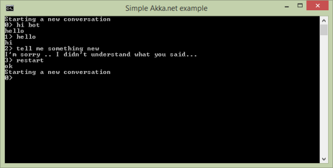

# Implementando “Actor Model” com Akka.net – Parte 2 – Um exemplo muito simples

No [post anterior](http://elemarjr.net/2015/05/28/implementando-actor-model-com-akka-net-parte-1-fundamentos/), falei um pouco sobre alguns conceitos fundamentais para Akka.net. Recomendei dar uma olhada em um exemplo que já implementado. Entretanto, acho fiquei devendo  algo um pouco mais “didático”.

### O que faremos

Vamos implementar algo muito simples

Trata-se de um chat simples, implementado como aplicação console, onde o usuário conversa com um Bot.

Nesse exemplo, implementei dois atores:

1. UserInterfaceActor – Responsável por fazer a “interação” do usuário
2. SimpleBotActor – Onde implementamos a “pouca” inteligência do sistema.

A ideia é fazer com que o ator responsável pela interface com o usuário “interagir” com o bot.

### Bootstrapping

Depois de adicionar o pacote Akka, comecei fazendo o bootstrapping da aplicação:

|  |  |
| --- | --- |
|  | `static` `void` `Main()`  `{`  `Console.Title =` `"Simple Akka.net example"``;`  `var` `actorSystem = ActorSystem.Create(``"AkkaActorsSystem"``);`  `var` `bot = actorSystem.ActorOf(Props.Create(() =>` `new` `SimpleBotActor()));`  `var` `ui = actorSystem.ActorOf(Props.Create(() =>` `new` `UserInterfaceActor(bot)));`  `ui.Tell(``"start"``);`  `actorSystem.AwaitTermination();`  `}` |

Aqui começamos a fazer nossas primeiras interações.

Sempre que formos trabalhar com Akka, precisaremos definir um “sistema”. Por agora, podemos entender o sistema como um “macro contexto” de execução. Geralmente, uma aplicação que usa Akka terá apenas um sistema.

“Levantado” o sistema, é hora de instanciar os atores. Por agora, não se incomode em entender os detalhes das duas linhas que fazem isso nesse código.

Entenda que o modelo de execução do Akka é assíncrona. Essa é a justificativa para a última linha (chamada para AwaitTermination)

### Nossos atores

Para esse primeiro exemplo, optei pela maneira mais rudimentar possível de implementar atores.

|  |  |
| --- | --- |
|  | `class` `UserInterfaceActor : UntypedActor`  `{`  `private` `readonly` `IActorRef _bot;`  `private` `int` `_interactions;`  `public` `UserInterfaceActor(IActorRef bot)`  `{`  `_bot = bot;`  `}`  `protected` `override` `void` `OnReceive(``object` `message)`  `{`  `var` `m = message` `as` `string``;`  `switch` `(m)`  `{`  `case` `"start"``:`  `Console.WriteLine(``"Starting a new conversation"``, _interactions);`  `_interactions = 0;`  `break``;`  `case` `"exit"``:`  `Console.WriteLine(``"Exiting after {0} interactions"``, _interactions);`  `Context.System.Shutdown();`  `break``;`  `default``:`  `_interactions++;`  `break``;`  `}`  `Console.Write(``"{0}> "``, _interactions);`  `var` `input = Console.ReadLine();`  `_bot.Tell(input);`  `}`  `}`  `class` `SimpleBotActor : UntypedActor`  `{`  `protected` `override` `void` `OnReceive(``object` `message)`  `{`  `var` `m = ((``string``)message).ToLower();`  `if` `(m.StartsWith(``"hello"``))`  `{`  `Console.WriteLine(``"hi"``);`  `Sender.Tell(``"continue"``);`  `}`  `else` `if` `(m.StartsWith(``"hi"``))`  `{`  `Console.WriteLine(``"hello"``);`  `Sender.Tell(``"continue"``);`  `}`  `else` `if` `(m.StartsWith(``"bye"``))`  `{`  `Console.WriteLine(``"See you"``);`  `Sender.Tell(``"exit"``);`  `}`  `else` `if` `(m.Contains(``"restart"``))`  `{`  `Console.WriteLine(``"ok"``);`  `Sender.Tell(``"start"``);`  `}`  `else`  `{`  `Console.WriteLine(``"I'm sorry .. I didn't understand what you said..."``);`  `Sender.Tell(``"continue"``);`  `}`  `}`  `}` |

Nossas duas classes Actor herdam de UntypedActor. Nos próximos posts, essa herança ficará mais clara.

O ponto mais importante dessas implementações é o método “Receive” que cada “actor” define. Esse método é responsável por ouvir o que o sistema está lhe dizendo.

UserInterfaceActor tem uma referência para o bot. Isso lhe permite conversar com esse ator facilmente.

Uma mensagem é enviada para um ator através do método “Tell”.

O ator que está recebendo uma chamada consegue interagir com o “Ator” de origem de uma mensagem através da propriedade “Sender”.

Era isso. Espero que as coisas estejam começando a ficar um pouco mais claras.

### Deixe um comentário [Cancelar resposta](http://elemarjr.net/2015/05/29/implementando-actor-model-com-akka-net-parte-2-um-exemplo-muito-simples/#respond)
