# Exponentiation by squaring

From Wikipedia, the free encyclopedia

In [mathematics](http://en.wikipedia.org/wiki/Mathematics "Mathematics") and [computer programming](http://en.wikipedia.org/wiki/Computer_programming "Computer programming"), **exponentiating by squaring** is a general method for fast computation of large [positive integer](http://en.wikipedia.org/wiki/Positive_integer "Positive integer") powers of a [number](http://en.wikipedia.org/wiki/Number "Number"), or more generally of an element of a [semigroup](http://en.wikipedia.org/wiki/Semigroup "Semigroup"), like a [polynomial](http://en.wikipedia.org/wiki/Polynomial "Polynomial") or a [square matrix](http://en.wikipedia.org/wiki/Square_matrix "Square matrix"). Some variants are commonly referred to as **square-and-multiply** algorithms or **binary exponentiation**. These can be of quite general use, for example in [modular arithmetic](http://en.wikipedia.org/wiki/Modular_arithmetic "Modular arithmetic") or powering of matrices. For semigroups for which [additive notation](http://en.wikipedia.org/wiki/Abelian_group#Notation "Abelian group") is commonly used, like [elliptic curves](http://en.wikipedia.org/wiki/Elliptic_curve "Elliptic curve") used in [cryptography](http://en.wikipedia.org/wiki/Cryptography "Cryptography"), this method is also referred to as **double-and-add**.

## Basic method[edit](http://en.wikipedia.org/w/index.php?title=Exponentiation_by_squaring&action=edit&section=1 "Edit section: Basic method")

The method is based on the observation that, for a positive integer *n*, we have

:   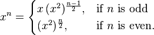

This may be easily implemented as the following [recursive algorithm](http://en.wikipedia.org/wiki/Recursion_(computer_science) "Recursion (computer science)"):

```
Function exp-by-squaring(x,n)
     if n<0 then return exp-by-squaring(1/x, -n);
     else if n=0 then return 1;
     else if n=1 then return x;
     else if n is even then return exp-by-squaring(x2, n/2);
     else if n is odd then return x * exp-by-squaring(x2, (n-1)/2).
```

Moreover, the above algorithm can be rewritten to be [tail-recursive](http://en.wikipedia.org/wiki/Tail_call "Tail call") and minimizes the stack-depth, making it efficient.

## Computational complexity[edit](http://en.wikipedia.org/w/index.php?title=Exponentiation_by_squaring&action=edit&section=2 "Edit section: Computational complexity")

A brief analysis shows that such an algorithm uses O(log2*n*) squarings and O(log2*n*) multiplications. For *n* greater than about 4 this is computationally more efficient than naively multiplying the base with itself repeatedly.

Each squaring results in approximately double the number of digits of the previous, and so, if multiplication of two *d* digit numbers is implemented in O(*d**k*) operations for some fixed *k* then the complexity of computing *x**n* is given by:

:   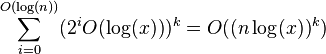

## 2k-ary method[edit](http://en.wikipedia.org/w/index.php?title=Exponentiation_by_squaring&action=edit&section=3 "Edit section: 2k-ary method")

This algorithm calculates the value of xn after expanding the exponent in base 2k. It was first proposed by [Brauer](http://en.wikipedia.org/wiki/Brauer "Brauer") in 1939. In the algorithm below we make use of the following function f(0) = (k,0) and f(m) = (s,u) where m = u·2s with *u* odd.

Algorithm:

Input
:   An element x of G, a parameter k > 0, a non-negative integer *n* = (*n**l*−1, *n**l*−2, ..., *n*0)2*k* and the precomputed values 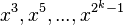.

Output
:   The element xn in *G*

```
 1. y := 1; i := l-1
 2. while i>=0 do
 3.    (s,u) := f(ni)
 4.    for j:=1 to k-s do
 5.        y := y2 
 6.    y := y*xu
 7.    for j:=1 to s do
 8.        y := y2
 9.    i := i-1
10. return y
```

For optimal efficiency, *k* should be the smallest integer satisfying [1](http://en.wikipedia.org/wiki/Exponentiation_by_squaring#cite_note-frey-1)

:   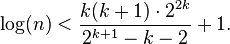

## Sliding window method[edit](http://en.wikipedia.org/w/index.php?title=Exponentiation_by_squaring&action=edit&section=4 "Edit section: Sliding window method")

This method is an efficient variant of the 2k-ary method. For example, to calculate the exponent 398 which has binary expansion (110 001 110)2, we take a window of length 3 using the 2k-ary method algorithm we calculate 1,x3,x6,x12,x24,x48,x49,x98,x99,x198,x199,x398. But, we can also compute 1,x3,x6,x12,x24,x48,x96,x192,x199, x398 which saves one multiplication and amounts to evaluating (110 001 110)n2

Here is the general algorithm:

Algorithm:

Input
:   An element *x* of *G*,a non negative integer *n*=(*n*l,*n*l-1,...,*n*0)2, a parameter k>0 and the pre-computed values .

Output
:   The element *xn* ∈ *G*

Algorithm:

```
1.  y := 1; i := l-1
2.  while i > -1 do
3.      if ni=0 then y:=y2' i:=i-1
4.      else
5.          s:=max{i-k+1,0}
6.          while ns=0 do s:=s+1 2
7.          for h:=1 to i-s+1 do y:=y2
8.          u:=(ni,ni-1,....,ns)2
9.          y:=y*xu
10.         i:=s-1
11. return y
```

## Montgomery's ladder technique[edit](http://en.wikipedia.org/w/index.php?title=Exponentiation_by_squaring&action=edit&section=5 "Edit section: Montgomery's ladder technique")

Many algorithms for exponentiation do not provide defence against [side-channel attacks](http://en.wikipedia.org/wiki/Side-channel_attack "Side-channel attack"). Namely, an attacker observing the sequence of squarings and multiplications can (partially) recover the exponent involved in the computation. This is a problem if the exponent should remain secret, as with many [public-key cryptosystems](http://en.wikipedia.org/wiki/Public-key_cryptography "Public-key cryptography"). A technique called [Montgomery's](http://en.wikipedia.org/wiki/Peter_Montgomery_(mathematician) "Peter Montgomery (mathematician)") Ladder[3](http://en.wikipedia.org/wiki/Exponentiation_by_squaring#cite_note-ladder-3) addresses this concern.

Given the [binary expansion](http://en.wikipedia.org/wiki/Binary_expansion "Binary expansion") of a positive, non-zero integer n=(nk-1...n0)2 with nk-1=1 we can compute xn as follows:

```
x1=x; x2=x2
for i=k-2 to 0 do
  If ni=0 then
    x2=x1*x2; x1=x12
  else
    x1=x1*x2; x2=x22
return x1
```

The algorithm performs a fixed sequence of operations ([up to](http://en.wikipedia.org/wiki/Up_to "Up to") log n): a multiplication and squaring takes place for each bit in the exponent, regardless of the bit's specific value.

This specific implementation of Montgomery's ladder is not yet protected against cache [timing attacks](http://en.wikipedia.org/wiki/Timing_attack "Timing attack"): memory access latencies might still be observable to an attacker as you access different variables depending on the value of bits of the secret exponent.

## Fixed base exponent[edit](http://en.wikipedia.org/w/index.php?title=Exponentiation_by_squaring&action=edit&section=6 "Edit section: Fixed base exponent")

There are several methods which can be employed to calculate xn when the base is fixed and the exponent varies. As one can see, [precomputations](http://en.wikipedia.org/wiki/Precomputation "Precomputation") play a key role in these algorithms.

### Yao's method[edit](http://en.wikipedia.org/w/index.php?title=Exponentiation_by_squaring&action=edit&section=7 "Edit section: Yao's method")

Yao's method is orthogonal to the 2k-ary method where the exponent is expanded in radix b=2k and the computation is as performed in the algorithm above. Let "n", "ni", "b", and "bi" be integers.

Let the exponent "n" be written as

:   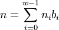 where 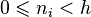 for all 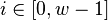

Let xi = xbi. Then the algorithm uses the equality

:   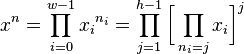

Given the element 'x' of G, and the exponent 'n' written in the above form, along with the precomputed values xb0....xbw-1 the element xn is calculated using the algorithm below.

1. y=1,u=1 and j=h-1
2. while j > 0 do
   1. for i=0 to w-1 do
      1. if ni=j then u=u\*xbi
   2. y=y\*u
   3. j=j-1
3. return y

If we set h=2k and bi = hi then the ni 's are simply the digits of n in base h. Yao's method collects in u first those xi which appear to the highest power h-1; in the next round those with power h-2 are collected in u as well etc. The variable y is multiplied h-1 times with the initial u, h-2 times with the next highest powers etc. The algorithm uses w+h-2 multiplications and w+1 elements must be stored to compute xn (see [1](http://en.wikipedia.org/wiki/Exponentiation_by_squaring#cite_note-frey-1)).

### Euclidean method[edit](http://en.wikipedia.org/w/index.php?title=Exponentiation_by_squaring&action=edit&section=8 "Edit section: Euclidean method")

The Euclidean method was first introduced in *Efficient exponentiation using precomputation and vector addition chains* by P.D Rooij.

This method for computing 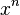 in group **G**, where 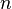 is a natural integer, whose algorithm is given below, is using the following equality recursively:

:   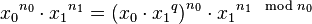, where 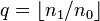
:   (in other words a Euclidean division of the exponent *n*1 by *n*0 is used to return a quotient and a rest 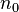).

Given the base element 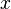 in group **G**, and the exponent  written as in Yao's method, the element  is calculated using  precomputed values 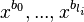 and then the algorithm below.

```
    Begin loop   
        Find 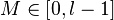, such that 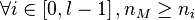;
        Find 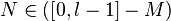, such that 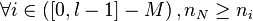;
        Break loop if 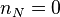;
        Let 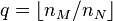, and then let 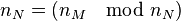;
        Compute recursively 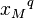, and then let 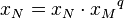;
    End loop;
    Return 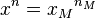.
```

The algorithm first finds the largest value amongst the *n**i* and then the supremum within the set of { *n**i* \ *i* ≠ *M* }. Then it raises *x**M* to the power , multiplies this value with *x**N*, and then assigns *x**N* the result of this computation and *n**M* the value *n**M* modulo *n**N*.

## Further applications[edit](http://en.wikipedia.org/w/index.php?title=Exponentiation_by_squaring&action=edit&section=9 "Edit section: Further applications")

The same idea allows fast computation of large [exponents modulo](http://en.wikipedia.org/wiki/Modular_exponentiation "Modular exponentiation") a number. Especially in [cryptography](http://en.wikipedia.org/wiki/Cryptography "Cryptography"), it is useful to compute powers in a [ring](http://en.wikipedia.org/wiki/Ring_(mathematics) "Ring (mathematics)") of [integers modulo *q*](http://en.wikipedia.org/wiki/Modular_arithmetic "Modular arithmetic"). It can also be used to compute integer powers in a [group](http://en.wikipedia.org/wiki/Group_(mathematics) "Group (mathematics)"), using the rule

:   Power(*x*, −*n*) = (Power(*x*, *n*))−1.

The method works in every [semigroup](http://en.wikipedia.org/wiki/Semigroup "Semigroup") and is often used to compute powers of [matrices](http://en.wikipedia.org/wiki/Matrix_(math) "Matrix (math)"),

For example, the evaluation of

:   13789722341 (mod 2345)

would take a very long time and lots of storage space if the naïve method were used: compute 13789722341 then take the [remainder](http://en.wikipedia.org/wiki/Remainder "Remainder") when divided by 2345. Even using a more effective method will take a long time: square 13789, take the remainder when divided by 2345, multiply the [result](http://en.wikipedia.org/wiki/Result "Result") by 13789, and so on. This will take less than 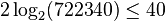 modular multiplications.

Applying above *exp-by-squaring* algorithm, with "\*" interpreted as *x*\**y* = *xy* mod 2345 (that is a multiplication followed by a division with remainder) leads to only 27 multiplications and divisions of integers which may all be stored in a single machine word.

## Example implementations[edit](http://en.wikipedia.org/w/index.php?title=Exponentiation_by_squaring&action=edit&section=10 "Edit section: Example implementations")

### Computation by powers of 2[edit](http://en.wikipedia.org/w/index.php?title=Exponentiation_by_squaring&action=edit&section=11 "Edit section: Computation by powers of 2")

This is a non-recursive implementation of the above algorithm in [Ruby](http://en.wikipedia.org/wiki/Ruby_(programming_language) "Ruby (programming language)").

In most [statically typed](http://en.wikipedia.org/wiki/Static_typing "Static typing") languages, result=1 must be replaced with code assigning an [identity matrix](http://en.wikipedia.org/wiki/Identity_matrix "Identity matrix") of the same size as x to result to get a matrix exponentiating algorithm. In Ruby, thanks to coercion, result is automatically upgraded to the appropriate type, so this function works with matrices as well as with integers and floats. Note that n=n-1 is redundant when n=n/2 implicitly rounds towards zero, as lower level languages would do. n[0] is the rightmost bit of the binary representation of n, so if it is 1, the number is odd, if it is zero, the number is even.

```
 powerx,n
  result = 
  while n.nonzero?
     n.nonzero?
      result = x
      n = 
    
    x = x
    n = 
  
  return result
```

#### Runtime example: compute 310[edit](http://en.wikipedia.org/w/index.php?title=Exponentiation_by_squaring&action=edit&section=12 "Edit section: Runtime example: compute 310")

```
parameter x =  3
parameter n = 10
result := 1

Iteration 1
  n = 10 -> n is even
  x := x2 = 32 = 9
  n := n / 2 = 5

Iteration 2
  n = 5 -> n is odd
      -> result := result * x = 1 * x = 1 * 32 = 9
         n := n - 1 = 4
  x := x2 = 92 = 34 = 81
  n := n / 2 = 2

Iteration 3
  n = 2 -> n is even
  x := x2 = 812 = 38 = 6561
  n := n / 2 = 1

Iteration 4
  n = 1 -> n is odd
      -> result := result * x = 32 * 38 = 310 = 9 * 6561 = 59049
         n := n - 1 = 0

return result
```

#### Runtime example: compute 310[edit](http://en.wikipedia.org/w/index.php?title=Exponentiation_by_squaring&action=edit&section=13 "Edit section: Runtime example: compute 310")

```
result := 3
bin := "1010"

Iteration for digit 2:
  result := result2 = 32 = 9
  1010bin - Digit equals "0"

Iteration for digit 3:
  result := result2 = (32)2 = 34  = 81
  1010bin - Digit equals "1" --> result := result*3 = (32)2*3 = 35  = 243

Iteration for digit 4:
  result := result2 = ((32)2*3)2 = 310  = 59049
  1010bin - Digit equals "0"

return result
```

JavaScript-Demonstration: <http://home.mnet-online.de/wzwz.de/temp/ebs/en.htm>

### Calculation of products of powers[edit](http://en.wikipedia.org/w/index.php?title=Exponentiation_by_squaring&action=edit&section=14 "Edit section: Calculation of products of powers")

Exponentiation by squaring may also be used to calculate the product of 2 or more powers. If the underlying group or semigroup is [commutative](http://en.wikipedia.org/wiki/Commutative "Commutative") then it is often possible to reduce the number of multiplications by computing the product simultaneously.

#### Example[edit](http://en.wikipedia.org/w/index.php?title=Exponentiation_by_squaring&action=edit&section=15 "Edit section: Example")

The formula a7×b5 may be calculated within 3 steps:

:   ((a)2×a)2×a (four multiplications for calculating a7)
:   ((b)2)2×b (three multiplications for calculating b5)
:   (a7)(b5) (one multiplication to calculate the product of the two)

so one gets eight multiplications in total.

A faster solution is to calculate both powers simultaneously:

:   ((ab)2×a)2×ab

which needs only 6 multiplications in total. Note that a×b is calculated twice, the result could be stored after the first calculation which reduces the count of multiplication to 5.

Example with numbers:

:   27×35 = ((2×3)2×2)2×2×3 = (62×2)2×6 = 722×6 = 31,104

Calculating the powers simultaneously instead of calculating them separately always reduces the count of multiplications if at least two of the exponents are greater than 1.

#### Using transformation[edit](http://en.wikipedia.org/w/index.php?title=Exponentiation_by_squaring&action=edit&section=16 "Edit section: Using transformation")

The example above a7×b5 may also be calculated with only 5 multiplications if the expression is transformed before calculation:

a7×b5 = a2×(ab)5 with ab := a×b

:   ab := ab (one multiplication)
:   a2×(ab)5 = ((ab)2×a)2×ab (four multiplications)

Generalization of transformation shows the following scheme:  
For calculating aA×bB×...×mM×nN  
1st: define ab := a×b, abc = ab×c, ...  
2nd: calculate the transformed expression aA−B×abB−C×...×abc..mM−N×abc..mnN

Transformation before calculation often reduces the count of multiplications but in some cases it also increases the count (see the last one of the examples below), so it may be a good idea to check the count of multiplications before using the transformed expression for calculation.

#### Examples[edit](http://en.wikipedia.org/w/index.php?title=Exponentiation_by_squaring&action=edit&section=17 "Edit section: Examples")

For the following expressions the count of multiplications is shown for calculating each power separately, calculating them simultaneously without transformation and calculating them simultaneously after transformation.

Example: a7×b5×c3  
separate: [((a)2×a)2×a] [((b)2)2×b] [(c)2×c] ( **11** multiplications )  
simultaneous: ((ab)2×ac)2×abc ( **8** multiplications )  
transformation: a := 2   ab := ab   abc := abc ( 2 multiplications )  
calculation after that: (aababc)2×abc ( 4 multiplications ⇒ **6** in total )

Example: a5×b5×c3  
separate: [((a)2)2×a] [((b)2)2×b] [(c)2×c] ( **10** multiplications )  
simultaneous: ((ab)2×c)2×abc ( **7** multiplications )  
transformation: a := 2   ab := ab   abc := abc ( 2 multiplications )  
calculation after that: (ababc)2×abc ( 3 multiplications ⇒ **5** in total )

Example: a7×b4×c1  
separate: [((a)2×a)2×a] [((b)2)2] [c] ( **8** multiplications )  
simultaneous: ((ab)2×a)2×ac ( **6** multiplications )  
transformation: a := 2   ab := ab   abc := abc ( 2 multiplications )  
calculation after that: (aab)2×aababc ( 5 multiplications ⇒ **7** in total )

## Signed-digit recoding[edit](http://en.wikipedia.org/w/index.php?title=Exponentiation_by_squaring&action=edit&section=18 "Edit section: Signed-digit recoding")

In certain computations it may be more efficient to allow negative coefficients and hence use the inverse of the base, provided inversion in G is 'fast' or has been precomputed. For example, when computing x2k−1 the binary method requires k−1 multiplications and k−1 squarings. However one could perform k squarings to get x2k and then multiply by x−1 to obtain x2k−1.

To this end we define the [signed-digit representation](http://en.wikipedia.org/wiki/Signed-digit_representation "Signed-digit representation") of an integer  in radix 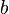 as

:   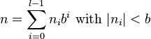

*Signed binary representation* corresponds to the particular choice 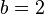 and 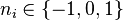. It is denoted by 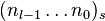. There are several methods for computing this representation. The representation is not unique, for example take 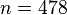. Two distinct signed-binary representations are given by 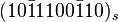 and 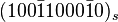, where  is used to denote 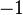. Since the binary method computes a multiplication for every non-zero entry in the base 2 representation of , we are interested in finding the signed-binary representation with the smallest number of non-zero entries, that is, the one with *minimal* [Hamming weight](http://en.wikipedia.org/wiki/Hamming_weight "Hamming weight"). One method of doing this is to compute the representation in [non-adjacent form](http://en.wikipedia.org/wiki/Non-adjacent_form "Non-adjacent form"), or NAF for short, which is one that satisfies 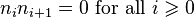 and denoted by 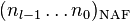. For example the NAF representation of 478 is equal to 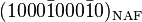. This representation always has minimal Hamming weight. A simple algorithm to compute the NAF representation of a given integer 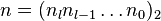 with 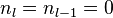 is the following:

Another algorithm by Koyama and Tsuruoka does not require the condition that 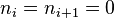; it still minimizes the Hamming weight.

## Alternatives and generalizations[edit](http://en.wikipedia.org/w/index.php?title=Exponentiation_by_squaring&action=edit&section=19 "Edit section: Alternatives and generalizations")

Main article: [Addition-chain exponentiation](http://en.wikipedia.org/wiki/Addition-chain_exponentiation "Addition-chain exponentiation")

Exponentiation by squaring can be viewed as a suboptimal [addition-chain exponentiation](http://en.wikipedia.org/wiki/Addition-chain_exponentiation "Addition-chain exponentiation") algorithm: it computes the exponent via an [addition chain](http://en.wikipedia.org/wiki/Addition_chain "Addition chain") consisting of repeated exponent doublings (squarings) and/or incrementing exponents by *one* (multiplying by *x*) only. More generally, if one allows *any* previously computed exponents to be summed (by multiplying those powers of *x*), one can sometimes perform the exponentiation using fewer multiplications (but typically using more memory). The smallest power where this occurs is for *n*=15:

:   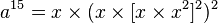 (squaring, 6 multiplies)
:   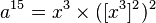 (optimal addition chain, 5 multiplies if *x*3 is re-used)

In general, finding the *optimal* addition chain for a given exponent is a hard problem, for which no efficient algorithms are known, so optimal chains are typically only used for small exponents (e.g. in [compilers](http://en.wikipedia.org/wiki/Compiler "Compiler") where the chains for small powers have been pre-tabulated). However, there are a number of [heuristic](http://en.wikipedia.org/wiki/Heuristic "Heuristic") algorithms that, while not being optimal, have fewer multiplications than exponentiation by squaring at the cost of additional bookkeeping work and memory usage. Regardless, the number of multiplications never grows more slowly than [Θ](http://en.wikipedia.org/wiki/Big-O_notation "Big-O notation")(log *n*), so these algorithms only improve asymptotically upon exponentiation by squaring by a constant factor at best.

## See also[edit](http://en.wikipedia.org/w/index.php?title=Exponentiation_by_squaring&action=edit&section=20 "Edit section: See also")

## Notes[edit](http://en.wikipedia.org/w/index.php?title=Exponentiation_by_squaring&action=edit&section=21 "Edit section: Notes")

1. ^ [Jump up to: ***a***](http://en.wikipedia.org/wiki/Exponentiation_by_squaring#cite_ref-frey_1-0) [***b***](http://en.wikipedia.org/wiki/Exponentiation_by_squaring#cite_ref-frey_1-1) Cohen, H., Frey, G. (editors): Handbook of elliptic and hyperelliptic curve cryptography. Discrete Math.Appl., Chapman & Hall/CRC (2006)
2. **[Jump up ^](http://en.wikipedia.org/wiki/Exponentiation_by_squaring#cite_ref-2)** In this line, the loop finds the longest string of length less than or equal to 'k' which ends in a non zero value. And not all odd powers of 2 up to 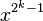 need be computed and only those specifically involved in the computation need be considered.
3. **[Jump up ^](http://en.wikipedia.org/wiki/Exponentiation_by_squaring#cite_ref-ladder_3-0)** Montgomery, P. L. "Speeding the Pollard and Elliptic Curve Methods of Factorization." Math. Comput. 48, 243-264, 1987.
