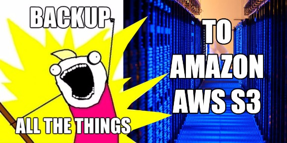
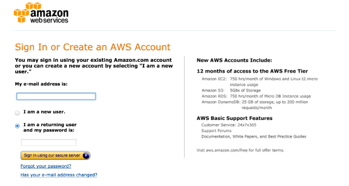
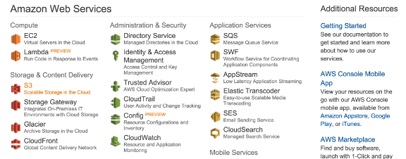
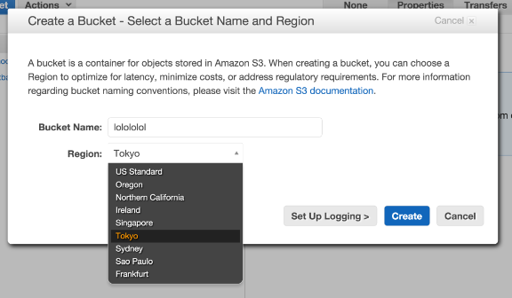
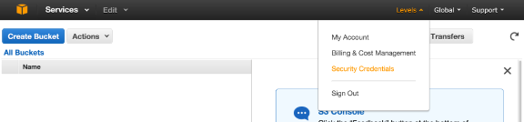
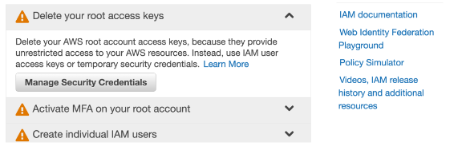
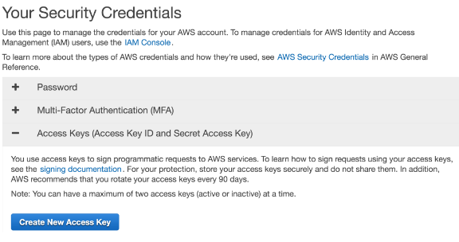
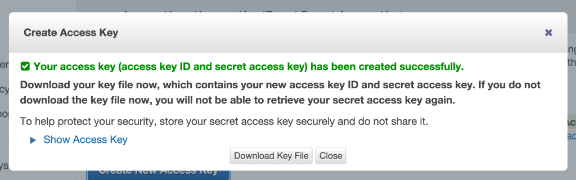
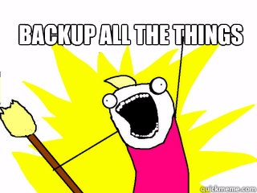

# [How to backup your Linode or Digital Ocean VPS to Amazon S3](https://levels.io/backup-linode-digital-ocean-vps-amazon-s3/ "How to backup your Linode or Digital Ocean VPS to Amazon S3")

This year I learnt how to build, run and maintain my own server. It now runs on [Linode](https://www.linode.com/?r=9ca5a3583601b91e04ba71883446f0ed3d8fd025) and runs all websites for my projects including all [12 startups in 12 months](https://levels.io/12-startups-12-months/). It runs [nginx](http://nginx.org/) and manages to [survive 1,000+ users per second from Hacker News and Product Hunt](https://levels.io/product-hunt-hacker-news-number-one/) out-of-the-box fine. I still think that’s a miracle since I’m a supernoob and I set it up myself and it’s just 4GB ram Linode server. With my startup [Nomad List](http://nomadlist.io/) now getting increasingly popular, my server is now also becoming increasingly important for me now. If it dies, I’m completely f\*d. So I want to start doing regular backups. Today I’m going to find out how to do that easily and cheap. And share the results with you <3

Linode has [backups](https://www.linode.com/backups) built-in which is awesome. It’s just a little per month extra. But storing your server and backups at the same hosting company is a [single point of failure](http://en.wikipedia.org/wiki/Single_point_of_failure). Therefore, I want to store another backup somewhere else.

So today I’m going to make an automatic offsite backup program. It can also be used for people with Digital Ocean VPS server or any other VPS really. Mine runs Ubuntu which is kind of standard now.

## Solution



So where should we backup to? Well, Amazon has a huge server company that hosts a large part of the internet (e.g. Dropbox and major websites) called [AWS](http://aws.amazon.com/). Most of you know this. And most of you might also know its service called S3. It’s a storage service many websites use to hold their static content (like images etc.). It’s redundant storage which means your files are probably not going to dissappear. It also has its own protocol s3:// that a lot of desktop and Linux apps support.

What’s great is that transferring to S3 is literally [free](http://aws.amazon.com/s3/pricing/). And storing it is only 3 cents per GB. My VPS is about 80 GB, so that’s $2.40/m for a redundant backup. Awesome, right?

Also their data center looks really cool. Who doesn’t want their files in here?


Let’s use S3 to set up a weekly backup.

## Set up S3

If you’re not yet, let’s sign up to Amazon AWS [here](http://aws.amazon.com/).



Then [sign in to AWS](https://signin.aws.amazon.com/) and click [S3 Scalable Storage in the Cloud](https://console.aws.amazon.com/s3/home).



We now want to create a bucket. A bucket is just a virtual server that stores your data.


You can pick a region, that’s where your server will be located. You can’t change that. You can create a new bucket and transfer everything to the other region but that DOES cost money. So make sure you pick the right region.



Give your bucket a name with ONLY alphanumeric characters. Make sure it’s kinda descriptive so you remember what the bucket is for.

My server is in London, so I picked United States as a region. Why? Well, I’m [paranoid about data](https://levels.io/backups-solar-flares-cookie-jar-faraday/) and what if a meteorite drops on the UK, where’s my data then, right?

After creating your S3 bucket, you need to set up your security credentials so you can let your VPS server access it.

Now you can do this super advanced [writing your own security policies](http://docs.aws.amazon.com/AmazonS3/latest/dev/example-bucket-policies.html), but it’s just too hard for me. So instead I’m going to do something not so secure which is give your server access to your ENTIRE AWS account. This is super unsafe IF you have other stuff in that account. If you only have this bucket in there, it’s fine.

Click on your username (at the top-right) and select [Security Credentials](https://console.aws.amazon.com/iam/home#security_credential).



Then click “Delete your root access keys” and select “Manage Security Credentials”.



From there click “Access Keys” and select “Create New Access Key”.



Your key is now created. This key is two-part, it contains an ID code and a secret code. You need both to access your bucket.

Click “Show Access Key” and save the Key and Secret code somewhere secure in a text file. You’re going to need this next.



## Set up S3 on your VPS

Now it’s time to set up S3 on your VPS server.

I picked a few things from this tutorial by [Kura](https://kura.io/2012/02/29/backup-a-linux-server-to-amazon-s3-on-debian-6ubuntu-10-04/). First we need to install s3cmd which is a Linux app that lets you transfer in and out of S3 super easily.

[> "How to backup your Linode or Digital Ocean VPS to Amazon S3"](https://twitter.com/intent/tweet?text=How%20to%20backup%20your%20Linode%20or%20Digital%20Ocean%20VPS%20to%20Amazon%20S3+/+@levelsio+https://levels.io/backup-linode-digital-ocean-vps-amazon-s3/)[Tweet this](https://twitter.com/intent/tweet?text=How%20to%20backup%20your%20Linode%20or%20Digital%20Ocean%20VPS%20to%20Amazon%20S3+/+@levelsio+https://levels.io/backup-linode-digital-ocean-vps-amazon-s3/)

This code install s3cmd to your server and starts it configuration.

```
sudo wget q http//s3tools.org/repo/deb-all/stable/s3tools.key | sudo apt-key add -  
sudo wget http//s3tools.org/repo/deb-all/stable/s3tools.list -O /etc/apt/sources.list.d/s3tools.list  
sudo apt update  install s3cmd  
sudo s3cmd configure
```

The questions in the configuration are pretty straightforward.

Enter your access key and secret key from your security credentials that you saved before.

At “Encryption password:”, it’s probably a good idea to specify a password with which your data will be encrypted when it transfers. You can generate a random one at [random.org](http://www.random.org/strings/?num=10&len=16&loweralpha=on&unique=on&format=html&rnd=new).

Just press ENTER at “Path to GPG program”, as you probably have GPG (an encryption program) installed already on your server at the default path. Press ENTER at “Use HTTPS protocol”, since it slows it down and you’re already encrypting it with GPG. I guess if you have super secure data turn this on instead. Press ENTER at “HTTP Proxy server name”, you probably don’t need that.

Then let the configuration app test the access and if it works continue. If not, check if your S3 credentials are set correctly.

```
Enter values  accept defaults  brackets EnterRefer to user manual  detailed description of all optionsAccessSecret key are your identifiers AmazonAccessSecretEncryption password  used to protect your files  reading  
 unauthorized persons while transfer to S3  
Encryption password to GPG program /usr/using secure HTTPS protocol all communication Amazon S3  
servers protected party eavesdropping method   
slower than plain HTTP  cannot be used  you are behind a proxy  
 HTTPS protocol  some networks all internet access must go through a HTTP proxy setting it here  you cannot conect to S3 directly  
HTTP Proxy server name settingsAccessSecretEncryption password to GPG program/usr/ HTTPS protocolFalseProxy server nameProxy server port access  supplied credentials
```

Now you need to connect to the bucket you created on S3:

```
s3cmd mb s3//nameofyours3bucket
```

If this works. Yay!

The s3cmd has a command called sync which syncs TO the remote server (not back locally, so don’t worry). Here’s an example (don’t run it!):

```
s3cmd sync recursive preserve folderbackup s3//nameofyours3bucket
```

I’ve added –recursive to save all child directories and important –preserve which keeps all file attributes and permissions the same. VERY important if you’ll be transferring your backups back when the shit hits the fan.

You can now make a shell script (ending with .sh) that transfers the most important files of your server to S3 regularly. I thought about just doing

```
s3cmd sync recursive preserve
```

but that also includes the ENTIRE Linux installation, I don’t know if that’s preferable as I only need the files that are important. The [most important directories](https://levels.io/superuser.com/questions/143557/which-are-the-most-important-directories-to-backup-on-a-linux-server) seemed to be /srv (that’s where I put my http files), /etc, /home and /var.

Also it’s useful to save a list of which apps you have installed on your server. You can do that with “dpkg –get-selections”. Then save that to “dpkg.list” and send that to S3 too.

The date functions logs the time so you have a better log of what’s happening later:

```
#!/bin/sh'Started''%a %b %e %H:%M:$S %Z %Y'  
s3cmd sync recursive preserve srv s3//nameofyours3bucket  
s3cmd sync recursive preserve etc s3//nameofyours3bucket  
s3cmd sync recursive preserve home s3//nameofyours3bucket  
s3cmd sync recursive preserve //nameofyours3bucketselections list  
s3cmd sync recursive preserve dpkglist s3//nameofyours3bucket'%a %b %e %H:%M:$S %Z %Y''Finished'
```

Save this file as backupToS3.sh. I’ve saved it in /srv on my server.  
 Test it by running it first and typing this in your shell:

```
sh backupToS3
```

If it transfers well you can make it in to a regularly scheduled job by setting up a cron job by typing this in your shell:

```
sudo crontab
```

Then you’ll see a text editor with all your scheduled cron jobs. Add this line at the top:

```
@weeklybackupToS3/srv/backupToS3
```

This will run the backup weekly and save the output to a .txt log file that you can check to see if it ran correctly.

You can also use @daily and @monthly on most Linux installations. But if the backup takes a long time it might take longer than a day. So it’ll start while the other one is still running. Eek.

So that’s it! Mini-tip: s3cmd also runs on OSX, that means you can even backup your Mac to S3.

## Conclusion

With an original copy on my server, a few Linode backups and now a redundant (!) S3 backup at Amazon, I feel a lot safer. Linode’s restore backup function is super smooth, but having an EXTRA backup present when THAT restore might go wrong is great.

Stay safe! **Backup ALL THE THINGS!**



By the way, I'm now on [Twitter](https://twitter.com/levelsio) too if you'd like to follow more of my adventures.

[> "How to backup your Linode or Digital Ocean VPS to Amazon S3"](https://twitter.com/intent/tweet?text=How+to+backup+your+Linode+or+Digital+Ocean+VPS+to+Amazon+S3+/+@levelsio+https://levels.io/backup-linode-digital-ocean-vps-amazon-s3/) [Tweet this](https://twitter.com/intent/tweet?text=How+to+backup+your+Linode+or+Digital+Ocean+VPS+to+Amazon+S3+/+@levelsio+https://levels.io/backup-linode-digital-ocean-vps-amazon-s3/)
