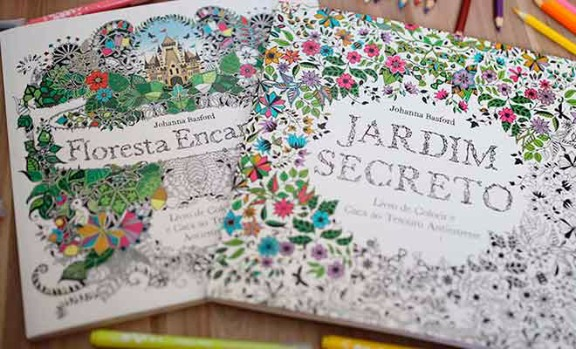
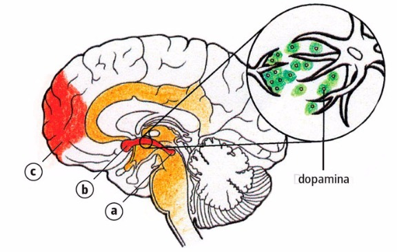

# Livros de colorir para adultos realmente alteram a atividade cerebral?

**Eles ganham fama de relaxantes e estão entre os mais vendidos no Brasil – mas será que eles funcionam?**

Marilia Marasciulo, na [Galileu](http://revistagalileu.globo.com/Revista/noticia/2015/04/conteudo-improprio-para-menores-de-18.html)

Esqueça os livros de autoajuda, “Cinquenta tons de cinza” e toda a coletânea de John Green.

A grande sensação do mercado editorial no momento é O jardim secreto: livro de colorir e caça ao tesouro antiestresse, da britânica Johanna Basford, lançado no Brasil pela Sextante no final do ano passado. O livro foi o terceiro mais vendido no país em março – mais de 22 mil exemplares no total, 14 mil só na última semana do mês.

O sucesso por aqui acompanha os números registrados em outros países: na Amazon, O jardim secreto é o mais vendido na categoria livros; na Amazon do Canadá, só perdeu o primeiro lugar para Floresta encantada, da mesma autora. E até a versão sul-coreana do livro ficou no topo da lista dos mais vendidos durante todo o mês de janeiro, segundo a Sociedade de Editores da Coreia. Várias editoras, em especial na Europa, têm apostado no gênero.

A inglesa Michael O’Mara Books começou a publicar livros para colorir em 2012, mas foi no ano passado que viu a moda pegar, com mais de 300 mil exemplares vendidos. “Já publicávamos livros de colorir para crianças, mas começamos a receber relatos de pais que também gostavam deles”, diz Ana McLaugh­lin, gerente de publicidade e marketing da editora.

Diferentemente dos livros infantis, os para adultos têm padrões mais complexos. Já os temas variam de jardins e mandalas a celebridades, como os da ilustradora Mel Elliot, também inglesa, que aposta em livros com desenhos de famosos (o do galã americano Ryan Gosling é um best-seller).

“Acredito que a tendência tenha começado com os livros interativos, como Destrua este diário, que fez muito sucesso. Desde então, as pessoas têm procurado uma forma de interagir com os livros e torná-los mais personalizados”, afirma Nana Vaz de Castro, gerente de aquisições da Sextante.

Há uma tese, porém, que por enquanto parece ser a mais aceita: a de que eles funcionam como uma espécie de “detox”, uma válvula de escape para rotinas estressantes. “É realmente relaxante porque, ao se concentrar em colorir direito ou na escolha das cores, a pessoa de fato parece esquecer os problemas do dia”, afirma McLaughlin. “Além disso, ainda tem a vantagem de que não dá para colorir e mexer no celular ao mesmo tempo.”

**BELEZA É FUNDAMENTAL** O sentimento de orgulho ou satisfação por completar a pintura e observar como ficou bonita também é outra explicação possível, já que os livros ativam o circuito de recompensa do cérebro, o sistema responsável pela sensação de prazer. Quando estimulado, ele libera dopamina, um neurotransmissor que provoca o sentimento de bem-estar (veja abaixo). “Mas não são todas as tarefas que ativam esse sistema, que se desenvolveu ao longo de milhões de anos para nos impelir a realizar ações úteis para a autopreservação e a preservação da espécie, como se alimentar e se reproduzir”, explica o neurologista Marino M. Bianchin, do Hospital de Clínicas de Porto Alegre.

Tudo o que envolve trabalho manual ou arte também estimula a criatividade e a concentração. Quando se trabalha com cores, o resultado é ainda melhor, já que elas podem provocar diversas sensações, como calor, frio e tranquilidade. Bianchin explica que isso é herança dos nossos ancestrais, que de tanto ver fogo, por exemplo, passaram a associar o vermelho ao calor.

Mas, embora causem uma sensação de prazer e bem-estar, os livros não podem ser encarados como terapia, conforme explicam os arteterapeutas Ana Carmen Nogueira e Alexandre Almeida. “Na arteterapia, há um assunto específico a ser trabalhado, e usamos diferentes linguagens, como pintura ou desenho, para que a pessoa possa se expressar”, diz Almeida. “Os livros de colorir não são terapia, mas são relaxantes porque ajudam a proporcionar um momento de pura concentração”, completa Ana Carmen. Ou seja, os livros podem até funcionar como um analgésico para situações de stress, mas não têm nenhum poder milagroso para curar problemas como depressão ou ansiedade – a não ser que você seja dono de uma editora e esteja faturando muito mais que o previsto graças à nova moda.

1. Ao observar que o desenho pronto ficou bonito, o sistema límbico do cérebro é ativado. Ele é responsável pelo controle de nossas emoções e tem papel importante na regulação do stress.

2. Dentro desse sistema, uma parte específica é responsável por proporcionar sensações de prazer: o circuito de recompensa. Ele começa na área tegmentar ventral (a), que transmite impulsos elétricos para o núcleo accumbens (b), parte central do circuito de recompensa. De lá, os impulsos seguem para o córtex pré-frontal (c), a parte responsável pelo planejamento de atividades.

3. Como não há contato físico entre os neurônios, os impulsos precisam de uma “ajudinha” para ser transmitidos de uma célula para outra. Essa ajuda é a dopamina, um neurotransmissor que transforma o impulso elétrico em sinal químico, possibilitando a transmissão. É a liberação da dopamina que causa a sensação de prazer.

### Comments

comentários

Powered by [Facebook Comments](http://peadig.com/wordpress-plugins/facebook-comments/)
