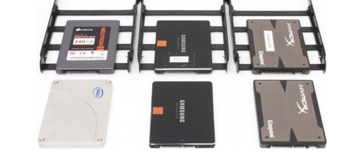
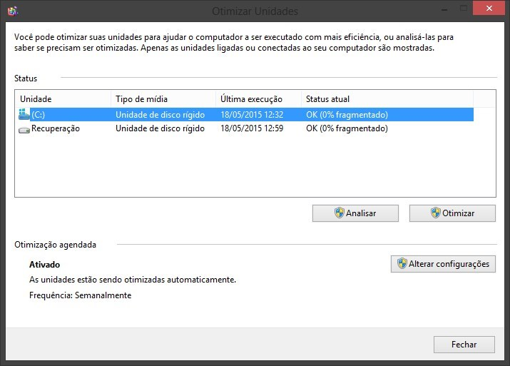
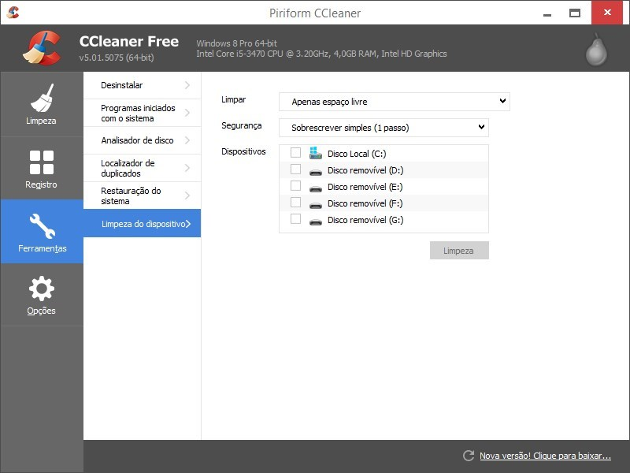
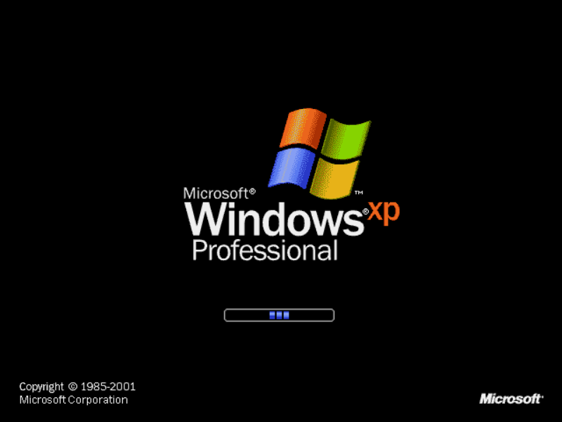
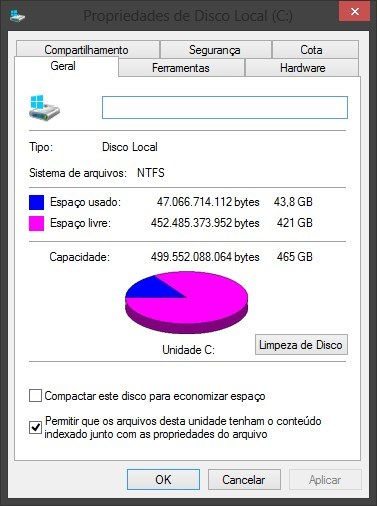

94.240

20 MAI 15

[133](http://m.tecmundo.com.br/comentarios/ssd/80203-6-coisas-alguem-ssd-nao-deve-fazer.htm)

# 6 coisas que alguém com SSD NÃO deve fazer

por [**Renan Hamann**](http://m.tecmundo.com.br/autor/83)

Você possivelmente já leu algo sobre os drives de estado sólido, não é mesmo? Sob a sigla SSD (Solid State Drive, em inglês), estes equipamentos surgiram como uma opção mais segura e veloz para os discos rígidos comuns — que contam com partes mecânicas e apresentam mais problemas relacionados à movimentação — e têm ganhado bastante espaço no mercado nestes últimos anos.

Mas, antes de [instalar e configurar o SSD](http://www.tecmundo.com.br/ssd/56274-ssd-guia-completo-configuracoes-voce-ter-o-maximo-desempenho.htm), é preciso saber que existem diferenças entre eles e os HDs com os quais já estamos acostumados. Por causa disso, algumas ações não devem ser tomadas com os aparelhos — para [aumentar o tempo de vida útil deles](http://www.tecmundo.com.br/ssd/57969-realmente-dura-ssd.htm) e evitar que exista qualquer problema. Ficou curioso? Então confira agora mesmo o que você não deve fazer com um SSD em seu PC.

## 1. Desfragmentação

Uma das principais diferenças entre os HDs e o SSDs está no modo como os dados são gravados. Enquanto os discos rígidos utilizam pequenas estruturas magnéticas para informar o valor de cada informação, nos drives sólidos isso acontece de uma maneira eletrônica — conseguida graças à energia elétrica armazenada ali. E é por causa disso que desfragmentar um SSD pode ser uma péssima ideia.

Esse método de gravação faz com que os SSDs tenham um número de gravações mais limitado do que acontece nos discos rígidos. Desfragmentar um disco significa realocar arquivos e fazer com que a porção de armazenamento dele seja otimizada — o que resulta em um grande consumo de espaço durante o período da desfragmentação. Ou seja: o processo pode reduzir a vida útil dos equipamentos.

Não bastasse isso, também vale dizer que a desfragmentação é um processo inútil nos computadores com SSD. Isso porque ela foi criada para reagrupar dados espalhados em discos rígidos, para facilitar a leitura em equipamentos desse tipo. Como o SSD não utiliza leitores mecânicos — e sim processos elétricos —, a informação pode ser acessada de qualquer lugar com a mesma rapidez.

## 2. Limpar áreas vazias

Por muito tempo, consumidores costumaram utilizar ferramentas para “apagar áreas vazias” do disco rígido. Isso permitia que as unidades ganhassem um pouco mais de espaço e ainda evitava que os dados pudessem ser recuperados após a exclusão de arquivos. Mas os sistemas operacionais mais recentes — Windows 7 e superiores, Mac OS X 10.6 e superiores ou Linux baseado em Kernels lançados depois de 2012 — são habilitados com o TRIM.

Isto é uma “notificação do sistema para o SSD para informar que determinados arquivos foram removidos e que os blocos, onde eles estavam armazenados, devem passar por um processo de limpeza para que novos dados sejam gravados”. Esta função faz com que os arquivos deletados do computador sejam realmente excluídos — não ficando disponíveis para restauração com o uso de aplicativos especializados.

Isso tudo significa que “limpar áreas vazias” em um sistema moderno e que utilize SSDs acaba sendo um esforço completamente desnecessário. Além de gastar um tempo sem fins realmente efetivos, o processo ainda pode desgastar o SSD com uma sobrecarga de informações — que também pode causar uma redução na vida útil do dispositivo.

### Verifique se o TRIM está ativo

É possível que o seu computador não possua o TRIM ativado por padrão. Para verificar isso você pode usar softwares como o [TrimCheck](http://files.thecybershadow.net/trimcheck/) ou então seguir alguns rápidos passos:

- 1) Pressione as teclas Window + R e digite na caixa de diálogo “cmd.exe”;
- 2) No prompt de comando, digite o seguinte: "fsutil behavior query DisableDeleteNotify"
- 3) Se o sistema retornar o valor “0”, então você está com o TRIM ativado;
- 4) Caso apareça o valor “1”, você deve digitar o seguinte para habilitar o TRIM: "fsutil behavior set disabledeletenotify 0"

## 3. Formatação completa

Assim como no caso anterior, aqui trazemos um exemplo de processo desnecessário para os computadores com SSD. Formatar completamente um drive de estado sólido não é uma tarefa muito interessante e isso se aplica por várias razões. Primeiro: apagar arquivos com o modo TRIM faz com que eles sejam realmente excluídos definitivamente. Segundo: isso não fará com que seu computador fique mais veloz. Sem falar que a ação ainda joga fora alguns ciclos de reescritas do dispositivo.

## 4. Usar Windows XP ou Vista

O Windows XP e o Windows Vista são sistemas operacionais que não possuem suporte para o TRIM. Isso significa que arquivos apagados permanecem disponíveis para a recuperação por meio de aplicativos especializados. Mais do que isso, também existe o fato de que sistemas sem TRIM acabam gerando bastante lentidão após algum tempo de uso.

Em resumo: com o passar do tempo, seu SSD passará a demorar muito para conseguir terminar a escrita de um arquivo. É claro que não é o fim do mundo usar esses outros sistemas operacionais, mas é importante usar alguns softwares de otimização criados pelas próprias fabricantes de drives — evitando problemas relacionados às já mencionadas sobreescritas.

**Atenção:** não é interessante usar ferramentas alternativas de manutenção, pois isso pode prejudicar ainda mais o desempenho — opte sempre pelas oficiais das fabricantes. O drive de estado sólido sabe gerenciar os dados e cuidar de sua Garbage Collection — um sistema automatizado do gerenciamento da memória disponível — , sendo que a interação do usuário apenas vai prejudicar as configurações determinadas no firmware do componente.

## 5. Usar toda a capacidade

Essa lição já foi ensinada pelos HDs comuns em outros momentos — quem usa os PCs há mais tempo deve se lembrar do quanto era difícil reservar espaço em computadores que tinham menos de 1 GB para o armazenamento —, mas precisa ser relembrada. É essencial que você nunca preencha toda a capacidade do seu SSD, sempre deixando um espaço de sobra na unidade.

Isso se deve ao fato de que novos arquivos e carregamentos exigem espaço livre para que funcionem corretamente. Logo, sem ele o seu sistema ficará muito lento e apresentando falhas constantes. O site [AnandTech](http://www.anandtech.com/show/6489/playing-with-op) afirma que pelo menos 25% do espaço total devem ser mantidos livres para evitar problemas — algo parecido com o que era indicado para os HDs comuns.

## 6. Realizar escritas constantes

Essa dica é bem importante, mas deve ser melhor aproveitada somente por quem utiliza SSDs em conjunto com HDs comuns. Um dos métodos mais eficientes de fazer com que a vida útil dos drives de estado sólido seja prolongada está em evitar as escritas nele. Ou seja, fazer com que menos arquivos sejam gravados nos drives e os mantendo como unidades de leitura.

As recomendações mais comuns são de que o SSD deve ser usado para a gravação dos arquivos de sistema operacional, softwares, jogos e outros dados que precisam ser acessados frequentemente e com rapidez. Em resumo: grave os arquivos que precisam ser acessados para que a sua utilização se torne mais confortável.

Ao mesmo tempo, não é indicado armazenar arquivos de mídia nos SSDs — uma vez que o espaço seria desperdiçado e o carregamento deles pode ser feito a partir de um HD sem qualquer problema ou lentidão. Ou seja... Nada de salvar o seu filme favorito em 4K nos drives de estado sólido.

### Evite arquivos de paginação

Quando a sua memória RAM está toda ocupada, o Windows utiliza um setor do seu HD para fazer com que mais aplicativos e processos possam ser carregados ou mantidos. O problema é que se estivermos falando sobre um computador com SSD, esse setor de memória será sobreescrito com muita frequência e causará danos à estabilidade e à vida útil do equipamento.

Ou seja... Desative a opção de paginação nas configurações do sistema operacional — ou use um disco rígido comum para isso. Se você só possui um SSD, recomenda-se que sua máquina tenha pelo menos 8 GB de RAM para que o sistema não exija a paginação da memória virtual.

### .....

Você conhecia essas recomendações? É claro que, se você optar por não segui-las, conseguirá usar o seu computador normalmente — afinal de contas, ele não vai explodir por causa disso. Mesmo assim, vale a pena ficar ligado em tudo isso para fazer com que os seus equipamentos possam ser usados por mais tempo e sem apresentar falhas.

Fontes
[AnandTech](http://www.anandtech.com/show/6489/playing-with-op)
[How to Geek](http://www.howtogeek.com/165472/6-things-you-shouldnt-do-with-solid-state-drives/)
[Life Hacker](http://lifehacker.com/5932009/the-complete-guide-to-solid-state-drives)

Imagens
[TecMundo](http://www.tecmundo.com.br/)
[TechReport](http://techreport.com/gallery/26523/the-ssd-endurance-experiment-casualties-on-the-way-to-a-petabyte/73631/big_drives2)

[Comentários](http://m.tecmundo.com.br/comentarios/ssd/80203-6-coisas-alguem-ssd-nao-deve-fazer.htm)
