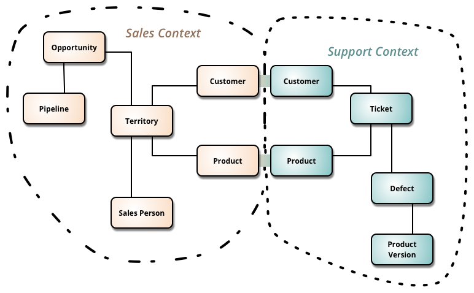

# [BoundedContext](http://martinfowler.com/bliki/BoundedContext.html)

Bounded Context is a central pattern in Domain-Driven Design. It is the focus of DDD's strategic design section which is all about dealing with large models and teams. DDD deals with large models by dividing them into different Bounded Contexts and being explicit about their interrelationships.

DDD is about designing software based on models of the underlying domain. A model acts as a [UbiquitousLanguage](http://martinfowler.com/bliki/UbiquitousLanguage.html) to help communication between software developers and domain experts. It also acts as the conceptual foundation for the design of the software itself - how it's broken down into objects or functions. To be effective, a model needs to unified - that is to be internally consistent so that there are no contradictions within it.

As you try to model a larger domain, it gets progressively harder to build a single unified model. Different groups of people will use subtly different vocabularies in different parts of a large organization. The precision of modeling rapidly runs into this, often to leading to a lot of confusion. Typically this confusion focuses on the central concepts of the domain. Early in my career I worked with a electricity utility - here the word "meter" meant subtly different things to different parts of the organization: was it the connection between the grid and a location, the grid and a customer, the physical meter itself (which could be replaced if faulty). These subtle [polysemes](http://en.wikipedia.org/wiki/Polysemy) could be smoothed over in conversation but not in the precise world of computers. Time and time again I see this confusion recur with polysemes like "Customer" and "Product".

In those younger days we were advised to build a unified model of the entire business, but DDD recognizes that we've learned that "total unification of the domain model for a large system will not be feasible or cost-effective" [[1]](#footnote-quote). So instead DDD divides up a large system into Bounded Contexts, each of which can have a unified model - essentially a way of structuring [MultipleCanonicalModels](http://martinfowler.com/bliki/MultipleCanonicalModels.html).

Bounded Contexts have both unrelated concepts (such as a support ticket only existing in a customer support context) but also share concepts (such as products and customers). Different contexts may have completely different models of common concepts with mechanisms to map between these polysemic concepts for integration. Several DDD patterns explore alternative relationships between contexts.

Various factors draw boundaries between contexts. Usually the dominant one is human culture, since models act as Ubiquitous Language, you need a different model when the language changes. You also find multiple contexts within the same domain context, such as the separation between in-memory and relational database models in a single application. This boundary is set by the different way we represent models.

DDD's strategic design goes on to describe a variety of ways that you have relationships between Bounded Contexts. It's usually worthwhile to depict these using a context map.

## Further Reading

The canonical source for DDD is [Eric Evans's book](http://www.amazon.com/gp/product/0321125215?ie=UTF8&tag=martinfowlerc-20&linkCode=as2&camp=1789&creative=9325&creativeASIN=0321125215). It isn't the easiest read in the software literature, but it's one of those books that amply repays a substantial investment. Bounded Context opens part IV (Strategic Design).

Vaughn Vernon's [Implementing Domain-Driven Design](http://www.amazon.com/gp/product/0321834577?ie=UTF8&tag=martinfowlerc-20&linkCode=as2&camp=1789&creative=9325&creativeASIN=0321834577) focuses on strategic design from the outset. Chapter 2 talks in detail about how a domain is divided into Bounded Contexts and Chapter 3 is the best source on drawing context maps.

I love software books that are both old and still-relevant. One of my favorite such books is William Kent's [Data and Reality](http://www.amazon.com/gp/product/1935504215?ie=UTF8&tag=martinfowlerc-20&linkCode=as2&camp=1789&creative=9325&creativeASIN=1935504215). I still remember his short description of the polyseme of Oil Wells.

Eric Evans describes how an explicit use of a bounded context can allow teams to graft new functionality in legacy systems using a [bubble context](http://domainlanguage.com/ddd/strategy/GettingStartedWithDDDWhenSurroundedByLegacySystemsV1.pdf). The example illustrates how related Bounded Contexts have similar yet distinct models and how you can map between them.

## Notes

Eric Evans in [Domain-Driven Design](http://www.amazon.com/gp/product/0321125215?ie=UTF8&tag=martinfowlerc-20&linkCode=as2&camp=1789&creative=9325&creativeASIN=0321125215)

Share:
