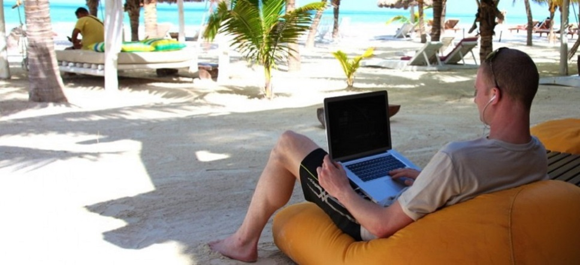
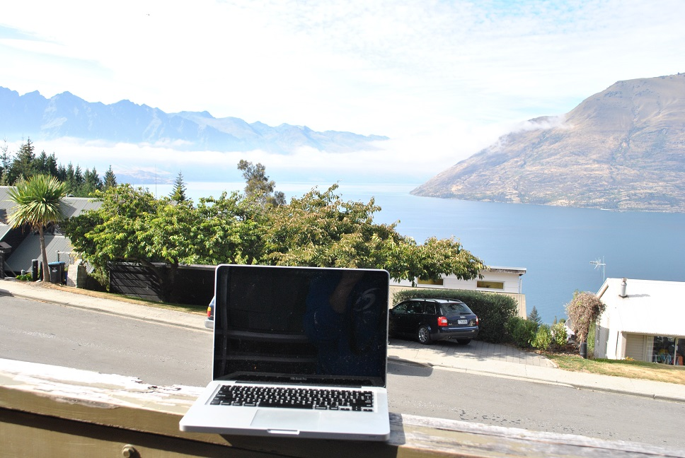

# 10 opções para quem quer trabalhar e viajar o mundo

por Nômades Digitais

E quando a resposta àquela velha perguntinha sobre “*o que você quer ser quando crescer*” não era nada do que seus pais esperavam? A maioria dos que hoje decidiram viver uma vida de nômades digitais já sabia o que queria mesmo antes de saber qual profissão seguir: o importante era viajar o mundo.

ADVERTISEMENT

Mas… como nem todo mundo nasce em famílias ricas – ou aventureiras – a maioria de nós precisou batalhar um pouquinho para chegar lá, muitas vezes decidindo a profissão não só por afinidades, mas pela possibilidade de viajar. A boa notícia é que muitas carreiras oferecem opções do tipo, quer saber quais?

### **1. Redator / Jornalista**

Você pode ser correspondente para um jornal no Brasil, escrever para diversos veículos e vender suas matérias depois de prontas ou escrever seu próprio site ou blog. Essa é uma das carreiras mais buscadas por quem quer ser nômade digital por oferecer muitas oportunidades de trabalho remoto, mesmo que algumas com remuneração bem abaixo do esperado. Se você senta na frente do computador e já começa a escrever, é esse o caminho.

*Foto: [Steven Zwerink](http://www.stevenzwerink.nl/)/Creative Commons.*

### **2. Professor de idiomas**

Vale para todas as línguas, mas o inglês costuma ser o idioma mais procurado. Quem encara a vida de nômade digital como professor de idiomas pode até mesmo ensinar português por onde passa, o que é também uma ótima maneira de conhecer moradores do local. E o melhor: depois de conquistar alunos, muitos deles não se incomodarão de continuar as aulas online depois que você partir para o próximo destino.

### **3. Tradutor**

Quem fala fluentemente outro idioma, mas não tem nenhuma *fluência* em dar aulas, pode apostar em uma carreira na área de tradução. De novo, o inglês continua sendo um diferencial e muitas empresas estrangeiras contratam brasileiros para trabalhar remotamente na tradução de jogos para o nosso idioma. O trabalho é interessante e os tradutores costumam ser pagos em moedas mais fortes, como o Dólar, ou Euro.

### **4. Fotógrafo**

Não basta uma câmera na mão e uma ideia na cabeça: um fotógrafo que queira se tornar nômade digital precisa desenvolver uma boa estratégia para vender suas imagens. Outra alternativa é ser muito bom de papo para encontrar alguns trabalhos novos onde quer que esteja morando – e, de quebra, conhecer alguns dos moradores da região.

*Foto [via](http://guiadoestudante.abril.com.br/blogs/melhores-faculdades/o-melhor-curso-de-fotografia-do-brasil-3/).*

### **5. Desenvolvedor de sites**

Web designers e programadores são comumente encontrados viajando pelo mundo como nômades digitais. Com uma carteira de clientes aqui no Brasil ou no exterior e uma boa publicidade online, estes profissionais podem criar e gerenciar novos projetos onde quer que estiverem, sem prejuízo para a qualidade.

### **6. Produtor de vídeo**

Assim como os fotógrafos, quem trabalha com a área de vídeo poderá criar praticamente em qualquer lugar – desde que haja uma boa conexão à internet para enviar seus trabalhos aos clientes. Profissionais da área podem tanto investir na criação de vídeos sobre os locais que visitam quanto criar um material mais universal ou, quem sabe, investir na área de publicidade, vendendo suas habilidades para empresas de diversas partes do mundo.

### **7. Professor de yoga, meditação…**

Vale também para diversos esportes, inclusive a capoeira, que gera bastante interesse mundo afora. Dar aulas no local em que você estiver vivendo permite conhecer de perto pessoas com interesses parecidos com os seus, enquanto aproveita para sustentar a viagem enquanto está no local.

*Foto [via](http://www.yoganarayana.com.br/curso-de-formacao/).*

### **8. Artista**

Pode até ser verdade que a vida de artista ainda não é muito fácil aqui no Brasil. E pode ter certeza de uma coisa: no exterior vai ser igual. Ou seja, não há motivo nenhum para não tentar e há diversos exemplos de artistas que viajam por aí vendendo suas obras ou trocando elas por alojamento pelo mundo. Afinal, por que não?

### **9. Hospitalidade**

Curte trabalhar com turismo e hospitalidade? Então que tal experimentar algum tempo trabalhando em hostels ou hotéis pelo mundo? Há também oportunidades para quem prefere encarar a rotina em cruzeiros, onde, além de um ótimo salário, você ainda tem a oportunidade de conhecer diversos países durante as pausas no trabalho.

### **10. Empreendedor**

Uma boa ideia para quem quer despedir o seu patrão é se tornar um empreendedor nômade. Muitas *startups* pelo mundo já funcionam completamente online. Um bom exemplo de alguém que levou essa ideia bem a sério é o nômade digital [Pieter Levels](https://levels.io/), que simplesmente decidiu fundar [12 startups em 12 meses](https://levels.io/12-startups-12-months/). Enquanto isso, ele viaja apenas com uma mochila e trabalha em cafés e espaços de *coworking* pelo mundo.

*Foto: [**Tropical Nomad**](http://tropicalnomad.com/digital-nomad/).*
