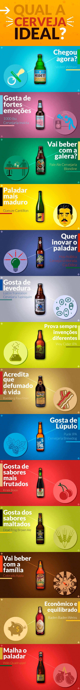
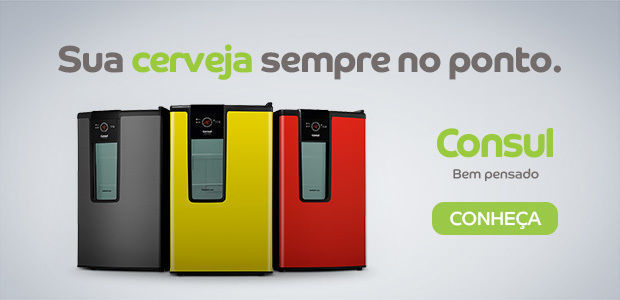

# 14 cervejas para descobrir como agradar o seu paladar

Cada vez mais cervejas artesanais deliciosas se tornam acessíveis. Como escolher aquela que mais te apetece?

Passamos por um momento de mudanças, a cerveja, antiga conhecida tem mudado e muito.

Os bares começam a nos oferecer uma infinidade de torneiras de chopes, as lojas especializadas se espalham por aí, o supermecado já tem prateleiras só para isso e seu amigo está até fazendo cerveja em casa.

Quando entramos nesse novo mundo das cervejas artesanais as vezes é difícil encontrar a cerveja perfeita.

Uns bebem cervejas amargas demais, azedas, doces, alcoólicas e você ainda não encontrou qual o seu tipo. É preciso entender que existe um caminho a ser descoberto e sua cerveja ideal nem sempre vai ser a mesma, pode mudar conforme o tempo passa e você conhece novos estilos e cervejarias.

Montamos um infográfico divertido com sugestões simples para ajudar você nessa escolha.

### Mecenas: [Consul](http://ia.nspmotion.com/event/?cap=339640&c=38690&e=ADM_Click!1!1!1!!&r=%5Btimestamp%5D)

Suas cervejas favoritas, escolhidas com cuidado, merecem ser guardadas em um lugar especial e estiloso: a [cervejeira da Consul](http://ia.nspmotion.com/event/?cap=339640&c=38690&e=ADM_Click!1!1!1!!&r=%5Btimestamp%5D).

- Mantém a cerveja gelada em até cinco níveis de temperatura diferentes que chegam até -4ºC;
- Capacidade e potência para gelar até 75 latas de 350ml;
- Prateleiras ajustáveis para você guardar todos os tipos de cerveja: long neck, garrafa de 600ml e até de 1L;
- Deixa sua cerveja no ponto;
- Econômica e frost free

---

*publicado em 07 de Maio de 2015, 11:32*
