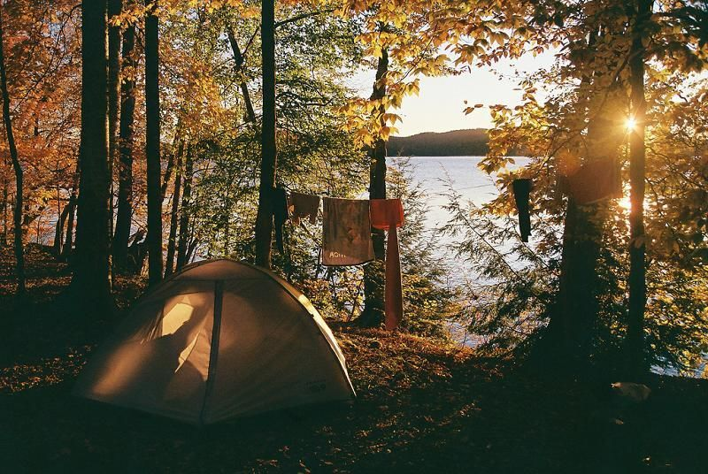
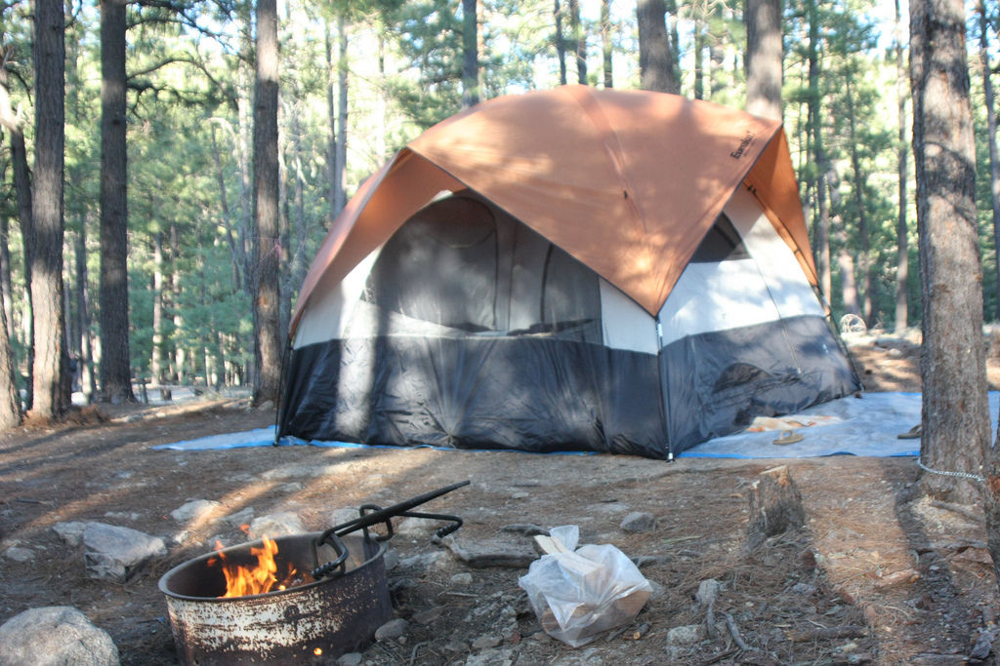
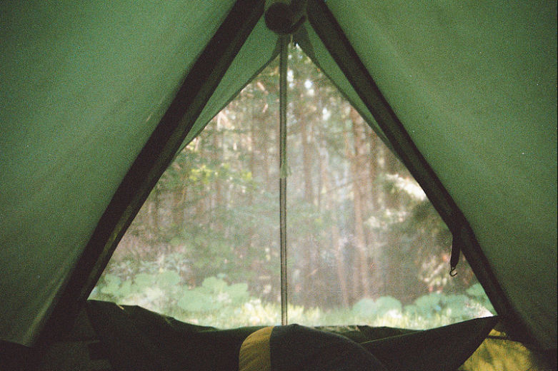
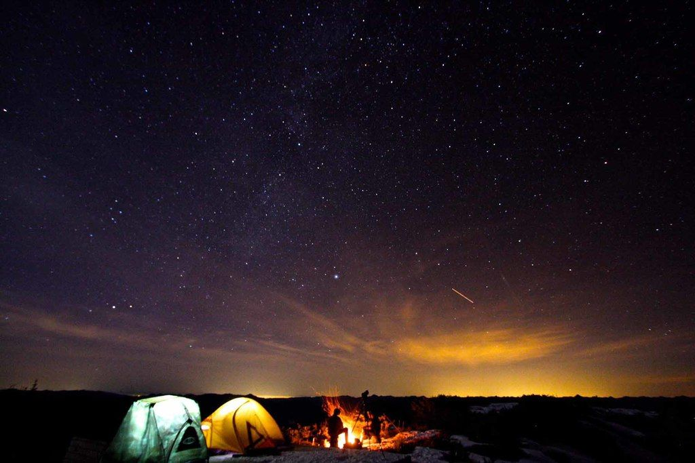
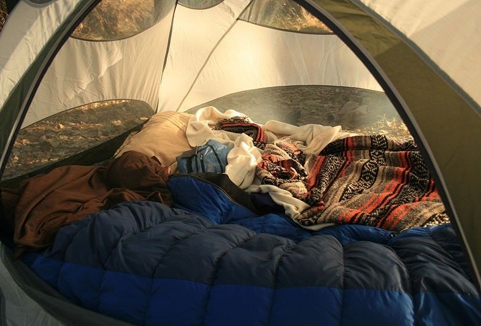
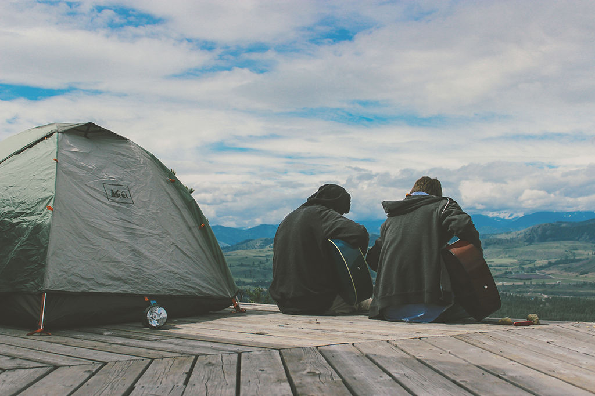
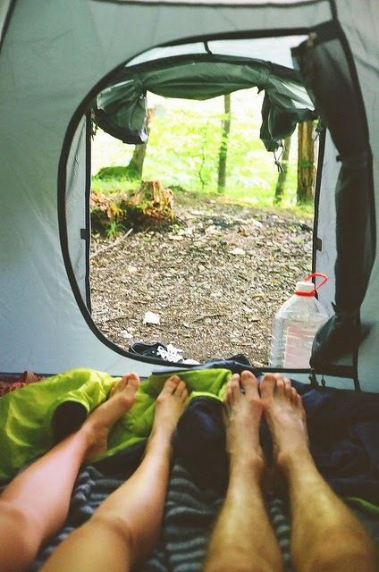

# 7 dicas para acampar

Pequenos planejamentos e informações que vão ajudar no seu acampamento

Eu já publiquei aqui, em 2013, [23 dicas para fazer uma trilha mais roots](http://www.papodehomem.com.br/23-dicas-essenciais-para-se-aventurar-em-uma-trilha-roots/), com várias informações para quem quer se aventurar por uns dias no meio do mato. É o tal do ar livre, do [Fugere urbem](http://pt.wikipedia.org/wiki/Fugere_urbem), a necessidade de reestabelecer contato com sons e cheiros naturais.

Um papo que vem sendo recorrente aqui na casa do PapodeHomem é de como, na cidade, não conseguimos ficar sem ouvir um barulho mecânico, algum tipo de som que não é natural, há sempre o incômodo da buzina ou de algum tipo de motor ou máquina. A conversa roda em torno de como isso é danoso, de como atrapalha mesmo, de como há essa exigência de sair desse meio e ficar em algum lugar cujo o ambiente proporcione apenas sons naturais: vento na folha, alguma comunicação de bichos, água descendo alguma coisa.

Acampar surge com essas características. Então descole uma barraca e siga as dicas [que eu pesquei lá da Go Outside](http://gooutside.com.br/3962-acampamento-perfeito) com o básico para estabelecer um acampamento interessante.

### 1. Observe o terreno

> Se há um lugar macio e vazio no chão, provavelmente há uma poça d'água que costuma se formar nele. É melhor armar a barraca em um terreno levemente inclinado, onde não vai acumular água.

### 2. Use a sombra com sabedoria

> Aproveite uma encosta ou árvores para "refrescar" a barraca à tarde. O ideal é que o sol bata na barraca de manhã: a barraca vai ficar quente, o que vai te obrigar a levantar cedo.

### 3. Teste dos specs

> Antes de armar a barraca, verifique o terreno fincando alguns specs pelo chão. É melhor descobrir o quanto antes se o piso é duro.

### 4. Repelente natural

> Para fugir dos insetos, o melhor é procurar uma clareira. Para encontrar um lugar onde bata mais vento, procure subir um pouco mais a montanha. Mas lembre-se: no geral, no alto da montanha você estará mais longe de uma fonte de água confiável.

### 5. Prevenção

> Ao voltar de uma viagem, seque sua barraca: pendure-a de ponta cabeça no varal. Mesmo se não choveu enquanto você estava acampado, a condensação que se forma na barraca pode deixar uma umidade. A consequência pode ser um cheiro terrível. Faça o mesmo com seu saco de dormir e isolante.

### 6. Manutenção

> Algo se quebrou ou se sujou durante a viagem? Conserte e limpe assim que chegar em casa, mesmo se for aparentemente irrelevante, como um pequeno furo no saco de dormir ou uns pingos de lama que entraram na barraca. Evite surpresas desagradáveis na próxima vez que montar sa barraca.

### 7. Mais um cuidado

> Uma vez que a barraca estiver seca e limpa, o melhor é guardá-la dentro de uma caixa, ao invés de deixá-la comprimida no saco. E fora do alcance da luz, que desgasta os tecidos sintéticos. Faça o mesmo com o seu saco de dormir.

---

*publicado em 24 de Maio de 2015, 09:00*
