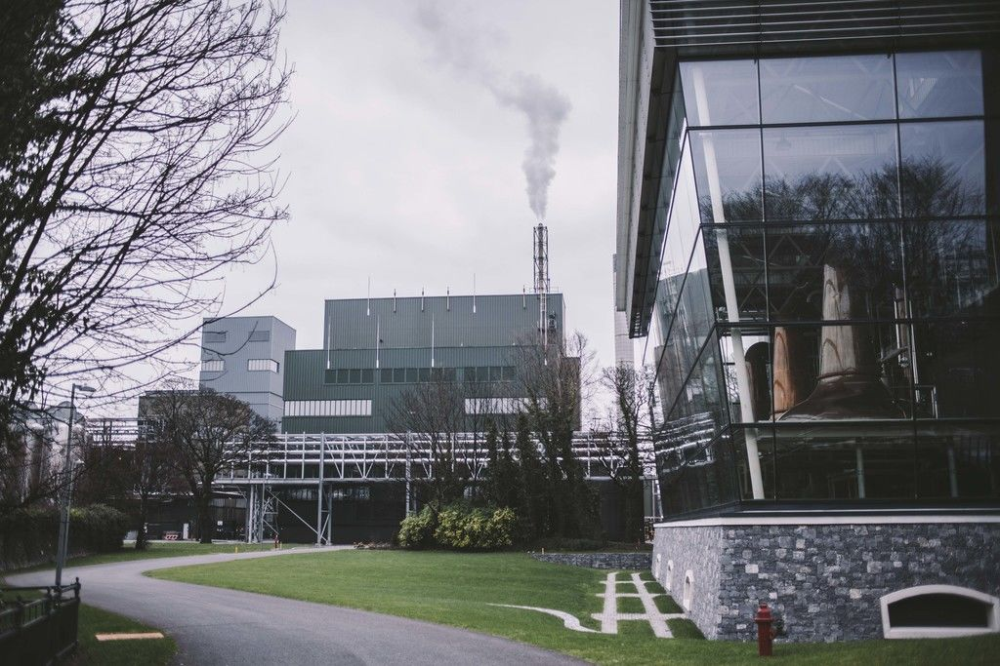
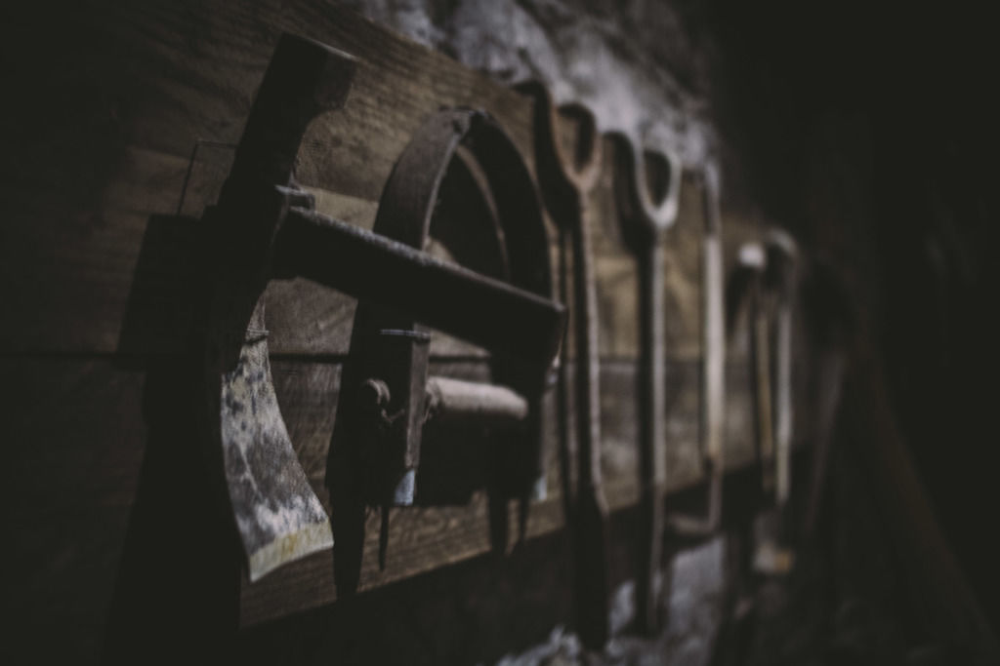
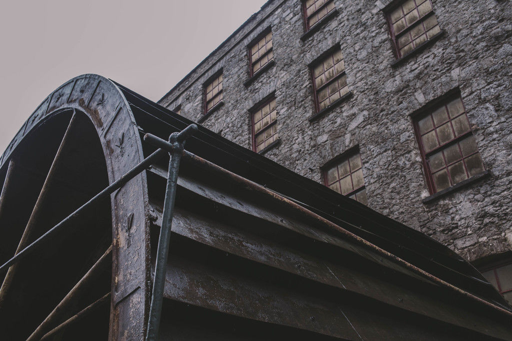
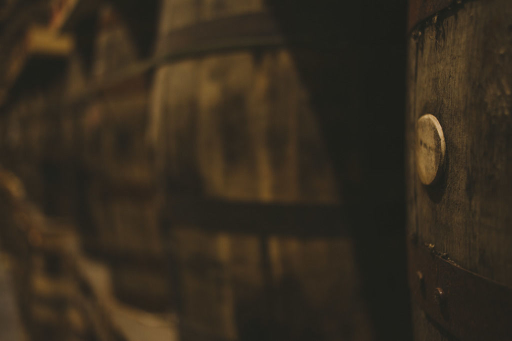
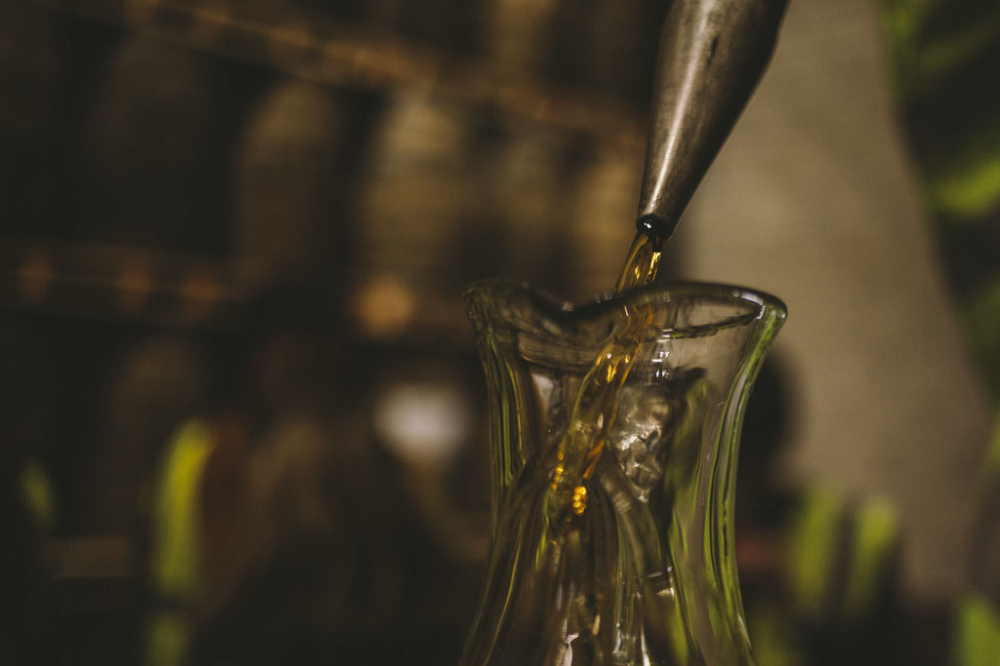
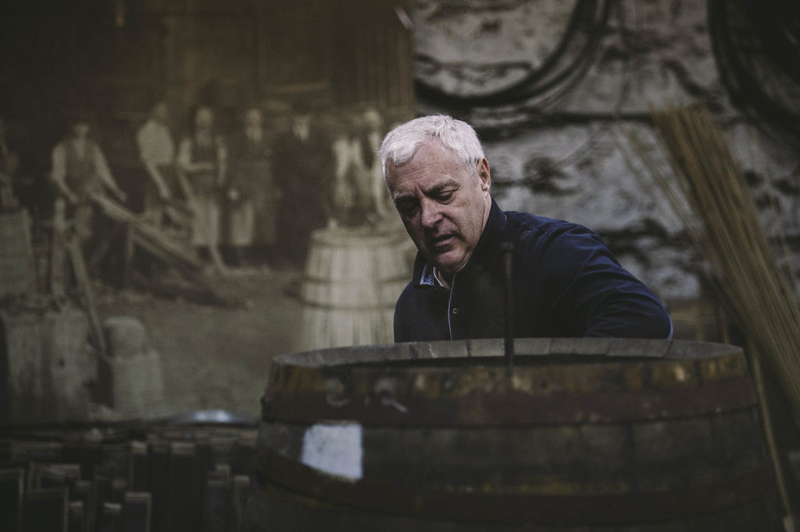
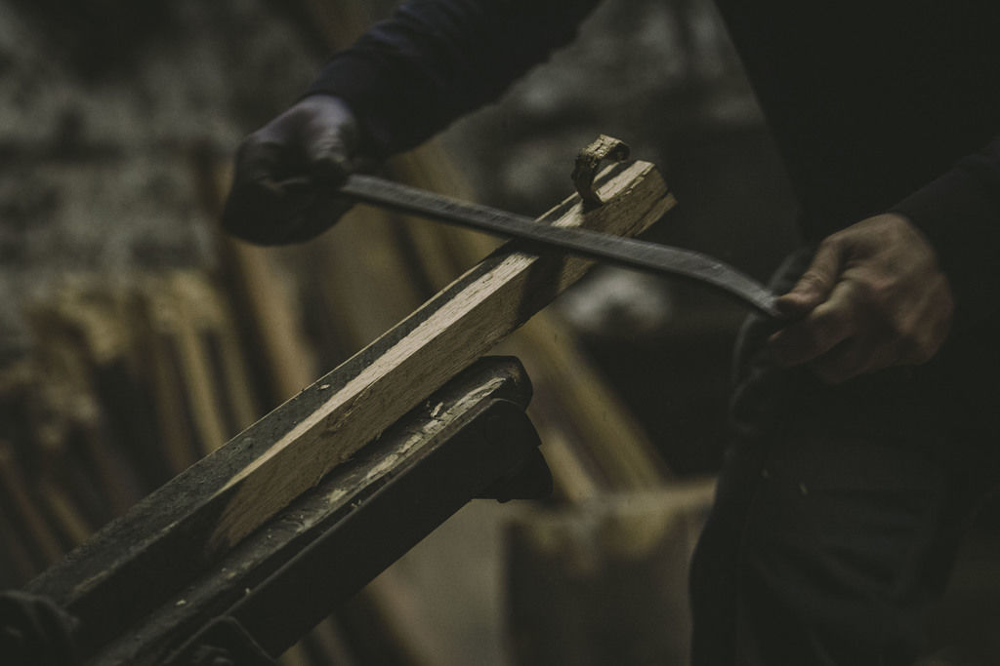
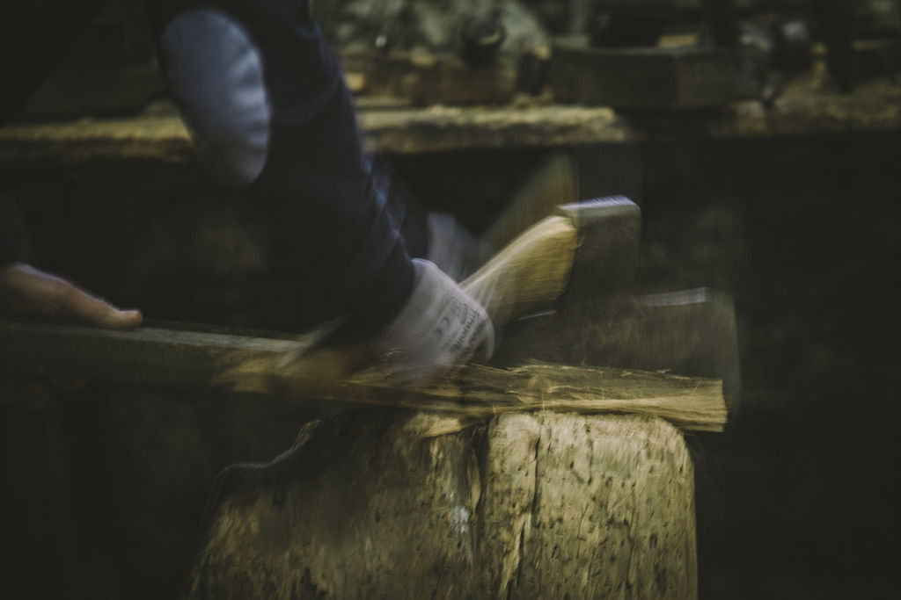
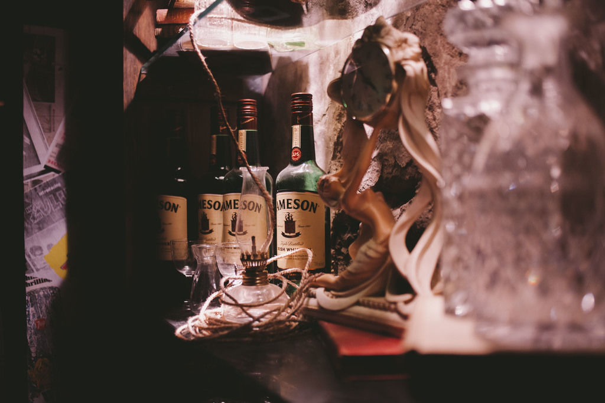

# A fantástica fábrica de whisky

Oompa Loompa, do-ba-dee-doo. Saiba como foi conhecer a destilaria da Jameson na Irlanda e conheça alguns drinks para se fazer com whisky

No início de março, a Jameson nos convidou para conhecer as
destilarias da marca em Middleton, na Irlanda.

São duas: uma antiga, que funcionou por 150 anos até ser
fechada, em 1975, e hoje funciona como atração turística; e uma nova,
operacional até os dias de hoje, que foi inaugurada justamente quando a outra
foi desativada.

A nova destilaria

A experiência de andar entre as duas instalações é um pouco
surreal.

Se a forma é diferente – as diferenças entre ferramentas
antigas, rodas d’água e paredes envidraçadas de metal e vidro saltam aos olhos
–, o conteúdo não: o líquido que é produzido ali é essencialmente o mesmo e
quase não passou por transformações mesmo atravessando um século.

Rodamos bastante por lá e ouvi muito sobre os processos de
criação dos whiskys irlandeses, mas admito que minha parte preferida da visita
guiada foi a que entregou uma constatação meio besta.

Sabe o whisky que você bebe? Um dia ele já foi uma cerveja.

Nunca tinha me tocado, mas faz todo sentido: antes de serem
destilados, os cereais que compõem o whisky são esmagados, maltados e
fermentados, tal qual acontece em uma cervejaria. De acordo com os
especialistas da marca, a principal diferença entre esse líquido e as cervejas
que estamos acostumados a beber é a ausência de lúpulo (tentei descolar uma
versão dessa bebida, mas não consegui. Dizem que não é exatamente gostosa).

A partir desse ponto é que o whisky começa a tomar forma.

Pelo método consagrado na terra dos leprechauns, essa
“cerveja” é destilada por três vezes. Não é uma regra universal e cada marca
possui seus métodos, é claro, mas essa decisão torna o whisky irlandês mais
suave quando comparado àqueles que são destilados apenas uma vez (os bourbouns
americanos, como Jack Daniel’s) ou duas (caso de boa parte dos whiskys
escoceses).

No caso específico da Jameson, como a bebida que encontramos
nas prateleiras é uma mescla de dois estilos diferentes – pot still e grain whisky
–, a tridestilação é fundamental para garantir que o produto final seja fácil
de beber. O pot still whisky é o equivalente irlandês ao single malt escocês, feito
apenas com malte e cevada. Mais pesado e apimentado, geralmente é apreciado por
bebedores mais experientes. O grain whisky, por sua vez, é feito de qualquer tipo
de cereal – como milho, centeio ou trigo – e é mais leve e floral. A mistura
dos dois, não por acaso, garante a versatilidade.

Os números envolvidos são assombrosos. Ao todo, 1 milhão e
200 mil barris de bebida estão espalhados pelos 45 galpões que armazenam a
produção. A cada dia, esses galpões perdem o equivalente a 29 mil garrafas de
whisky. E essa não é uma imensa falha de produtividade: o fenômeno, apelidado
de [a parte dos anjos](http://www.adorocinema.com/filmes/filme-193360/), se deve à evaporação natural de 2% do álcool durante o processo de
envelhecimento.

Provar os whiskys que servem de base para os blends da
Jameson direto desses barris foi, inclusive, uma oportunidade e tanto. O teor
alcoólico dessa etapa da produção (antes de serem misturados uns com os outros
e diluídos em água) fica na casa dos 60%.

Outra oportunidade bem legal que o passeio ofereceu foi
conhecer Ger Buckley, o mestre dos barris da Jameson. Quinta geração da família
no negócio, Buckley não é só um tanoeiro habilidoso com o machado e um baita contador de
histórias. É ele o responsável por selecionar, garantir a qualidade e consertar
cada um dos barris de carvalho utilizados para o envelhecimento do whisky.

Geralmente compradas de outras destilarias e já com alguns
anos de uso, a seleção das peças é fundamental para garantir os sabores e as
diferenças entre cada um dos rótulos da empresa.

> Jameson Original é envelhecido em barris que já acolheram
> bourbon e xerez. Os barris de bourbon entregam sabores como mel, baunilha e
> madeira doce, enquanto os de xerez dão especiarias, canela e frutas secas.

> Jameson Black Barrel também usa os barris usados com bourbon
> e xerez. A diferença é que a parte interna do barril de bourbon usado aqui já
> foi carbonizado duas vezes, e não apenas uma. Com o contato com a madeira
> queimada, o whisky fica mais doce e com sabores mais complexos.

> Jameson Gold reserve é o único whisky da marca que usa
> barris de carvalho virgens no processo de envelhecimento. Essa escolha dá um
> toque apimentado ao whisky e, como o percentual de pot still whisky é maior
> nessa garrafa, tem-se um whisky mais encorpado.

> [Fonte: Dave Mc Cabe, da 
> Irish Whiskey Academy](http://www.irishwhiskeyacademy.com/)

Uma das coisas que foi possível perceber sendo claramente martelada em cada
uma das falas que ouvi durante a visita é a preocupação em manter um certo
frescor, longe da ideia de que whisky é algo intocável e que só deve ser bebido
puro ou com algumas pedrinhas de gelo (e já era assim em 2011, quando [o Rodrigo
Cambiaghi esteve por lá](http://www.papodehomem.com.br/uisque-misturado-o-que-diriam-os-mestres-do-liquido-dourado/)

O uso do Jameson Original para drinks refrescantes ou em
coquetéis mais complexos, por exemplo, é largamente estimulado. Era mais fácil beber um Ginger
and Lime do que encontrar whisky puro na maior parte do tempo.

Torci o nariz para essa ideia no começo, admito. Mas com o
tempo – e a ajuda desse drink abaixo – Tipperary, o negroni irlandês – me
convenci de que não é necessariamente um sacrilégio misturar whisky com outras
coisas.

Sério, experimentem.

O pulo do gato é usar ingredientes que ressaltam
os sabores da bebida, ao invés de escondê-los (acho que foi por isso que o
drink com ginger ale, uma espécie de refrigerante muito doce, não me pegou).

Pedi a Oisin Davies, barman que faz as vezes de embaixador
da marca e foi o responsável por preparar o Tipperary, que compartilhasse
algumas das receitas dele com o PdH. Podem ir sem medo.

#### All Irish Punch

- 1 garrafa de whisky irlandês
- 2 litros de cidra
- 250 ml de aperitivo de [ruibarbo](http://www.bbc.co.uk/blogs/legacy/portuguese/amesa/2009/12/o-doce-sabor-do-ruibarbo.html) (planta semelhante ao aipo)
- 250 ml de aperitivo de [elderflower](http://en.wikipedia.org/wiki/Elderflower_cordial%20)
- 150 ml de suco de limão fresco
- Limão, ruibarbo fresco e trevos cordados para decorar.

*Como fazer:*Misture todos os ingredientes com exceção da cidra e
deposite o resultado, já coado, em uma vasilha para ponche. Quando estiver
pronto para servir, coloque a cidra e os itens para decorar.

#### The Emerald

*Ingredientes:*

- 50 ml de whisky
- 20 ml vermute italiano doce (como o Martini vermelho, por exemplo)
- 2 doses de bitters  de laranja

*Como fazer:* Agite todos os ingredientes em uma coqueteleira com gelo e
coe tudo para um copo gelado ou taça de Martini. Enfeite com um pouco de
laranja.

#### Monastic Sour

*Ingredientes:*

- 40 ml de whisky
- 10 ml de licor Benedictine
- 10 ml de xarope de açúcar
- 15 ml de suco de limão
- 1 dose de Angostura

*Como fazer:* Coloque a clara de ovo e o suco de limão em uma coqueteleira
e feche. Misture por alguns segundos, retire a tampa e acrescente o resto dos
ingredientes. Acrescente bastante gelo e depois balance por 20 segundos.
Coe em um copo gelado e enfeite com limão.

Black Barrel Punch

*Ingredientes:*

- 20 ml de Jameson Black Barrel
- 20 ml de rum
- 20 ml de vinho do Porto
- 20 ml aperitivo de framboesa
- 20 ml de suco fresco de lima
- 2 doses de angostura (bitter)

*Como fazer:*Coloque todos os ingredientes em uma coqueteleira cheia de
gelo. Feche e mexa por 20 segundos. Coe para uma xícara de chá e enfeite com
noz moscada recém ralada.

P.S: Paralelamente ao trabalho como editor do PdH, tenho
começado a me dedicar mais à fotografia. Se você gostou das fotos desse texto (são
todas de minha autoria) ou quer conhecer outras, dê uma passada por lá: [@ismaeldosanjos](https://instagram.com/ismaeldosanjos).
Desde já, agradeço pela força.

---

*publicado em 04 de Maio de 2015, 05:14*
