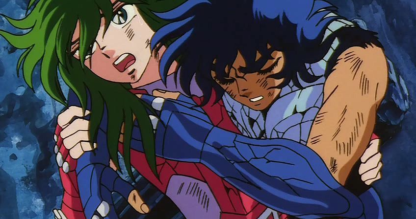

# Ajude o crescimento de alguém

Não torne as pessoas reféns da sua ajuda, deixe-as crescer

O ano de 1796 entrou para a história da humanidade. O médico Edward Jenner, após observar mulheres que trabalhavam na ordenha não se contaminavam com varíola de vaca, desenvolveu a primeira vacina que temos notícia.

O conceito parte do princípio que hoje é conhecido como [Hormese](http://en.wikipedia.org/wiki/Hormesis). O corpo humano, quando exposto a estressores, não apenas se recupera do dano causado, mas se torna resistente ao fator estressor.

O conceito básico da vacina é, simplesmente, expor o organismo ao vírus e esperar que ele se recupere, tornando-se mais forte. Por isso, quando tomamos uma vacina, sentimos febre e parte dos sintomas causados pela doença. De fato, estamos sendo expostos ao vírus em troca do benefício de adquirir imunidade.

A mesma analogia se aplica aos exercícios físicos: estressamos os músculos e esperamos que se recuperem, dessa vez um pouco mais fortes que antes. Se tive dificuldades para correr 5km hoje, precisando caminhar durante alguns momentos, basta esperar meu corpo se recuperar para que da próxima vez seja mais fácil, até que eu consiga fazer todo percurso tranquilamente.

O mesmo também observamos na cor da nossa pele. A exposição ao sol faz a pele se regenerar mais forte e resistente, ficando mais escura.

Não são apenas danos físicos que funcionam dessa maneira, nosso comportamento e a forma como lidamos com as coisas também são assim, tendem a sobrecompensar a partir de uma experiência ruim.

**É importante entender que falo de fatores estressores pequenos**, causando apenas dano suficiente para permitir que o corpo se recupere, se fortalecendo no processo.

Grandes estressores podem levar o sistema ao colapso, no caso de um vírus, por exemplo, resultar numa doença em estágio mais avançado, podendo até evoluir ao óbito. É importante esclarecer a diferença entre pequenos e grandes estressores, porque é nesse argumento que surgem as críticas aos sistemas de intervenção social dos governos, por exemplo. Obviamente, queremos que os cidadãos consigam se sobressair a partir de certos problemas, mas quando o estressor é muito forte, pode inviabilizar qualquer crescimento.

### O crescimento pós-traumático

Todos já ouvimos falar de “transtorno pós-traumático”, mas quase ninguém menciona seu irmão ainda mais comum, o “crescimento pós-traumático”.

Observe como somos capazes de fazer coisas que levariam muitos dias, com muita rapidez, quando existe um prazo muito urgente para atender. O clássico ex-gordinho que agora é militante do fitness ou, até mesmo, como nosso foco é amplificado quando existem ruídos ao fundo, levando muitas pessoas a produzirem muito mais em cafés do que fariam em casa.

Esse último é um fenômeno tão observado que existem até aplicativos que simulam o som de fundo pra promover esse foco compensatório.

Pequenos problemas podem trazer grandes benefícios. Seja do ponto de vista biológico ou psicológico, superar dificuldades não apenas nos devolve ao estágio original, mas nos transforma em pessoas – organismos – mais fortes, possivelmente melhores.

### Quando ajudar atrapalha

Mas existe outro principio que não é mencionado com frequência, mas que remove os benefícios possíveis da hormese. A [Iatrogenia](http://pt.wikipedia.org/wiki/Iatrogenia) pode ser descrita – com muita simplificação – como “**Morte causada pelo curador**”, ou seja, um dano causado por alguém que procurava ajudar.

Mesmo com toda a possibilidade de esconder os danos, é mais simples identificar a iatrogenia quando falamos de medicina, já que erros médicos são bastante sensíveis aos pacientes e seus familiares. Mas também podemos aplicar esse conceito na vida cotidiana.

Shun sempre cresce muito mais quando Ikki não pode ajudar

O exemplo mais clássico de intervenção que prejudica, é a atenciosa mãe coruja. Aquela que não deixa o filho se sujar, brincar na terra, andar descalço ou se expor aos riscos comuns da infância. É interessante observar que, normalmente, esse perfil materno não permite que seus filhos o façam porque vivem doentes, caindo no curioso paradoxo: os filhos vivem doentes porque não estão exposto aos estressores comuns à idade, ou não são expostos aos estressores porque vivem doentes?

É fácil identificar quando algo claramente nos faz mal, mas é complexo observar quando, alguém que nos ajuda está na verdade atrapalhando. Uma excelente forma de falir um negócio, por exemplo, é contratar pessoas que prometem ajudar mas não cumprem prazos e estão sempre dando desculpas. Você acaba deixando passar, porque sabe que a pessoa tem boa intenção, mas essa ajuda acaba custando cada vez mais caro.

Na segunda-feira em que defini este assunto para escrever, fui para meu treino de jiu-jitsu, como de costume. Por estar pensando sobre como alguns tipos de ajuda acabam nos fragilizando, acabei observando uma situação curiosa, mas bastante comum.

O treino consistia em aplicar algumas técnicas de estrangulamento, mas depois de algumas repetições notei que meu parceiro dava os dois tapinhas de desistência antes que o golpe estivesse realmente funcionando. Ele certamente acreditava que estava me ajudando, que aquele ponto era o suficiente para ter compreendido a técnica, mas na verdade estava apenas me condicionando a fazer uma técnica incompleta, sem o ajuste necessário para que se tornasse eficaz. Pedi para que deixasse a técnica ir até o fim, me possibilitando entender melhor o ponto de execução.

Depois disso, precisei fazer pelo menos mais cinco vezes, nessas novas condições, para que o golpe funcionasse e meu amigo precisasse de fato dar os os tapinhas para que eu parasse.

Outro exemplo curioso de como intervenções ingênuas são difíceis de identificar, são as placas de trânsito. Acreditamos que quanto mais sinalizado for o caminho, menos perigoso ele se apresentará para o motorista, quando na verdade o oposto se mostra verdadeiro.

Alguns testes vem mostrando que, ao retirar sinais e placas de transito, os [acidentes são consideravelmente reduzidos](http://www.dw.de/european-towns-remove-traffic-signs-to-make-streets-safer/a-2143663-1). Quando um motorista dirige por uma avenida repleta de placas, se sente seguro e confortável. Este sentimento acaba tirando a preocupação que ele deveria ter. Ao remover as placas, somos obrigados a dirigir mais devagar e observar o que está acontecendo, nos preparar para imprevistos e agir com mais cautela.

Acreditamos que, ao remover estes pontos de pressão, a pessoa “beneficiada”, mesmo que não exceda suas capacidades, permanecerá apenas como estava. O comum argumento “ah, mas mal não faz” é frequentemente empregado nesses casos, sem observar o dano que é causado.

As pessoas que sofrem algum tipo de intervenção ingênua, sendo privadas de seus medos, dores e sofrimentos, acabam se fragilizando e se tornando cada vez menos aptas a lidar com seu problema. Pior ainda, algumas dessas pessoas acabam virando reféns dessa ajuda.

É muito comum ajudar amigos a resolverem pequenos problemas algumas vezes e isso acabar se tornando frequente. Por tê-lo condicionado com essa ajuda, ele se tornou incapaz de agir por conta própria, acreditando que sempre precisará de mim para ajudar ou que eu preciso estar lá para quando ele precisar.

Num exemplo ainda mais extremo, observamos homens que acreditam proteger as mulheres, por julgá-las mais frágeis, sem se dar conta que este é, historicamente, o comportamento que acaba fragilizando-as.

É muito comum sentir vontade de ajudar, de socorrer e fazer algo para cessar a dor daqueles que estão próximos. Muitas vezes não fazemos isso por mal, não temos intenção de aprisionar ou fragilizar as pessoas a nossa volta. A intenção é honesta e válida.

Com isso também não quero dizer para deixar todos ao seu redor entregues à própria sorte.

A problemática surge quando não reconhecemos os danos que nossa intervenção ingênua causa nos outros, provocando mais danos do que desejamos.

---

*publicado em 25 de Maio de 2015, 16:32*
