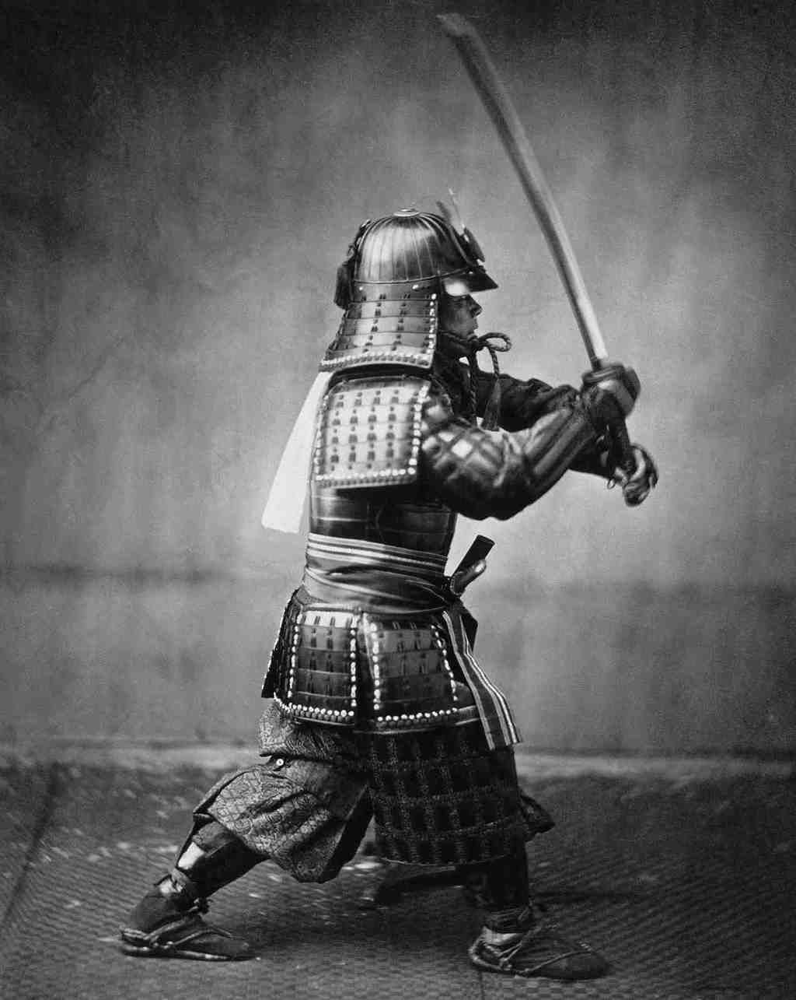
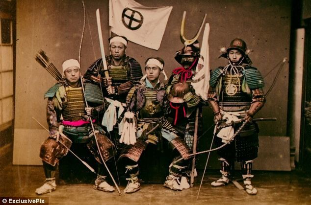
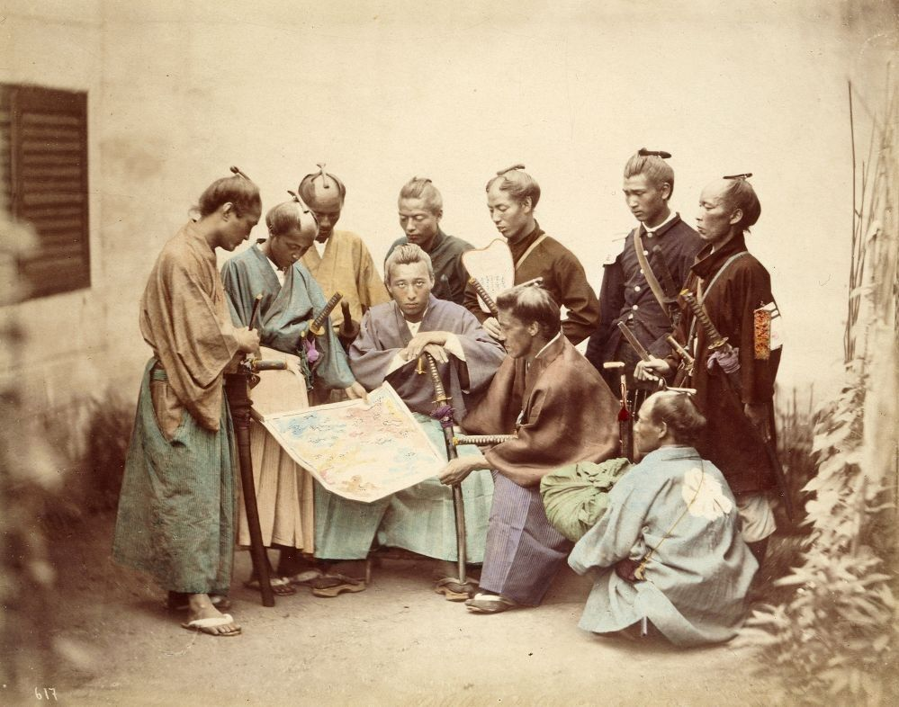

# Aprendendo com os samurais: o segredo de sempre estar pronto para tudo

Cultivar a calma inabalável

Samurais são um tipo de figura histórica que ecoa na mente ocidental como caubóis muito mais honrados e poderosos. Frios, destemidos, inabaláveis.

Pelo menos pra mim, que cresci em meio a um boom de elementos culturais orientais, como mangás, animes e filmes feitos no Japão, não é difícil se ver vítima do extremo fascínio que esses guerreiros exercem.

Sua forma de pensar, tanto quanto o visual característico, é objeto de estudo e está presente em uma extensa literatura.

Esse é um texto que vi no blog [Barking Up The Wrong Tree](http://www.bakadesuyo.com/2014/02/samurai/), de autoria de Eric Barker. Traduzimos e publicamos na íntegra, pra quem também admira o pensamento dos samurais.

### Aprendendo com os samurais: o segredo de sempre estar pronto para tudo, por Eric Barker

Estava lendo alguns livros escritos por samurais, e algo que se repetiu várias vezes me surpreendeu.

Não tem nada a ver com espadas, [luta](http://www.bakadesuyo.com/2011/05/what-can-we-learn-from-sun-tzus-art-of-war/) ou [estratégia](http://www.bakadesuyo.com/2012/08/what-three-things-can-we-learn-about-strategy/). Na verdade, se pensarmos bem, é até o oposto disso.

**O que tantos dos maiores guerreiros da história enfatizaram como sendo chave para o sucesso e o melhor desempenho?**

**“Ficar calmo.”**

E não foi só um samurai aleatório que mencionou isso de passagem.

Estamos falando sobre os maiores samurais que já viveram escrevendo a respeito ao longo de **quinhentos anos**:

**[Shiba Yoshimasa](http://www.amazon.com/gp/product/B005DXOLVS/ref=as_li_ss_tl?ie=UTF8&camp=1789&creative=390957&creativeASIN=B005DXOLVS&linkCode=as2&tag=spacforrent-20) (1349-1410):**

> Em particular para guerreiros, podemos considerar como a principal arte da guerra acalmar a própria mente e ser capaz de discernir a mente dos outros.

**Suzuki Shosan (1579-1655):**

> Quando você consegue dominar a própria mente, você domina as múltiplas preocupações, se eleva acima de todas as coisas, e se liberta. Quando você é dominado pela própria mente, sobre você recai o fardo de múltiplas preocupações, e você se torna subalterno das muitas coisas, incapaz de se elevar. “Cuide de sua mente; a resguarde sem hesitação. Uma vez que é a mente que confunde a mente, não deixe que ela ceda a si própria.”

**[Kaibara Ekken](http://www.amazon.com/gp/product/B005DXOLVS/ref=as_li_ss_tl?ie=UTF8&camp=1789&creative=390957&creativeASIN=B005DXOLVS&linkCode=as2&tag=spacforrent-20) (1630-1714):**

> Um nobre controla a frivolidade com seriedade, espera pela ação num estado calmo. É importante que o espírito esteja integrado, com o humor estável, e a mente inamovível.

**[Adachi Masahiro](http://www.amazon.com/gp/product/B005DXOLVS/ref=as_li_ss_tl?ie=UTF8&camp=1789&creative=390957&creativeASIN=B005DXOLVS&linkCode=as2&tag=spacforrent-20) (1780-1800):**

> A mente imperturbável é o segredo da guerra.

E, é claro, o homem talvez considerado o maior samurai de todos, Miyamoto Musashi, em seu clássico [Livro dos Cinco Anéis](http://pt.wikipedia.org/wiki/O_Livro_dos_Cinco_An%C3%A9is):

> Tanto ao lutar quanto na vida cotidiana, você deve ser determinado, ainda que calmo. Vá de encontro à situação sem tensão, mas também sem desleixo, com o espírito estável, mas sem prejulgamentos.

Ninguém precisa realmente fazer propaganda do valor da calma.

Conhecemos seus benefícios: com ela pensamos claramente, não tomamos decisões precipitadas, não nos assustamos facilmente.

**Mas *como* se ficar e permanecer calmo?**

Nossa sociedade está num ciclo de notícias de 24h, embebida em energéticos, com um Starbucks em cada esquina, e incansáveis linhas do tempo de medias sociais. GO GO GO.

E até mais curioso que isso, a maior parte do que sabemos sobre relaxar e ficar calmo está [totalmente errada](http://www.bakadesuyo.com/2012/05/are-you-doing-all-the-wrong-things-to-relieve/).

Os samurais tinham as respostas. E elas se alinham com as da ciência. Vamos a elas.

### O guia científico do samurai para se ficar de boa

O samurais treinavam muito as artes marciais, e pensavam muito sobre a morte.

Sério, eles pensavam *muito* sobre a morte.

O [Código dos Samurai: uma tradução atual dos Bushido Shoshins](http://www.amazon.com/gp/product/B0055PDKZ2/ref=as_li_ss_tl?ie=UTF8&camp=1789&creative=390957&creativeASIN=B0055PDKZ2&linkCode=as2&tag=spacforrent-20) diz:

> Aquele que se considera um guerreiro tem como sua preocupação principal manter em mente a morte, a todos os momentos, dia e noite, da manhã do dia de ano novo até à noite da véspera do ano novo.

E você naquela situação também pensaria, não é mesmo? A morte basicamente estava na descrição de funções dos samurai.

**Mas a pesquisa mostra que [treinar muito](http://www.bakadesuyo.com/2014/01/ancient-philosophers/%20) e imaginar que [o pior pode acontecer](http://www.bakadesuyo.com/2014/01/ancient-philosophers/) são duas técnicas poderosas para promover a calma.**

Os samurais treinavam sem parar. Acreditava muito em sempre se estar “preparado” (eram escoteiros mortais).

A pesquisa mostra que a preparação [reduz o medo](http://www.bakadesuyo.com/2013/08/fearlessness/) já que quando as coisas ficam tensas, não se tem que pensar.

Quem sobrevive aos cenários catastróficos, semelhantes a batalhas de samurais? As pessoas que se prepararam.

[Você não é tão esperto quanto pensa](http://www.buscape.com.br/voce-nao-e-tao-esperto-quanto-pensa-48-maneiras-de-se-autoiludir-david-mcraney-8580444969.html#precos), de David McRaney, coloca:

> De acordo com Johnson e Leach, o tipo de pessoa que sobrevive é o tipo de pessoa que se prepara para o pior e pratica de antemão... Tais pessoas não precisam deliberar durante a calamidade, uma vez que já passaram pela deliberação que as outras pessoas estão apenas começando.

E toda essa reflexão sobre a morte?

**“A visualização negativa” é uma das principais ferramentas do [estoicismo antigo](http://www.bakadesuyo.com/2014/01/ancient-philosophers/), e a [ciência a comprova](http://www.bakadesuyo.com/2012/04/was-steve-jobs-right-can-thinking-about-death/).**

**Pensar para valer sobre como as coisas podem piorar muitas vezes tem o efeito irônico de nos fazer perceber que não são tão ruins.**

De minha entrevista com [Oliver Burkeman](http://www.bakadesuyo.com/2013/11/the-art-of-negative-thinking/), autor de [O antídoto, felicidade para pessoas que não aguentam o pensamento positivo](http://www.amazon.com/gp/product/B0080K3G4O/ref=as_li_ss_tl?ie=UTF8&camp=1789&creative=390957&creativeASIN=B0080K3G4O&linkCode=as2&tag=spacforrent-20):

> Isso é o que os estoicos chamam de “premeditação” – que na verdade se obtém muita paz de espírito ao pensar detalhada, cuidadosamente e conscientemente sobre como as coisas podem dar muito errado. Na maior parte dos casos você descobre que a ansiedade e os medos quanto a essas situações eram exagerados.

**Certo, mas você não quer passar o dia inteiro treinando com espadas ou pensando na morte. Sinceramente, nem eu.**

**Então qual é a chave aqui?**

**A [pesquisa](http://www.bakadesuyo.com/2012/08/what-can-you-do-to-eliminates-stress/) mostra que a forma mais poderosa de combater o estresse ou a ansiedade – ficar calmo – é se sentir em controle.**

Para os samurais, treinar incansavelmente e visualizar o pior lhes dava uma sensação de controle durante a batalha.

O marinha dos EUA aumentou muito a taxa de [aprovação dos fuzileiros](http://www.bakadesuyo.com/2009/11/how-the-navy-seals-increased-passing-rates/) ensinando aos recrutas métodos psicológicos de obter a sensação de estar em controle.

Sem essa sensação, quando o estresse aumenta não conseguimos pensar direito.

Em O trabalho e o cérebro: estratégias para superar distração, obter foco e trabalhar de forma mais inteligentemente o dia todo [Your Brain at Work: Strategies for Overcoming Distraction, Regaining Focus, and Working Smarter All Day Long](http://www.amazon.com/gp/product/0061771295/ref=as_li_ss_tl?ie=UTF8&camp=1789&creative=390957&creativeASIN=0061771295&linkCode=as2&tag=spacforrent-20) está escrito:

> Amy Arnsten estuda os efeitos da estimulação do sistema límbico no funcionamento do córtex prefrontal. Durante uma entrevista filmada em seu laboratório em Yale ela resume a importância de um senso de controle para o cérebro: “A perda da função pré-frontal só ocorre quando nos sentimos sem controle. É o próprio córtex pré-frontal que determina se estamos em controle ou não. Se mantivermos pelo menos a iluão do controle, ficam preservadas as funções cognitivas.” Essa percepção de estar em controle é uma motivação muito importante no comportamento.

Qualquer coisa que lhe dê uma [sensação de controle](http://www.bakadesuyo.com/2011/09/whats-the-key-to-dealing-with-stress/) sobre a situação o ajuda a ficar calmo.

Então o que faz isso por você?

Mais informação? Prática? Ajuda dos outros?

Vou dizer o que vai o ajudar a manter a calma como um samurai.

Repare que eu disse “sentimento de controle” – não precisa ser controle verdadeiro, só a sensação de estar em controle já faz maravilhas.

Até mesmo um talismã pode ajudar – porque [talismãs realmente funcionam](http://www.bakadesuyo.com/2013/10/increase-luck/).

Amuletos nos dão uma sensação de controle, e essa sensação de controle realmente faz as pessoas desempenharem melhor.

De [The Courage Quotient: How Science Can Make You Braver](http://www.amazon.com/gp/product/0470917423/ref=as_li_ss_tl?ie=UTF8&camp=1789&creative=390957&creativeASIN=0470917423&linkCode=as2&tag=spacforrent-20):

> …as pessoas que tinham talismãs tiveram um desempenho significativamente maior do que as pessoas que não os tinham. É isso mesmo, ter um talismã o fará jogar golfe melhor, se for o que você gosta, e melhora seu desempenho cognitivo em tarefas tais como jogos de memória.

### Resumo

Sei que alguns de vocês estão pensando: *Calma? Os samurais não eram aqueles caras sempre gritando pra valer agitando a espada acima da cabeça?*

Ocorre que aquela era uma tática deliberada para assustar os inimigos. [Musashi explica](http://www.amazon.com/gp/product/B00BIFLR1W/ref=as_li_ss_tl?ie=UTF8&camp=1789&creative=390957&creativeASIN=B00BIFLR1W&linkCode=as2&tag=spacforrent-20):

> No combate um a um, também é preciso tirar vantagem de pegar um inimigo desprevenido a fim de derrotá-lo, assustando-o com seu corpo, espada ou voz... **No combate individual, para perturbar o inimigo, cortamos com a lâmina curta e gritamos “Ei!” simultaneamente, e quando ele está se recuperando do grito, cortamos com a espada longa.**

Sorrateiro. Esse é o tipo de ideias espertas que vem de uma cabeça fria.

Os samurais eram grande guerreiros. Eles lutavam contra seus inimigos em batalhas épicas.

**Mas como Musashi e outros deixam claro em seus escritos sobre calma, a batalha mais importante é vencer a si mesmo.**

Do [Livro dos Cinco Anéis](http://www.amazon.com/gp/product/B00BIFLR1W/ref=as_li_ss_tl?ie=UTF8&camp=1789&creative=390957&creativeASIN=B00BIFLR1W&linkCode=as2&tag=spacforrent-20):

> Hoje é o dia de sua vitória perante o que você era ontem; amanhã é o dia de sua vitória sobre os homens inferiores.

---

*publicado em 09 de Maio de 2015, 00:05*
