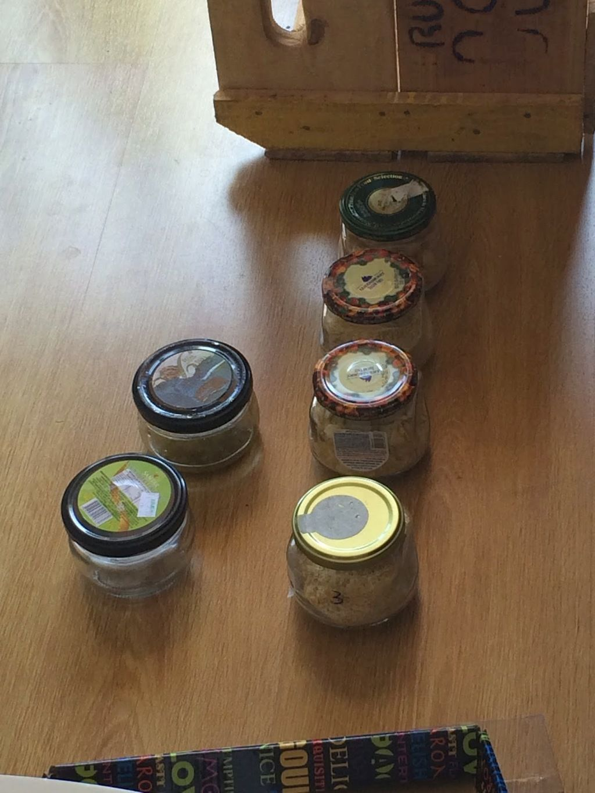
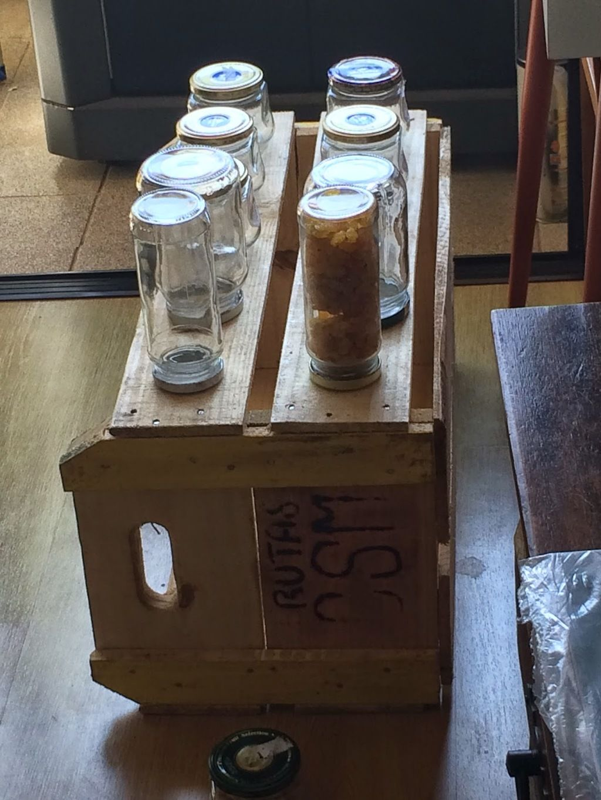
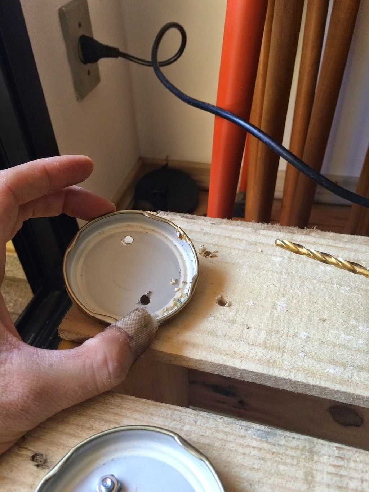
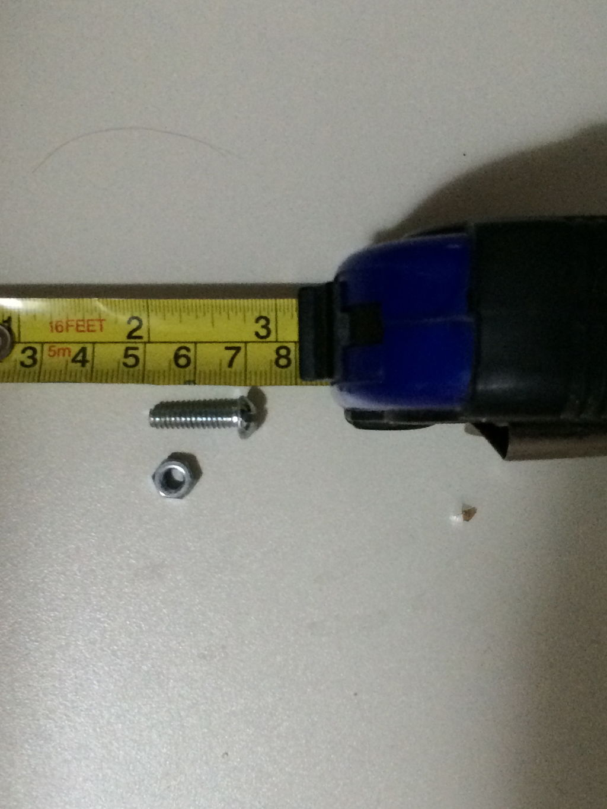
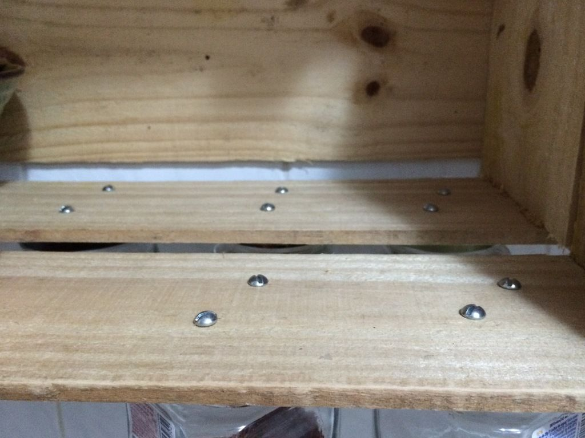
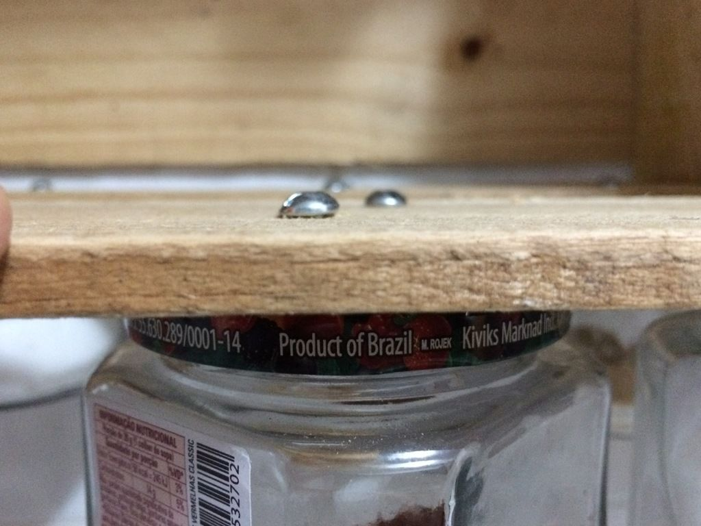
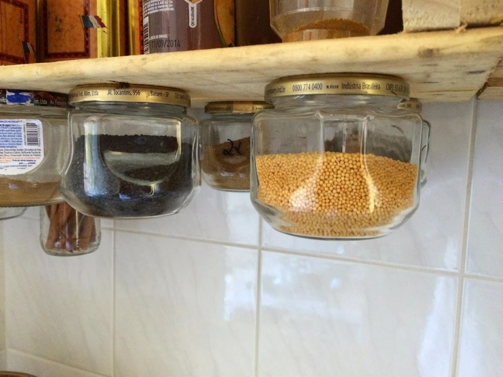
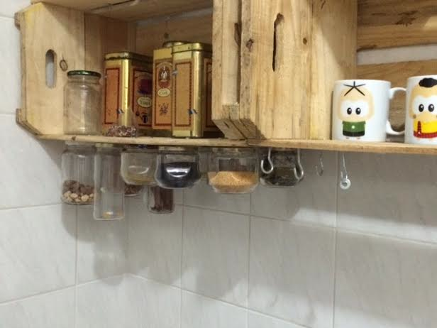
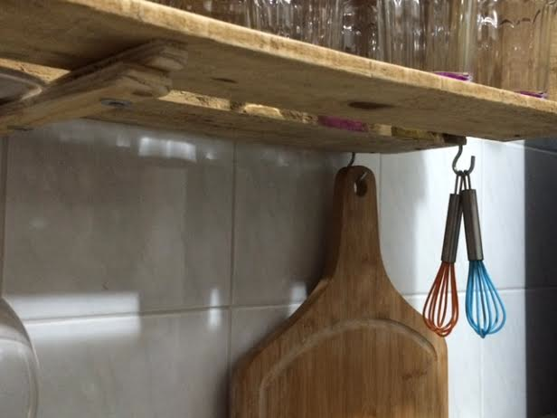

# Chega de bagunça: como organizar seus temperos de forma prática

Arranjo bonito e prático para organizar seus temperos

Quando compramos temperos, usualmente os colocamos em um armário bagunçado e escondido da cozinha. Ficam lá, no breu. Caem em sono eterno em seus próprios moedores de mercado, em saquinhos de plástico ou em um tapué véio. Sem identificação ou com um rótulo desgastado.

Na pressa do dia a dia, acabamos não usando aquela pimenta especial, o gengibre em pó, a semente de mostarda por preguiça, esquecimento ou ambos.

Mas esses dias acabaram, com essa dica de organização, de baixo custo e de altíssimo teor gustativo.

Lá vai o passo a passo:

### 1. Escolha potes bonitinhos e separe da maneira que mais agradar (por tamanho ou cor, por exemplo)

### 2. disponha-os no local onde vai parafusar. Recomendo uma prateleira ou em uma caixa de feira que será parafusada na parede

### 3. Faça dois furos para cada pote, em lados opostos da tampa

Fure a tampa e a madeira juntos, para marcar o local. Por isso você deve definir direitinho onde irá colocar os potes (veja o segundo passo).

### 4. Use parafusos com porca

Usei parafusos #6, com ponta chata para evitar acidentes no manuseio dos temperos. O tamanho deles vai depender da espessura da sua tábua. No caso de caixas de feira, use parafusos de 2cm de comprimento.

Pronto, com eles furados, parafusados em um local de fácil acesso, seus rangos serão devidamente condimentados.

Basta desrosquear seu tempero e usufruir dos sabores e aromas de cada um.

### 5. Aproveite o espaço do suporte (prateleira ou caixa de feira) e prenda parafusos com ganchos

Neles, você pode pendurar as ferramentas que mais usa na cozinha, como uma tábua de madeira, uns fues coloridos, suas colheres de bambu ou o que preferir.

---

*publicado em 01 de Maio de 2015, 17:13*
