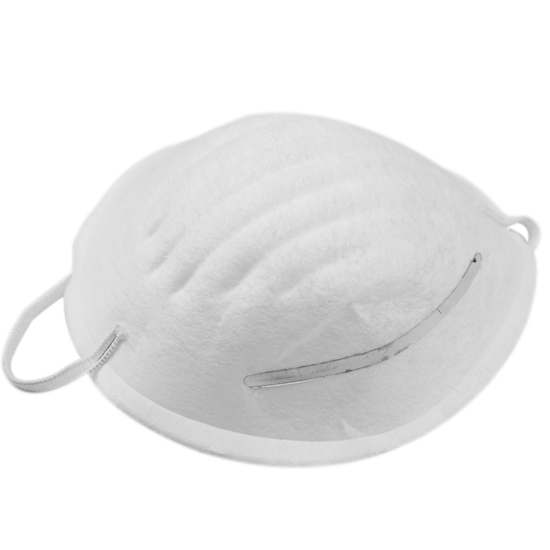
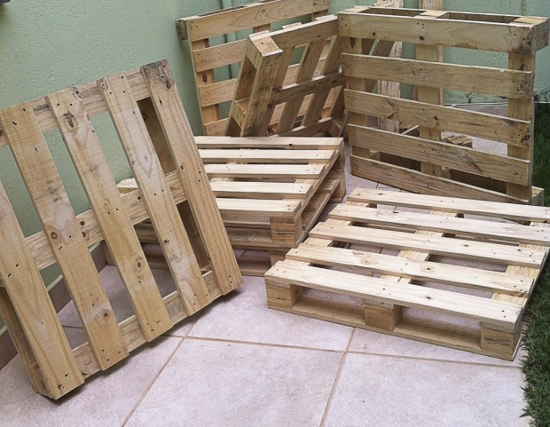
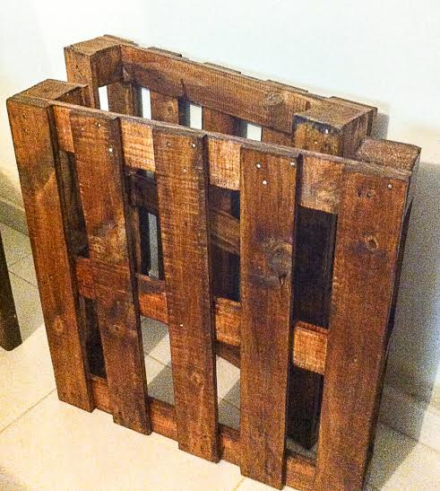
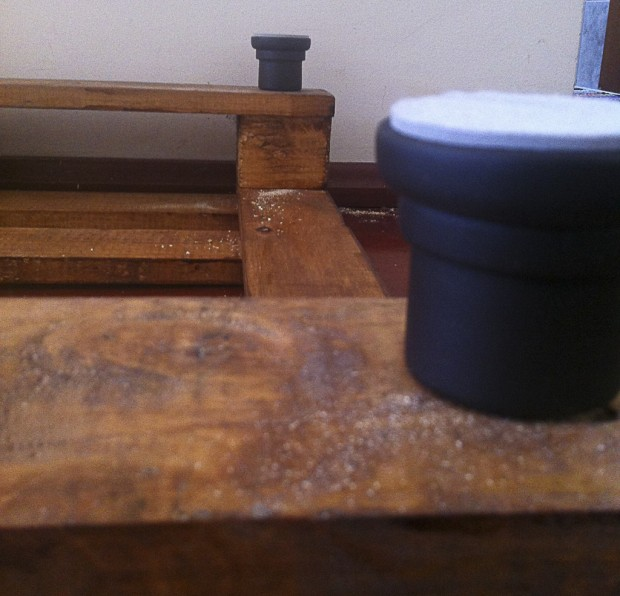
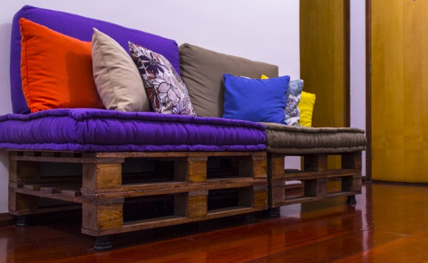
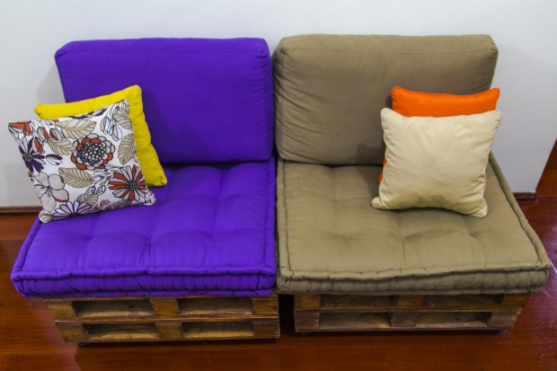
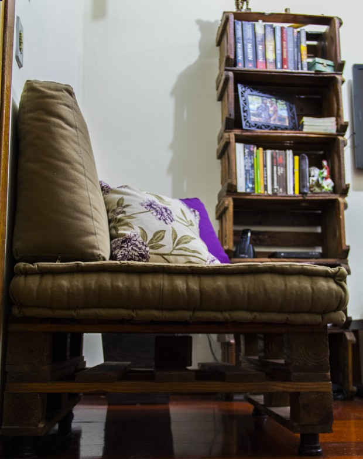
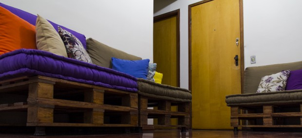
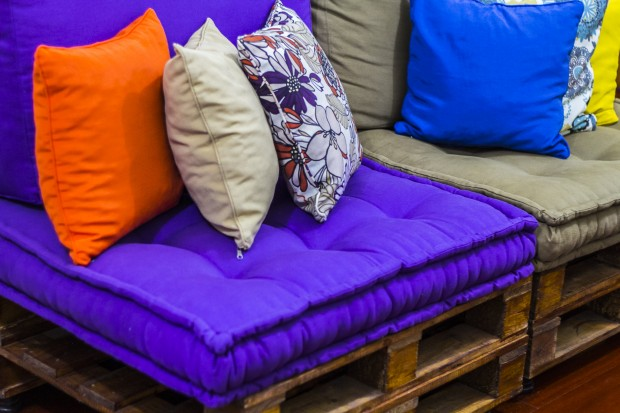
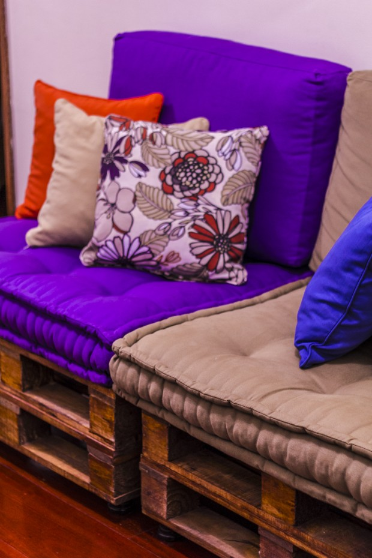

# Como fazer um sofá de pallets com futons

  
  

***Nota do editor:** Recebemos esse tutorial pelo email [deixaqueeufaco@papodehomem.com.br](http://www.papodehomem.com.br/como-fazer-um-sofa-de-pallets-com-futons/mailto:deixaqueeufaco@papodehomem.com.br). O objetivo da coluna é que, cada vez mais leitores mandem suas contribuições. Se você tiver algo a ensinar, não deixe de nos mandar material, vamos ficar bem contentes em receber e ajudar a lapidar o texto.*

Gostamos de móveis rústicos e re-utilização de 'materiais', por isso, minha namorada e eu resolvemos fazer um sofá de *pallets* com futons, bem a nossa cara. Aqui vai um breve tutorial da confecção do sofá.

### Material

- 6 pallets
- 8 folhas de lixa para madeira grão 60
- 6 lixas de grão 120
- 2 latas de Verniz Filtro Solar 900 ml imbuia Suvinil
- 12 pés
- Futons e almofadas
- Pano umedecido
- Muitas folhas de jornal velho

### Como fazer

Utilizamos ao todo 6 *pallets*, para que ficassem agrupados em duplas (um em cima do outro). Compramos os *pallets* por uma pechincha, R$10,00 cada, de um vizinho que não tinha o que fazer com eles.

Lixamos todos os*pallets* na 'munheca', sem artifícios como lixadeira elétrica. Essa foi a parte mais trabalhosa e gerou muita poeira – a madeira solta muito pó – assim, para aqueles que moram em apê, pode ser melhor lixar em outro lugar.

Dica: é aconselhável utilizar uma máscara, por causa do pó

Para lixar as partes mais 'grosseiras' utilizamos aproximadamente 8 folhas de lixa para madeira grão 60 e finalizamos com lixas de grão 120. Utilizamos umas 6 desta.

Cada lixa foi adquirida com valor aproximado de R$ 0,70.

Aqui um link que explica melhor como funciona essa coisa dos [grãos das lixas](http://pt.wikipedia.org/wiki/Lixa).

Após lixar todos os *pallets*, utilizamos um pano umedecido para retirar o excesso de pó que sobrou na madeira. Reforço: é muito pó! Importante limpar bem nos 'encontros' entre as madeiras.

Deixamos secar. Quanto mais úmido o pano utilizado, maior será o tempo necessário para secagem.​

Nosso material repousando depois de lixado e removido o pó com pano úmido. Deixa secar aí

Vamos à pintura.

Utilizamos 4 pincéis de 2 polegadas, com valor aproximado de R$4,00 para pintura.

Forramos o chão com jornais velhos, pois não somos pintores profissionais e, do contrário, com certeza teríamos manchado o piso todo.

Utilizamos 2 latas de Verniz Filtro Solar 900 ml imbuia Suvinil, cada lata custou aproximadamente R$ 38,50.

Usamos também uma lata de aguarrás para limpar a sujeira de nossas mãos e algumas poucas gotas que caíram no piso. Mesmo com jornais as tintas encontram um lugarzinho para pingar e fazer sujeira, incrível.

Secando de novo, só que agora por causa do verniz. Deixamos descansando por dois dias

Deixamos os *pallets* secarem por uns 2 dias, pra ficar bem seco. O verniz tem um cheiro muito forte, portanto, colocá-lo dentro de casa ainda molhado é dor de cabeça na certa.

Compramos 12 pés, pois sem pé achamos que ficaria muito baixo (e ruim para sentar). Cada pé saiu por R$ 7,50.

Fizemos um furo nos 4 cantos de cada *pallet* que ficaria por baixo.

pallet

Colocamos uma folha de compensado em cima de cada que ficou por cima, por causa dos buracos que tem entre as madeiras dos pallets, assim evitamos que o futon ficasse marcado.

Nós optamos por não pregar um *pallet* no outro.

Preferimos mandar fazer os assentos de futons e algumas almofadonas para encosto, tudo saiu por aproximadamente R$ 1000,00. Se achar caro, rola de fazer o sofá com aquele colchão velho de casa ou tentar outros estofamentos alternativos.

Minha namorada e eu adoramos o resultado da nossa parceria, ganhamos um sofá super bacana e descobrimos mais uma afinidade.

Vejam como ficou o resultado final.

### Você gostaria de ensinar algo?

*“Deixa que eu faço” é a nova série colaborativa de textos mão na massa do PapodeHomem. A ideia é reunirmos pessoas dispostas a contribuírem com guias e tutoriais, ensinando a fazer as mais diversas tarefas, das rotineiras às inusitadas. Com o tempo, queremos ter um compilado com todo tipo de passo-a-passo, para tornar o PapodeHomem um espaço cada vez mais útil.*

*Pode se programar: toda sexta, um texto com um guia ensinando a fazer algo prático.*

*Tem alguma ideia? Manda pra gente no e-mail [deixaqueeufaco@papodehomem.com.br](http://www.papodehomem.com.br/como-fazer-um-sofa-de-pallets-com-futons/mailto:deixaqueeufaco@papodehomem.com.br).*

*E, caso faça um dos tutoriais já publicados, põe a hashtag #deixaqueeufacopdh pra compartilhar com a gente. As mais legais a gente solta no [Instagram do PapodeHomem](http://instagram.com/papodehomem).*

---

*publicado em 24 de Outubro de 2014, 07:00*
