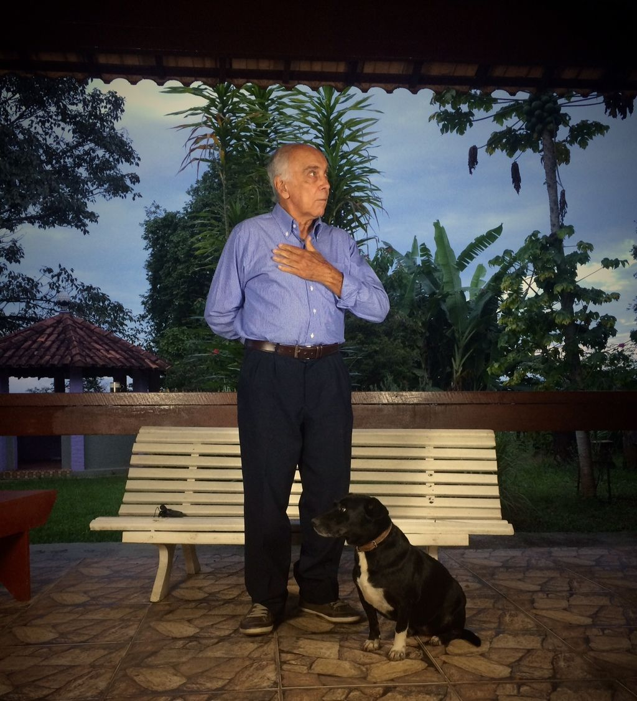
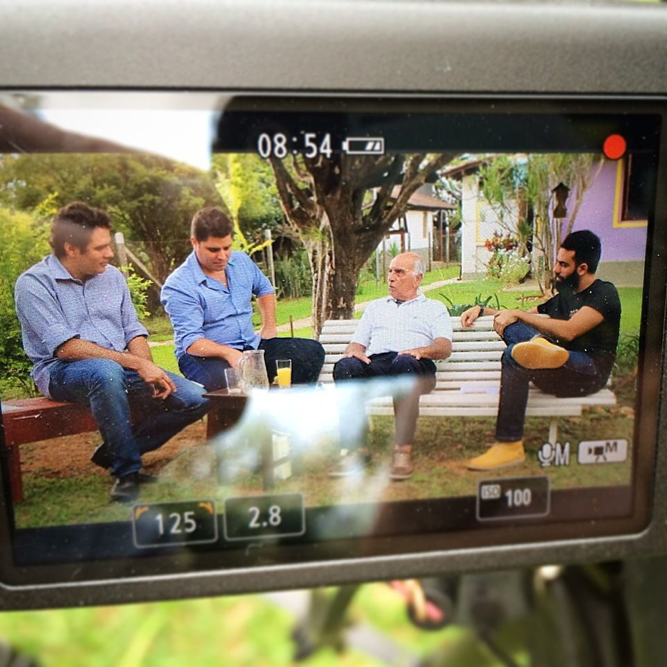

# Conversa com um homem de 88 anos

Sobre sentar e escutar e aprender com quem está aqui há bem mais tempo do que nós

Essa semana proseei com Sebastião, um senhor altivo à beira dos noventa.

De olhar matreiro, relutou um pouco ao escutar as primeiras perguntas, "pra quê falar disso? Tive uma vida comum como qualquer outra". Talvez, mas conte mesmo assim, insisti.

A infância nos cafundós de Minas foi rica, segundo ele, pois podia nadar no córrego todos os dias, caçar passarinho, subir em árvore e brincar bastante.

Aos doze a vida enrijeceu. Cozinhava e cuidava de três irmãos mais novos, enquanto o pai trabalhava na estação de trem e a mãe seguiria hospitalizada por anos.

Aos dezoito, a tirou do hospital e passou a sustentá-la e cuidar dela, até sua morte por câncer no útero. A família se mudou para Contagem, município urbano próximo a Belo Horizonte, capital do Estado. Vendia doces durante o dia, estudava à noite, "era o melhor que um moleque pobre vindo da roça podia esperar".

Em um dia bom, arranjava uns trocados pra jantar pão seco antes de ir pra escola, nos ruins não comia. Com o tempo, arranjou vaga de ascensorista tocando elevadores.

Logo o levaram para a tesouraria do prédio, "por ser um camarada sempre interessado e colaborador". Fez formação técnica em contabilidade e, em seguida, se graduou na primeira turma de Economia do Brasil, pela UFMG. Foi às ruas manifestar para ter a profissão reconhecida.

Aos vinte e três, conheceu Zélia. Ela o viu com uma amiga, enquanto ele remava no lago do Parque Municipal sem camisa, exibindo o peitoral de galã.

O rapazote pé de valsa alardeava nunca ter intenção de se casar enquanto vivesse. Quando não estava estudando ou trabalhando, ia até o "pesqueiro" com os amigos, o ponto final do bonde no qual as moças se encontravam com os rapazes para paquerar. Os mais assanhados acabavam se resolvendo por ali mesmo, nas ruas mais ermas ou no meio do mato, na época em que ainda havia mato em meio à cidade.

Seis meses após trocar palavras com a charmosa Zélia, de dezessete anos apenas, estavam os dois no altar a trocar alianças. "Ela era diferente", confessou aos colegas, que riram dizendo "vixe, quando se diz que a mulher é diferente, o cabra tá fisgado". O padre falou que seria até que a morte os separasse e aconselhou outras tantas coisas sobre o amor.

Sebastião, sujeito católico e tradicional, não pestanejou ao me dizer agora, "tudo falso, o casamento são dois desconhecidos entrando em algo que não têm nem ideia, e ninguém te prepara pra isso". A união foi sim até que a morte os separasse.

Nesse interim, construiu carreira por dez anos na Cemig. Saiu prestes a "ganhar estabilidade" (sonho dourado da época), para assumir uma vaga de diretor na construtora Mendes Júnior. Chegou no novo emprego com uma carta de recomendação do presidente da Cemig. Um economista comandando um time de engenheiros. Lá seguiu e bastante realizou, implementando métodos de controle e auditoria, até surgir a oportunidade de arriscar tudo que havia juntado num projeto chamado Retiro do Chalé. Deu certo. Seu último investimento foi em um terreno que demorou, entre licenciamentos, negociações e planos, nove anos até se transformar num condomínio chamado Veredas das Geraes, onde residem inúmeras famílias em busca de uma alternativa à loucura urbana.

Enquanto as manchetes atuais insistem em *start-ups* fenômeno que escalam absurdamente em meses, ele trabalhava com a paciência de esperar dez anos até que o momento ideal fosse construído.

Viúvo, empreendedor ainda ativo, e morando numa casa com jardim e quintal com jaboticabeiras, como as que trepava quando pequeno, silencia ao escutar uma das perguntas derradeiras: carrega algum arrependimento?

"Sim. Sinto que não fui um bom marido e nem um bom pai. Eu poderia ter estado mais presente para minha mulher e para meus filhos quando eles precisaram de mim." Meus olhos marejam junto com os dele, [essa é a dor de muitos homens](http://www.papodehomem.com.br/o-homem-e-mais-simples-do-que-a-mulher-ne), que, mesmo tendo tentado seu melhor, sentem que falharam em alguma medida com aqueles que mais amam.

Nos últimos momentos da conversa, conta ter descoberto após décadas que amor "é se doar e dedicar, sem exigir nada em troca, pois até esperar gratidão pode te deixar preso, melhor é só oferecer mesmo".

Adriano, Juliano (que deu a ideia), Sebastião e eu, gravando a conversa que será transformada num registro em vídeo para a família

Alegria do tamanho do mundo ser seu neto, Sebastião.

*[Homens possíveis](http://www.papodehomem.com.br/colecoes/homens-possiveis) é uma coluna quinzenal, sai sempre aos domingos.*

---

*publicado em 11 de Maio de 2015, 00:08*
