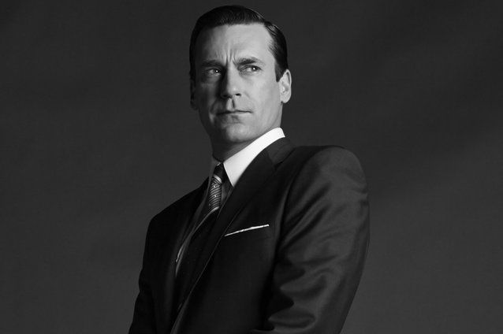

# A depressão masculina | ID #45

Como identificar um dos maiores males psicológicos que acomete os homens

***Nota do editor:** normalmente, a coluna ID vem precedida de uma pergunta de leitor. No caso desse tema, não recebemos nenhuma, mas achamos tão relevante que valia a pena seguir mesmo assim. Como sempre, podem enviar suas perguntas para [id@papodehomem.com.br](http://www.papodehomem.com.br/depressao-masculina-or-id-45mailto:id@papodehomem.com.br). Abaixo, o texto do Fred.*

A depressão masculina se configura com elementos muito particulares, reservados aos homens. Há a necessidade de tratá-la de forma diferenciada.

A depressão, quando não tem causas essencialmente orgânicas é resultante de uma combinação de fatores como histórico pessoal, traços de personalidade, cultura e elementos externos que disparam um processo silencioso de corrosão da capacidade de sentir prazer na vida, equilíbrio da negatividade ou de resiliência frente aos impasses.

A nossa cultura cria imagens simbólicas do que é sucesso ou fracasso baseadas em nacionalidade, gênero, religião, etc. Por exemplo, se uma mulher não se casa virgem num país, pode morrer por isso (literalmente). Já em outro, essa mesma situação é facilmente reconhecida como um completo absurdo.

Na queda de braço entre a pressão externa e a capacidade interna de corresponder à essas expectativas, o homem parece se debater com demônios diferentes das mulheres. Se, para elas, pesa o fato de estar solteira, não ter filhos ou serem vistas com descaso quando se mostram livres, o mesmo não ocorre com os homens, que sofrem de outras pressões.

### Sinais da depressão masculina

Dificilmente um homem vai procurar ajuda porque está deprimido, normalmente a queixa dele é:

- Estou cansado;
- Não aguento meu chefe/trabalho;
- Tenho raiva de tudo e estou perdendo o controle com facilidade;
- Minha parceira está reclamando do meu jeito;
- Minha família acha que tenho um problema, mas eles estão "viajando".

Além desses, há alguns sinais que valem atentar.

#### Ele não admite estar fragilizado

O primeiro sintoma da depressão masculina é não ter a capacidade de reconhecê-la por conta própria. Normalmente, a pessoa em depressão desconfia que perdeu o fôlego para viver, que está desproporcionalmente triste.

O ponto-cego da depressão que acomete o homem é a de não poder admitir que tem uma fraqueza, muito menos emocional.

Ele pode dizer que está chapado ou fora de si, mas nunca abatido ou emocionalmente fragilizado.

Brad Pitt enfrentou problemas com drogas e depressão durante os anos 90

#### Não consegue identificar o que sente

Outro aspecto é uma inabilidade para avaliar suas próprias emoções e dar nome aos bois.

O vocabulário emocional do homem costuma se restringir, com bonitas exceções, a sensações corporais como "cansado", com um "troço no peito", tesão e, no máximo, uma emoção vista como viril que é a raiva.

Angústia, medo, tristeza, desesperança, insatisfação, desencantamento, desapontamento, decepção, culpa, inveja, estão fora do campo de autoanálise de grande parte dos homens.

#### Ele sente as dores emocionais no corpo

O terceiro viés da depressão masculina é que ela raramente é percebida claramente, com a sua propriedade sutil. Na maior parte das vezes, é vista como uma dor no corpo que o homem carrega por dias, sem compartilhar com os outros que sente.

Ele vai ficar curvado, calado, recluso e perder produtividade, mas dificilmente vai confessar uma fragilidade.

Você notará a depressão masculina quando o rendimento profissional dele cair, quando começar a agir de um modo estranho no seu relacionamento familiar ou amoroso, quando começar a fazer mais uso de álcool ou outras substâncias químicas e até quando ele ficar fisicamente doente. Da boca dele não sairá nenhuma queixa.

#### Ele acha que não deve incomodar os outros

O quarto ponto crítico é que, quando as pessoas percebem o quadro, ele já está instalado nas entranhas da mente desse homem. Não é incomum que as pessoas descubram quando ele já cometeu suicídio.

Essa atitude para o homem é vista como uma tentativa de poupar os outros de carregá-lo como um peso na vida delas. Só a imagem de ver familiares e amigos se movimentando para cuidarem dele já causaria calafrios e, para evitar esse "transtorno" na vida dos outros, ele prefere se sacrificar.

Pensando nesses aspectos, é muito mais fácil notar o motivo pelo qual homens morrem tão precocemente. Muitos que se deixam entregar por um diabetes mal cuidado, um problema cardíaco, uma compulsão por álcool ou tabaco, podem ter como pano de fundo uma auto-destrutividade não detectada como depressão.

O lugar que a nossa cultura construiu para o homem é uma gaiola psicológica bem pequena.

A [solidão masculina](http://www.papodehomem.com.br/solidao-masculina/) é um fator que contribui para a construção dessa jaula social que cria uma barreira invisível entre os amigos homens. Eles não se sentem à vontade para abrir seus medos, dores e desilusões pessoais.

> Numa realidade complexa e com muitas sutilezas emocionais, o homem
> fica paralisado, pois não foi treinado para lidar com a amplitude de
> identidades à nossa disposição. Ser apenas mais um macho-provedor está
> longe de dar conta do recado.
>
> **Então ele desenvolve um psiquismo fragmentado.**
> Dentro de si guarda as velhas noções de masculinidade, mas externamente
> se adequa a uma mentalidade livre de papéis restritos. Isso causa uma
> sensação de isolamento. As revistas e programas de TV voltados ao
> público masculino tendem a reforçar os estereótipos. Não se abrem
> espaços para discussões maduras e sérias sobre os dramas masculinos.
>
> O
> resultado é uma apatia existencial que se manifesta por meio do famoso
> “o que vier é lucro”. Uma postura destituída de valores e
> questionamentos. **Ganhar dinheiro, transar, tomar umas com uns amigos e já está bom demais.**
>
> –Trecho do texto sobre [Solidão Masculina](http://www.papodehomem.com.br/solidao-masculina/)

No texto sobre [prisões masculinas](http://www.papodehomem.com.br/sexo-dinheiro-forca-e-poder-as-prisoes-masculinas) enumero várias grades emocionais e obstáculos com as quais os homens convivem.

> Nunca nos perguntamos sobre as angústias de alguém que se fantasia de
> vencedor e depois não consegue se desgarrar dessa ilusão. Como você se
> sentiria em viver sem a liberdade de perder, fraquejar, descansar e
> errar?
>
> (...)
>
> Pode parecer um luxo de classe privilegiada falar do sofrimento em estar no topo. Porém, quero deixar claro um ponto. **O homem que tem a pretensão de **sempre**ser o Alpha está num processo silencioso de ameaça frente às condições de falência ao longo da existência.**
>
> –Trecho do texto sobre [Prisões Masculinas](http://www.papodehomem.com.br/sexo-dinheiro-forca-e-poder-as-prisoes-masculinas)

Quando levamos essas travas em consideração, fica mais compreensível porque muitos homens gritam ou agridem quando se sentem minimamente acuados em suas posições pessoais: eles próprios são seus mais fiéis e implacáveis críticos.

Jon Hamm apresentou depressão aos 20 anos de idade

Quando alguém lembra um homem de que ele age como um egoísta, inconsequente, arrogante, machista, inexperiente ou imaturo, sua primeira reação costuma ser gritar para manter um mínimo de dignidade pública, ainda que, lá no fundo, ele próprio desconfie das suas convicções.

Uma nota importante: é preciso olhar com muita delicadeza para um homem que se mostra ferozmente convicto de quase tudo. Quanto maior a blindagem, mais frágil o conteúdo do cofre.

Os homens mais duros, irascíveis, casca-grossas e extremistas que conheci e atendi no consultório tinham uma beleza poética guardada à sete chaves e que não admitiam nem para os seus próprios pensamentos.

### O herói, invencível, poderoso, livre, realizador

Temos alguns ideais de masculinidade que podem ser decupados dentro de arquétipos.

O **herói** é aquele que triunfa diante dos desafios, aquele que vence o cansaço, o medo e que mesmo diante de desafios impossíveis derrota o dragão. Essa é a imagem que circula no imaginário masculino como a única opção existencial digna de consideração.

O **invencível** é quem não perde uma batalha e, mesmo que esteja vergado no chão, ainda conta para si a história de que a jornada não chegou no final, pois se ainda não venceu é porque não acabou. É o discurso da recusa à desistência legítima.

O **poderoso** pode ser tanto por não se entregar ao comportamento de ser produtivo, gerar dinheiro, status de poder ou por ir ao extremo disso. Então, seja por uma moralidade imaculada ou prostituída, o homem se debate sempre pelo lugar de destaque. Para ele, ser mediano é um tipo de inferno pior do que o descrito por Dante.

Hugh Laurie luta contra depressão crônica

**Livre**, leve, solto e sem vínculos intermináveis, é isso que busca o homem que sente alergia quando pensa em qualquer coisa que seja "para sempre". Um trabalho, uma parceira, um carro, não importa, qualquer vínculo que simbolicamente o "prenda" será visto como um inimigo.

Se o homem não se sente ativo e **realizador**, com a mão na massa ou desembaraçando algum problema, como um MacGyver, ele percebe a si mesmo como sendo menos homem. Os filmes de aventura e ação estão recheados desses ícones de homens que resolvem a coisa toda, mesmo que seja na porrada.

Em maior ou menor grau, os homens almejam atender a essas expectativas.

### O fracassado, frágil e sonhador

E todos o universo de homens que não consegue sustentar os valores cultivados acima por mais de 6 meses sem sucumbir a uma síncope?

Esses – todos nós – são os grandes candidatos à depressão masculina.

Quase tudo confronta o ideal impossível que citei ali em cima, desde perder no poker, fazer dívidas impagáveis (para sustentar uma vida que não pode bancar), ficar fugindo do sentimento de amor que bate à porta, se sentir envergonhado por ser mais tímido ou desengonçado do que gostaria, broxar… enfim, a lista é interminável.

O lugar imaginário no qual o homem se coloca (e tenta se sustentar, mesmo sofrendo indigestão emocional) é basicamente a antítese da composição da vida. Ela é frágil, falível e facilmente extinguível.

A depressão masculina é um tipo de lembrete da própria humanidade do homem que é chacoalhado em sua tentativa de se defender dos seus próprios medos.

Se um homem pudesse dar atenção à voz silenciosa que vem de seu íntimo, ouviria algo como: "Está tudo bem se você não for um campeão. Quantos momentos felizes você já não viveu fora do pódio?"

A "cura" da depressão masculina está mais numa mudança individual e coletiva que se abre para a construção de homens múltiplos possíveis do que numa corrida do ouro para provar quem é o mais fodão.

---

*publicado em 07 de Maio de 2015, 00:05*
