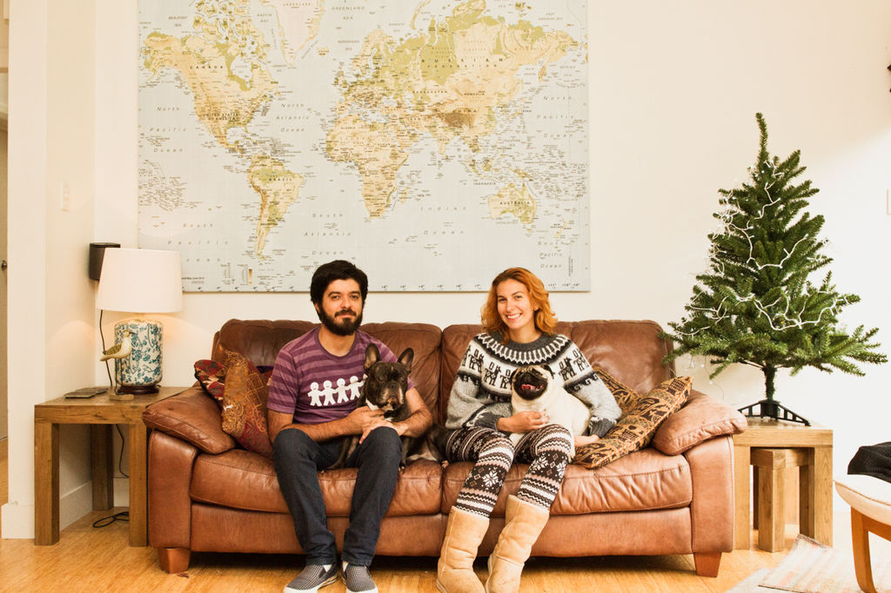
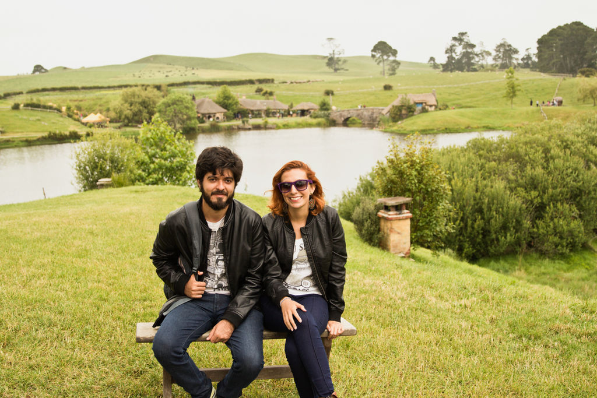
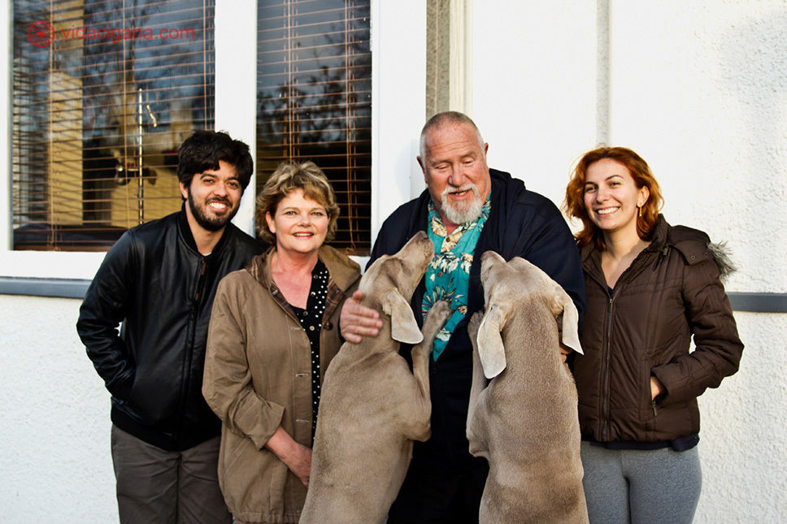
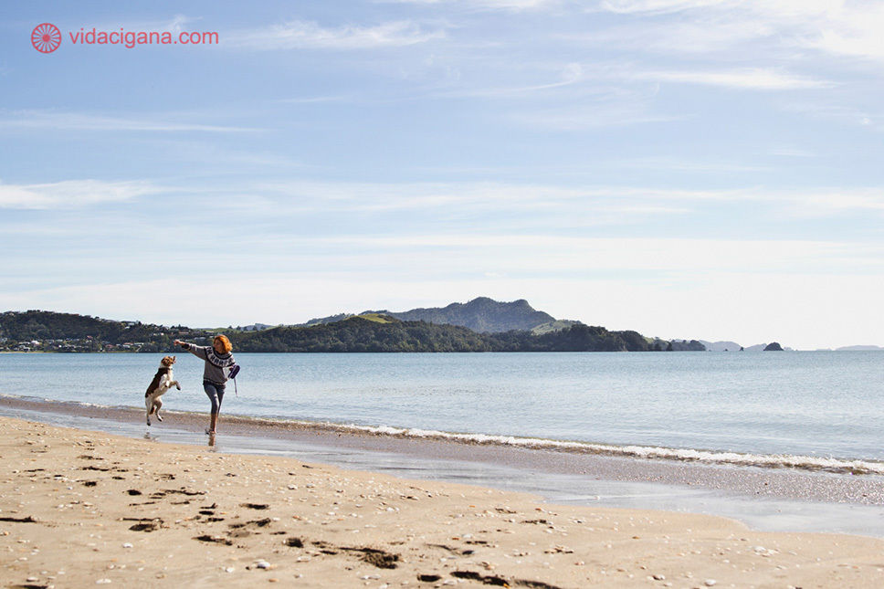

# House sitting: viaje o mundo sem pagar por acomodação

Conheça o estilo gratuito de acomodação em troca de cuidar da casa de quem está viajando e de seus bichos de estimação

Escrevo este texto do interior da Nova Zelândia. Vou passar o mês em uma casa de dois andares, a cem metros de uma praia banhada pelo [Mar da Tasmânia](http://pt.wikipedia.org/wiki/Mar_de_Tasman) e com um carro à disposição na garagem. Tudo isso sem tirar um centavo do bolso.

A casa não é minha, pertence a um casal – ele neozelandês, ela britânica – que está na França, rodando o país em um mês de férias. Enquanto eles viajam por lá, fico com minha mulher na casa deles, ocupando o lugar e cuidando dos animais da família – um cachorro e três gatos.

### House sitting

Conseguir ficar hospedado aqui foi possível por meio de um acordo de House Sitting, um novo estilo gratuito de acomodação que temos abraçado desde que saímos do Brasil, há quase um ano. É um esquema negociado pela internet entre famílias que pretendam viajar, mas precisam de alguém que cuide de suas casas (e, em geral, de seus animais de estimação também), e viajantes como nós, que estejam dispostos a ocupá-la pelo tempo necessário, sem precisar pagar por isso, apenas mantendo a rotina do local como se os donos estivessem presentes.

Perceba que **as duas partes saem lucrando mesmo não havendo troca financeira** na transação: de um lado, nós podemos escolher casas para morarmos gratuitamente em diferentes locais do mundo, com um padrão de vida que não teríamos como bancar de outra forma; de outro, nossos anfitriões conseguem sair de férias sem a preocupação de terem deixado a casa fechada, economizam uma fortuna em diárias de canis, e ainda têm o bônus de, ao retornarem, serem recebidos por seus animais felizes como nunca.

A casa onde estamos já é a oitava diferente que temos desde que abandonamos o apartamento alugado que tínhamos no Brasil. Não precisamos mais pagar aluguel, IPTU, IPVA, nem contas de luz, água, internet, TV a cabo ou qualquer tipo de despesa que exista para a manutenção de uma residência fixa. E se colocarmos na balança que ainda estamos conhecendo o mundo pelo caminho passa a ser covardia a comparação.

Usando esta fórmula, ficou fácil solucionar aquele eterno problema da falta de dinheiro disponível para viajar, já que conseguimos de uma só vez um local para dormir, uma cozinha para fazermos as refeições, uma base para trabalhar remotamente e, muitas vezes, um carro para rodar pela região. Tudo isso antes da carteira começar a sangrar, como é normal numa viagem.

Estamos há meses percorrendo a Nova Zelândia e, com a economia que temos conseguido ao zerar os gastos com hospedagem, não temos mais data para retornar, pretendendo partir em breve para uma volta ao mundo.

Viajar o mundo tem nos custado menos que o valor que gastávamos para morar em um bairro de subúrbio, pegar trânsito, ir ao escritório de segunda à sexta e dormir toda noite na mesma cama.

Pensa comigo: e se o dinheiro que hoje escoa para bancar suas despesas fixas pudesse ser usado apenas para financiar suas viagens?

### Nunca mais pague hospedagem (ou aluguel)

House sitting pode ser uma nova opção de hospedagem ou um novo estilo de vida. Há quem use apenas para conter os custos de uma viagem por um curto período e os que abandonam tudo o que tinham para aproveitar toda a liberdade que o modelo pode oferecer.

Nós já passamos pelos mais diversos tipos de acordos, permanecendo em cada local de cinco dias a quase dois meses. Tivemos casas enormes com piscina ou somente 18 metros quadrados em um ônibus adaptado como residência. Cuidamos de um animal apenas ou de cachorros, gatos, bodes e vacas ao mesmo tempo. Vivendo nas maiores cidades do país ou em um vilarejo com menos de trezentos habitantes. No entanto, todos estes momentos nos proporcionaram em comum a experiência genuína de conhecer de perto a rotina e vivenciar cada local exatamente como aquelas famílias fariam, independente de origem e condição social.

### Economia colaborativa

A negociação funciona diretamente entre proprietários e candidatos a hóspedes, mas para conseguir um acordo desses você deve se cadastrar em alguma das plataformas especializadas em organizar o meio-campo que existem espalhadas pela internet. Entre as que utilizo com maior frequência estão o [Trusted Housesitters](http://www.trustedhousesitters.com/) e o [House Carers](https://www.housecarers.com/), mas existem diversas outras com as mais diferentes características e vale pesquisar para ver qual se adapta melhor às necessidades da viagem que tenha planejado.

Nestes sites, os donos das casas anunciam as datas e os requisitos que esperam que sejam cumpridos pelos futuros moradores e escolhem entre as candidaturas recebidas a quem será permitido ocupar o local divulgado. Como qualquer transação feita na Internet, para ter sucesso em um acordo de house sitting, o candidato precisa construir uma boa rede de referências que valide seu discurso e passe confiança àquele anunciante de que você é quem realmente diz ser e a escolha certa a ser feita por ele.

Como em um primeiro emprego, também pode parecer difícil conseguir um primeiro acordo de house sitting, mas depois de engrenado, tudo passa a correr de modo mais suave. Para a casa que estamos, por exemplo, sequer tivemos que nos candidatar – ela nem chegou a ser anunciada, na verdade – já que antes de publicar abertamente, os proprietários checaram nossa disponibilidade, as referências deixadas em nosso perfil por outros usuários e entraram em contato diretamente, tornando tudo mais simples.

### Uma casa em cada canto do planeta

O ato de deixar estranhos cuidando de sua casa durante a viagem de férias é popular há anos nos países de colonização britânica – a mais antiga newsletter de anúncio de ofertas do tipo ainda em funcionamento, a [The Caretakers Gazette](http://www.caretaker.org/), data do início da década de 80! Mas, aos poucos, têm se espalhado e conectado viajantes das mais diferentes origens, sendo hoje possível encontrar anúncios mesmo nos países sul-americanos e asiáticos, os mais fechados à ideia de deixar a casa nas mãos de um estranho.

Sem precisar mais ter a preocupação de pesar a hospedagem no orçamento de uma viagem, conhecer o mundo nunca me pareceu tão fácil e acessível. Quem dera tivesse sido sempre assim.

---

*publicado em 18 de Maio de 2015, 00:00*
