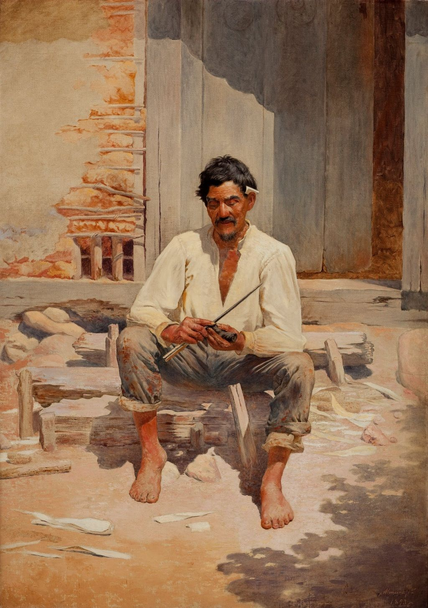

# Meu avô estava certo

A juventude teimosa me impedia de ver que meu avô estava à frente do seu tempo

Quando eu estava entrando na adolescência, lembro de achar engraçado e até meio ridículo o fato do meu avô levar a sacola dele debaixo do braço pra feira todos os dias.

Eu ria, às vezes tirava um sarro ou ficava extremamente chateado quando eu tinha que ir com ele e carregar a maldita sacola.

Na minha cabeça, não fazia o menor sentido levar a sacola e comprar manteiga, arroz, feijão ou farinha a granel como ele fazia, uma vez que já tinham todas as porções em embalagens plásticas fechadinhas nas prateleiras. O design delas era bonito e o produto vinha no que me parecia ser a quantidade correta.

Além disso, eu me sentia um pouco mais pobre, já que os produtos comprados da forma como ele fazia eram bem mais baratos e não tinham a validação social dos comerciais da TV.

O tempo passou, põe uns 15 ou 20 anos aí.

Agora, o governo quer que você compre uma sacola e leve pro mercado todas as vezes.

Está rolando um hype de mercado colaborativo, produção artesanal, as pessoas querem que você compre direto dos produtores e pare de usar tanto plástico.

É óbvio que há uma boa razão para isso. Se você parar para olhar o lixo que tem na sua casa, é bem provável que, fora os restos de alimentos, a maioria seja puro plástico (incluindo a própria sacola na qual você descarta as coisas).

Quando faço o exercício de tentar imaginar o que tenho em casa para jogar fora nesse momento, já acho bastante. Mas, quando tento projetar o que seria esse mesmo consumo multiplicado pelos milhões de habitantes de uma cidade como São Paulo, preciso lembrar de voltar a respirar.

O planeta não aguenta mais e está na hora de mudar.

Está certo que, pra muita gente, esse é um papo de hippie, de ativista de sofá ou simplesmente de quem não se importa de perder mais tempo fazendo coisas cotidianas, seja por não ter contas tão pesadas martelando na consciência ou por ser simplesmente desocupado mesmo.

Pro meu avô, não existe consumo consciente ou mercado colaborativo. O que, pra nós, parece ser uma moda inventada na Vila Madalena, não acende sequer uma faísca na mente dele.

Nós teorizamos e inventamos nomes legais, mas pra ele, a melhor alternativa sempre foi e sempre será gastar pouco, comprar apenas o que é preciso, não desperdiçar, não gerar montes de lixo.

Eu achava ridículo o que ele dizia e penso que o resto do mundo também.

Mas a verdade é que ele esteve certo desde o princípio.

---

*publicado em 06 de Maio de 2015, 00:05*
