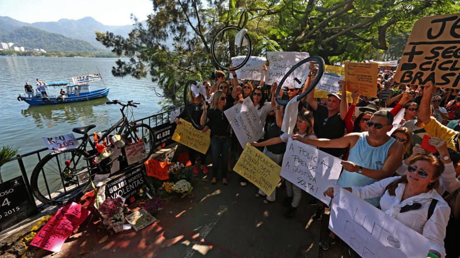

# O que a morte de Jaime diz sobre nós

O médico Jaime Gold foi esfaqueado ao andar de bicicleta na Lagoa, no Rio de Janeiro

Minha segunda-feira amanheceu cinza.

Já não bastasse o céu nublado lá fora, acordei com [as imagens aterrorizantes de Jaime Gold](http://g1.globo.com/rio-de-janeiro/noticia/2015/05/morre-ciclista-esfaqueado-na-lagoa-na-zona-sul-do-rio.html), morto, caído ao chão, em meio a seu próprio sangue, na Lagoa. Engoli a seco. Olhei para o meu café, mas o apetite tinha ido embora. Saí de casa pensando que precisava vir aqui conversar com vocês.

Pessoas protestando no local da morte

Eu havia prometido ao [Guilherme](http://www.papodehomem.com.br/autores/guilherme#artigos) um outro texto, como continuação a esse percurso que estamos trilhando juntos sobre "[quero mudar o mundo: e agora?](http://www.papodehomem.com.br/antes-de-tudo-precisamos-ter-uma-conversa/)". Espero que ele aceite minha mudança de planos e que me desculpe por não tê-lo avisado. Outras palavras querem sair, Gui. É urgente colocá-las para fora.

As tristes imagens de Jaime me remeteram a [um texto da Eliane Brum publicado no dia 11 de maio, no El País](http://brasil.elpais.com/brasil/2015/05/11/opinion/1431351138_436101.html), sobre a resposta coletiva que o Brasil deu à greve dos professores em Curitiba. Eliane foi mais dura do que o de costume, mas com a precisão cirúrgica de sempre – desta vez, sem anestesia – disse assim:

> "Inclusão social no Brasil significa entrar no barco dos que podem se salvar.

> A classe média acredita que seus filhos estão a salvo e uma parcela daqueles que ascenderam, na década passada, ao que se chama de Classe C fez um grande esforço para matricular seus filhos em escolas particulares assim que a situação financeira permitiu.

> Filho em escola privada – e portanto supostamente a salvo da péssima educação pública – é parte do que significa ser classe média no Brasil."

Ela tem razão. E eu vou ainda mais longe por este mesmo caminho: no Brasil, **passamos a vida em função de garantir nosso espaço no barco dos que podem se salvar**. E se salvar significa encontrar meios - em sua maioria financeiros - para contornar a péssima qualidade dos serviços públicos pelos quais já pagamos, em forma de imposto.

Se eu puder pagar uma escola particular para o meu filho, ele estará a salvo. Se eu puder pagar um plano de saúde para a minha família, eles estarão a salvo. Se eu puder morar numa região mais segura da cidade, estaremos a salvo. Se eu puder comprar um carro e não precisar mais do transporte público, estarei a salvo.

É nisso em que focamos os nossos esforços.

Trabalhamos para não precisar depender do governo para nada. Somos obrigados a pagar pelos serviços públicos que na prática não usamos, "Deus me livre de usar". Tratamos o setor público na base do "já que você não vai fazer mesmo, deixa que eu faço." A conta é alta e está ficando cada vez mais cara, mas isso não importa, desde que a gente consiga sustentar nosso lugar no barco. Nele estamos a salvo.

Por Andre Dahmer (www.malvados.com.br)

A morte de Jaime é mais difícil de engolir porque ela escancara que essa sensação de isolamento não passa de uma ilusão. "Não é justo, o cara trabalha honestamente a vida toda, paga os impostos em dia, é um cidadão de bem, pai de família, faz tudo certo e acaba morto por marginais." É claro que não é justo. A lógica do barco é perversa para todo mundo - para quem está fora e para quem está dentro dele.

O que acontece quando sistematicamente nos isentamos da responsabilidade de cobrar por aquilo que nos é de direito é que nos acostumamos à falta.

Falta para todos - para quem não precisa depender do governo (por esforço próprio ou por sorte), mas principalmente para quem depende dele. E essas distorções sociais, agravadas em parte por nossa própria negligência, abrem espaço para atos de violência e para o crescimento da criminalidade, que no fundo são um reflexo claro do sentimento de que "aqui é cada um por si".

Cada um está tentando se salvar, à sua maneira, mesmo aqueles para os quais o barco não é uma opção.

Queremos justiça, mas enquanto "justiça" significar tão somente "prender criminosos", não estaremos de fato resolvendo o problema. Precisamos de justiça num sentido muito mais amplo. Precisamos de condição de vida justas para mais pessoas. Precisamos **qualificar nosso entendimento sobre os problemas que queremos resolver e agir sobre eles**. Precisamos não ceder à vontade de solucionar o problema com respostas imediatas. Precisamos mapear pontos de alavancagem que vão nos ajudar a chegar lá.

Não estou falando de coisas impossíveis, projetos enormes, sem prazo para acabar. Estou falando, antes de tudo, de estarmos atentos ao fato de que estamos inseridos dentro de um espaço coletivo, que nos impacta e também é impactado a todo momento por nós. E que é mais sensato que a gente se empodere de direcioná-lo.

Obama falando sobre o mais sério dos déficits (e talvez o mais esquecido), o de empatia

[Como eu disse na nossa primeira conversa](http://www.papodehomem.com.br/antes-de-tudo-precisamos-ter-uma-conversa/), melhor você fazer alguma coisa, a não ser que você acredite que já tem gente fazendo coisa muito boa no seu lugar. As notícias – as recentes e as nem tanto – parecem apontar para a direção contrária.

### **Antes do fim, uma provocação**

Conheci recentemente o projeto *Million Dolar Blocks*, dos alunos do [Spatial Information Design Lab](http://spatialinformationdesignlab.org/projects/million-dollar-blocks), da Universidade de Columbia, em Nova York. Eles fizeram um mapeamento visual sobre o histórico social da população de presos nos Estados Unidos - que gira hoje em torno de dois milhões de pessoas.

Eles descobriram que uma parte surpreendente dos encarcerados vinha de algumas poucas cidades do país e, dentro dessas cidades, de bairros determinados. Em alguns casos, eles mapearam que uma quantidade considerável deles vinha de um quarteirão específico e que o governo gastava milhões de dólares para prendê-los e mantê-los presos.

A esses quarteirões, eles deram o nome de *Million Dolar Blocks*, "os quarteirões milionários".

O levantamento demonstrou que, **nessas regiões, o governo gastava mais dinheiro tentando prender e mantendo presos os criminosos do que investindo em educação, saúde e moradia**, o que poderia de maneira mais efetiva evitar que essas pessoas entrassem para o crime. Em outras palavras, o dinheiro estava sendo mal empregado e, por consequência, o problema não se resolvia.

Essas informações ajudaram os governos locais a redirecionar o orçamento e a desenvolver políticas sociais específicas para essas regiões.

A provocação que eu quero deixar aqui é: e se a gente fizesse esse levantamento no Brasil?

Mais prático ainda, e se a gente fizesse esse levantamento nas nossas cidades? O que descobriríamos sobre a raiz dos problemas que queremos combater? Onde será que está a chave que a gente precisa girar pra fazer diferença no todo? Essa me parece uma boa pista para a gente seguir. O que você acha?

---

*publicado em 25 de Maio de 2015, 16:25*
