# O que aprendemos com nossas mães?

Relatos dos autores e autoras do PdH sobre como nossas mamães moldaram parte do nosso caráter

Não somos o trabalho de nossas mães. O mundo é muito maior na formação de nosso caráter e a vida vai nos enchendo de novos ares e de novos ensinamentos. Com o tempo, nos tornamos pessoas completamente diferente dos anseios que elas tinham pra gente, nos estudos, no trabalho, com as pessoas as quais nos relacionamos e nossas opções para a vida, social, cultural e politicamente. Muita coisa pode seguir juntas e outras tantas são completamente distintas.

Mães não formam caráter, mas ajudam bastante a moldá-lo. Com isso, depois já de grandes e sabendo bem o que queremos para os nossos acasos, percebemos o quão importante foi essa ajuda. Não estou falando da nutrição, do cuidado quando bebê, das infinitas vezes em que elas esconderam alguma cagada nossa do marido pra gente não apanhar ou de como elas estavam presentes (ou ausentes) quando os pais já não mais habitavam a casa.

A importância que digo é de como mulheres nos disseram muito sobre respeito e empatia. Hoje, diversos autores do PapodeHomem contam o que nossas mães nos ensinaram:

### O que aprendi com minha mãe: "a dor dos outros" (por [Rafael Nardini](http://www.papodehomem.com.br/autores/rafael-nardini#artigos))

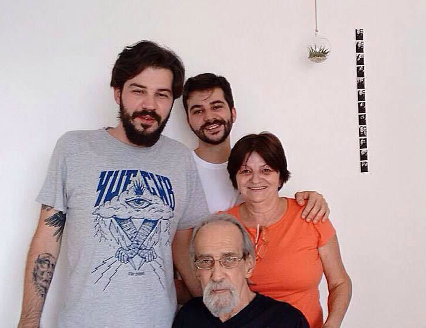

A minha mãe é doce. É daquelas que chega a ter dores físicas e não dorme se trombar com um cachorro abandonado. Que fecha os olhos porque não consegue assistir velhinho sendo maltratado nas reportagens do Datena. Uma das raras pessoas que nunca tem tempo para cuidar de si, já que todo mundo em volta se acostumou a precisar dela. Aquele exemplo escasso de quem trabalhou muito desde pequena, chefiou a casa, equilibrou os pratos que surgiram no caminho e atravessou 57 anos sem um pingo de amargura para sair da boca.

A Taninha se contenta com pouco, contesta quem tem muito e tem um olhar sempre condescendente para quem vem de baixo. É de lá que ela veio. Ela sabe disso. Não deve ter sido nada fácil ser menina numa cidadezinha no meio do nada. Talvez o grande aprendizado tenha sido justamente a capacidade de sofrer a dor dos outros, de não deixar ninguém para trás. A gente sabe o quanto isso é difícil. Mas é só uma extensão do comportamento para ela. Não precisa fazer força, não precisa ensaio. É natural. A Dona Tânia é dessas que nasceram com o coração tão gigante que os defeitos parecem mínimos, demora para encontrar um que seja digno de nota. Na real, acho que eles surgem só para a coisa não soar maçante.

### O que aprendi com minha mãe: "A ser sonhador" (por [Jader Pires](http://www.papodehomem.com.br/autores/jader-pires#artigos))

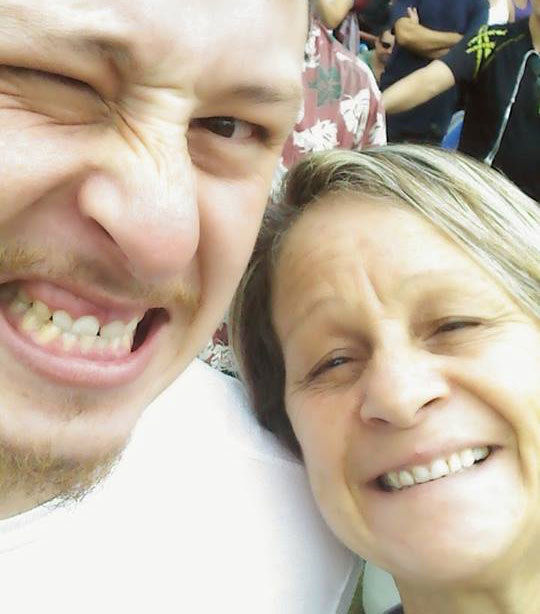

Show do Wynton Marsalis deste ano

A mamãe me cantava "João e Maria" do Chico antes de eu saber me comunicar, é certamente a primeira canção que me lembro da vida todinha. "Agora eu era herói e meu cavalo só falava inglês".

No mercado, a mamãe via uma mulher simples e imaginava como a vida devia ser dura com ela. Inocência, um pensamento equivocado, mas ainda assim, uma observação. Na rua, um senhor caminhava com dificuldades e ela se compadecia. Sempre criando suas históriazinhas na cabeça. "Agora eu era o rei, era o bedel e era também juiz. E pela minha lei a gente era obrigado a ser feliz".

Disso pra eu começar a imaginar foi um pulo. Comecei a ver e, vendo, olhava tudo e, olhando, reparava. Mais um pouco e eu estava botando essas coisas todas no papel. A mamãe me ensinou a sonhar. "Agora era fatal que o faz-de-conta terminasse assim...".

### O que aprendi com minha mãe: "a importância de ficar sozinho" (por [Rodrigo Cambiaghi](http://www.papodehomem.com.br/autores/cambiaghi#artigos))

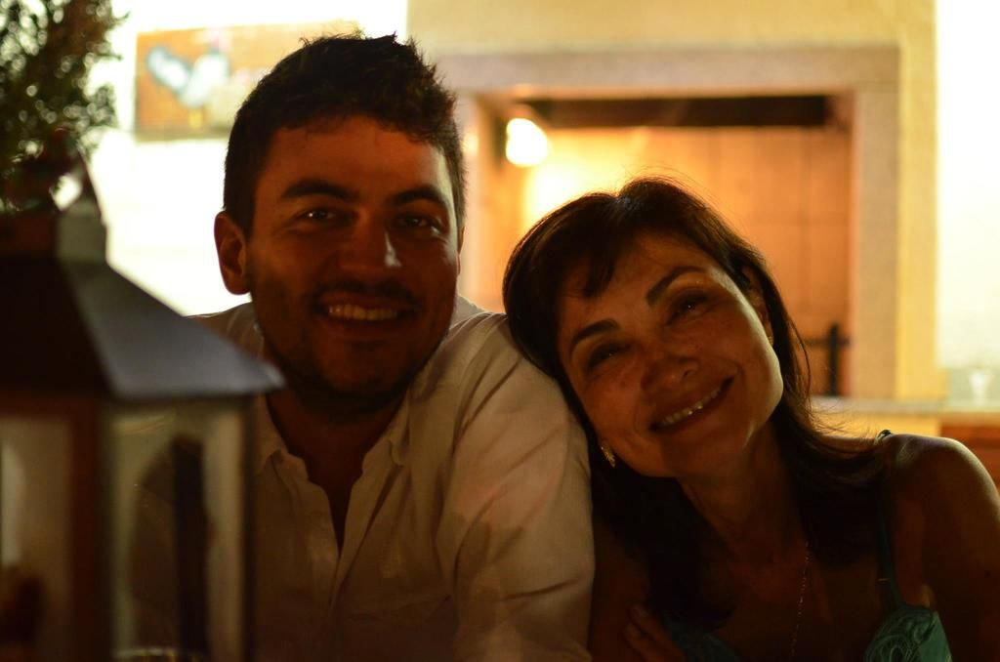

A Tsunae e o Cambi

Alguns dias atrás, eu esperava por um vôo e a bateria do celular acabou. Na hora bateu aquele desespero clássico de pensar como seriam as próximas 3 ou 4 horas sem celular.

Pensei em ir até a banca de jornal comprar alguma revista ou livro para me distrair, mas lembrei o que minha mãe me disse quando eu ainda era bem pequeno. "Quem não consegue ficar sozinho é porque não aguenta a própria companhia".

Faziam anos que eu não passava um bom tempo comigo. Caiu a ficha do tanto de distração que acabo procurando para me manter ocupado quando estou sozinho (e evitar minha própria companhia).

Obrigado pelo puxão de orelha, mãe, mesmo que você o tenha dado sem perceber.

### O que aprendi com minha mãe: "a ser um pouco filho" (por [Diego Dubard](http://www.papodehomem.com.br/autores/diegodubard#artigos))

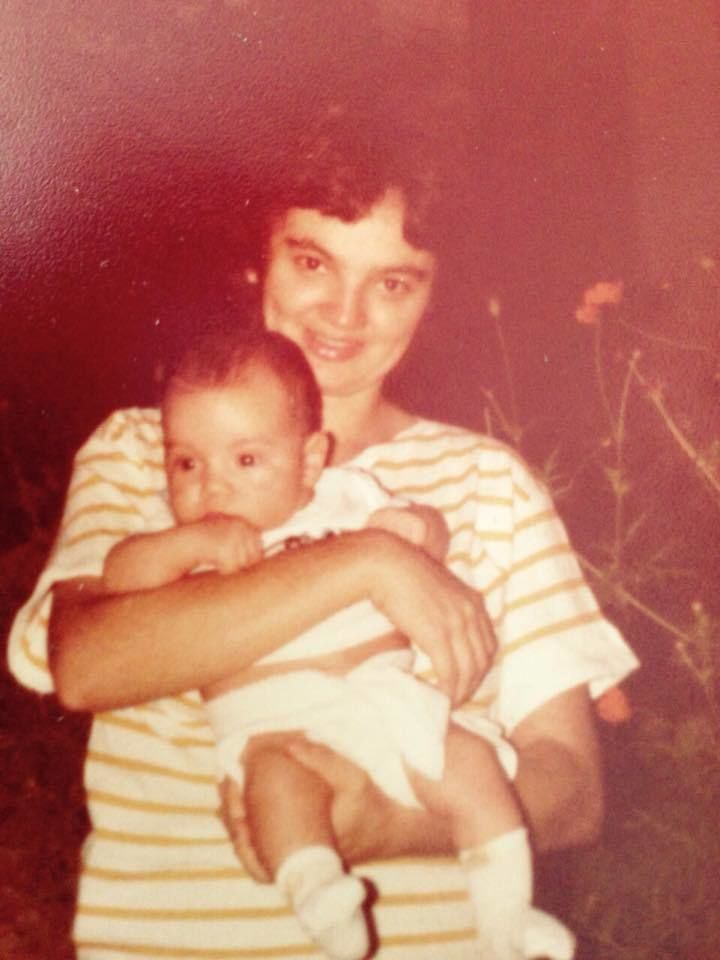

Dona Janete e o Diego

Minha mãe sempre foi uma espécie de pequena heroína, especialmente quando eu era criança. Aquela pessoa que sabe fazer tudo, mesmo quando não sabe, e a gente acha que sabe. Minha mãe fez curativo, fez minhas comidas preferidas, deu bronca, segurou no colo quando precisou, até quando não era necessário.

Um dia a gente deixa de ser criança, mas nunca deixa de ser filho, minha mãe jamais deixaria que eu deixasse de ser seu filho. Se antes eu era apenas o filho que precisava de cuidados, hoje também sou o filho que cuida. Sou um pouco amigo, um pouco psicólogo, um pouco padre, mas muito filho.

E mesmo quando a conversa não é a mais divertida, quando o problema parece pequeno ou quando você só precisa dormir mais 30 minutos, mas ela te acordou às seis da manhã porque teve um sonho ruim, eu tenho que ser filho. Não porque ela já fez muito por mim, ela fez tudo aquilo porque queria, e foi muito, muito mesmo. Eu faço porque ela me ensinou a devolver porque é o certo, porque eu devo.

### O que aprendi com minha mãe: "Teimosia e pimenta" (por [Pedro Reis](http://www.papodehomem.com.br/autores/pedroreis#artigos))

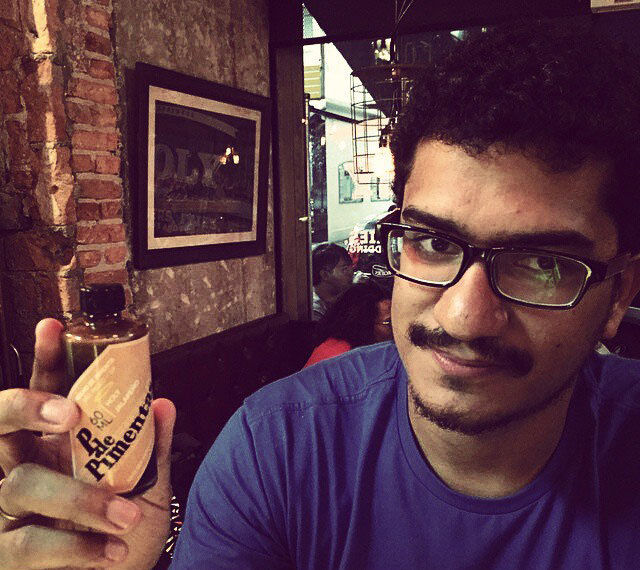

O amor pelas pimentas veio dela

O que tenho de lembrança mais teimosa, daquela que não consegue fugir da memória, é a teimosia da minha mãe (sacou a inception?). Quando não quis mais fazer judô, e ela nadou contra as lágrimas até eu ceder e ficar mais um pouco nos treinos, até decidir com calma que de fato aquilo não era pra mim. E depois ter entrado de cara no basquete, uma paixão de longa data, até hoje guardada embaixo da cama, forrada com sedentarismo.

A segunda que me vem veloz também é o gosto pela comida e pela pimenta. Foi com ela que comecei a conhecer variedades de temperos, curiosidade que ela incutiu em mim e em toda família. Aquele tradicional tempero secreto para churrasco que meu pai fazia todos os sábados no interior de Pernambuco (que até hoje só ele sabe), na verdade veio da minha mãe. Lembro que, numa mudança em Recife, minha mãe fez uma feijoada abissal para todos os ajudantes e tinha feito com uma garrafa de uísque de 3 litros uma conserva temerosa. Naquele dia, eu com 20 anos de idade, começou [a minha paixão por pimentas](http://www.papodehomem.com.br/pimentas-pimentas-pimentas-como-conhece-las-fuca-las-e-aprender-a-fazer-uma-boa-conserva).

Mas na real, talvez isso que escrevi logo acima sejam só sintomas de paixão, talvez tenha sido isso que minha mãe tenha me ensinado mais profundamente. Teimar pelas coisas, lutar por elas, ter gosto na vida e procurar se apaixonar pelas pessoas é das atitudes mais complicadas que se pode ter no dia a dia. Mas por conta da minha mãe levo essa vontade sempre ao meu lado.

### O que aprendi com minha mãe: "Dedicação, liberdade, resiliência" (por [Bia Amorim](http://www.papodehomem.com.br/autores/bia-amorim#artigos))

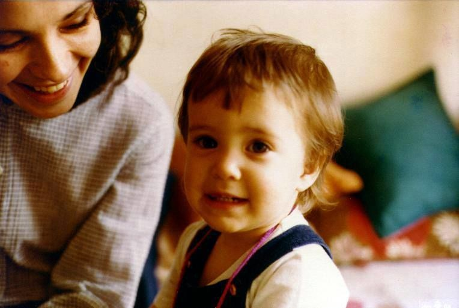

Vera Cristina Silva, bióloga, e a pequena Bia

Quando eu nasci,  aprendi com a minha mãe o que era dedicação.  Talvez logo de cara a gente não saiba o que é parir um bebê e cuidar e se doar a ele 24 horas por dia. O resultado é aprender que, no amor, não tem troca mais feliz do que um sorriso. O simples não é simples, é completo!

Quando eu era moleca aprendi com a minha mãe que liberdade tem limite para que haja aprendizado. Nem tudo que é bom precisa ser consumido e nem tudo o que a gente quer pode ser concedido.

Quando adulta, aprendi com a minha mãe que temos que ter resiliência.  O nosso tempo não é o tempo de todo mundo e o mundo é muito complexo para ser julgado sem empatia.

Nessa vida aprendi com a minha mãe que o amor nos aproxima e nos cuida, com a gratidão em um abraço.

Minha mãe é a Vera e ela é para mim a melhor do mundo!

### O que aprendi com minha mãe: "Segurar lá atrás pra fazer o gol" (por [Ismael dos Anjos](http://www.papodehomem.com.br/autores/ismael-dos-anjos#artigos))

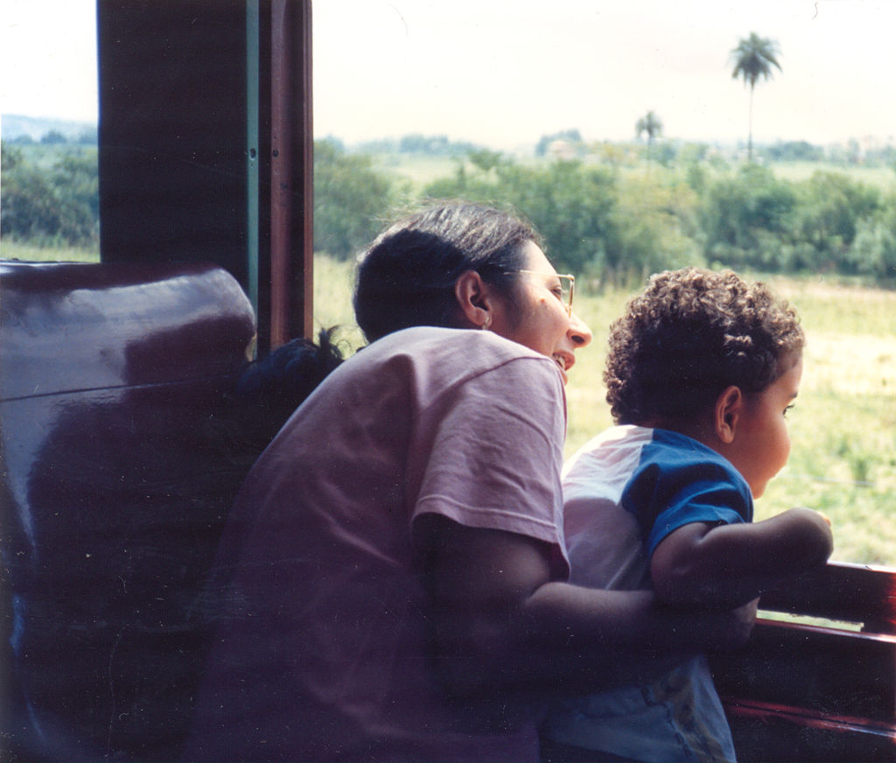

Dona Rosa e o pequeno Ismael

Quando eu era pequeno, era comum que me chamassem de Tarcisinho.

Não caí longe da árvore seja em traços do rosto, time de futebol ou emocionalmente. Era esperto, mas genioso. Capaz de ser carinhoso, mas duro. Teimoso. Com dois sujeitos assim em casa, minha mãe assumiu uma postura compassiva. Mediava as disputas, silenciosas ou não. Ao invés de colocar lenha, censurava com carinho. Se discordava de um ponto, o desconstruía na surdina.

Por muito tempo, pensei que minha mãe era o elo "fraco". Aquela pessoa a quem eu era capaz de convencer, de trazer para o meu lado. Foi preciso sair de casa e ver o núcleo familiar desfeito para entender que se havia corrente, era por conta dela.

E se nasci Tarcisinho, cresci com muito de Rosa. Foi ela quem me ensinou a ler. Foi ela quem despertou o encanto pela fotografia. Foi ela quem me ensinou a ouvir música. Foi com ela que vivi minhas principais alegrias e tristezas em um estádio de futebol.

Minha mãe é pernambucana, mas foi quem ensinou a esse mineirinho o valor de se comer quieto.

Mãe: demorou, mas acho que finalmente entendi.

Às vezes é preciso se colocar na retaguarda para ser, efetivamente, protagonista.

### O que aprendi com minha mãe: "A fluir e relaxar" (por [Guilherme Nascimento](http://www.papodehomem.com.br/autores/guilherme#artigos))

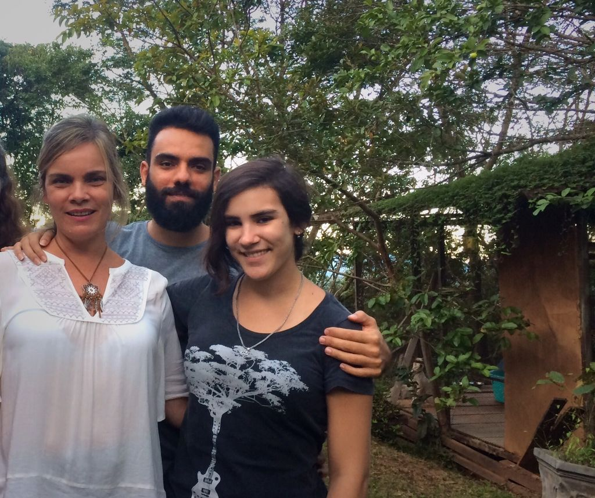

Minha mãe Beatriz à esquerda, eu e minha irmã Ana Beatriz à direita

Me lembro de estar com minha mãe no Minas Tênis Clube, aqui em BH, lá pelos meus 8 ou 9 anos, jogando peteca numa quadra improvisada. A cada lance em que eu errava, parava o jogo pra justificar porque a falha havia acontecido, com longos e elaborados argumentos – pelo menos para o ponto de vista de uma criança.

Ela logo emendava, "sem explicações, meu filho, arremessa a peteca e segue o jogo!" . Essa frase dela, "sem explicações", me lembra muito a sua capacidade de fluir e relaxar. De confiar.

Me recordo de situações nas quais ela perdia algo, como um brinco precioso no mar (!), e acabava conseguindo encontrar, apenas dizendo "vamos confiar que a gente resolve, é só relaxar, acho que tava por aqui, ó...". Quem estivesse em volta pensava que era maluquice encontrar algo tão pequeno num contexto desses. Cansei de ver cenas assim se repetirem, com o objeto sendo encontrado.

Com uma lábia suave e voz doce, olhar firme e aquela estranha capacidade de relaxar, a vi negociar o que não era negociável, achar o que já estava desaparecido, não se preocupar em meio ao caos. Tive umas boas brigas com ela, pois durante muito tempo considerava esse jeito de ser insuportável, até sufocante. Hoje reconheço que aprendi muito sobre fluir pelo mundo e relaxar apenas a observando. Aprendi como ter um senso de confiança inato, que não pede explicações.

Por isso e por todo o carinho com que me criou, te agradeço do fundo de meu coração, mãe.

### O que aprendi com minha mãe: "Nunca faça nada que você vai ter vergonha de me contar" (por [Rob Gordon](http://www.papodehomem.com.br/autores/robgordon#artigos))

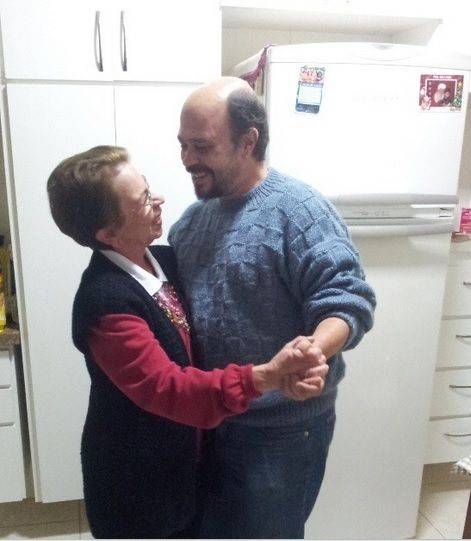

Dona Marlene e o pequeno Rob Gordon

– Nunca faça nada que você vai ter vergonha de me contar.

Eu devia ter uns quinze anos quando minha mãe disse essa frase pela primeira vez. Hoje, com quase quarenta, eu ainda tenho um pouco de inveja dela por ter criado uma frase tão genial do alto do seu metro e meio de altura. Porque a frase foge daquele lugar comum “não faça nada de errado”. Afinal, o que é errado para ela pode não ser errado para mim. E era exatamente com isso que ela estava contando.

A frase é brilhante porque deixa o julgamento na minha mão. Não é “nunca faça nada que vai me deixar com vergonha de você”, e sim “nunca faça nada que você vai ter vergonha de me contar”. Ao invés de me falar o que é errado, minha mãe criou um sistema métrico que me permite identificar por conta própria o que é errado. Porque você pode até justificar para os outros (e principalmente para você) suas atitudes... Mas se você fez algo que vai ter vergonha de contar até para sua própria mãe, é porque você sabe que fez algo errado.

Até hoje tenho isso como lema. E funciona, sempre.

Claro que eu poderia achar uma brecha na lei e começar a fazer coisas que eu teria vergonha de contar para minha mãe, achando que a solução seria apenas “não comentar nada com ela sobre esse assunto”. Mas sempre que eu penso sobre isso, percebo que não teria coragem de contar para ela sobre essa estratégia, então concluo que essa ideia não deve ser muito correta.

### O que aprendi com minha mãe: "O que deve ser feito" (por [Luciano Ribeiro](http://www.papodehomem.com.br/autores/lucianoribeiro#artigos))

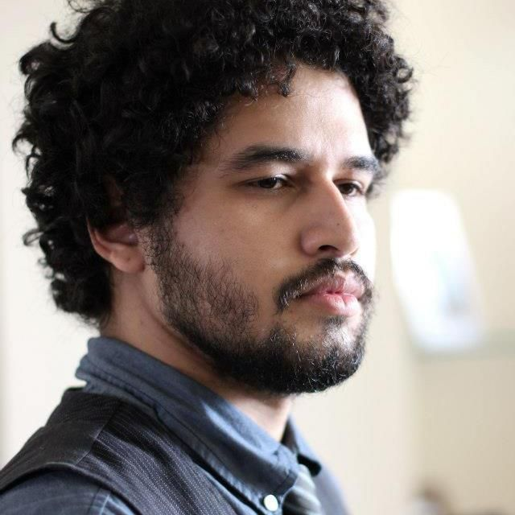

Luciano pensando na dona Léia

Minha mãe me ensinou que algumas coisas simplesmente precisam ser feitas e, quando ninguém mais se habilita, é melhor você estar preparado pra tomar conta.

Quando ela se separou do meu pai, foi mais ou menos isso que aconteceu. Nós, meu irmão e eu, tínhamos de ser cuidados por alguém e ela fez o papel de pai e de mãe. Minha avó, no final da vida, teve um AVC e alguém da família precisava tomar a dianteira nos cuidados. Enquanto as outras pessoas se dividiam entre os seus afazeres (sem julgamento aqui, todo mundo fez o máximo que pôde), ela dedicou tempo integral.

Meu avô, depois que a avó faleceu, também precisava de cuidados. Ela vem fazendo isso há mais de dez anos, sacrificando a carreira profissional e muito do que as pessoas consideram como fatores essenciais para uma boa vida, como autonomia, privacidade e até relacionamentos amorosos.

Mais recentemente, ela teve de tomar conta da irmã mais velha, que veio a falecer por complicações da diabetes.

Eu, péssimo aluno e filho que sou, não tenho nem 10% dessa dedicação. Mas é uma característica que admiro demais, especialmente quando vejo como ela combina isso com a resiliência de quem não vê alternativa a não ser fazer o melhor possível pelos outros em qualquer circunstância.

Obrigado por tudo, Mãe.

### O que aprendi com minha mãe: "Leva o celular, menino!" (por [Bruno Passos](http://www.papodehomem.com.br/autores/bruno-passos#artigos))

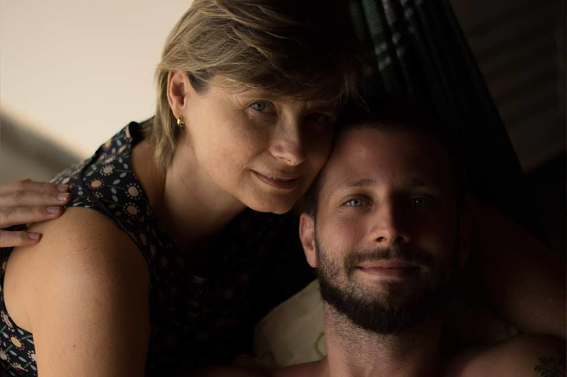

Dona Rosane e o Bruno

Eu, que sou um admirador dos clichês – vejo na maioria deles as grandes verdades da vida, uma pena eles serem constantemente diminuídos apenas por causa do seu alto grau de incidência cotidiana –, posso afirmar que aprendi muitos com meus pais, inclusive os dois principais: ser responsável por meu destino e honesto.

Em específico, com a minha mãe, aprendi (ou fui aprendido) que posso conquistar o mundo, sabendo sempre que as verdadeiras conquistas desdenham da temporalidade do desejo, se tratam de “como” e não “do que”.

De curioso, apesar de extrovertido, tenho vocação para o isolamento, e ela têm me ensinado que amizades hão de sentir o desaforo da ausência, por mais que se diga o contrário.

Por fim, aprendi a lição mais ouvida por todo filho, que se eu andar sem celular, ela me mata.

Mãe, obrigado por tudo, te amo e to chegando com fome.

### O que aprendi com minha mãe: "parceria" (por [Jonas Sakamoto](https://sobreotatame.wordpress.com/))

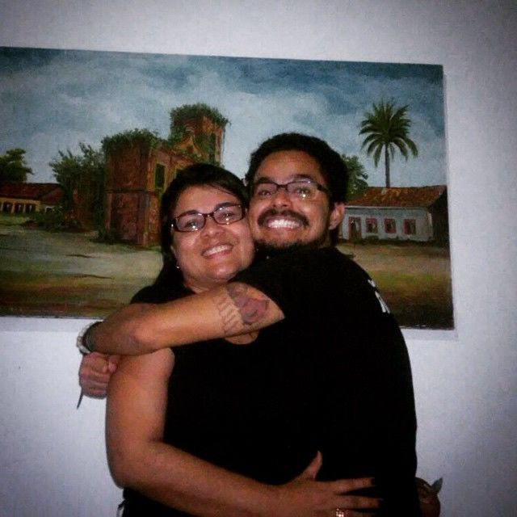

Jeanne Sakamoto e Jonas Sakamoto

Acho que a melhor palavra que posso definir minha mãe é: parceira.

Escolhi essa palavra porque desde sempre funcionamos como melhores amigos dando mais sentido ao que intitulamos de mãe-filho. Digo isso porque a reciprocidade é tamanha que fico sem jeito quando ela vem desabafar ou pedir um conselho para a cria dela. No caso, eu.

Compartilhando algumas coisas que aprendi com ela, cito que a primeira que aprendi é que ter filho cedo pode bagunçar um pouco os planos e forçar um amadurecimento mais imediato. Ela me teve com apenas 16 anos, não sabia ao certo o que estava acontecendo e graças aos meus avós e ao meu pai, ela não ficou só nessa etapa que estava inaugurando na vida. Com isso, ela compartilhou comigo seus desejos e importância dos estudos, que temos sim medo e nos sentimos apequenados com o mundo caótico a nossa volta, mas que acreditar na bondade e cuidar da família é fundamental.

Mas eu acho que o ensinamento mais valioso que aprendi com ela foi que precisamos ter malícia na vida. Digo porque cresci com ela falando isso e eu, simplesmente, não entendia por, talvez, sempre achar que era algo derivado da maldade. No entanto, como na vida os exemplos funcionam melhores que conselhos, ela me mostrou que é preciso ter malícia e não ser ingênuo ao que nos propomos viver, seja em relacionamentos, trabalho, família, amizades e experiências.

### O que aprendi com minha mãe: "calma" (por [Ana Higa](https://www.youtube.com/user/papodehomem))

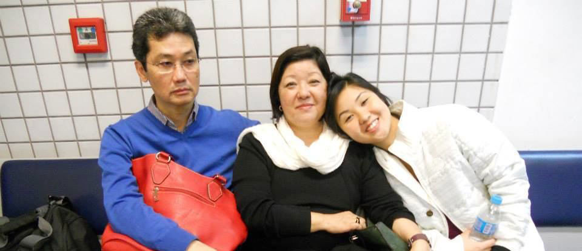

A dona Alice é a do meio

Acabamos de discutir. No meio da confusão toda, você disse que eu sempre vou ser sua filhinha de 10 anos – e isso me deixou muito chateada. No calor do momento eu entendi essa fala como um atestado de que você nunca veria minha evolução, e continuamos a briga. Agora que nos separamos ficou só aquela sensação ruim, de rancor, em relação à pessoa que a gente ama.

Quando o Jader me pediu pra escrever esse texto, comecei a fazer uma carta de desabafo.  No meio dela, comecei a pensar como seria daqui pra frente e foi fácil visualizar. Você vai chegar em casa à noite, super receptiva. Será carinhosa como sempre e não vai exigir que eu peça desculpas ou qualquer coisa do tipo. Simplesmente vai esperar até eu sossegar o ego e ficará feliz em me ver estável de novo.

Você sabe que essas coisas – e essas brigas – são pequenas, passageiras. Diferente de mim, que tento resolver tudo na hora e acabo me atropelando, você consegue esperar o tempo das coisas e sempre age da melhor forma para que tudo volte a ficar bem. Você sabe que tem algo maior por trás, e que esse algo vale a pena.

Quero um dia ter essa calma e confiança que você tem, mãe. Obrigada por me amar como sua filhinha de 10 anos.

### O que aprendi com minha mãe: "Ser conselheiro" (por [Leonardo Filomeno](http://manualdohomemmoderno.com.br/))

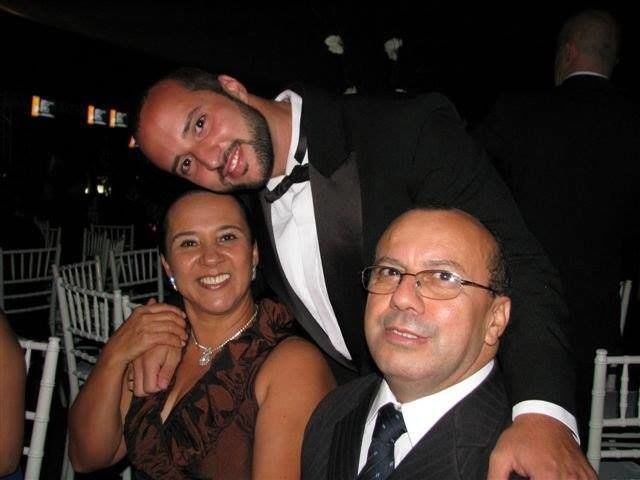

Dona Maria e o Leonardo

A primeira mulher de uma família com 21 irmãos, desde pequena ela tomou para si a responsabilidade de mãe e protetora. Tanto que, aos 7 anos já ajudava a matriarca na lida com a casa. Casou cedo, veio para São Paulo, mas trouxe e cuidou de cada novo irmão que chegava na cidade grande.

Até hoje ela é o núcleo que une toda a família. É com a Dona Maria que os problemas são resolvidos, as pessoas aconselhadas e as desavenças desfeitas.

Basta precisar de alguma coisa e ela estará lá para ajudar. Às vezes, até utilizando do sexto sentido para evitar que algo de ruim aconteça. Ela também me ensinou a perdoar, dar a outra face e, principalmente, transformar as pessoas através do amor, e não do confronto.

### O que aprendi com minha mãe: "Sem frescuras" (por Felipe Franco )

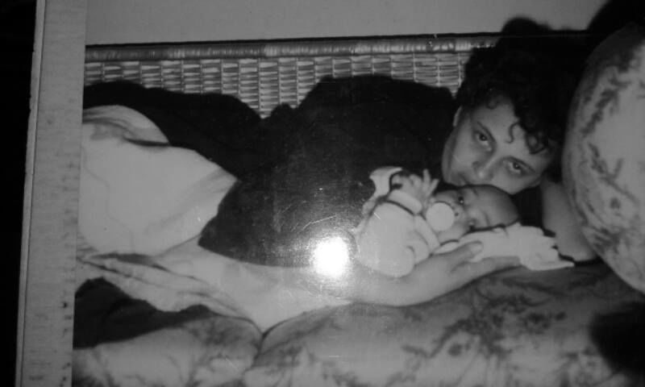

Dona Vera e o Felipe

O que aprendi com a minha mãe. Difícil falar dela. Olhando de longe, somos parecidos. De perto, não temos nada a ver um com o outro. Mas se olhar bem, bem de perto, somos iguaizinhos. E esse é nossa maior dificuldade, dois cabeçudos de personalidade forte que acham que tem a razão em tudo e que não precisam de ninguém para resolver os seus problemas. Discutimos até quando concordamos.

Eu a admiro muito, dou atenção para tudo o que ela me fala, é a pessoa que mais escuto e considero as opiniões, mesmo que na maioria das vezes finjo que não. Se com o meu pai aprendi a ser criativo e me virar com pouco, com a minha mãe aprendi a lutar pelo que eu quero sem frescuras.

Quando nova ela sonhava em ser psicóloga, mas foi estudar economia, pois não queria passar as necessidades que passou na infância. Para isso, atravessava São Paulo todos os dias para trabalhar, houvesse chuva ou sol, conquistou seu espaço, teve seu reconhecimento e seu sucesso, mas essa escolha fez ela ficar bem afastada durante minha infância e da minha irmã.

Acordávamos e ela já tinha saído para o trabalho. Quando chegava, já estávamos dormindo. Porém, se ela não tivesse feito as escolhas que fez, eu não teria toda a base e alicerce para ser quem eu sou, nunca passei nenhuma necessidade isso graças à ela. Devo tudo o que tenho e, hoje, no auge dos meus 30 anos, enxergo o sacrifício que ela fez por mim.

Obrigado, mãe, por se essa mulher forte, batalhadora, durona, independente que fez o que tinha que ser feito. Te admiro muito.

Te amo!

### Mecenas: [Hering](http://boop.cld.bz/Catalogo-Feminino-inverno-2015)

*Assim como as mães estão presente na vida dos filhos, [a Hering](http://boop.cld.bz/Catalogo-Feminino-inverno-2015) está sempre presente na vida dos brasileiros e faz parte da história de cada um. Como ótima opção de presente para o Dia das Mães, a marca resgata o vínculo emocional e a tradição, sem perder a renovação, a modernidade e a sintonia com a moda. Neste inverno, a coleção está cheia de referências naturais que contrapõem às urbanas e fazem um gancho com a história da própria Hering. Aposte em tricôs, sobreposições e maxi comprimentos, no quesito estampas a dica é não esquecer das listras e dos florais.*

*[Com peças Hering](http://boop.cld.bz/Catalogo-Feminino-inverno-2015), é possível escolher presentes autênticos, com estilo e confortáveis. Sua mãe vai gostar e você também.*

---

*publicado em 08 de Maio de 2015, 00:00*
