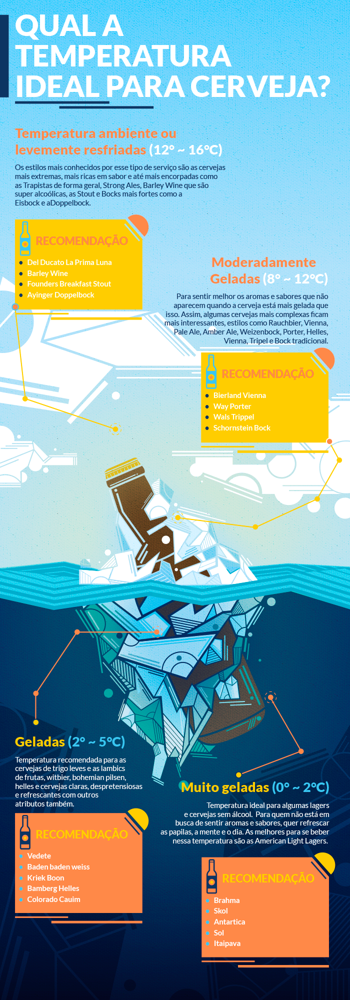
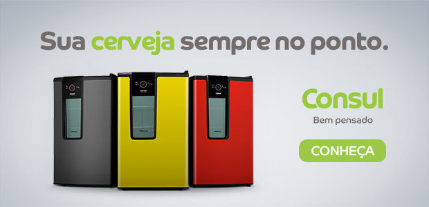

# Qual a temperatura ideal para a sua cerveja?

Cada cerveja pede uma temperatura para melhor aproveitar suas propriedades

A temperatura da cerveja é algo que ainda deixa dúvidas em quem vai apreciar o líquido.

A verdade é a seguinte: com temperaturas muito baixas, congelamos nossas papilas gustativas, que são pequenas células extremamente complexas e sensíveis- são responsáveis por enviar ao sistema nervoso, por meio da saliva, as informações de paladar que o cérebro identifica.

Então, quando estão em temperaturas mais altas, realçam aroma, sabor, corpo, acidez e doçura.

Quando as temperaturas estão mais baixas, realçam refrescância, amargor, [carbonatação](http://pt.wikipedia.org/wiki/Carbonata%C3%A7%C3%A3o) e secura, perdendo itens importantes como aroma, corpo e sabor.

Ou seja, uma cerveja muito escura, alcoólica e aromática quando servida geladíssima, perde suas principais características e, naquele momento, se vai todo o trabalho que o cervejeiro teve de pensar em uma receita equilibrada.

Mas o bom senso e o gosto popular não se discute, por isso preparamos algumas dicas, mas beba sua cerveja a temperatura que mais gostar.

E aí, como vocês estocam a cerveja de vocês?

Mecenas: [Consul](http://ia.nspmotion.com/event/?cap=339640&c=38690&e=ADM_Click!1!1!1!!&r=%5Btimestamp%5D)

Cervejas diferentes, pedem temperaturas diferentes.

Suas cervejas favoritas, escolhidas com cuidado, merecem ser guardadas em um lugar especial, estiloso e com o controle de temperatura ajustável: *[cervejeira da Consul](http://ia.nspmotion.com/event/?cap=339640&c=38690&e=ADM_Click!1!1!1!!&r=%5Btimestamp%5D)*

- Mantém a cerveja gelada em até cinco níveis de temperatura diferentes que chegam até -4ºC;
- Capacidade e potência para gelar até 75 latas de 350ml;
- Prateleiras ajustáveis para você guardar todos os tipos de cerveja: long neck, garrafa de 600ml e até de 1L;
- Deixa sua cerveja no ponto;
- Econômica e frost free

---

*publicado em 14 de Maio de 2015, 11:14*
