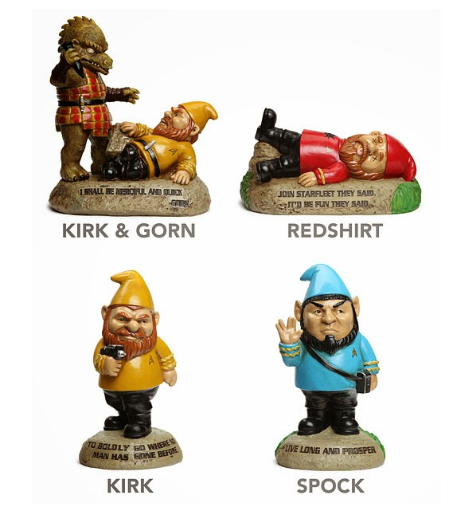

**Os divertidos gnomos de jardim de Star Trek**

Nada como ter a Frota Estelar para explorar todo o universo que há nos jardim da sua casa. Assim, a [ThinkGeek](http://www.thinkgeek.com/product/hujt/?cpg=cj&amp;ref=&amp;CJURL=&amp;CJID=2617611) lançou essa série de Gnomos de Star Trek. São 4 modelos diferentes, com Kirk, Spock, Kirk & Gorn e Redshirt. Cada um vem com o uniforme clássico da série e sai por US$24,99 na loja, além de vir com uma frase embaixo. O Spock ainda possui o cumprimento vulcaniano e a famosa "Vida Longa e Próspera" (Live Long and Prosper). Faltou só mesmo uma Enterprise.

