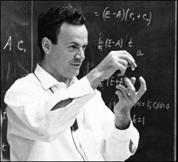
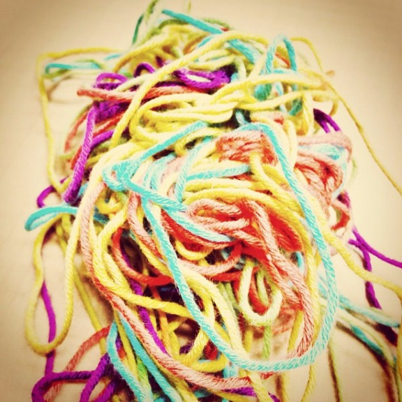
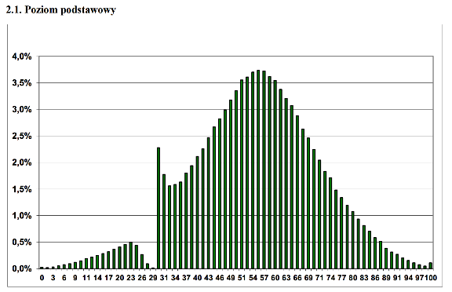

#

Posted on
May 07, 2015
, by 

-
[Permanent link](http://sahandsaba.com/nine-anti-patterns-every-programmer-should-be-aware-of-with-examples.html "Permalink to 9 Anti-Patterns Every Programmer Should Be Aware Of")

A healthy dose of self-criticism is fundamental to professional and personal
growth. When it comes to programming, this sense of self-criticism requires the
ability to detect unproductive or counter-productive patterns in designs, code,
processes, and behaviour. This is why a knowledge of anti-patterns is very
useful for any programmer. This article is a discussion of anti-patterns that I
have found to be recurring, ordered roughly based on how often I have come
across them, and how long it took to undo the damage they caused.

Some of the anti-patterns discussed have elements in common with cognitive
biases, or are directly caused by them. Links to relevant cognitive biases are
provided as we go along in the article. Wikipedia also has a nice [list of
cognitive biases](http://en.wikipedia.org/wiki/List_of_cognitive_biases) for
your reference.

And before starting, let's remember that dogmatic thinking stunts growth and
innovation so consider the list as a set of guidelines and not written-in-stone
rules. And if I missed anything that you consider to be important, feel free to
comment below!

## 1   Premature Optimization

> We should forget about small efficiencies, say about 97% of the time: premature optimization is the root of all evil. Yet we should not pass up our opportunities in that critical 3%. Donald Knuth

> Although never is often better than \*right\* now. Tim Peters, The Zen of Python

### What is it?

Optimizing before you have enough information to make educated conclusions
about where and how to do the optimization.

### Why it's bad

It is very difficult to know exactly what will be the bottleneck in
practice. Attempting to optimize prior to having empirical data is likely
to end up increasing code complexity and room for bugs with negligible
improvements.

### How to avoid it

Prioritize writing clean and readable code that works first, using known and
tested algorithms and tools. Use profiling tools when needed to find
bottlenecks and optimize the priorities. Rely on measurements and not guesses
and speculation.

### Examples and signs

Caching before profiling to find the bottlenecks. Using complicated and
unproven "heuristics" instead of a known mathematically correct algorithm.
Choosing a new and untested experimental web framework that can
theoretically reduce request latency under heavy loads while you are in early
stages and your servers are idle most of the time.

### The tricky part

The tricky part is knowing when the optimization is premature. It's important
to plan in advance for growth. Choosing designs and platforms that will allow
for easy optimization and growth is key here. It's also possible to use
"premature optimization" as an excuse to justify writing bad code. Example:
writing an algorithm to solve a problem when a simpler,
mathematically correct, algorithm exists, simply because the
simpler algorithm is harder to understand.

### tl;dr

Profile before optimizing. Avoid trading simplicity for efficiency until it is
needed, backed by empirical evidence.

## 2   Bikeshedding

> Every once in a while we'd interrupt that to discuss the typography and the color of the cover. And after each discussion, we were asked to vote. I thought it would be most efficient to vote for the same color we had decided on in the meeting before, but it turned out I was always in the minority! We finally chose red. (It came out blue.) Richard Feynman, What Do You Care What Other People Think?

### What is it?

Tendency to spend excessive amounts of time debating and deciding on
trivial and often subjective issues.

### Why it's bad

It's a waste of time. Poul-Henning Kamp goes into depth in an [excellent email
here](http://phk.freebsd.dk/sagas/bikeshed.html).

### How to avoid it

Encourage team members to be aware of this tendency, and to prioritize
reaching a decision (vote, flip a coin, etc. if you have to) when you
notice it. Consider A/B testing later to revisit the decision, when
it is meaningful to do so (e.g. deciding between two different UI
designs), instead of further internal debating.



Richard Feynman was not a fan of bikeshedding.

### Examples and signs

Spending hours or days debating over what background color to use in your
app, or whether to put a button on the left or the right of the UI, or to
use tabs instead of spaces for indentation in your code base.

### The tricky part

Bikeshedding is easier to notice and prevent in my opinion than premature
optimization. Just try to be aware of the amount of time spent on making a
decision and contract that with how trivial the issue is, and intervene if
necessary.

### tl;dr

Avoid spending too much time on trivial decisions.

## 3   Analysis Paralysis

> Want of foresight, unwillingness to act when action would be simple and effective, lack of clear thinking, confusion of counsel [...] these are the features which constitute the endless repetition of history. Winston Churchill, Parliamentary Debates

> Now is better than never. Tim Peters, The Zen of Python

### What is it?

Over-analyzing to the point that it prevents action and progress.

### Why it's bad

Over-analyzing can slow down or stop progress entirely. In the extreme cases,
the results of the analysis can become obsolete by the time they are done, or
worse, the project might never leave the analysis phase. It is also easy to
assume that more information will help decisions when the decision is a
difficult one to make ― see [information bias](http://en.wikipedia.org/wiki/Information_bias_(psychology)) and [validity
bias](http://en.wikipedia.org/wiki/Illusion_of_validity).

### How to avoid it

Again, awareness helps. Emphasize iterations and improvements. Each
iteration will provide more feedback with more data points that can be used
for more meaningful analysis. Without the new data points, more analysis
will become more and more speculative.

### Examples and signs

Spending months or even years deciding on a project's requirements, a new
UI, or a database design.

### The tricky part

It can be tricky to know when to move from planning, requirement gathering
and design, to implementation and testing.

### tl;dr

Prefer iterating to over-analyzing and speculation.

## 4   God Class

> Simple is better than complex. Tim Peters, The Zen of Python

### What is it?

Classes that control many other classes and have many dependencies and lots of
responsibilities.

### Why it's bad

God classes tend to grow to the point of becoming maintenance nightmares ―
because they violate the single-responsibility principle, they are hard to
unit-test, debug, and document.

### How to avoid it

Avoid having classes turn into God classes by breaking up the responsibilities
into smaller classes with a single clearly-defined, unit-tested, and documented
responsibility. Also see "Fear of Adding Classes" below.

### Examples and signs

Look for class names containing "manager", "controller", "driver", "system", or
"engine". Be suspicious of classes that import or depend on many other classes,
control too many other classes, or have many methods performing unrelated
tasks.

God classes know about too many classes and/or control too
many.

### The tricky part

As projects age and requirements and the number of engineers grow, small and
well-intentioned classes turn into God classes slowly. Refactoring such classes
can become a significant task.

### tl;dr

Avoid large classes with too many responsibilities and dependencies.

## 5   Fear of Adding Classes

> Sparse is better than dense. Tim Peters, The Zen of Python

### What is it?

Belief that more classes necessarily make designs more complicated, leading to
a fear of adding more classes or breaking large classes into several smaller
classes.

### Why it's bad

Adding classes can help reduce complexity significantly. Picture a big
tangled ball of yarns. When untangled, you will have several separated
yarns instead. Similarly, several simple, easy-to-maintain and
easy-to-document classes are much preferable to a single large and complex
class with many responsibilities (see the God Class anti-pattern above).



A tangled ball of yarn. Large classes have a tendency to turn into the
software equivalent of this. ([Photo by absolut\_feli on Flickr](https://www.flickr.com/photos/absolut_feli/7162673224))

### How to avoid it

Be aware of when additional classes can simplify the design and decouple
unnecessarily coupled parts of your code.

### Examples and signs

As an easy example consider the following:

```
class Shape
     __init__ shape_type 
        shape_type  shape_type
          

     
         shape_type  "circle"
            center  
            radius  
            # Draw a circle...
         shape_type  "rectangle"
              
            width  
            height  
            # Draw rectangle...
```

Now compare it with the following:

```
class Shape
     
        raise NotImplemented"Subclasses of Shape should implement method 'draw'."

class CircleShape
     __init__ center radius
        center  center
        radius  radius

     
        # Draw a circle...

class RectangleShape
     __init__  width height
          
        width  width
        height  height

     
        # Draw a rectangle...
```

Of course, this is an obvious example, but it illustrates the point: larger
classes with conditional or complicated logic in them can, and often should, be
broken down into simpler classes. The resulting code will have more classes but
will be simpler.

### The tricky part

Adding classes is not a magic bullet. Simplifying the design by breaking up
large classes requires thoughtful analysis of the responsibilities and
requirements.

### tl;dr

More classes are not necessarily a sign of bad design.

## 6   Inner-platform Effect

> Those who do not understand Unix are condemned to reinvent it, poorly. Henry Spencer

> Any sufficiently complicated C or Fortran program contains an ad hoc, informally-specified, bug-ridden, slow implementation of half of Common Lisp. Greenspun's tenth rule

### What is it?

The tendency for complex software systems to re-implement features of the
platform they run in or the programming language they are implemented in,
usually poorly.

### Why it's bad

Platform-level tasks such as job scheduling and disk cache buffers are not easy
to get right. Poorly designed solutions are prone to introduce bottlenecks and
bugs, especially as the system scales up. And recreating alternative language
constructs to achieve what is already possible in the language leads to
difficult to read code and a steeper learning curve for anyone new to the code
base. It can also limit the usefulness of refactoring and code analysis tools.

### How to avoid it

Learn to use the platform or features provided by your OS or platform instead.
Avoid the temptation to create language constructs that rival existing
constructs (especially if it's because you are not used to a new language and
miss your old language's features).

### Examples and signs

Using your MySQL database as a job queue. Reimplementing your own disk buffer
cache mechanism instead of relying on your OS's. Writing a task scheduler for
your web-server in PHP. Defining macros in C to allow for Python-like language
constructs.

### The tricky part

In very rare cases, it might be necessary re-implement parts of the platform
(JVM, Firefox, Chrome, etc.).

### tl;dr

Avoid re-inventing what your OS or development platform already does well.

## 7   Magic Numbers and Strings

> Explicit is better than implicit. Tim Peters, The Zen of Python

### What is it?

Using unnamed numbers or string literals instead of named constants in code.

### Why it's bad

The main problem is that the semantics of the number or string literal is
partially or completely hidden without a descriptive name or another form of
annotation. This makes understanding the code harder, and if it becomes
necessary to change the constant, search and replace or other refactoring tools
can introduce subtle bugs. Consider the following piece of code:

```
 create_main_window
    window  Window 
    # etc...
```

What are the two numbers there? Assume the first is window width and the second
in window height. If it ever becomes necessary to change the width to 800
instead, a search and replace would be dangerous since it would change the
height in this case too, and perhaps other occurrences of the number 600 in the
code base.

String literals might seem less prone to these issues but having unnamed string
literals in code makes internationalization harder, and can introduce similar
issues to do with instances of the same literal having different semantics.
For example, homonyms in English can cause a similar issue with search and
replace; consider two occurrences of "point", one in which it refers to a noun
(as in "she has a point") and the other as a verb (as in "to point out the
differences..."). Replacing such string literals with a string retrieval
mechanism that allows you to clearly indicate the semantics can help
distinguish these two cases, and will also come in handy when you send the
strings for translation.

### How to avoid it

Use named constants, resource retrieval methods, or annotations.

### Examples and signs

Simple example is shown above. This particular anti-pattern is very easy to
detect (except for a few tricky cases mentioned below.)

### The tricky part

There is a narrow grey area where it can be hard to tell if certain numbers are
magic numbers or not. For example the number 0 for languages with zero-based
indexing. Other examples are use of 100 to calculate percentages, 2 to check
for parity, etc.

### tl;dr

Avoid having unexplained and unnamed numbers and string literals in code.

## 8   Management by Numbers

> Measuring programming progress by lines of code is like measuring aircraft building progress by weight. Bill Gates

### What is it?

Strict reliance on numbers for decision making.

### Why it's bad

Numbers are great. The main strategy to avoid the first two anti-patterns
mentioned in this article (premature optimization and bikeshedding) was to
profile or do A/B testing to get some measurements that can help you optimize
or decide based on numbers instead of speculating. However, blind reliance on
numbers can be dangerous. For example, numbers tend to outlive the models in
which they were meaningful, or the models become outdated and no longer
accurately represent reality. This can lead to poor decisions,
especially if they are fully automated ― see [automation bias](http://en.wikipedia.org/wiki/Automation_bias).


Do you find yourself commiserating with Pryzbylewski from the HBO
show The Wire, Season 4?

Another issue with reliance on numbers for *determining* (and not merely
*informing*) decisions is that the measurement processes can be manipulated
over time to achieve the desired numbers instead ― see [observer-expectancy
effect](http://en.wikipedia.org/wiki/Observer-expectancy_effect). Grade
inflation is an example of this. The HBO show The Wire (which, by the way, if
you haven't seen, you must!) does an excellent job of portraying this issue of
reliance on numbers, by showing how the police department and later the
education system have replaced meaningful goals with a game of numbers. Or if
you prefer charts, the following one showing the distribution of scores on a
test with a passing score of 30%, illustrates the point perfectly.



Score distribution of the high school exit exam in Poland with passing
score of 30%. [Source in Polish](http://www.cke.edu.pl/images/files/matura/informacje_o_wynikach/2013/2013_Matura.pdf).

### How to avoid it

Use measurements and numbers wisely, not blindly.

### Examples and signs

Using only lines of code, number of commits, etc. to judge the effectiveness of
programmers. Measuring employee contribution by the numbers of hours they spend
at their desks.

### The tricky part

The larger the scale of operations, the higher the number of decisions that
will need to be made, and this means automation and blind reliance on numbers
for decisions begins to creep into the processes.

### tl;dr

Use numbers to inform your decisions, not determine them.

## 9   Useless (Poltergeist) Classes

> It seems that perfection is attained, not when there is nothing more to add, but when there is nothing more to take away. Antoine de Saint Exupéry

### What is it?

Useless classes with no real responsibility of their own, often used to just
invoke methods in another class or add an unneeded layer of abstraction.

### Why it's bad

Poltergeist classes add complexity, extra code to maintain and test, and make
the code less readable—the reader first needs to realize what the poltergeist
does, which is often almost nothing, and then train herself to mentally replace
uses of the poltergeist with the class that actually handles the
responsibility.

### How to avoid it

Don't write useless classes, or refactor to get rid of them. Jack Diederich has
a great talk titled [Stop Writing
Classes](https://www.youtube.com/watch?v=o9pEzgHorH0) that is related to this
anti-pattern.

### Examples and signs

A couple of years ago, while working on my master's degree, I was a teaching
assistant for a first-year Java programming course. For one of the labs, I was
given the lab material which was to be on the topic of stacks and using linked
lists to implement them. I was also given the reference "solution". This is the
solution Java file I was given, almost verbatim (I removed the comments to save some
space):

```
import java.util.EmptyStackException
import java.util.LinkedList

public class LabStack 
    private LinkedList 

    public LabStack 
           LinkedList>();
    

    public boolean empty 
        return isEmpty
    

    public   throws EmptyStackException 
         isEmpty 
            throw  EmptyStackException
        
        return 
    

    public   throws EmptyStackException 
         isEmpty 
            throw  EmptyStackException
        
        return 
    

    public   element 
        element
    

    public   
        return 
    

    public  makeEmpty 
        clear
    

    public String toString 
        return toString
```

You can only imagine my confusion looking at the reference solution, trying to
figure what the point of the `LabStack` class was, and what the students
were supposed to learn from the utterly pointless exercise of writing it. In
case it's not painfully obvious what's wrong with the class, it's that it does
absolutely nothing! It simply passes calls through to the `LinkedList`
object it instantiates. The class changes the names of a couple of methods
(e.g. `makeEmpty` instead of the commonly used `clear`), which will
only lead to user confusion. The error checking logic is completely unnecessary
since the methods in `LinkedList` already do the same (but throw a
different exception, `NoSuchElementException`, yet another possible
source of confusion). To this day, I can't imagine what was going through the
authors' minds when they came up with this lab material. Anytime you see
classes that do anything similar to the above, reconsider whether they are
really needed or not.

### The tricky part

The advice here at first glance looks to be in direct contradiction of the
advice in "Fear of Adding Classes". It's important to know when classes
perform a valuable role and simplify the design, instead of uselessly
increasing complexity with no added benefit.

### tl;dr

Avoid classes with no real responsibility.
