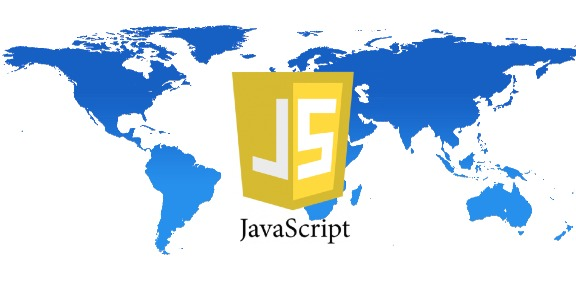

# The future of JavaScript is (almost) now

JavaScript is everywhere. Once relegated to an Internet fad, the malleable programming language has evolved along with the Web and now finds itself entrenched in modern browsers, complex Web applications, mobile development, server-side programming, and in emerging platforms like the Internet of Things.

Underlying that browser-centric user and developer shift, JavaScript has developed a robust ecosystem of third-party and open-source libraries, frameworks, tools, implementations and superset languages woven into the backbone upon which Web and mobile development is now built.

Over the past decade, starting with jQuery empowering Web developers with client-side scripting, every popular plug-in has filled another gap in the language and its capabilities.

According to Gartner analyst Danny Brian, a member of the Gartner for Technical Professionals group specializing in Web and mobile development, “JavaScript’s prominence is a byproduct of the browser being ubiquitous, whether that’s desktop, mobile or other platforms like native desktop applications using the browser wrapped up and deployed or built with HTML5, and the emerging IoT devices and peripherals that treat Node.js as the engine that powers them.”

**Where JavaScript goes next**After more than 15 years without a major update, the international standards organization Ecma is finally set to release ECMAScript 6—a comprehensive update to standardized JavaScript—in June of this year. The 650-page [final draft of ECMA-262 Edition 6](https://github.com/tc39/tc39-notes/blob/master/es6/2015-03/ES6%20Draft%20Status%20March%202015.pdf.) (ES6) was recently sent to the Ecma General Assembly so it could be finally approved and standardized at the June Ecma General Assembly meeting. ES6 is a foundational change to the language, featuring a revamped syntax of modules, classes and other advancements to enable the development of larger, more complex Web applications.

**(Related: [Milestone ECMAScript 6 on track for June standardization](http://sdtimes.com/milestone-ecmascript-6-track-june-release/))**

Mozilla research fellow and ECMAScript project editor Allen Wirfs-Brock said it will fall on browser providers, many of which are already in various stages of implementing ES6 features, to roll out the standard and optimize it across their JavaScript engines and developer tools.

“What ECMAScript does is provide the common foundation that JavaScript programmers in whatever environment or application can depend upon,” said Wirfs-Brock. “ECMAScript 6 is such a significant advance over previous versions of JavaScript, it’s what all programmers over the next couple years will expect to be there. So there’ll be a whole lot of pressure on the browsers, server-based systems and everyone who implements JavaScript to run fully performant ES6 as soon as possible.”

**The tooling and browser evolution**The JavaScript ecosystem has made the language more accessible and easier to work with across the development spectrum, according to Gartner’s Brian.

Angular extends HTML syntax to JavaScript, while streamlining the coding process with data binding and dependency injection. CoffeeScript, TypeScript and the like bring in developers from other languages by dangling the syntactical carrot and compiling to JavaScript. Backbone, Ember and Grunt make Web application development run smoother and faster. Apache Cordova and Bootstrap open JavaScript’s mobile Web and app development possibilities. The emergence of HTML5 entwines JavaScript with the future of the markup language. And Node.js gives JavaScript the cross-platform runtime to conquer servers, embedded devices and more.

“We spent all these years trying to bring our favorite languages to the browser in the form of plug-ins, applets and cross-compilers, but JavaScript was already there, and now developers are taking to it via frameworks,” said Brian. “They see their friend building something cool with Angular or Ember or another framework, so they decide to learn it.

“It’s this appeal of being able to write a function or have an object in JavaScript and being able to literally cut and paste that to consoles running in the cloud and the browser. That’s a power we’ve wanted for a long time, though we didn’t necessarily expect to get it from JavaScript.”

### About Rob Marvin

Rob Marvin has covered the software development and technology industry as Online & Social Media Editor at SD Times since July 2013. He is a 2013 graduate of the S.I. Newhouse School of Public Communications at Syracuse University with dual degrees in Magazine Journalism and Psychology. Rob enjoys writing about everything from features, entertainment, news and culture to his current work covering the software development industry. Reach him on Twitter at [@rjmarvin1](https://twitter.com/rjmarvin1).

[View all posts by Rob Marvin](http://sdtimes.com/author/rob-marvin/)

*Página 2*

Andrew Connell, an independent software development contractor who’s worked extensively in both server-side coding and Web development, said it all really started with jQuery. Once jQuery helped everyone get around the maddening process of writing cross-browser JavaScript, a maturing progression of frameworks helped advance the language. Now, with examples like Angular and Facebook’s React, the biggest tech companies on the block are investing heavily in JavaScript development tools.

“Back in the day, JavaScript was always just the glue that led us to make things somewhat interactive on the browser, but that was about the extent of it,” said Connell. “The fact that the language has been adopted in so many different ways, from Web to server to devices, clients and mobile, and the advent of all these different libraries and ecosystem around it—the better tooling and frameworks we’ve had over the past 5+ years—it’s become much more than just the glue that holds things together.”

A strong indicator of how JavaScript philosophies have changed is the [partnership](http://sdtimes.com/google-microsoft-combine-typescript-atscript-angular-2/) between Google and Microsoft to write Angular 2 in Microsoft’s superset TypeScript language. Google chose to scale back independent development of some of its own JavaScript tools, including the [Dart programming language](http://sdtimes.com/sd-times-blog-google-concedes-dart-is-just-like-everybody-else/), and even rolling features of its AtScript language and runtime into the next version of TypeScript.

Brian sees the landmark Angular 2 collaboration as a healthy sign that the larger tech companies are working together to accelerate ECMAScript 6 adoption, and also as a strategic move for Google to push forward some its own Web component goals through working with TypeScript on Angular 2.

“Google understands that the browser continues to evolve, with ES6 and Web components changing what we need from a framework,” he said. “Angular 2 is a really interesting collaboration from the perspective of JavaScript, because although Microsoft and Google have not always got along, Microsoft has been very proactive in its [advocacy] of TypeScript and in building ES6 features into Internet Explorer. Google has a lot to gain from involving Microsoft and TypeScript’s strong following in that discussion.”

**Runtimes**Though JavaScript has advanced far beyond simple browser interactivity, that concept of the language as glue is still applicable, particularly in JavaScript runtimes such as Google’s V8 engine, io.js and Node.js. These runtimes give developers the ability to essentially build desktop applications running in JavaScript, leveraging one language and one skill set to wrap the language into the future of servers, embedded devices and the Internet of Things as a truly cross-platform language.

“Node.js has really become foundational to a lot of other products and different platforms,” said Brian. “That’s true of JavaScript and V8 in general. Clients never want to find themselves in a runtime dead-end, and the health of an ecosystem is a great indicator of a runtime’s longevity.”

The prospect of the [io.js fork](http://sdtimes.com/sd-times-github-project-week-io-js/) ultimately rejoining the main Node.js distribution as part of the [Node.js Foundation](http://sdtimes.com/node-js-announces-move-open-governance-model-establishes-node-js-foundation/) indicates to Brian a higher level of investment across the development community in the runtime, and by extension the browsers it lives in.

As Connell put it, the biggest factor holding Web development in the past has been legacy versions of browsers, exemplified by the half-dozen lingering versions of a browser like Internet Explorer. With Chrome and Firefox moving to a continuous, “evergreen” update cadence, users and developers don’t have to worry about their browsers being current. With Spartan (Microsoft Edge), Microsoft is now moving to the evergreen browser update model as well.

In terms of browser maturity, Brian believed the market has evolved to a point where major browsers are largely on the same page when it comes to standards and ultimate goals for what they want the browser to be. It’s a concept borrowed from open source he refers to as “co-opetition.”

“We’re all agreed on standards. We’re all shooting for a similar end goal,” said Brian. “Where the actual competition takes place is in more of the optimization. How quickly can browsers adopt these technologies? If we only had one browser today, our confidence would be very low in that thing running 10 years from now on all those devices we can’t predict today. But because I can take that same JavaScript code and run it on a single-board computer, run it on my desktop, run it on a native mobile app on my phone, run it in the cloud, that’s what gives JavaScript staying power.

“So long as we have Internet Explorer competing with Chrome competing with Safari competing with Firefox and Opera—even though many of those will share code between them—the landscape will continue to shift, and that’s a good thing for JavaScript developers.

“This is exactly what developers want,” said Brian. “We want all these options available that are still running the same portable applications. The more the merrier.”

### About Rob Marvin

Rob Marvin has covered the software development and technology industry as Online & Social Media Editor at SD Times since July 2013. He is a 2013 graduate of the S.I. Newhouse School of Public Communications at Syracuse University with dual degrees in Magazine Journalism and Psychology. Rob enjoys writing about everything from features, entertainment, news and culture to his current work covering the software development industry. Reach him on Twitter at [@rjmarvin1](https://twitter.com/rjmarvin1).

[View all posts by Rob Marvin](http://sdtimes.com/author/rob-marvin/)

*Página 3*

**JavaScript’s complex relationship with the enterprise**Enterprise application development is where JavaScript’s uptake has been slowest, and it finally turned the corner over the last several years. Connell echoed the general feelings of many traditional enterprise developers, explaining that even now a significant population still looks at JavaScript as “not real development.”

Overall perceptions are warming, though, as server-side developers have begun to see JavaScript and the frameworks that come with it as another option in their toolbox.

Marc Anderson, cofounder and president of Sympraxis Consulting and the developer of SPServices (a jQuery library for SharePoint), explained that early in enterprise development, many programmers found themselves unable to meet traditional project requirements using JavaScript. Rather than asking which framework a developer should use, he said they should’ve been asking what language or framework matched their business requirements.

“Everybody dislikes something about any language,” he said. “I’ve used dozens and they all have their quirks, so when people say they don’t like JavaScript for one reason or another, it’s usually about the technical implementation of the language itself. One of the reasons JavaScript had a bad reputation for a while is this elitism around using a compiled language: the idea that scripting is somehow inferior or less of a programming language.”

One of the enterprise areas in which JavaScript took the longest to catch on was in the Microsoft space. Until the release of TypeScript, Microsoft never offered any kind of meaningful JavaScript developer tool.

“[JavaScript has] been in the browser since the mid-1990s, and it gives you this immediacy of working with the end user that you can’t get in a compiled language,” said Anderson. “We can be much more agile and pay a lot more attention to the user experience with JavaScript when we’re closer to the glass. Right where the user is, we’re running our code.”

According to Anderson, Microsoft developers were comfortable writing C# and .NET on the server, and they looked at the browser as a brave new world. Tools like TypeScript make the language feel more natural to C# developers, giving them a compiler-like feel even though it’s not a compiler, per se. He mentioned JavaScript code quality tools such as JSLint and JSHint, passing code through them for static analysis to give enterprise developers a higher comfort level.

“TypeScript takes what they write and puts it through a syntax checker, applying a bunch of rules to JavaScript to make them more comfortable writing it,” said Anderson. “There’s this way of writing JavaScript now that’s more comfortable for people from a compiled language background. A lot of server-side coders are coming to the party now.”

Gartner’s Brian said that while frameworks and superset languages like TypeScript have been integral to JavaScript’s popularity, he worried about the culture around developers specializing in a particular library or framework becoming a crutch for development teams going forward.

“You see a lot of résumés nowadays where a developer titles him or herself an Angular developer or an Ext JS developer, etc.,” he said. “They tend to think in fairly limited terms of what the framework provides for them. That’s the risk of any big framework or superscript: You’re at the mercy of the tool. That’s fine, as long as you have a high degree of confidence in the maintenance and development of that tool. The bigger the cross-compiler and the more complex the framework, the more abstraction it’s giving you. It’s not just about targeting the open-source runtime, which is the browser. It’s about choosing tools in your workflow that’ll be around for a long time.”

**ECMAScript 6 and the Web’s next frontier**Many developers are already making use of ES6 features available in different Chrome builds, Internet Explorer and other browsers where class support is almost fully implemented. Brian sees ECMAScript 6 standardization as less about developers using the features than about the importance of a clear picture of JavaScript going forward.

“Up until now, you’ve had projects like TypeScript and Traceur and ES6 polyfills shooting for a specification that’s not yet baked,” he said. “Having that baked now gives everybody a sense of where the browsers will go, and therefore dev teams can have a lot more confidence starting to use things like TypeScript. That lingering question mark is gone, and when it comes to these Web standards, you can’t be sure of anything until you get that John Hancock at the bottom of the page.”

Mozilla’s Wirfs-Brock said we won’t know for four or five years until ECMAScript 6 is broadly used if it’s achieved all its technical goals, but the effect of galvanizing the Web development community is already apparent.

### About Rob Marvin

Rob Marvin has covered the software development and technology industry as Online & Social Media Editor at SD Times since July 2013. He is a 2013 graduate of the S.I. Newhouse School of Public Communications at Syracuse University with dual degrees in Magazine Journalism and Psychology. Rob enjoys writing about everything from features, entertainment, news and culture to his current work covering the software development industry. Reach him on Twitter at [@rjmarvin1](https://twitter.com/rjmarvin1).

[View all posts by Rob Marvin](http://sdtimes.com/author/rob-marvin/)
