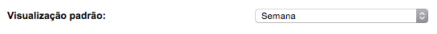
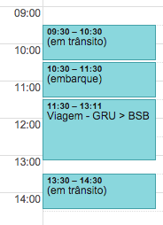
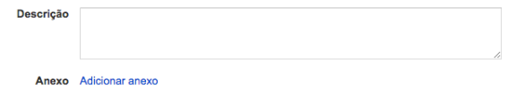
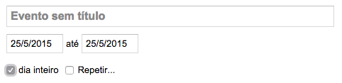
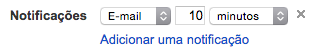

# 5 maneiras de usar a agenda do Google para o GTD

Este post não faz exatamente parte da série Aprenda GTD, mas está relacionado. Eu utilizo a agenda do Google no meu sistema GTD e criei este post com dicas para utilizá-la de acordo com a metodologia. Veja como:

### 1. Configure a visualização semanal

No GTD, o planejamento é feito semanalmente. Logo, faz sentido você visualizar sua semana corrente ao acessar sua agenda. Para fazer isso, vá em **Configurações > Visualização padrão > Semana**.

### 2. Use duas cores

[Já dei essa dica aqui](http://vidaorganizada.com/produtividade/agenda/hack-para-agenda-duas-cores/), e a ideia é a seguinte: utilize uma cor padrão de destaque para os compromissos com data e hora e uma cor com menos destaque para inserções que podem ser modificadas (uma tarefa que você precisa fazer naquele dia, mas pode ser qualquer horário, por exemplo). Isso ajuda você a bater o olho na sua agenda e ver o que pode ser alterado caso alguém ligue querendo agendar uma reunião com você, por exemplo. Você pode usar essa cor de menos contraste para tarefas e a cor principal para compromissos.

Para alterar, basta clicar no seu compromisso e então em **Cor do evento**.

### 3. Planeje seus compromissos semanalmente

Uma vez por semana, insira as datas e horas exatas dos compromissos que têm essa configuração e pergunte-se: o que tenho que providenciar para cada um desses compromissos? Eu começo no domingo e vou planejando a minha semana até o sábado seguinte.

Por exemplo, se no domingo eu vou pegar um vôo às 16:35, eu insiro o compromisso com a duração exata. Antes dele, insiro o tempo do embarque e, antes ainda, calculo quanto tempo demoro para chegar. Nesse intervalo, insiro o compromisso “em trânsito” para sinalizar que horas preciso sair de casa. Isso é muito útil porque, se não colocar, vou precisar fazer os cálculos no dia e posso me atrapalhar, além de ser mais estressante. Isso também serve como guia para eu poder planejar as outras atividades do meu dia, que preciso fazer antes.

Dentro do compromisso do vôo, também insiro todas as informações que possam ser úteis, como o número do mesmo, endereço certinho, portão (se já tiver), terminal do aeroporto e por aí vai.

Além de inserir os períodos em trânsito no meu planejamento, eu gosto de inserir também minha rotina matinal, quando acordo, tomo café-da-manhã e me arrumo para sair (bloqueio meia hora no calendário sempre que tenho algum compromisso externo; quando trabalho em casa não preciso), além da quantidade de horas de sono necessária em cada dia. Como estou comprometida a descansar melhor, bloqueio as 8 horas de sono para saber se estou indo dormir no horário certo de acordo com a hora que preciso acordar pela manhã.

Eu também gosto de inserir, semanalmente, algumas atividades de rotina que sei que me requerem tempo, como processar meus e-mails na manhã seguinte a um dia cheio de compromissos (e que eu sei que não vou ver meus e-mails) ou processar com calma as minhas recentes anotações da caixa de entrada.

### 4. Use a agenda como tickler digital

Pouca gente sabe, mas você pode anexar arquivos aos seus compromissos na agenda do Google. Por isso, se precisar de alguma imagem ou qualquer outro tipo de arquivo em determinado dia, basta anexar no compromisso clicando nele e, depois, em **Anexo > Adicionar anexo**.

[Saiba mais sobre o tickler e como funciona](http://vidaorganizada.com/produtividade/gtd/como-implementar/o-que-e-o-tickler-e-como-funciona/).

Além dos anexos, você pode simplesmente inserir links para notas no Evernote na descrição, por exemplo, ou as próprias informações diretamente ali, para facilitar.

### 5. Insira lembretes, prazos e notificações

Não só de compromissos vive a agenda, então você pode inserir vencimento de contas, lembretes para tomar remédios, aviso de quando seu chefe estará de férias, aniversários importantes, entre outros. Para isso, ao criar um evento, marque como **dia inteiro** e veja como ele aparece no topo do seu dia, sem bloquear seus horários.

É claro que, se for um lembrete dentro de um horário específico (ligar para alguém, tomar um remédio), vale a pena inserir o horário e uma notificação para alguns minutos antes. Procure não usar notificações para ocasiões diferentes destas.

Para adicionar uma notificação, clique no seu compromisso e em Notificações > Adicionar uma notificação. Particularmente, gosto de selecionar e-mail ou SMS, pois a pop-up já falhou comigo algumas vezes.

Apesar de ser um post sobre o Google Calendar, a maioria das dicas acima pode ser utilizada em outras ferramentas de calendário eletrônico – algumas até com mais especificidades, como o calendário do Outlook. Vale a pena explorar a agenda que você usa para descobrir ideias legais que podem ajudar muito no seu dia a dia com o GTD.
