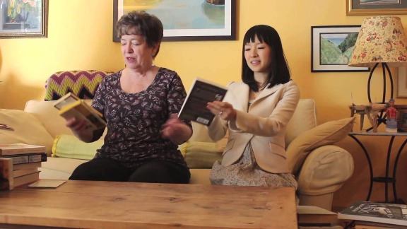
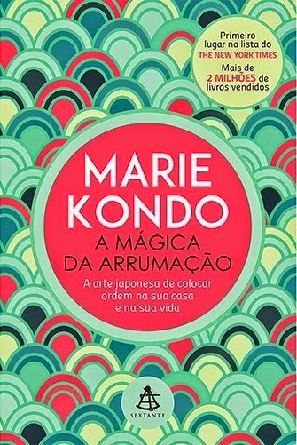

# Resenha: A mágica da arrumação (Marie Kondo)

Eu recebi mais de 40 mensagens, comentários e e-mails perguntando a minha opinião sobre a personal organizer japonesa Marie Kondo, que ficou famosa agora no Brasil devido à ampla divulgação do lançamento do seu livro aqui, “A mágica da arrumação”, publicado pela editora Sextante e respaldado por publicações de grande porte como a revista Veja e o jornal Folha de SP. Já tinha lido a versão original em inglês (The life changing magic of tyding up) e agora acabei de terminar a versão em português, podendo escrever uma resenha para quem tiver curiosidade sobre a minha visão pelo que ela aborda.

A Marie é uma personal organizer que está fazendo um sucesso tremendo não apenas no Japão, como em todo o mundo. Ela é um fenômeno. Ela é nova (30 anos), e uma mulher, então é muito legal ver alguém “da nossa área” fazendo sucesso assim e levando o tema organização pessoal para a vida das pessoas.

Eu gostei muito do livro (a tradução da Sextante, por sinal, está fantástica – cabe o elogio), mas discordo da Marie em diversos aspectos.

Uma das principais crenças dela é que não existe arrumação eficaz feita aos pouquinhos – somente a organização radical ensina a pessoa de verdade a se organizar e não acumular mais tralha. Eu concordo e discordo. Concordo que o ideal é sim a pessoa fazer a organização radical porque aí isso vai ajudá-la a ver o resultado imediato do seu trabalho. Porém, sei que a realidade das pessoas é diferente. Ninguém consegue fazer essa organização radical porque na vida não existe extreme makeover. Você consegue fazer se morar sozinho e se organizar nas férias, ou se contratar uma personal organizer para arrumar tudo para você. Aí sim dá e até recomendo! Porém, se não é o seu caso, não precisa se frustrar pensando nesse ideal. Dá para se organizar aos poucos sim.

O livro dela é um livro sobre destralhamento. Eu fiquei muito surpresa quando li pela primeira vez, porque acabou tão rápido – é um livro tão simples! O conceito de destralhamento é essencial para a organização e fico feliz por existir um livro tão repercurtido como o dela no mercado, pois as pessoas realmente tendem a acumular muitos objetos e não é possível organizar tralha. Quem conheceu e gostou do livro pode ir atrás de outros autores bem bacanas sobre esse assunto, ou pesquisar sobre minimalismo.

Eu acho que ela é bastante radical em alguns aspectos e traz dicas certeiras em outros. Apesar de ser contra a tralha, ela gosta de agradecer e se relacionar de forma mais afetuosa com os objetos. No último sábado, levantei o tópico no meu workshop “Organize sua casa” e todos que já tinham começado a ler o livro tiveram a mesma impressão.

Muito do que ela fala pode ser novidade para o público em geral, mas já é notícia velha para quem trabalha como personal organizer. Não traz nada de novo para quem trabalha com isso, apesar de eu recomendar a leitura fortemente a todas as profissionais da área. Acredito muito que a organização pessoal deva ser um conceito integrado, que a organização da casa se reflete na organização da vida (e vice-versa), e o livro dela fala basicamente sobre isso também.

Todo o método KonMari se baseia na ideia de que na sua casa devem ficar somente os objetos que te trazem alegria, e nisso concordo demais com ela. É uma boa filosofia de escolha.

A grande vantagem do livro é que, em português, não temos muito material sobre o assunto detralhamento a favor da organização, então ele é um bom presente a todos nós apaixonados por organização pessoal.

E você, já leu esse livro? O que achou? Deixe sua opinião nos comentários!
