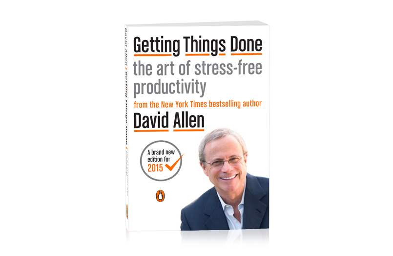
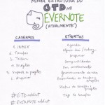

17 *May 2015*

## Resenha: Getting Things Done, David Allen (a nova versão 2015)

Há cerca de nove anos, eu li o livro do GTD pela primeira vez. *GTD, para quem está chegando agora no blog e não conhece, é uma metodologia de produtividade criada pelo David Allen, que eu utilizo há muitos anos. [(Clique aqui para entender do que se trata)](http://vidaorganizada.com/trabalho/produtividade/gtd/o-que-e-gtd/gtd-getting-things-done-ou-a-melhor-metodologia-de-produtividade-que-existe/).*

Da primeira leitura para cá, praticamente tudo mudou na minha vida e, grande parte dela, por causa do método GTD. Eu li e reli esse livro tantas vezes que já perdi a conta. Depois que me tornei instrutora da metodologia, então, venho estudando o livro de maneira muito mais intensa, com o objetivo de entender a metodologia de forma profunda para ensinar de forma cada vez melhor às pessoas interessadas em aprendê-la.

No dia 17 de março de 2015, foi lançada uma nova versão do livro. O David reescreveu o livro inteiro, completamente. Não quis ler tão rápido porque quis aproveitar para re-implementar todo o meu sistema do zero, como se fosse a primeira vez, porque assim eu (penso que) absorveria melhor todos os novos ensinamentos.

Por já ter lido o livro, participado de alguns webinars com o próprio David Allen e ter lido alguns comentários pela Internet sobre a nova edição, eu achei que seria legal escrever uma resenha com a minha visão sobre a nova edição, o que tem de novo, o que tem de diferente, e assim tirar as principais dúvidas de quem ainda não teve a oportunidade de ler.

### É um livro novo? A metodologia é a mesma?

Sim, é um livro novo, mas a metodologia é a mesma. O David simplesmente reescreveu todo o livro original que dá origem ao método (publicado no Brasil pela Ed. Campus com o título “A arte de fazer acontecer”). A metodologia não mudou.

O que acontece é que, quando o David escreveu a primeira versão do livro, ele quis colocar toda informação possível lá. Isso fez do livro do GTD um livro com uma quantidade enorme de informação que, muitas vezes, para quem está começando, é desnecessária. Muitas pessoas me falam que têm dificuldade em aplicar o GTD apenas lendo o livro, e que então buscaram cursos ou artigos pela Internet para ajudar na implementação. Sabendo dessa dificuldade, ele reescreveu o novo livro deixando a leitura muito mais simples e fluida, facilitando a vida de todo mundo.

### Já tem versão em português?

Não. O livro foi lançado em março deste ano e a tradução já está sendo feita pela editora brasileira, mas esse é um processo que leva tempo. Não tenho a previsão para a publicação em português, mas eu chuto que eles devam publicar entre o segundo semestre de 2015 e o primeiro de 2016.

### Onde comprar o livro importado?

Tanto a Amazon quanto a Livraria Cultura importam a versão física do livro (leva umas seis semanas para chegar), mas a maneira mais fácil é comprar e ler a versão digital, tanto para Kindle quanto para Kobo. Vale lembrar que não é necessário ter os e-readers para ler – basta baixar o programa gratuito nos sites da Amazon e da Livraria Cultura ou na loja de apps do seu celular/tablet.

### Não tenho como ler o livro novo agora. Posso ler o livro antigo e ainda aprender GTD?

Claro que pode! Como eu disse, a metodologia é a mesma. É claro que, se você puder ler o novo em inglês, sugiro que já leia a versão nova.

### O que mudou nesse novo livro?

Algumas mudanças na própria nomenclatura de alguns termos do GTD já vinham sendo implementadas pelo David nos seus últimos livros e materiais publicados, como o nome dos cinco passos e os termos de horizontes de foco. Essas mudanças então foram transpostas para o novo livro, seguindo a coerência do seu trabalho.

Os cinco passos deixaram de se chamar coletar, processar, organizar, revisar e executar e agora se chamam **capturar, esclarecer, organizar, refletir e engajar**. O sentido é o mesmo, mas menos mecânico e operacional e mais intelectual.

Um ponto que me chamou muito a atenção foi como o livro foi escrito para todos, da dona de casa ao CEO da empresa multinacional. A versão original era muito focada no ambiente corporativo e dava a impressão de que o GTD não era para todo mundo.

A fluidez do novo livro é impressionante, tornando a leitura muito mais leve para quem está acessando a metodologia pela primeira vez. Você também sente o David bastante confiante sobre tudo o que ele fala – afinal, foram mais de 15 anos desde o lançamento do livro original e muita coisa aconteceu com ele de lá para cá, em termos de experiência de trabalho com o método no mundo.

Existem alguns capítulos novos, como um sobre GTD e as ciências cognitivas (fantástico) e um sobre como alcançar a maestria no GTD. Eu também senti que todos os capítulos já existentes tiveram um up bem legal. O capítulo sobre projetos está fantástico e dá muito mais ênfase ao planejamento natural de um projeto, que muitas vezes acabava passando batido antes frente a tantas informações.

No livro original, muitas vezes o David citava artigos de tecnologia como palm tops. A tecnologia muda muito rápido e o GTD é uma metodologia que independe de dispositivos, softwares e aplicativos, então ele procurou deixar isso bem claro no novo livro, mantendo a metodologia desassociada de tais tecnologias temporais. A metodologia é atemporal.

### O que o livro não tem

Guias para implementação da metodologia em programas ou ferramentas específicas. O David tem o grande cuidado de mostrar que a metodologia é independente de qualquer tipo de tecnologia e que a pessoa que a aprende pode implementar em qualquer lugar. Não adianta fazer um guia com ferramentas se daqui a uma semana vão lançar uma versão mais nova e atualizada e o livro vai ficar desatualizado. O novo livro foi escrito para ser atemporal.

Quem quiser guias para aplicação, pode conseguir no próprio site da David Allen Company e nas centenas de opções publicadas por fãs do GTD na Internet. [anexo ausente]

Essa é a minha resenha do novo livro e eu espero que possa ter tirado as principais dúvidas a respeito. Caso eu não tenha falado sobre algum aspecto em específico que você tenha curiosidade, por favor, poste nos comentários. Obrigada!

Escrito por [Thais Godinho](http://vidaorganizada.com/sobre/ "Thais Godinho")

em [GTD](http://vidaorganizada.com/categoria/produtividade/gtd/ "GTD"), [Resenhas](http://vidaorganizada.com/categoria/comece/organizacao/resenhas-organizacao/ "Resenhas")

- [2 comentários](http://vidaorganizada.com/produtividade/gtd/resenha-getting-things-done-david-allen-a-nova-versao-2015/#comments)

### Posts relacionados:

- 
- 
- 
- 
- 
