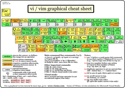

# Graphical vi-vim Cheat Sheet and Tutorial

Learning vi or vim is not easy. But it doesn't have to be that difficult, either. It is, in any case, faster, more powerful, and more productive than editing with any other editor, so you would do very well in investing the time and effort to learn it.

Being a vi lover myself, I came up with the idea of providing a graphical cheat sheet for those learning vi or vim, and I also found out it was a very good way to structure a tutorial. Here are the results for your learning enjoyment (or your colleagues').

By the way, I recently published the definitive article explaining why vi/vim editing is so much better than regular editing. It should prove useful if you want to read it yourself, or if you want to point your skeptical friends to a description of why it makes sense, apart from being an entertaining read: [Why, oh why, do those #?@! nutheads use vi?](http://www.viemu.com/a-why-vi-vim.html).

### Graphical cheat sheet

This is a single page describing the full vi/vim input model, the function of all keys, and all major features. You can see it as a compressed vi/vim manual. Click on the image below to access the full-size bitmap image, or download the vector-based, scalable [SVG version](http://www.viemu.com/vi-vim-cheat-sheet-svg.zip) (zip-compressed - and be sure to view & print the SVG with the open source application [Inkscape](http://www.inkscape.org/) or the Adobe plug-in for Internet Explorer, Firefox breaks the layout for some reason, apart from rendering it with no anti-alias!).

### Graphical cheat sheet based tutorial

The tutorial above is structured in 7 lessons that cover the major commands in vi/vim. They are structured so that you will learn the simplest and most useful first, and the more advanced ones afterwards. Actually, using just the commands shown in lesson 1, you can already start editing in vi/vim in a similar way to how you would on a regular editor. Lesson 2 introduces the very powerful, and vi/vim-exclusive *operators*, and the rest of the lessons advance from there. Each thumbnail links to a high-resolution bitmap version. You can also download the full tutorial in a [single zip file with all the bitmaps](http://www.viemu.com/vi-vim-tutorial-gif.zip) or a [single zip file with all the SVGs](http://www.viemu.com/vi-vim-tutorial-svg.zip) (see the note above about incorrect rendering on Firefox).

[📎 vi-vim-tutorial-gif.zip](viemu-com--graphical-vi-vim-cheat-sheet-and-tutorial/40f03ebe02da0ef4144cf4a9c12fb59a.zip)

### Notes

[vim](http://www.vim.org/) is an incredible editor by Bram Moolenaar, based on the [original vi](http://ex-vi.sourceforge.net/) by Bill Joy, adding a ton of improvements over it. Nowadays, you should choose vim over vi every time you can.

The cheat sheet and tutorial cover most important functions of vi's input model, leaving out the more advanced regular expressions/ex command line material. This should be a very good beginning to becoming a vi/vim wizard.

With the single exception of the external filter feature ("!"), all functions shown are supported by ViEmu, my commercial add-in that provides advanced vi-vim emulation in Visual Studio.

### Relevant links

This cheat sheet has proven to be pretty popular. Here are some relevant links:

And of course, the article detailing why vi/vim editing is 'the killerest':

- [Why, oh why, do those #?@! nutheads use vi?](http://www.viemu.com/a-why-vi-vim.html).
