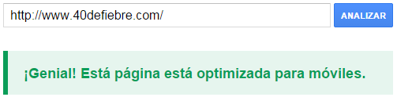
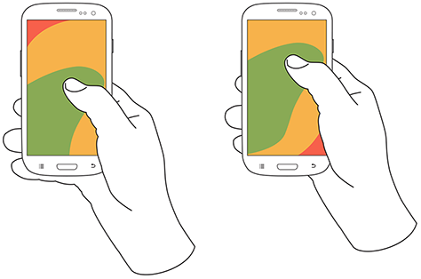

¿Está tu web adaptada a dispositivos móviles? Descubre cómo mejorar la usabilidad de tu web móvil aunque ya esté optimizada y mejorar así la experiencia de tus usuarios.

El 21 de abril ya está aquí. Algunos lo han llamado el *mobilegeddon* por el impacto que puede llegar a tener en su posicionamiento y tráfico. Si has estado mínimamente conectado a este blog (y a Internet en general), habrás leído que es necesario [tener tu web correctamente adaptada a dispositivos móviles](http://www.jordihernandez.es/web-mobile/) antes de esa fecha.

En caso de que hayas estado los últimos dos meses viviendo en una isla desierta, tenemos una buena noticia que darte: Google tardará aún unos días (o incluso, semanas) en desplegar el algoritmo, por lo que quizá aún tengas tiempo de [rediseñar tu web](http://www.40defiebre.com/tendencias-diseno-web-2015/).

## Tu nota en el examen del 21 de abril será un 1 o un 0

Para los más habituados a este tipo de cambios, sabed que Google puso a disposición de todos los usuarios un [Mobile-Friendly Test](https://www.google.com/webmasters/tools/mobile-friendly/) con el que podremos saber si pegaremos ojo o no a partir del martes 21. En 40deFiebre ya hemos hecho los deberes, ¿y vosotros?

Como veréis, el sistema es bastante simple y nos arroja una respuesta booleana (sí o no). Esto es porque, al menos de momento, el famoso buscador no otorgará rankings numéricos a nuestras páginas en función de si están mejor o peor optimizadas, sino simplemente validará (o no) el contenido y la facilidad para ser consumido en móviles y tablets. En este punto, vale la pena aclarar un par de interrogantes habituales:

- Esta nota no afectará en absoluto a la autoridad o relevancia de la página en su versión de escritorio, tan solo a la posición en el resultado de las búsquedas orgánicas móviles. Seguramente no haga falta, pero recordad [la importancia que lo *mobile* tendrá este 2015](http://www.40defiebre.com/tendencias-mobile-2015/).
- El algoritmo trabajará a nivel de página y no a nivel de dominio, por lo que deberíamos preocuparnos únicamente de aquellas páginas que no se visualizan adecuadamente.

## 5 maneras de mejorar la usabilidad móvil de nuestra página

Precisamente porque Google no se detiene jamás, hemos decidido adelantarnos a él e ir un paso más allá, definiendo 5 formas de **mejorar la usabilidad móvil** de nuestra página web aunque ya esté optimizada. De este modo, el día que al señor Larry Page le dé por cambiar de nuevo las reglas del juego, volveremos a estar preparados. ¿Comenzamos?

### Contenido más ancho que la pantalla = Scroll horizontal

A veces ocurre. Si no prestamos atención a la forma que tienen los elementos de escalarse en nuestra versión responsive, nos podemos encontrar con la **necesidad hacer scroll horizontal** para ver la totalidad de una imagen; aunque donde más se suele dar es cuando insertamos vídeos.

Más allá de la **terrible experiencia de usuario** que ofreceremos a nuestros lectores, lo que debería preocuparnos es el *mensaje* que estamos lanzando a los buscadores. Comprobad siempre que los elementos audiovisuales se comportan adecuadamente.

### El scroll vertical con el pulgar que cambia de sección

Algunas páginas están pensadas para que nos podamos mover entre secciones utilizando el scroll horizontal (el clásico movimiento de pasar página).

El problema es que no se suele tener en cuenta a aquellas personas que utilizan su dispositivo con una mano. En este caso, el scroll vertical con el dedo pulgar no sigue una vertical “perfecta”, por lo que se puede interpretar como un **movimiento diagonal-horizontal** que nos cambie de página, con la consecuente frustración para nuestro visitante.

### Coloca siempre lo más importante en el centro

Aceptémoslo. Ni dejándonos las uñas muy largas llegaríamos con una sola mano a las esquinas de los nuevos smartphones de 5,5 pulgadas.

Una vez más, no tenemos que pensar como el usuario, sino que **debemos SER el usuario**. Coloca los elementos importantes para él, por ejemplo un botón de suscripción, de compra o de más información, lo más cerca posible del centro de la pantalla para **facilitar el clic con una sola mano**.

### El icono de la hamburguesa, con queso y explicación por favor

Lo veréis en prácticamente el 90% de las páginas actuales, sobre todo en aquellas generadas con *Bootstrap* o *Foundation*. El famoso icono en el que muchos vemos una hamburguesa (eso sí, sin extras: solo el pan y la carne), ha generado tantas líneas de debate en Internet que vale la pena ser mencionado.

En base a numerosos tests (como, por ejemplo, [el Mobile Menu AB Tested: Hamburger Not the Best Choice?](http://exisweb.net/mobile-menu-abtest)), la mayor recomendación en este aspecto sería la de seguir los siguientes puntos:

- Recuadra el icono; los bordes lo hacen parecer más lo que es: un botón.
- Si puedes, coloca la palabra menú al lado o debajo.
- Limita los elementos que aparecerán en este menú lo máximo posible, haciendo que la información relevante sea siempre accesible desde la pantalla principal.

Una buena solución es la de utilizar una *tab bar*, pero cuidado con los dispositivos de dimensiones pequeñas.

### La distancia entre elementos con clic, vital para una mejor UX

No hay nada más frustrante que querer hacer clic en un botón y sentir que tu dedo se ha convertido en un enorme bratwurst que es capaz de pulsar siete elementos a la vez excepto el deseado.

Por si aún tenías alguna duda… ¡Sí! Google tiene en cuenta el gap de error existente al entrar en una sección **midiendo la distancia entre botones y calculando la tasa de rebote** que provocan las pulsaciones erróneas.

La solución: Deja un espacio suficiente entre botones y enlaces para que el usuario sea más feliz.

#### Y no te olvides de…

A parte de lo comentado, vale la pena recordar algunas de las **optimizaciones a nivel de usabilidad y experiencia de usuario** que son ya clásicas, como por ejemplo:

- Utilizar un tamaño de letra adecuado (a ser posible, de 16px o superior).
- Usar un contraste evidente en el texto y elementos de llamada a la acciónUn Call to Action o CTA es un botón o enlace situado en nuestro site que busca atraer clientes potenciales y convertirles en clientes finales, normalmente a través de un formulario en una página de destino o landing page.... [Saber más](http://www.40defiebre.com/que-es/call-to-action/).
- Eliminación de los *hovers* (el efecto de pasar el ratón por encima de un elemento) para las versiones *mobile*.
- Las políticas de cookies que ocupan un 50% de la pantalla y que contienen un botón de cerrar pequeño e inaccesible.
- Formularios que no se adaptan. Por ejemplo que no son numéricos cuando el campo lo requiere o que se muestran en horizontal.
- No utilizar *display:none* para la ocultación de elementos en versiones móviles.
- Cuidado con abusar de las páginas con pestañas, el contenido de las mismas puede no ser indexado.

Y vosotros, **¿ya estáis preparados para el *mobilegeddon*?**

- [#Experiencia de Usuario](http://www.40defiebre.com/experiencia-de-usuario/)
