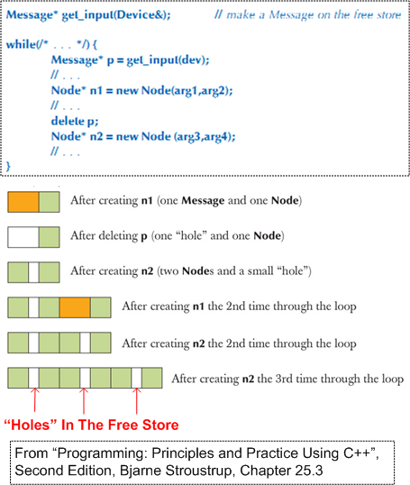
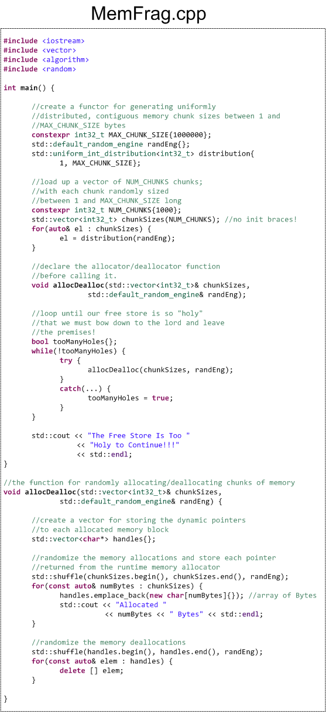

# Holier Than Thou

Since C++ (by deliberate design) does not include a native garbage collector or memory compactor, programs that perform dynamic memory allocation and de-allocation (via explicit or implicit use of the “**new**” and “**delete**” operators) cause small “*holes*” to accumulate in the free store over time. I guess you can say that C++ is “*holier than thou*“.

Mind you, drilling holes in the free store is not the same as leaking memory. A memory leak is a programming bug that needs to be squashed. A fragmented free store is a “*feature*“. His holiness can become an issue only for loooong running C++ programs and/or programs that run on hardware with small RAM footprints. For those types of niche systems, the best, and perhaps only, practical options available for preventing **any** holes from accumulating in your briefs are to eliminate all **delete**s from the code:

- Perform all of your dynamic memory allocations at once, during program initialization (global data – D’oh!), and only utilize the CPU stack during runtime for object creation/destruction.
- If your application *inherently* requires post-initialization dynamic memory usage, then use pre-allocated, fixed size, unfragmentable, pools and stacks to acquire/release data buffers during runtime.

If your system maps into the “*holes can freakin’ kill someone*” category and you don’t bake those precautions into your software design, then the C++ runtime may toss a big, bad-ass, [**std::bad\_alloc** exception](http://www.cplusplus.com/reference/new/operator%20new/) into your punch bowl and crash your party if it can’t find a contiguous memory block big enough for your impending **new** request. For large software systems, refactoring the design to mitigate the risk of a fragmented free store *after* it’s been coded/tested falls squarely into the expensive and ominous “*stuff that’s hard to change*” camp. And by saying “*stuff that’s hard to change*“, I mean that it may be expensive, time consuming, and technically risky to reweave your basket (case). In an attempt to verify that the accumulation of free store holes will indeed crash a program, I wrote this hole-drilling simulator:

Each time through the while loop, the code randomly allocates and deallocates 1000 chunks of memory. Each chunk is comprised of a random number of bytes between 1 and 1MB. Thus, the absolute maximum amount of memory that can be allocated/deallocated during each pass through the loop is 1 GB – half of the 2 GB RAM configured on the linux virtual box I am *currently* running the code on. The hole-drilling simulator has been running for days  – at least 5 straight. I’m patiently waiting for it to exit – and hopefully when it does so, it does so gracefully. Do you know how I can change the code to speed up the time to exit? **Note1: This post doesn’t hold a candle to Bjarne Stroustrup’s thorough explanation of the “holiness” topic in chapter 25 of “[*Programming: Principles and Practice Using C++, Second Edition*](http://bjarne%20stroustrup/)“. If you’re a C++ programmer (beginner, intermediate, or advanced) and you haven’t read that book cover-to-cover, then… you should.** **Note2: For those of you who would like to run/improve the hole-drilling simulator, here is the non-.png source code listing:**

|  |  |
| --- | --- |
|  | `#include`  `#include`  `#include`  `#include`  `#include`  `int` `main() {`  `//create a functor for generating uniformly`  `//distributed, contiguous memory chunk sizes between 1 and`  `//MAX_CHUNK_SIZE bytes`  `constexpr` `int32_t MAX_CHUNK_SIZE{1000000};`  `std::default_random_engine randEng{};`  `std::uniform_int_distribution distribution{`  `1, MAX_CHUNK_SIZE};`  `//load up a vector of NUM_CHUNKS chunks;`  `//with each chunk randomly sized`  `//between 1 and MAX_CHUNK_SIZE long`  `constexpr` `int32_t NUM_CHUNKS{1000};`  `std::vector chunkSizes(NUM_CHUNKS);` `//no init braces!`  `for``(``auto``& el : chunkSizes) {`  `el = distribution(randEng);`  `}`  `//declare the allocator/deallocator function`  `//before calling it.`  `void` `allocDealloc(std::vector& chunkSizes,`  `std::default_random_engine& randEng);`  `//loop until our free store is so "holy"`  `//that we must bow down to the lord and leave`  `//the premises!`  `bool` `tooManyHoles{};`  `while``(!tooManyHoles) {`  `try` `{`  `allocDealloc(chunkSizes, randEng);`  `}`  `catch``(``const` `std::bad_alloc&) {`  `tooManyHoles =` `true``;`  `}`  `}`  `std::cout <<` `"The Free Store Is Too "`  `<<` `"Holy to Continue!!!"`  `<< std::endl;`  `}`  `//the function for randomly allocating/deallocating chunks of memory`  `void` `allocDealloc(std::vector& chunkSizes,`  `std::default_random_engine& randEng) {`  `//create a vector for storing the dynamic pointers`  `//to each allocated memory block`  `std::vector<``char``*> handles{};`  `//randomize the memory allocations and store each pointer`  `//returned from the runtime memory allocator`  `std::shuffle(chunkSizes.begin(), chunkSizes.end(), randEng);`  `for``(``const` `auto``& numBytes : chunkSizes) {`  `handles.emplace_back(``new` `char``[numBytes]{});` `//array of Bytes`  `std::cout <<` `"Allocated "`  `<< numBytes <<` `" Bytes"` `<< std::endl;`  `}`  `//randomize the memory deallocations`  `std::shuffle(handles.begin(), handles.end(), randEng);`  `for``(``const` `auto``& elem : handles) {`  `delete` `[] elem;`  `}`  `}` |

If you do copy/paste/change the code, please let me know what you did and what you discovered in the process. **Note3: I have an intense love/hate relationship with the C++ posts that I write. I love them because they attract the most traffic into this gawd-forsaken site and I always learn something new about the language when I compose them. I hate my C++ posts because they take for-freakin’-ever to write. The number of create/reflect/correct iterations I execute for a C++ post prior to queuing it up for publication always dwarfs the number of mental iterations I perform for a non-C++ post.**
