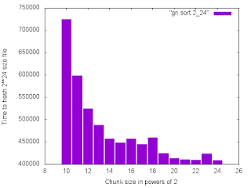

# Micro Benchmarking in Elixir using Benchfella

When I finished the last post, I had complete intentions of writing a post about how to use the Ports module in Elixir to interaction with the system shell to do I/O redirection. However, I now understand why people complain about Erlang documentation. Ports in Elixir aren't documented other than by a reference to the underlying Erlang libraries and the documentation in Erlang for ports is very incomplete. ( For example, what are the default drivers available in erlang?)  
  
Ports are gateways between the Erlang VM and external codes and processes. The Erlang VM is sensitive to code "hanging" in any fashion and Ports need drivers that are aware of how to interact with the Erlang VM safely. However I was unable to find any clear documentation of just what drivers are available and the examples I found were inconsistent.  
  
I did however find the [Porcelain](https://github.com/alco/porcelain) Elixir module that is both well documented and very straightforward to use. Having taken this long to get back to this, I'd just as soon go on to the actual benchmarks.  
  
[Benchfella](https://github.com/alco/benchfella)is a micro benchmarking framework that works much like ExUnit does for testing and  
you can use the same Dave Thomas hack for creating many tests that iterate over a list of values.  
  
defmodule Hash do  
  use Benchfella  
  @lengths [1024,2048,4096,8192,16384,32768,65536,131072,262144,524288,1048576,2097152,4194304,8388608,16777216]  
  
for chunk <- @lengths do   
   @chunk chunk   
    bench "Hash 2\*\*24 file by #{Integer.to\_string(@chunk)}" do  
      hash\_test("./bench/data\_2\_24",@chunk)   
  
  
  for chunk <- @lengths do   
    @chunk chunk   
    bench "Hash 2\*\*26 file by #{Integer.to\_string(@chunk)}" do  
      hash\_test("./bench/data\_2\_26",@chunk)  
  
  
  for chunk <- @lengths do   
    @chunk chunk   
    bench "Hash 2\*\*28 file by #{Integer.to\_string(@chunk)}" do  
      hash\_test("./bench/data\_2\_28",@chunk)  
  
  
  def hash\_test(file,chunk) do  
   File.stream!(file,[],chunk)   
   |>   
    Enum.reduce(:crypto.hash\_init(:sha256),fn(line, acc) -> :crypto.hash\_update(acc,line) end )   
   |>   
    :crypto.hash\_final   
   |>   
    Base.encode16   
  
Benchfella runs each test for as many times as possible in a given interval ( the default is one second ) and returns the average time per test over that interval. Data from each run is stored on the filesystem so you can do comparisons between runs.  The plot below shows the results from using a chunk size in powers of 2 from 2\*\*10 to 2\*\*24 to hash a file of size 2\*\*24.

The results are similar for files of size 2\*\*26 and 2\*\*28. As you can see there is a significant advantage to using a large chunk size. ( With an odd bump at 2\*\*23 ) This test  
was done on a MacBook Pro with 16gig of memory and an SSD disk drive.  
  
This shows that using large binaries in Elixir ( and Erlang ) is generally the fastest way to deal with large data sets. Of course you need to make the tradeoff between total available memory and the number of binaries you want to process at a time.  
  
The other benchmark I tested was to compare using the "chunk" method of hashing the file with a chunk size larger than the file and simply reading the entire file into a string and  
computing it's hash. The simple read method was consistently twice as fast as the single chunk method.    
  
So for my resulting application I choose to pick a chunk size that allows the code to process multiple files at a time and chooses a method for computing the hash based on the  
size of the file.
