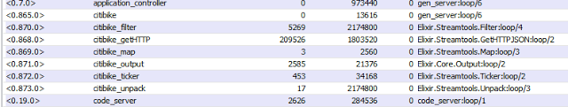

# Elixir Flow-Based Programming

## Wednesday, June 3, 2015

The current design and implementation of ElixirFBP does not take advantage of Elixir's ability to spawn many processes cheaply and quickly. There will undoubtedly be times where it would be desirable to have multiple processes supporting a single component. Right now, each component is supported by one Elixir process.  
  
To give ElixirFBP this capability, I used the metadata part of the flow-based network protocol to specify the number of Elixir processes that you want running in support of a component. In code for creating a graph, this looks like:

```
    Graph.add_node(fbp_graph_reg_name, "copier", "Jsfbp.Copier",
                   %{:number_of_processes => 4})
```

In this example, when the FBP graph is started, four separate processes will be spawned for this component. Any component that sends an Information Packet (IP) to this component will automatically have this IP sent to one of the spawned processes, in a round-robin manner. Note that, with this method, there is no guarantee that the order of the IPs will be preserved as they move through the remainder of the flow. I will discuss techniques for ensuring order in subsequent posts.  
  
We should expect to see some improvement in the execution speed of a graph that uses multiple processes for a component. Recall that the Elixir/Erlang virtual machine will take advantage of multiple cores in a processor automatically. Here's an experiment to see this in action: I've created an example program - Examples.Fbptestv1Multi - that uses a component to create IPs and sends them to a "faker" component which sends them on to a discarder component that simply ignores them. The faker component will sleep for a certain number of milliseconds to simulate processing. The example is written so that the faker component can be set to run in a specified number of processes (by default one).  
  
The example program has a timing function that takes two arguments: the number of IPs to create and send and the number of processes to assign to the faker component. I ran the following tests on my four-core, AMD processor running at 3.60 Ghz processor (the time is in seconds and the faker process was set to sleep for 20 milliseconds):

| No. of IPs | No. of Processes | Time |
| --- | --- | --- |
| 1,000 | 1 | 31.282 |
| 1,000 | 2 | 15.648 |
| 1,000 | 4 | 7.830 |
| 1,000 | 8 | 3.924 |
| 1,000 | 16 | 1.972 |
| 1,000 | 32 | 1.001 |

You can see that as the number of processes assigned to the faker component increases the overall speed of the graph execution goes down. All the code to run this example is in my github [repository](https://github.com/pcmarks/ElixirFBP/).  To run it, perform the following steps after downloading the ElixirFBP code:

1. cd to the ElixirFBP directory.
2. You may have to run mix deps.get in order to download and install certain libraries
3. Run iex -S mix
4. At the iex prompt enter: Examples.Fbptestv1Multi.time\_it - this will, by default, run 1,000 IPs utilizing one processor for the faker component. The time will be displayed in microseconds - not milliseconds.
5. Enter Examples.Fbptestv1Multi.time\_it(1000, 4) to use 4 faker processes.

All we needed to do to utilize the inherent concurrency present in Elixir/Erlang systems was to specify the number of processes that we wanted a component to be run in. The changes that I had to make to ElixirFBP were to simply create a tuple of  the registered names of the spawned processes and maintain an index that points to the next process to use - to send an IP to. The only other change was to how the components are written. Now, all sends return an updated value for the target out port. So,

```
def loop(in_port, out) do
    receive do
      {:IN, value} ->
        # Do some processing
        out = Component.send_ip(out, value)
        loop(value, out)
    end
  end
```

became

```
def loop(in_port, out) do
    receive do
      {:IN, value} ->
        # Do some processing 
        out = Component.send_ip(out, value)
        loop(value, out)
    end
  end
```

## Wednesday, May 27, 2015

In the Elixir implementation of FBP, the components and the graph that represents the data flow are each running as a separate process - Erlang process; that's the Elixir/Erlang way of doing things. All communication among these processes is via the sending of messages - Information Packets (IPs) in the flow-based terminology. If you are curious, you can see these processes using the Erlang observer tool. Try the following with the current version - as of today - of ElixirFBP:

1. Using a command window, cd to the ElixirFBP directory
2. Type iex -S mix
3. At the iex prompt, enter :observer.start This will open a window onto the Erlang virtual machine.
4. Click on the Processes tab. You'll see a list of all the processes currently executing.
5. Back at the iex prompt, enter Examples.Citibike.start to start the ElixirFBP version of the Streamtools Citibike example.
6. Go back to the observer window and click on the "Name or Initial Func." column. This will sort the processes by their name. You should see something like the following:

[](http://2.bp.blogspot.com/-w0cyNJw3w-g/VWYblpjoH3I/AAAAAAAACmE/hYAhanL7PeE/s1600/processes.png)

All the processes associated with the example start with "citibike".7. If you go back to the iex prompt again and enter ElixirFBP.Network.stop  and then enter ElixirFBP.Network.stop\_network you will see the "citibike" processes disappear as they forced to stop.

## Monday, May 25, 2015

The point of my work is not to re-invent Flow-Based Programming nor to re-invent visual programming (for a really good list of visual programming languages, visit this [website](http://blog.interfacevision.com/design/design-visual-progarmming-languages-snapshots/)). Rather, I want to explore how one can take advantage of the inherent concurrency of Elixir/Erlang processes. Impedance mismatch, when used in software development, is how hard it is to make something behave like something else. There seems to be less of an impedance mismatch with the idea of implementing flow-based or streaming systems in Elixir.  
  
ElixirFBP is showing some life! Last week I was able to create a small graph consisting of an adder and an output component. This is what the code looks like:

```
defmodule Examples.Add1 do
  alias ElixirFBP.Graph
  alias ElixirFBP.Network

  @graph_1      "graph_n1"
  @node_1       "node_1"
  @node_2       "node_2"

  def start do
    {:ok, fbp_graph_reg_name} = Graph.start_link(@graph_1)
    # Add the components to the graph
    Graph.add_node(fbp_graph_reg_name, @node_1, "Math.Add")
    Graph.add_node(fbp_graph_reg_name, @node_2, "Core.Output")
    # Connect the components
    Graph.add_edge(fbp_graph_reg_name, @node_1, :sum, @node_2, :in_port)
    # Set the initial values
    Graph.add_initial(fbp_graph_reg_name, 42, @node_1, :addend)
    Graph.add_initial(fbp_graph_reg_name, 24, @node_1, :augend)
    # Start the flow
    {:ok, _fbp_network_pid} =
        Network.start_link(fbp_graph_reg_name)
    Network.start()
  end
end
```

The add component is initialized with the two values: 42 and 24. The output of this component is fed into a component that simply prints its message. Granted, this is not the way one would do a little bit of arithmetic but it does test many of the ElixirFBP design elements. For a more interesting demo, please read on.  
  
I recently gave a presentation of my ideas at a Meetup of the Portland, ME Elixir group. I got some great feedback and pointers to three systems that were worth looking at:

Streamtools is being developed by the R&D group at the New York Times. They have designed a flow-based system that features a graphical front-end - similar to NoFlo's - and a backend that executes components written in the Go language. They have some interesting demos - more than the addition of two numbers! [One](http://blog.nytlabs.com/2014/03/12/streamtools-a-graphical-tool-for-working-with-streams-of-data/), a poller, periodically checks the status of a [bike share](http://www.citibikenyc.com/) program in New York City. I decided to try and implement this demo using ElixirFBP. Here's what it looks like:

```
defmodule Examples.Citibike do
  alias ElixirFBP.Graph
  alias ElixirFBP.Network

  @graph_1      "citibike"
  @node_1       "ticker"
  @node_2       "map"
  @node_3       "getHTTP"
  @node_4       "unpack"
  @node_5       "filter"
  @node_6       "output"

  def start do
    {:ok, fbp_graph_reg_name} = Graph.start_link(@graph_1)
    # Add the components
    Graph.add_node(fbp_graph_reg_name, @node_1, "Streamtools.Ticker")
    Graph.add_node(fbp_graph_reg_name, @node_2, "Streamtools.Map")
    Graph.add_node(fbp_graph_reg_name, @node_3, "Streamtools.GetHTTPJSON")
    Graph.add_node(fbp_graph_reg_name, @node_4, "Streamtools.Unpack")
    Graph.add_node(fbp_graph_reg_name, @node_5, "Streamtools.Filter")
    Graph.add_node(fbp_graph_reg_name, @node_6, "Core.Output")
    # Connect the components
    Graph.add_edge(fbp_graph_reg_name, @node_1, :out, @node_2, :in_port)
    Graph.add_edge(fbp_graph_reg_name, @node_2, :out, @node_3, :path)
    Graph.add_edge(fbp_graph_reg_name, @node_3, :out, @node_4, :in_port)
    Graph.add_edge(fbp_graph_reg_name, @node_4, :out, @node_5, :in_port)
    Graph.add_edge(fbp_graph_reg_name, @node_5, :out, @node_6, :in_port)
    # Set initial values
    Graph.add_initial(fbp_graph_reg_name, 10_000, @node_1, :interval)
    Graph.add_initial(fbp_graph_reg_name,
                      "http://www.citibikenyc.com/stations/json",
                      @node_2, :map)
    Graph.add_initial(fbp_graph_reg_name, "stationBeanList", @node_4, :part)
    Graph.add_initial(fbp_graph_reg_name, "stationName", @node_5, :filter)
    Graph.add_initial(fbp_graph_reg_name, "W 41 St & 8 Ave", @node_5, :filter_value)
    # Start the flow
    {:ok, _fbp_network_pid} =
        Network.start_link(fbp_graph_reg_name)
    Network.start()
  end
end
```

To run this you need to have Erlang and Elixir installed - see [here](http://elixir-lang.org/install.html). Then:

1. Download the ElixirFBP code from [github](https://github.com/pcmarks/ElixirFBP).
2. Open a command window at the ElixirFBP directory level.
3. You may have to perform a mix deps.get first in order to load some libraries that I use.
4. Run iex -S mix
5. Type the following at the iex prompt: Examples.Citibike.start
6. Wait about 10 seconds. You should start seeing messages appearing roughly every 10 seconds; the messages will likely be the same, unless someone has rented a bike in the last 10 seconds!
7. Stop the execution by pressing Ctrl+c, twice.
8. You can run the Add example by entering  Examples.Add1.start

The code is still a little rough. Note that the Streamtools flow components are JSON-oriented. In my implementation, once a JSON response is received, it is converted to Elixir data - maps and lists. They also feed the final result into a mask component that then connects via web sockets to a browser. I did not implement this step in the flow.  
  
Soon I'll start connecting NoFlo's graphical front end to ElixirFBP. Then you'll be able to create and run these demos using their GUI.

## Monday, May 18, 2015

The addition of the add\_initial graph function triggered several changes in the type of information being stored in the internal - Erlang - graph. Here are the external and internal implementations of add\_initial (recall that the graph module is a GenServer; typically functions are written in pairs):

```
  def add_initial(graph_id, src, tgt, metadata \\ %{}) do
    GenServer.call(graph_id, {:add_initial, src, tgt, metadata})
  end
```

```
  def handle_call({:add_initial, src, tgt, metadata}, _req, fbp_graph) do
    src_data = src.data
    node_id = tgt.node_id
    port = tgt.port
    {node_id, label} = :digraph.vertex(fbp_graph.graph, node_id)
    inports = label.inports
    new_inports = Keyword.put(inports, port, src_data)
    new_label = %{label | :inports => new_inports}
    :digraph.add_vertex(fbp_graph.graph, node_id, new_label)
    {:reply, src_data, fbp_graph}
  end
```

Notice that the initial data is associated with a target port. When the graph is eventually executed, these values will be sent, as a message, to the target process. The target node will be an Elixir process at this point and will be listening for messages coming in on its input ports.  
If the nodes are Elixir processes, what will they look like? We can borrow some ideas from the implementations of FBP components in other programming languages. Below is the CoffeeScript version of the Math.Add component that I retrieved from one of NoFlo's component [libraries](http://noflojs.org/component/noflo-math-Add/):

```
class Add extends noflo.Component
  constructor: ->
    @augend = null
    @addend = null
    @inPorts =
      augend: new noflo.Port
      addend: new noflo.Port
    @outPorts =
      sum: new noflo.Port

    @inPorts.augend.on 'data', (data) =>
      @augend = data
      do @add unless @addend is null
    @inPorts.addend.on 'data', (data) =>
      @addend = data
      do @add unless @augend is null

  add: ->
    @outPorts.sum.send @augend + @addend
    @outPorts.sum.disconnect()
```

Something very similar could be written in Elixir:

```
defmodule Math.Add do

  def inports, do: [{:addend, nil}, {:augend, nil}]
  def outports, do: [{:sum, nil}]

  def loop(augend, addend, sum) do
    receive do
      {:augend, value} when addend != nil ->
        send sum, addend + augend
        loop(nil, nil, sum)
      {:augend, value} -> 
        loop(value, addend, sum)
      {:addend, value} when augend != nil ->
        send sum, addend + augend
        loop(nil, nil, sum)
      {:addend, value} -> 
        loop(augend, value, sum)
    end
  end
end
```

This is neither a complete nor a final version of what an Elixir-based component would look like. Earlier, I mentioned that I would like to employ Elixir's macro facilities and create an FBP DSL.
  
  
There is now enough information being stored in the graph so that I will be able to begin trying out some designs for the execution of the graph. I hope to show some of my early attempts in the next post. In the meantime, try out some of the [code](https://github.com/pcmarks/ElixirFBP), if you like.

## Wednesday, May 13, 2015

As I get deeper into an understanding of how the FBP graph protocol operates, I uncover areas in my code that are deficient; this is, of course, inevitable. For example, the original design for storing FBP graph nodes couldn't deal with adding an initial value to a node input port. To do this, it was necessary to add placeholders in the graph node for these ports. Recall that Erlang's digraph facilities store nodes (vertices) with an identifier value and a label value. The label value can be used to store extra information about the node - such as FBP ports. Whereas, before the following code was used to store an FBP node in the graph:

```
:digraph.add_vertex(fbp_graph.graph, node_id, [component, metadata])
```

it now looks like this:

```
  label = %{component: component, inports: inports, outports: outports, metadata: metadata}
  new_node = :digraph.add_vertex(fbp_graph.graph, node_id, label)
```

Where do the value for inports and outports come from? They come from the component itself. Right now, the component is identified by its module name - a string, for example, "Math.Add". To support the retreival of a component's ports, a very early design for an Elixir component looks like the following:

```
defmodule Math.Add do
  @moduledoc """
  This module describes an FBP Component: Math.Add
  It knows its input and outport ports and how to execute a function.
  Ports are described with tuples: {name, initial value}
  """
  def inports, do: [{:addend, nil}, {:augend, nil}]
  def outports, do: [{:sum, nil}]
  def execute do
  end
end
```

With this in place, the port definitions can be retrieved at run-time by executing the following statements in the add\_node function:

```
    inports = elem(Code.eval_string(component <> ".inports"), 0)
    outports = elem(Code.eval_string(component <> ".outports"), 0)
```

I have a feeling that this design for an Elixir component will not last too long... But, for the time being, it works. The complete implementation of the new add\_node callback is:

```
def handle_call({:add_node, graph_id, node_id, component, metadata}, _req, fbp_graph) do
    inports = elem(Code.eval_string(component <> ".inports"), 0)
    outports = elem(Code.eval_string(component <> ".outports"), 0)
    label = %{component: component, 
              inports: inports, outports: outports, 
              metadata: metadata}
    new_node = :digraph.add_vertex(fbp_graph.graph, node_id, label)
    {:reply, new_node, fbp_graph}
  end
```

Similar changes needed to be made to the add\_edge callback:

```
  def handle_call({:add_edge, graph_id, src, tgt, metadata}, _req, fbp_graph) do
    label = %{src_port: src.port, tgt_port: tgt.port, metadata: metadata}
    new_edge = :digraph.add_edge(
                    fbp_graph.graph,
                    src.node_id,
                    tgt.node_id,
                    label)
    {:reply, new_edge, fbp_graph}
  end
```

I'll show add\_initial, the function that triggered all these changes, in the next post. All the rest of the code and its tests can be found at [github](https://github.com/pcmarks/ElixirFBP).

## Monday, May 11, 2015

In this post, I'll continue the development of the ElixirFBP Graph process. I'll show functions to add and remove a node; and add an edge. Again, we are guided by the [NoFlo Network Protocol](http://noflojs.org/documentation/protocol/).  You can see the code and tests that I've developed so far in [GitHub](https://github.com/pcmarks/ElixirFBP/). I expect that these functions will change as I get a better understanding of how FBP will work in an Elixir environment.  
Adding a node is straight-forward; the external API and the callback implementations are:

```
  def add_node(graph_id, node_id, component, metadata \\ %{}) do
    GenServer.call(__MODULE__, {:add_node, graph_id, node_id, component, metadata})
  end
```

```
  def handle_call({:add_node, graph_id, node_id, component, metadata}, _requester, fbp_graph) do
    new_node = :digraph.add_vertex(fbp_graph.graph, node_id, [component, metadata])
    {:reply, new_node, fbp_graph}
  end
```

Nothing overly complex going on here. Again, note that even though we are changing the graph, we do not need to pass back a new state. This is because, the Erlang ETS table that is behind the internal graph representation is, in fact, mutable.  
Here is the remove\_node function:

```
  def remove_node(graph_id, node_id) do
    GenServer.call(__MODULE__, {:remove_node, graph_id, node_id})
  end
```

```
  def handle_call({:remove_node, graph_id, node_id}, _requester, fbp_graph) do
    result = :digraph.del_vertex(fbp_graph.graph, node_id)
    {:reply, result, fbp_graph}
  end
```

One design aspect that remains unresolved is whether adding a node to a graph should result in the spawning of a process.  There is a subset of the FBP Network protocols that deals with what is called a network. One starts and stops networks - executes the graph. So, it is possible that this is when the process should be spawned.  It's clear that we will model FBP processes - instances of components - with Elixir processes, but it is unclear, at least to me, how and when this will happen. In the next post, I hope to describe and show a solution to this problem.

## Thursday, May 7, 2015

Today I code! Not a great deal - but, at least it'll be a start  
I decided to begin the implementation of an Elixir FBP by developing the code which will be responsible for maintaining the internal representation of the FBP program. It's a graph whose nodes represent the FBP components and whose edges are the connections between the components over which Information Packets (IP's) pass. I'll use the Erlang package [digraph](http://www.erlang.org/doc/man/digraph.html) for this representation.   
An FBP graph is a dynamic entity: nodes and edges can be added, changed and removed. I will model its functional interface according to NoFlo's [FBP Network Protocol](http://noflojs.org/documentation/protocol/), in particular, the graph sub-protocol.  Further on in our implementation, this graph will be able to be accessed either programmatically, through the Network Protocol, or via a DSL.   
The graph also needs to persist.  It is a common practice in Elixir/Erlang to model a persistent entity as a separate process that maintains state and provides functionality by responding to messages. Elixir provides a [GenServer](http://elixir-lang.org/docs/v1.0/elixir/GenServer.html) behavior, which has its base in [Erlang's OTP](http://www.erlang.org/doc/) - a platform to support long-running processes along with many other facilities.   
According to the NoFlo's Network Protocol, a graph also has metadata associated with it, such as name, id, description, etc. Thus our first bit of code will be the definition of an Elixir structure to hold this metadata as well as the graph (digraph):

```
defmodule ElixirFBP.Graph do
  defstruct [
    id: nil,
    name: "",
    library: nil,
    main: false,
    description: "",
    digraph: nil
  ]
```

  
When a module uses (exhibits) the GenServer behavior, it automatically handles the starting and termination of the process, and message handling - both synchronously and asynchronously. Collectively these functions constitute the "callback" interface. But these functions do very little and are usually overridden.The Elixir FBP Graph module will also present an "external" interface - those functions that will be called by clients. Our first external function will be start\_link. This function is responsible for creating the process state, and getting the process going:

```
  use GenServer
  ########################################################################
  # The External API
  @doc """
  Starts things off with the creation of the state.
  """
  def start_link(id \\ nil, name \\ "", library \\ nil,
                 main \\ false, description \\ "") do
    digraph = :digraph.new()
    fbp_graph = %ElixirFBP.Graph{id: id, name: name, library: library,
          main: main, description: description, digraph: digraph}
    GenServer.start_link(__MODULE__, fbp_graph, name: __MODULE__)
  end
```

Here, I create an empty Erlang digraph and add it to an instance of the Graph structure. This structure is passed to GenServer and becomes the process's state. GenServer will make this state available to all subsequent calls. The process is also registered with the name  ElixirFBP.Graph - the value of \_\_MODULE\_\_. The process will stay alive until there is a failure or its terminate function is called.  
Elixir processes, including this GenServer process, do something in response to being sent a message. All messages are sent asynchronously, although a synchronous message can be effected by sending the process id of the caller along with the message. In GenServer terminology sending an asynchronous message is termed a cast and the sending of a synchronous message is termed a call. To make a GenServer process do somethin, you create "external" functions that call or cast information to it; the process will respond by calling back to handler functions that you provide. For example, to provide a function to clear a graph, you would code the following pair of functions:

```
  def clear do
    GenServer.call(__MODULE__, :clear)
  end

@doc """
  A request to clear the FBP Graph. Clearing is accomplished by
  deleting all the vertices and all the edges.
  """
  def handle_call(:clear, _requester, fbp_graph) do
    g = fbp_graph.graph
    vs = :digraph.vertices(g)
    es = :digraph.edges(g)
    :digraph.del_vertices(g, vs)
    {:reply, nil, fbp_graph}
  end
```

  
Notice, in the clear function, the :clear atom. It is used in the definition of a handle\_call function as a way of distinguishing one GenServer call (or cast) from another. Note that we did not create a new state, a new ElixirFBP.Graph. This is because nothing actually changed in the state. The graph did change - the edges and vertices were deleted - but this element is implemented using Erlang's [ETS](http://www.erlang.org/doc/man/ets.html) - a mutable internal storage facility.  
In the next post, I'll continue the implementation of the ElixirFBP Graph process.
