# 10 Ways To Un-Samsungify Your Galaxy S5

Ads by Google

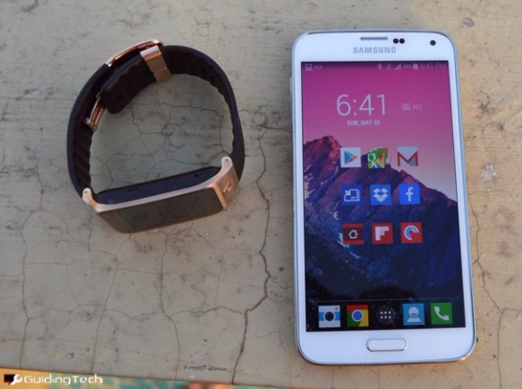

There are a lot of great things the about Samsung Galaxy S5. The screen and the camera come to mind. But the problem with the device is that it gets in its own way. [S5 is biggest example of Samsung being Samsung](http://www.guidingtech.com/30018/samsung-galaxy-s5-review/ "Samsung Galaxy S5 Review: Delicious Pasta With Extra Sauce You Didn’t Order") and trust me that’s not a good thing. Samsung is good at hardware but when it comes to their software, it is one of the worst in the industry.

Thanks to the fast processor and GPU in this edition of Galaxy S series, there’s not much lag to speak of (other than opening the Gallery app). But that’s not going to last. And some things about TouchWiz are so annoying that you just can’t go on with it.

Follow our guide to Un-Samsungify your Galaxy S5 as much as you can [without actually rooting](http://www.guidingtech.com/23571/get-stock-android-look-feel-without-rooting/ "Get that Stock Android Look and Feel – Without Rooting or Flashing Your Device") and installing a custom ROM like [CM 11](http://www.guidingtech.com/24049/top-3-custom-roms-android/ "Top 3 Custom ROMs for Android").

## 1. Replace TouchWiz Launcher

Samsung is TouchWiz and TouchWiz is Samsung. Nowhere does this haunt you more than the homescreen. The launcher has the signature bright wallpaper and square icons with desktop looking folders.

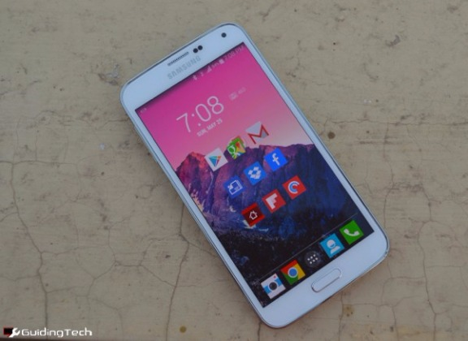

The launcher is your gateway to Android. Switch to something like [Nova Launcher](https://play.google.com/store/apps/details?id=com.teslacoilsw.launcher "Download Nova") or [KK Launcher](https://play.google.com/store/apps/details?id=com.kk.launcher "Download KK Launcher") ( a KitKat style launcher) to get an experience closer to vanilla Android.

Check out [Themer](http://www.guidingtech.com/28742/top-themer-themes-android/ "Top 10 Themes for Themer Beta in Android") to apply beautiful themes with just one tap.

Change the wallpaper to something [minimal using one of these apps](http://www.guidingtech.com/28900/android-flat-minimal-wallpaper/ "Top 5 Android Apps For Finding Flat And Minimal Wallpapers") or use [Muzei to automatically cycle between awesome wallpapers](http://www.guidingtech.com/27429/best-muzei-live-wallpaper-plugins-android/ "10 Best Plugins to Customize Muzei Live Wallpaper For Android") from different sources.

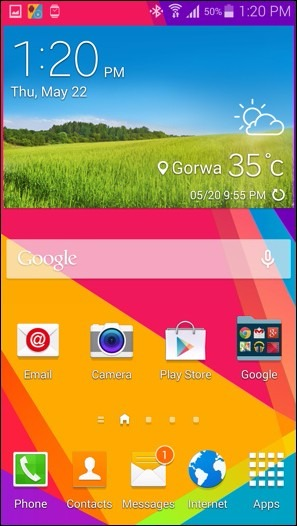

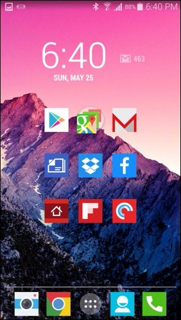

## 2. Change Lockscreen

Samsung’s TouchWiz lockscreen is really cluttered. Plus it plays an annoying “natural” sound effect when you unlock your phone.

You can turn it off from *Lockscreen Settings* but then you get a plain unlock circle. If you’re not going to use the fingerprint scanner (it doesn’t work well most of the time), try changing the lockscreen to something better.

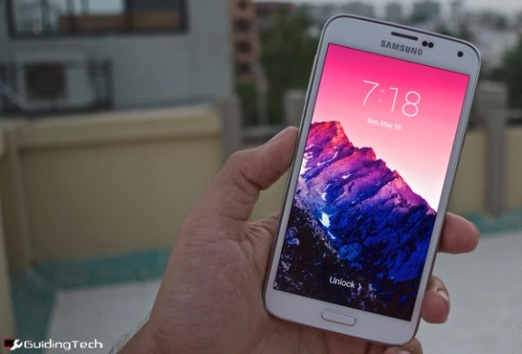

You can look at [GoLocker](https://play.google.com/store/apps/details?id=com.jiubang.goscreenlock "Download GoLocker") or my personal favorite, [SlideLock](https://play.google.com/store/apps/details?id=com.slidelock "Download SlideLock") (pictured above). SlideLock is an iOS 7 style lockscreen app that is minimal and looks beautiful when paired with the right wallpaper. It will also [display notifications on the lockscreen](http://www.guidingtech.com/28466/notifications-android-lockscreen/ "How to Get Customized Notifications On Android Lockscreen") just like iOS 7 and I find it to be really useful.

The app gives you a lot of customization options to make sure that only the things you care about show up on the lockscreen.

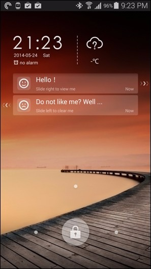

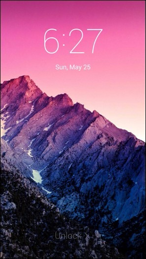

## 3. Turn Off Animations

TouchWiz, just as iOS 7, has added unnecessary animations for the [sake of adding it](http://www.guidingtech.com/27640/best-small-ios-7-jailbreak-tweaks/ "Top Small Jailbreak Tweaks To Fix iOS 7′s Biggest Annoyances"). It doesn’t do any good and actually decreases performance, because you have to sit there waiting for the extra fraction of a second. It might look good but that’s not the point.

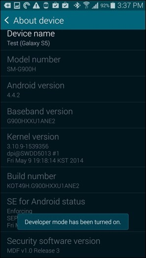

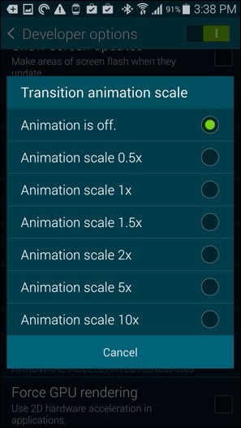

Go to *About Device* in *Settings* and tap the *Build Number* 7 times. This will unlock *Developer Options* in *Settings*. Go in there and tap *Transition Animation Scale* and turn it off.

## 4. Disable S Voice From Home Button

Next station on get off the Samsung train is S Voice. [S Voice](http://www.guidingtech.com/27428/s-voice-guide/ "The Complete Guide to Samsung S Voice and How to Use it Effectively") is the voice assistant you never asked for, now it’s time to get rid of it.

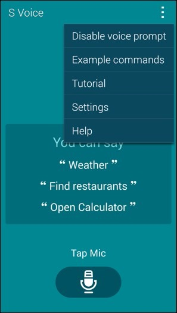

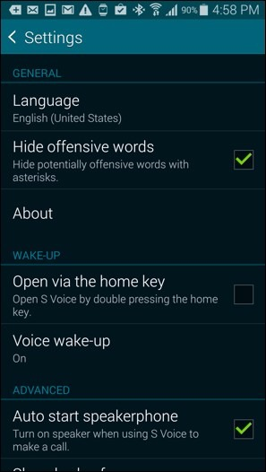

S Voice is invoked by double pressing the home key and Google Now is a long press away. Launch the S Voice app. You’ll have to activate it to disable the home button gesture – funny, I know.

Once you are in, tap the three dotted menu button at the top and go into *Settings*. Now uncheck the option “Open via the home key”. If you need, you can access S voice from the app drawer, but I pray to [the old Gods and the new](http://www.guidingtech.com/29525/george-martin-writing-experience/ "How To Recreate George R.R. Martin’s DOS Based Writing Experience On Your Mac Or PC") that such a situation never presents itself.

Ads by Google

Now that we’ve said goodbye to S Voice, use Google Now by long pressing the home button.

## 5. Customize Toggles

You’ll find a selection of toggles on the top of notification drawer. You can scroll right to see more. The default toggles include stuff like power saving mode, multi-window support and Toolbox. You might not not want them around all the time.

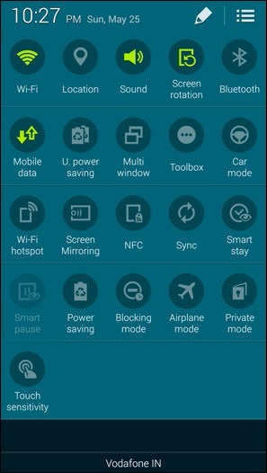

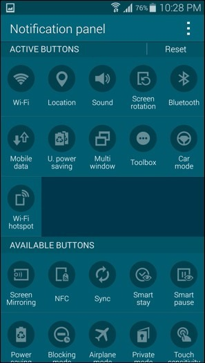

Swipe down with two fingers on the status bar and then tap the pen button on the top right. Here, drag the unused toggles from the active section to the available section. And drag up the toggles you actually want to use.

## 6. Sort Out The Messy Settings Menu

When Samsung released the artwork and preview for the S5 launch event, it featured minimal design and flat icons. [Some people took it as a sign](http://www.cnet.com/news/samsung-hints-at-new-touchwiz-design-for-galaxy-s5/ "Samsung hints at new TouchWiz design for Galaxy S5") that TouchWiz would get the minimal treatment like Android did with KitKat.

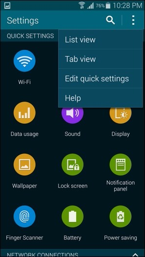

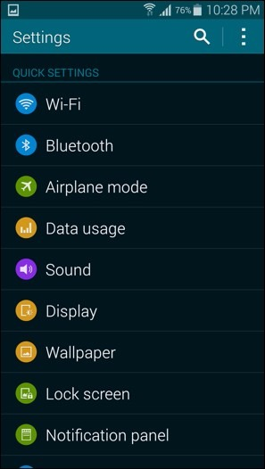

Of course, as it turned out, it was just Samsung being Samsung. Those flat icons only show up in the redesigned Settings app. To add to the injury, they are just there for the sake of being there. They don’t add anything in form of functionality, actually they make everything a lot more worse. There’s no other way to put it – it’s a mess.

So go to the *Settings* app and from the three dotted menu switch to the *List view*.

Phew, much better!

## 7. Turn Off My Magazine

My Magazine is just [Flipboard](http://www.guidingtech.com/19248/flipboard-ios-review-more-than-google-reader/ "Flipboard for iOS Review: More Than Just a Google Reader Client") wrapped up in Samsung’s attire. I have the habit of swiping through the homescreens. But now, the far left screen is taken by My Magazine, so I can’t jump from the first screen to the last by swiping left.

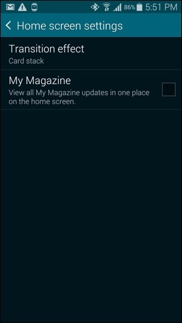

If you want to disable My Magazine from the homescreen, long press anywhere on the screen and from the options below tap *Home screen settings* and from there uncheck *My Magazine*.

## 8. Don’t Touch Samsung Apps

As I said, Samsung comes with an alternate for every Google app. Samsung has its own app store called Samsung Apps and is only useful if you have the Gear 2 or Gear Fit as the manager apps aren’t available on the Play Store.

While you’re at it, don’t sign up for a Samsung account either. You can use the S Health app without a Samsung account, just skip the process. Of course, your stats and calories won’t be backed up to the cloud but at least your conscious will be clear.

## 9. SwiftKey Keyboard

There’s no sugar coating it, the Samsung keyboard is ugly. It has the best spacing in any keyboard I’ve every used and that helps me type faster but the prediction engine isn’t that good and the gesture based input doesn’t work well.

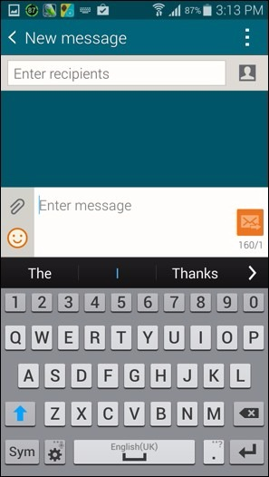

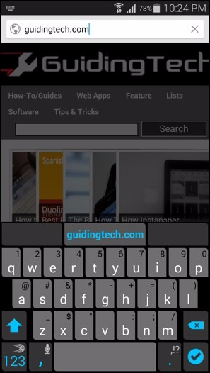

*Above – Samsung Keyboard left, SwiftKey right*.

SwiftKey isn’t the best looking thing out there but it looks a lot better than the Samsung keyboard and it has the best feature set of any keyboards out there.

## 10. Disable The Samsung Apps That You Can

The last step to saying no to Samsung comes by disabling the Samsung apps that you can. You can’t disable system level apps like Email, Samsung Apps and Calendar but you’ll be surprised to know how many pre-installed Samsung apps you actually can disable.

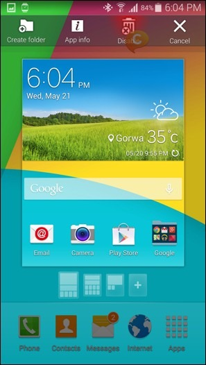

This list includes Memo, ChatOn, Smart Remote, S Voice and even S Health. Go to the app drawer and long press on any of the above apps. Now you’ll see a toolbar appear at the top of the screen. Drag your app to the icon that reads *Disable*. You’ll get a warning message that states how to restore the app. Just click OK.

Disabling these apps mean they won’t be running in the background all the time without your permission. It also means they won’t eat up unnecessary RAM and battery.

## How Are You Living With Your S5?

What changes have you made to your S5, if any? Let us know what your S5 looks like in the comments below. Screenshots welcome.
