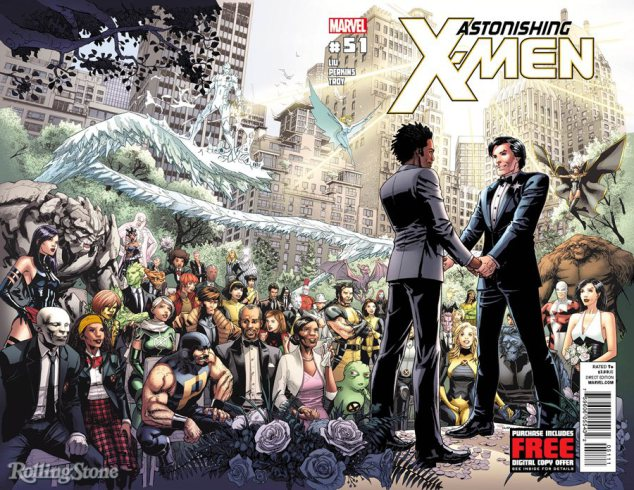
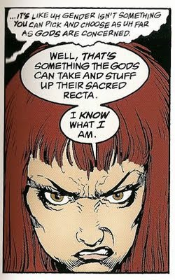

# ubNeil Gaiman responde de forma sensacional às críticas das mães ofendidas com Lúcifer

Por [Ronaldo Gogoni](http://meiobit.com/author/cyberramses/ "Posts de Ronaldo Gogoni") em 4 de junho de 2015 - [60 comentários](http://meiobit.com/319073/neil-gaiman-serie-fox-protesto-boicote-um-milhao-maes-resposta-excelente/#disqus_thread)

Um dos grandes problemas dos seres humanos em geral diz respeito em querer cuidar da vida dos outros sem ver sua própria pia de louça cheia. Desses talvez os religiosos sejam os mais chatos, os pretensos defensores da moral e da família tradicional contra a perversidade e devassidão, segundo eles.

Vide o barulho todo em torno [da linda propaganda do Boticário para o Dia dos Namorados](http://www.youtube.com/watch?v=p4b8BMnolDI "Dia dos Namorados O Boticário"), e mais recentemente com a Motorola que [lançou uma campanha similar](http://facebook.com/MotorolaBrasil/videos/10153347559774509/ "Facebook — Motorola - #EscolhaOAmor"). Os salsinhas de Cristo, liderados pelo degenerado do Malafaia conclamaram um boicote pelas “pessoas de bem” a todas as marcas e companhias que defendem a diversidade.

Eu poderia listar inúmeras empresas que são a favor da causa LGBT, mas me basta citar duas: Unilever e P&G. Pronto salsinhas, voltem para as cavernas.

Nos Estados Unidos a situação é pior. No Texas por exemplo evolucionismo é tabu nas escolas. Temos pérolas como o Museu do Criacionismo e ONGs como a One Million Mothers, associação formada por mães norte-americanas que luta pela defesa dos valores morais cristãos e rejeitam tudo o que contrarie suas crenças, tais como a causa LGBT.

Três anos atrás a instituição entrou no radar dos nerds por causa de um intenso lobby que fizeram contra a Marvel, que publicou na época o casamento do herói Estrela Polar — este o primeiro personagem assumidamente homossexual dos quadrinhos.

Desta vez o alvo é Neil Gaiman, mais precisamente a proposta da Fox (*justo ela, veja você*) de transformar Lúcifer em uma série. Na última quinta-feira as mães ofendidas entraram com [uma petição na internet](http://onemillionmoms.com/current-campaigns/urge-fox-drop-plans-to-air-lucifer-sign-petition-now/) (*claro, porque isso sempre dá certo*) exigindo o cancelamento dos planos de levar o capiroto para a televisão, já que ele será mostrado como “um cara bonzinho”, que está cansado de mandar no inferno e se instala em Los Angeles para combater criminosos e os problemas causados por suas férias não autorizadas.

Gaiman, que não é santo nem nada deu uma chapuletada daquelas nas carolas indignadas, que ele lembra já pegaram no seu pé décadas atrás:

> “*Parece que foi ontem (mas foi em 1991) que as ‘Mães Preocupadas da América’ anunciaram um boicote à Sandman porque continha personagens gays, lésbicas, bissexuais e trans. Wanda Mann era a que mais as incomodava: a ideia de uma personagem trans em quadrinhos… elas organizaram um boicote à Sandman e disseram que só parariam se escrevêssemos para a American Family Association prometendo reformular a série.*  
>    
> *Fico pensando se elas notaram que já não funcionou da última vez*…”

Wanda Mann aliás é uma das melhores representações de uma pessoa trans nas HQs

Ofendidos sempre existirão, mas daí a essa parcela do público (*que não consome o material que tanto critica, é bom frisar*) querer ditar o que outros devem ou não consumir ou mesmo publicar e exibir é demais da conta. Claro que vão continuar tentando, vide nossos problemas com a bancada evangélica por aqui. Mas a resposta de Gaiman foi simples e prática, podem reclamar o quanto quiserem, vou continuar fazendo o que der na telha e pronto.

No mais, fiquem com o trailer:

[LUCIFER | Official Trailer | FOX BROADCASTING](http://youtu.be/X4bF_quwNtw)

Fonte: [o Tumblr do Neil](http://neil-gaiman.tumblr.com/post/120223970701/one-million-moms-says-new-fox-tv-series).

- [Facebook66](http://meiobit.com/319073/neil-gaiman-serie-fox-protesto-boicote-um-milhao-maes-resposta-excelente/?share=facebook&amp;nb=1 "Compartilhar no Facebook")
- [Twitter15](http://meiobit.com/319073/neil-gaiman-serie-fox-protesto-boicote-um-milhao-maes-resposta-excelente/?share=twitter&amp;nb=1 "Clique para compartilhar no Twitter")
- [Google](http://meiobit.com/319073/neil-gaiman-serie-fox-protesto-boicote-um-milhao-maes-resposta-excelente/?share=google-plus-1&amp;nb=1 "Compartilhe no Google+")
- [Email](http://meiobit.com/319073/neil-gaiman-serie-fox-protesto-boicote-um-milhao-maes-resposta-excelente/?share=email&amp;nb=1 "Clique para enviar por email a um amigo")

em[Quadrinhos](http://meiobit.com/arquivo/pop/quadrinhos/) [Televisão](http://meiobit.com/arquivo/pop/televisao/) [Web 2.0](http://meiobit.com/arquivo/meio-bit/web2/) relacionados[boicote](http://meiobit.com/tag/boicote/) [constantine](http://meiobit.com/tag/constantine/) [Fox](http://meiobit.com/tag/fox/) [HQ](http://meiobit.com/tag/hq/) [Lúcifer](http://meiobit.com/tag/lucifer/) [Neil Gaiman](http://meiobit.com/tag/neil-gaiman/) [respostas](http://meiobit.com/tag/respostas/) [Salsinha](http://meiobit.com/tag/salsinha/) [séries](http://meiobit.com/tag/series/) [TV](http://meiobit.com/tag/tv/) [Vertigo](http://meiobit.com/tag/vertigo/)

 Mais textos de:  
[Ronaldo Gogoni](http://meiobit.com/author/cyberramses/ "Posts de Ronaldo Gogoni")  
[Site](http://www.scicast.com.br/) | [Twitter](http://twitter.com/RonaldoGogoni/)
