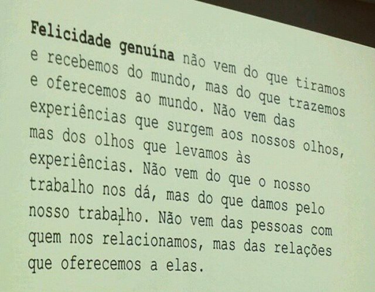

# 17 sinais de que o trabalho sujo começou | Como a gente se transforma? #6

O que pode acontecer assim que uma pessoa começa a cultivar uma presença mais estável e amorosa

Ainda que todo mundo esteja em meio a aflições coletivas, é muito raro surgir uma pergunta desse tipo: "Como exatamente você está superando a ansiedade?" Ou melhor ainda: "Como você sabe se o que você pratica realmente leva à redução da ansiedade?"

Nossas tentativas de reduzir o sofrimento muitas vezes acontecem de modo isolado em um submundo de pílulas, crenças e terapias duvidosas. Precisamos conversar mais (e melhor) sobre como a gente se transforma.

Depois de descrever três grandes problemas (agitação, delusão, autocentramento) e três práticas ([equilíbrio, sabedoria, compaixão](http://www.papodehomem.com.br/tres-frentes-de-pratica-como-a-gente-se-transforma-5)), seguimos com mais uma pergunta cuja resposta é aparentemente óbvia, mas pode revelar possibilidades extraordinárias: o que acontece quando alguém começa a trabalhar com sua mente?

### Dá pra medir algo tão sutil?

O processo de superar aflições e cegueiras pode ser muito complexo, porém o resultado é incrivelmente “bolo na cara”, evidente, facilmente percebido por qualquer um. Uma pessoa amorosa é reconhecida de longe. Ainda assim, o que nos interessa aqui é descrever os processos que favorecem o nascimento de um ser com uma mente estável e um coração amplo. E para isso a resposta parece ser: “Sim, é possível falar sobre isso.”

É possível uma ciência em primeira pessoa dos processos de transformação humana porque há experimentos, investigações, registros detalhados, treinamentos e métodos muito precisos que levam a resultados verificáveis e reproduzíveis intersubjetivamente.

Este texto (e toda essa coluna) é apenas um começo de conversa sobre tal ciência. “Como a gente se transforma” aqui no sentido de como a transformação acontece, não no sentido do que fazer para acontecer — "how" apenas, não "how to".

### Algumas ressalvas em relação à lista abaixo

Listar os sinais de avanço é um trabalho muito arriscado. Primeiro porque, claro, cada pessoa é uma pessoa. Segundo porque há múltiplos referenciais para definir transformação (se usarmos o referencial da medicina convencional, por exemplo, para ser considerado saudável basta que você não tenha doenças ou distúrbios). Terceiro porque cada conjunto de métodos tem seus próprios critérios. Quarto, e esse é o principal problema: a sabedoria não tem conteúdo, a ação livre não tem uma cara, a lucidez não é uma atitude específica, então assim como existem picaretas simulando equilíbrio, sabedoria e compaixão, existem grandes praticantes que agem além das convenções.

No entanto, os problemas dessa lista acabam explicitando suas vantagens — uma conversa em que surgem tais ressalvas é uma conversa que vale a pena.

Além de ajudar a refinar nossa linguagem consensual, tal clareza pode servir para perdermos menos tempo em caminhos que não nos levam muito longe e para ajudarmos pessoas próximas que estão se enganando, confusas, patinando sem sair do lugar. Se eu vou regularmente para a Índia receber ensinamentos de gurus, se faço análise, se frequento algum centro espiritual, como saber se está funcionando, se a macumba está operando, se há real transformação?

A proposta não é colocar em xeque essa ou outra prática, mas oferecer recursos e apontar critérios para que possamos, nós mesmos, olhar para nossos caminhos. Também não faz sentido estimular julgamentos e comparações: "Essa pessoa é mais avançada do que aquela..." Ainda assim, até mesmo na relação conosco o foco nos sinais de avanço pode ser contraprodutivo, gerando checagem excessiva, orgulho, materialismo espiritual ou uma narrativa que reifica o autocentramento: "Eu comecei a praticar há 15 anos, desde então fiz isso e isso e hoje cheguei aqui."

A fonte do que segue não é pessoal. Apenas me propus a resumir algumas das descobertas de seres que dedicaram a vida para realizar nosso potencial de florescimento, em diversos caminhos. Tentei usar uma linguagem mais neutra e superficial de modo que esse processo possa ser encontrado em diversas práticas e treinamentos. Sob diferentes nomes e abordagens, há livros, retiros, ensinamentos, treinamento inteiros dedicados a cada um desses processos listados. A ideia é depois fazermos juntos esse detalhamento, na medida de nossa curiosidade e exploração prática.

Se olharmos bem para onde apontam todas as grandes tradições de sabedoria da humanidade, no lugar de postulados místicos abstratos encontraremos processos práticos e incrivelmente acessíveis. Os melhores textos não soltam teorias, mas descrevem métodos e experimentos que podemos fazer para comprovar o que está sendo exposto.

Aliás, essa conversa pode ser boa também para evidenciar a importância de um professor ou professora, de uma comunidade de praticantes e de métodos testados extensivamente por uma linhagem genuína de prática (tema de um outro texto). Se com tal apoio facilmente nos enganamos quanto aos sinais de avanço, imagine sozinhos.

Não me preocupei com o tema da diferença entre o caminho direto e o caminho gradual. Isso ficará para outra conversa, mas, claro: nenhum processo listado abaixo precisa ocorrer de modo causal. Repetirei "começa" para enfatizar que não estou falando de uma pessoa santa e iluminada, mas de algo realmente acessível a cada um de nós. Por fim, enumero para facilitar os comentários, não para sugerir uma ordem.

### O que acontece quando uma pessoa começa a se transformar?

Quando uma pessoa começa a praticar equilíbrio, sabedoria e compaixão, alguns processos de transformação genuína podem acontecer:

**1.** A pessoa começa a não se identificar tanto com pensamentos e emoções. A mente se reconhece mais no espaço onde tudo surge e menos no conteúdo das aparências. Começa a surgir o que Alan Wallace chama de “mente de teflon”. É um processo capaz de salvar vidas! Em vez de ser comandada pelo conteúdo do pensamento (“Eu quero me matar”), a mente reconhece o pensamento como pensamento: “Apareceu um pensamento suicida, uau. É assim que as pessoas se matam.”

**2.** O que era visto como totalidade começa a ser visto como parte. O que era contexto passa a ser conteúdo, o que era a verdade passa a ser um referencial, o que era a realidade passa a ser uma experiência de realidade. O que era a nossa vida começa a ser visto como uma bolha, o que era "eu" começa a ser visto como diversas identidades. Enfim, o que era visto como absoluto começa a ser visto como relativo.

**3.** A pessoa começa a realmente viver em um mundo sem inimigos. Torna-se cada vez mais impossível localizar um ser que realmente está contra nós. Quando a pessoa vê alguém como inerentemente maldosa ou como inferior, pelo menos ela sabe que está alucinando.

**4.** Fixações de todo tipo são reduzidas. A pessoa não se agarra tanto a visões, hábitos, pessoas, lugares, ideias, identidades, planejamentos… Ela se torna capaz de transitar pelas experiências sem ser aprisionada por elas.

**5.** Quanto mais a pessoa não se identifica com o que surge em sua mente, mais ela se surpreende com a quantidade de sujeira que estava encoberta, ela localiza todo tipo de negatividade em sua própria mente e assim se sente cada vez mais próxima do pior dos seres humanos, de criminosos a malucos de todo tipo.

**6.** A pessoa começa a enxergar todas as estruturas aflitivas e também todas as qualidades positivas como não pessoais. Fica cada vez mais nítido que superar a "minha" ansiedade é a mesma coisa que ajudar outra pessoa a ser menos ansiosa. Do mesmo modo, ser generoso é operar com uma inteligência que não é minha nem de ninguém, mas está sempre disponível a qualquer um. Ao despessoalizar, a pessoa começa a abandonar o mecanismo da culpa.

**7.** Mais e mais situações são vistas como trabalháveis, lúdicas, plásticas, flexíveis, abertas — não mais como algo tão sério, pesado, sisudo, definido, rígido, intransponível. Com isso não apenas surge leveza, mas uma maior liberdade para lidar com os problemas de modo criativo.

**8.** Tende a aumentar o tempo em que a pessoa consegue repousar a atenção em um único foco, sem distrações, sem excitação ou lassidão.

**9.** A pessoa começa a encontrar uma fonte mais autônoma de ânimo, de energia, de relaxamento, estabilidade e e vivacidade. Com isso ela começa a se tornar imperturbável, não reativa, não precisando que coisas aconteçam para que ela se sinta bem.

**10.** As ações da pessoa começam a ser cada vez mais sem esforço. Enfraquece a sensação de ser um "eu" fazendo tudo. Porque a pessoa se reconhece cada vez mais como veículo de qualidades impessoais, pode surgir uma maior experiência de entrega e de confiança nos fluxos naturais da vida.

**11.** A pessoa começa a se tornar mais presente no corpo (a transição de "Eu tenho um corpo" para "Eu sou um corpo"), se familiarizando e se reapropriando de cada parte de seu corpo em seus movimentos grosseiros e fluxos sutis, aumentando sua capacidade de gerir a própria saúde. Isso pode surgir em paralelo e não é contraditório com a capacidade de não se identificar com o corpo (a transição de "Meu joelho está doendo" para "Joelho doendo").

**12.** A pessoa começa a ganhar clareza sobre a diferença entre felicidade condicionada e felicidade genuína. Assim que ela faz a extraordinária descoberta que é possível cultivar diretamente as causas da felicidade genuína, em algum momento é inevitável que ela realmente comece a fazer isso.

Slide final da palestra "Por que não vai dar certo?", que ofereci para cerca de 300 pessoas no Festival Path, no Tomie Ohtake, em São Paulo. O texto toma como base a abordagem do professor Alan Wallace | Foto de Carol Brunharo

**13.** A pessoa começa a simplificar sua vida, precisando de cada vez menos, ao perceber que a origem de seu bem-estar não precisa depender de coisas, pessoas e situações. Isso não significa que ela vai viver como um ermitão: ainda que ela não precise, existe a liberdade de ter ou não ter coisas, afinal liberar o apego às coisas não significa se livrar das coisas.

**14.** A pessoa começa a ganhar clareza sobre o que realmente nos faz sofrer. Pode surgir uma certeza avassaladora: nenhuma aparência específica está causando suas aflições! Não é o outro, não é a vida, não é uma ou outra situação… A pessoa enfim começa a se perceber responsável pelo que surge em seu mundo interno.

**15.** Toda a vida da pessoa começa a se orientar para a felicidade genuína e para a erradicação das causas do sofrimento — em si mesma e nos outros. A pessoa começa a verificar que tudo o que é feito com essa motivação gera benefício. E tudo o que é feito sem essa motivação gera confusão.

**16.** Ao perceber que as predisposições negativas nem sempre se manifestam e podem ser reduzidas, a pessoa entrevê a possibilidade de erradicação completa de todas as aflições e desequilíbrios cognitivos e emocionais. Enfim a pessoa começa a desejar a extraordinária realização por trás de palavras como ["liberação", "despertar" ou "iluminação"](http://www.budavirtual.com.br/iluminacao-e-outras-luminosidades-budistas-padma-dorje/%20).

**17.** A pessoa começa a se dar conta que trabalhar com sua mente não é nada fácil, então naturalmente aumenta sua admiração pelas pessoas que fizeram e fazem isso pra valer. Quanto mais a pessoa encontra qualidades positivas em si mesma, mais capaz ela se torna de reconhecer exemplos vivos dessas qualidades. E vice-versa: quanto mais ela se aproxima desses exemplos vivos, mais ela se torna capaz de reconhecer e agir a partir dessas sabedorias.

### A lista é muito mais longa...

Creio que os pontos acima são suficientes para abrir a conversa, mas continuarei a lista nos próximos textos (sempre no primeiro domingo do mês).

Você enxerga alguns desses processos em sua vida?

Um abraço e seguimos nos comentários!

# Quer colocar isso em prática?

*Para quem está cansado de apenas ler, entender e compartilhar
sabedorias que não sabemos como praticar, criamos o lugar: um espaço
online para pessoas dispostas a fazer o trabalho (diário, paciente e
às vezes sujo) da transformação.*

*Entenda [o que
estamos fazendo](http://olugar.org/o-que-estamos-fazendo/) e veja
[**como entrar e participar**](http://olugar.org/participe).*

*Seguimos o papo nos comentários.*

---

*publicado em 07 de Junho de 2015, 15:11*
