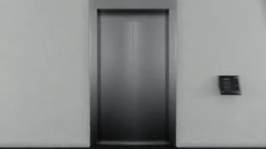

# Como seria o mundo se você não estereotipasse ninguém?

O estereótipo tem das suas, generaliza mas facilita o entendimento inicial. Como entender melhor e trabalhar positivamente essa noção?

Pare as coisas que estiver fazendo neste momento e fique atento. Você será levado para um mundo diferente como nunca imaginou antes. Será surpreendente e, quem sabe, até retorne de lá conhecendo um pouco mais sobre si mesmo. Juntos, você e eu faremos uma jornada rumo a um mundo desconhecido de novas possibilidades. Peço que ouça com atenção o que direi a seguir. Busque imaginar a situação exatamente como vou descrevê-la.

Prepare-se... silêncio... lá vai:

Você acaba de acordar atrasado, toma um banho rápido e se arruma correndo. Hoje tem reunião importante no trabalho.

Ao entrar no elevador, ainda com o rosto meio inchado, por coincidência uma outra pessoa também está lá. Nunca se viram antes e, ao olhá-la, sabe que se trata de uma mulher. Ouve um “bom dia” gentil, mas esta é a única informação externa a imagem que você recebe. A visão é impressionante, você se esforça para entender o que esta acontecendo, hipnotizado pelo mistério que se apresenta diante de ti.

De maneira discreta, olha outra vez para ela. Aquele breve instante é insuficiente para decifrar o que está acontecendo e quem é aquela mulher a  dois passos de você. Ela está nua, você não sabe como agir. A curiosidade o atrai feito imã, nota-se que, além daqueles cabelos negros e dominantes, ela também tem um queixo delicado e levemente pontudo que te chama bastante a atenção. Percebe as voltas do seu quadril e imagina o quão carinhosas devem ser aquelas coxas. De repente, o que era curiosidade se tornou desejo. O que você faz?

Lembre-se, você não realiza pré julgamentos, ela estar sem roupa não lhe diz nada mais do que o “bom dia” casual que trocaram. Seria ela uma prostituta que notou em seu olhar uma boa oportunidade de negócios? Quem sabe uma freira, retornando de uma triste vigília logo de manhã, que não desejaria, de modo algum, ser incomodada com assunto tão pecaminoso? Ou então somente uma vizinha jornalista, que adora as mesmas músicas estranhas que você e possa até vir a ser o amor da sua vida?

O que você vai fazer? Quem é esta mulher?

O elevador está quase no térreo e a única coisa que você fez até agora é começar a suar. Pois iremos ainda mais longe, estenderemos a ausência de estereótipos também aos ofícios, portanto, pode ser que a freira é quem esteja interessada em vender seus serviços carnais a você, ou então a puta é que adore as músicas e, provavelmente, seja sua alma gêmea. Já a jornalista, quem sabe uma religiosa e casta, voltando da vigília, triste e temerosa a Deus.

Como agir perante o desconhecido?

Nesta hora, um turbilhão de sentimentos te acompanha e decisões aleatórias não existem. Nada que você possa fazer a não ser ver aquela mulher sair lentamente do elevador rumo aos seus sonhos distantes. Ela foi embora. Este mundo imaginário não é um filme da Brasileirinhas, portanto, a única característica que se mantém pré estabelecida aqui é o julgamento ético e moral que fazemos de nós mesmos e é provável que este fator é que tenha te impedido de agir como um animal.

É claro que, se você tivesse tido mais tempo, poderia ter pensado em alguma coisa ou então estabelecido uma conversa e descoberto fatos concretos que lhe indicariam o melhor modo de agir. Mas o elevador, tal como a vida corrida do dia a dia, é dotado daquele curto espaço de tempo que não nos permite analisar profundamente a maioria das coisas e, quando pensamos em dizer algo, a porta já se abriu e só nossas dúvidas ainda se manterão no ambiente.

Embora este novo mundo pareça incrível e excitante, pense quão desgastante seria vivenciar situações assim todos os dias, meses e anos de sua vida. Só bebês são capazes de processar tantas informações novas ao mesmo tempo, não à toa, eles precisam de tantos cuidados.

“Ô campeão, entendi tudo, mas o que raios isso tem a ver com a minha imagem e a maneira com que me visto?”.

Simples. Agora você percebeu que mesmo se não tiver interesse no assunto, mesmo que julgue ter um estilo próprio e único, ainda assim, você será enquadrado em algum grupo e, por isso, quanto mais controle você tiver sobre sua imagem, maior será a chance de ser entendido pelos outros.

**O domínio da linguagem visual funciona do mesmo modo que o controle da linguagem verbal**. Ler um livro aumenta seu vocabulário e seu poder de dialogar, tanto quanto o discernimento e a escolha consciente de uma calça, pense nisso.

### Lembre-se, Estereótipo não é a mesma coisa que Preconceito

Enquanto o primeiro é resultado da realidade percebida ou da vivência, o segundo é uma ideia estabelecida baseada em uma realidade imaginada, portanto, mais vazia e, também, majoritariamente negativa a respeito do analisado. Embora seja recheada de defeitos, **estereotipar é a maneira que encontramos para entender boa parte do que nos cerca**, nos ajudando a reger muitas de nossas relações sociais.

Analisar informações categorizadas nos permite antever comportamentos, fazendo com que, supostamente, saibamos lidar com eles de maneira rápida e segura. É fato que ninguém deseja ser estereotipado, mas é impossível evitar que isto ocorra na maioria das relações menos profundas. E não se engane, todo mundo pertence a algum grupo, aliás, a diversos deles, **pois o pertencimento na sociedade é definido pela observador, não pelo observado**.

### Conselho do He-Man

Independente de estereótipos, a sua vizinha, a freira e a puta merecem tanto respeito quanto você. Não seja um babaca

Momento jabá honestíssimo, **primeira parte:** fico contente em ter encontrado um mecenas que compreenda que divulgar sua marca é muito mais do que vender peças. Entendendo que seu papel principal é ajudar o consumidor a explorar sua personalidade por meio da imagem.

Momento jabá honestíssimo, **segunda parte:** recebo, há algum tempo, e-mails pedindo para que eu fizesse um Instagram e, embora eu não seja muito simpático a celulares, penso que parte crucial do meu trabalho é a tradução da imagem. Logo, nada mais justo do que atender a este pedido. Espero ter a disciplina para mantê-lo com conteúdo relevante. Tá aqui. Lá, sou o [@brunopassosbr](http://instagram.com/brunopassosbr).

Por hoje é só pessoal. Como sempre, espero que tenha sido útil ou, ao menos, divertido.

Partiu sucesso

### Mecenas: [Dafiti](http://www.dafiti.com.br/dafiti-collection-brand-masculino/?os=HomeMasculina.lanc_dafiti_collection.944x500.Aspiracional&wt_cc4=HomeMasc_944x500_Full01_lanc_dafiti_collection_.jpg&wt_cc3=HomeMasc_944x500_Full01_lanc_dafiti_collection_.jpg&osb_abc=HomeMasc_944x500_Full01_lanc_dafiti_collection_.jpg?pdh=1wmc=sm.papodehomem.pdh11052015dftcollection620&utm_source=papodehomem&utm_medium=sm&utm_campaign=pdh11052015dftcollection620)

*O*estereótipo*facilita a percepção mais imediata das informações que passamos. Para termos diversas referências para as mais variadas situações,* *um guarda-roupas versátil te auxilia nesse papel. Para isso, [a](http://www.dafiti.com.br/dafiti-collection-brand-masculino/?os=HomeMasculina.lanc_dafiti_collection.944x500.Aspiracional&wt_cc4=HomeMasc_944x500_Full01_lanc_dafiti_collection_.jpg&wt_cc3=HomeMasc_944x500_Full01_lanc_dafiti_collection_.jpg&osb_abc=HomeMasc_944x500_Full01_lanc_dafiti_collection_.jpg?pdh=1wmc=sm.papodehomem.pdh22042015dftcollection620&utm_source=papodehomem&utm_medium=sm&utm_campaign=pdh22042015dftcollection620) [Dafiti pode te dar uma mãozinha](http://www.dafiti.com.br/dafiti-collection-brand-masculino/?os=HomeMasculina.lanc_dafiti_collection.944x500.Aspiracional&wt_cc4=HomeMasc_944x500_Full01_lanc_dafiti_collection_.jpg&wt_cc3=HomeMasc_944x500_Full01_lanc_dafiti_collection_.jpg&osb_abc=HomeMasc_944x500_Full01_lanc_dafiti_collection_.jpg?pdh=1wmc=sm.papodehomem.pdh11052015dftcollection620&utm_source=papodehomem&utm_medium=sm&utm_campaign=pdh11052015dftcollection620): são mais de 100.000 produtos a venda na loja deles, para o seu visual dialogar em qualquer meio, do mais quadrado ao mais descolado.*

*A cada quinze dias, pelos próximos seis meses, [Dafiti](http://www.dafiti.com.br/dafiti-collection-brand-masculino/?os=HomeMasculina.lanc_dafiti_collection.944x500.Aspiracional&wt_cc4=HomeMasc_944x500_Full01_lanc_dafiti_collection_.jpg&wt_cc3=HomeMasc_944x500_Full01_lanc_dafiti_collection_.jpg&osb_abc=HomeMasc_944x500_Full01_lanc_dafiti_collection_.jpg?pdh=1wmc=sm.papodehomem.pdh11052015dftcollection620&utm_source=papodehomem&utm_medium=sm&utm_campaign=pdh11052015dftcollection620)vai ser mecenas de conversas sobre estilo e moda sem frescuras. Com artigos práticos e conceituais vamos explorar a fundo esse território.*

---

*publicado em 10 de Junho de 2015, 00:07*
