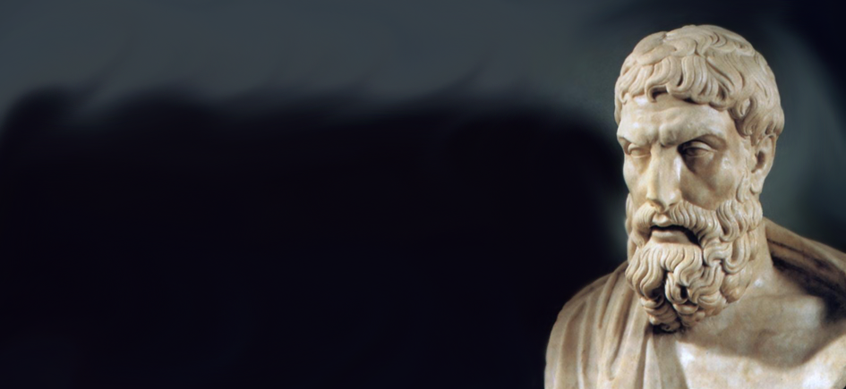
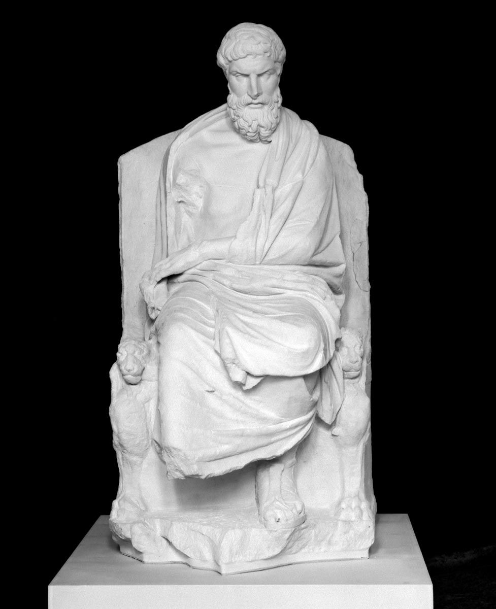
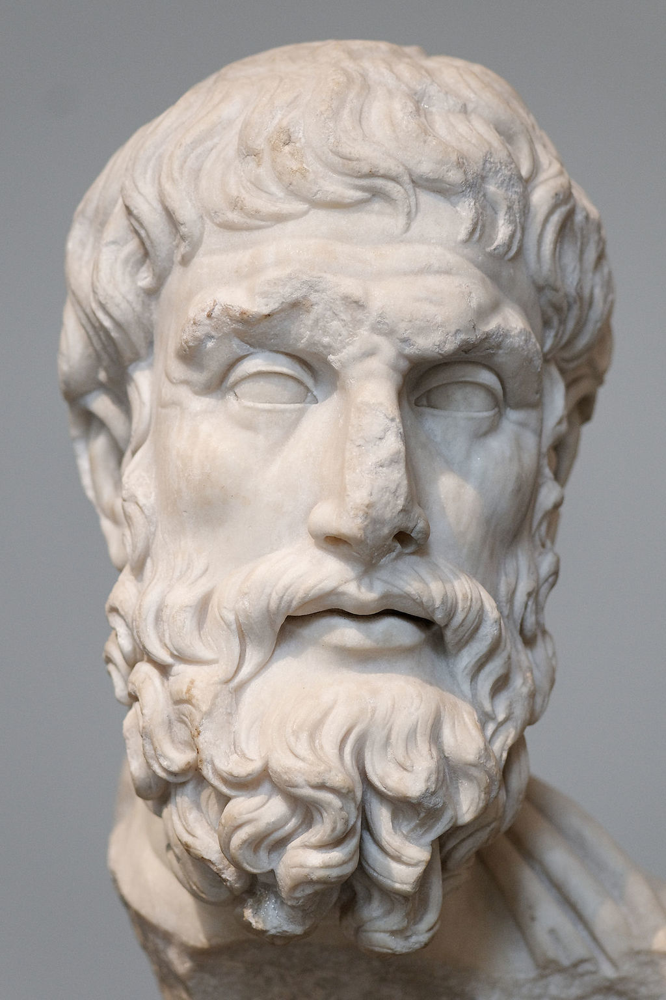

# Epicuro | Homens que você deveria conhecer #48

A felicidade epicúrea, morte e negação do além-mundo, além do pensamento do filósofo grego na realidade contemporânea

Há um fragmento de Epicuro que continua absolutamente atual que diz:

> “Devemos começar a filosofar desde a mocidade, porém sem deixarmos de o fazer, cansados, na velhice. Para realizar algo em prol da saúde espiritual, ninguém é demasiado moço nem muito velho; mas quem, porventura, supuser que, para filosofar, está moço ou velho, em demasia, dirá do mesmo modo que o instante exato da sua felicidade ainda não chegou ou já se foi.” (1)

 O homem contemporâneo está distante dessa compreensão. Vivemos a procura de algo que não sabemos bem o que é, aceitando a possibilidade de ser uma “felicidade”. Não a felicidade como era vista por Epicuro, mas uma felicidade inatingível, que buscamos por meio de conquistas a serem alcançadas: fama, dinheiro, ou qualquer coisa que ainda não temos, futura, difícil, e, se pensarmos bem, quase sempre inalcançável por estar sempre distante do momento presente. O lugar do desejo real de cada indivíduo (ponto chave da teoria psicanalítica de Freud) é preenchido com o que nos mostra a mídia, a família, os padrões de comportamento ou até as empresas com suas propagandas de produtos. Além disso, vivemos numa época em que o senso crítico é raro e o homem vive cercado de medos, que muitas vezes os levam ao refúgio das religiões tradicionais e seus dogmas. Este cenário mostra a importância da filosofia de Epicuro hoje.

Epicuro viveu já no período de decadência da [pólis grega](http://pt.wikipedia.org/wiki/P%C3%B3lis). A conquista macedônica enfraquecia os ideais de coletividade e de cidadania. Assim, toda a filosofia de Epicuro volta-se para a busca de uma felicidade baseada muito mais no indivíduo do que na coletividade.

O elitismo do conhecimento também sofreu um abalo com a perda da independência grega, o que acabou proporcionando uma concepção mais igualitária do saber.

Epicuro aceitava em seu jardim a todos: homens, mulheres e escravos. Assim, inaugura uma ética igualitária, acessível à inteligência de todos os homens capazes de se abrir para uma nova forma de ver a realidade, sem superstições, dogmas ou preconceitos.
Epicuro foi influenciado pela física atomística de [Leucipo](http://pt.wikipedia.org/wiki/Leucipo) e [Demócrito](http://pt.wikipedia.org/wiki/Dem%C3%B3crito) e a ética hedonista dos [Sofistas](http://pt.wikipedia.org/wiki/Escola_sof%C3%ADstica) e [Cirenaicos](http://pt.wikipedia.org/wiki/Escola_cirenaica), tendo em comum com estes o prazer como bem maior, mas criticando o prazer sem controle e desmedido da ética deles.

Sua tentativa de compreender a natureza se mistura à criação de uma ética para o homem, ou seja, sua condição plena de realização. O equilíbrio, no interior do homem, geraria o prazer, o sumo bem, tranquilidade, liberdade e felicidade. A busca desse equilíbrio se dava a partir da eustatheía (boa disposição), aponía (ausência de dor) e ataraxía (ausência de perturbações na alma). É interessante notar que Epicuro sofreu de crises renais por toda a vida e o que ele afirmava sobre suportar a dor era experiência própria. Além disso, viveu em uma Grécia invadida e dominada. Esses fatores podem ter sido decisivos para a sua visão de felicidade baseada nas situações mais simples (e apesar de dor e sofrimentos).

O jardim de Epicuro era o local de uma nova prática de existência comunitária entre amigos verdadeiros. Seus moradores cultivavam hortas, na busca da auto-suficiência. Segundo Sêneca, havia a seguinte inscrição na entrada do jardim:

> “Hóspede, aqui serás feliz; o soberano bem aqui é o prazer.”

Epicuro não praticava um hedonismo vulgar. Para ele, um corpo pode ficar saturado de prazer quando tem pão e água: “[...] Para nós, prazer significa: não ter dores no âmbito físico e não sentir falta de serenidade no âmbito da alma. Pois uma vida cheia de ventura não é formada por uma sequência infinita de bebedeiras e banquetes [...]”(3) . Assim, a ética de Epicuro desloca o local do filósofo da [Ágora](http://pt.wikipedia.org/wiki/%C3%81gora_de_Atenas), onde se discursava para toda a cidade, para o jardim, onde conversava com amigos. Numa época em que pátria, cidadania e coletividade perdiam o sentido, Epicuro coloca o novo lugar do sábio no jardim, mais recolhido, com amigos escolhidos apenas: “De todos os bens que a sabedoria nos proporciona para a felicidade de toda nossa vida, o da amizade é de longe o maior.”(4) Assim, a amizade passa a ser o vínculo primordial na comunidade agora sem concidadãos e sem compatriotas. É interessante notar também que o jardim não era apenas um centro de debates e reflexões, como a AcademiadePlatão ou o Liceu de Aristóteles. Esse modelo inspirou vários movimentos sociais pela história, como o dos hippies.
Em suma, a filosofia epicúrea tem como base quatro fundamentos que trazem uma forma de viver da melhor maneira possível, com menos medos e perturbações na alma, o chamado *tetraphármakon*:

**1.** Não há nada a temer quanto aos Deuses (que não interferem na vida humana de um modo geral);

**2.** Não há nada a temer quanto à morte (quando a morte chega, cessa a existência);

**3.** O prazer é fácil de se obter (se for difícil, não é necessário);

**4.** A dor é suportável (se for insuportável, não dura muito).

Epicuro teve uma vastíssima produção mas, infelizmente, muito de sua obra se perdeu.

### A felicidade epicúrea

A felicidade epicúrea tem como base o equilíbrio e a harmonia como a da natureza, sempre considerando a medida racional: “Por isso eu afirmo que o prazer é a essência de uma vida venturosa. A ele conhecemos como nosso primeiro bem inato, por ele nos deixamos guiar em todos os nossos anelos e abstenções, e por ele nos governamos, medindo todos os outros bens pela sua norma. E, justamente porque o prazer é o nosso primeiro bem, aquele que recebemos pela própria natureza, não zelamos pela obtenção de qualquer prazer, mas deixamos de lado muitos, dos quais finalmente poderia resultar-nos um mal-estar maior ainda. [...]”(7) .
Para Epicuro, o sábio tem a capacidade de viver de acordo com a natureza: “Eu, que dedico incessantemente minhas energias à investigação da natureza, e através desse modo de viver exerço principalmente o meu equilíbrio.”(8) . Assim, a filosofia de Epicuro, como ele mesmo definiu, é um saber para a vida, em que o mais sábio é o mais tranquilo, mais livre e mais feliz. E esse equilíbrio é fonte de prazer. Trata-se de uma filosofia baseada na serenidade e sensatez: “No principio de tudo, porém, encontra-se a razão, o maior dos nossos bens. Dela resultam por si só todas as outras virtudes; na verdade, é mais valiosa ainda que a filosofia, porque nos ensina que é impossível viver prazerosamente, sem que se viva uma vida cheia de razão [...]”(9) .

Sua ética fundamenta-se no corte de tudo o que não é natural nem necessário ao indivíduo (incluindo aí normas e valores da sociedade). Epicuro tenta aqui nos libertar dos grilhões dos padrões da maioria, da multidão que posteriormente [Nietzsche](http://pt.wikipedia.org/wiki/Friedrich_Nietzsche) vem a chamar de “rebanho”, e que [Heráclito](http://pt.wikipedia.org/wiki/Her%C3%A1clito) bem antes dele já chama de "hoi poloi". O homem sábio, o homem feliz de Epicuro, ao tentar compreender a natureza e seus fenômenos, percebendo seu equilíbrio cheio de conflitos e amores, pode conseguir dominar seus desejos, paixões e ações tendo como base apenas a si mesmo, sem se prender a nenhum dogma ou padrão externo que não lhe sirva. Sem se forçar a aceitar qualquer forma de agir como melhor ou correta, baseando-se apenas no número de homens que assim age e pensa. A vida feliz resulta desse agir livre.

Na época de Epicuro, a visão do homem intervencionista na natureza não existia. Sua filosofia buscava a compreensão e não a intervenção na natureza. O homem devia melhorar sua vida ao estudar a natureza, e não corrigir a natureza para melhorar sua vida.

### Negação do além-mundo

Epicuro fundamenta seus estudos na physis, a partir da observação da natureza: “Prefiro proclamar abertamente aos homens, baseando-me no meu conhecimento da natureza, aquilo que lhes seja útil, ainda que ninguém o compreenda, a dar, sob caloroso aplauso da multidão, o meu acordo em tolices.”(13)

Neste ponto o Epicurismo se iguala à Filosofia imanente do [Estoicismo](http://pt.wikipedia.org/wiki/Estoicismo), de sua lei ética que tem como base a busca da felicidade, negação da metafísica e de qualquer possibilidade de transcendência fora da imanência.

### A morte

“A morte nada é para nós, pois aquilo que já foi dissolvido não possui mais sentimentos. Aquilo, porém, que não possui mais sentimentos, não nos importa.”(19) . Para Epicuro, a alma é um princípio corpóreo, ligado às sensações e aos sentidos, e não haveria motivo para pensá-la possível com o fim do corpo: “[...] a alma contém em si a causa principal de nossa percepção pelos sentidos [...]”(20) “Quando a massa total dos átomos do corpo se dissolve, então também a alma se dispersa [...].”(21)

A ideia de alma eterna deriva de um mito órfico, que, segundo alguns, Platão aceita (não quero aprofundar esta questão aqui, apenas registrar que há controvérsias) e que, posteriormente, o cristianismo usará como base de sua doutrina. Epicuro também fala belamente da morte na carta a Meneceu:

> “Além disso, acostuma-te à ideia de que a morte, para nós, é um nada. Todo bem e todo mal residem na faculdade de sentir; a morte, porém, é a privação desse sentimento. Assim, o conhecimento de que a morte nada é torna deliciosa a nossa vida efêmera. Evidentemente, esse saber não modifica o limite temporal da nossa vida, contudo livra-nos do desejo de ser imortais, pois para quem ficou ciente de que nada de terrível existe na ausência de vida, nenhum terror pode haver no viver. Mas se alguém argumentar que não teme a morte por causa da pena que ela trará quando vier, mas sim porque o simples fato da sua vinda já lhe é doloroso, é um tolo; pois é doidice que algo que não nos cause receio quando acontecer, possa trazer-nos pena, durante a espera, pelo fato de ser esperado!   
>   
> Assim a morte, o mais temível de todos os males, é para nós um nada: enquanto nós existirmos, não existirá ela, e quando ela chegar, nada mais seremos. Desse modo, a morte não toca nem os vivos nem os mortos, porque onde estão os primeiros não se encontra ela, e os últimos já não existem mais.   
>   
> É verdade que a grande massa do povo evita a morte como o mais terrível dos males, mas deseja-a, por outro lado, como se fosse o descanso das labutas da vida. O sábio, porém, nem nega a vida nem tem temores de não mais viver, pois aquela não lhe é repugnante, e ele não considera o não-mais-viver como se fosse um mal. Do mesmo modo que, na refeição, ele não faz questão absoluta da quantidade desmesurada, mas dá maior valor à preparação gostosa, igualmente na vida não se preocupa com o tempo que esta dura, mas sim com a delícia da colheita que ela lhe traz.”(22)

Epicuro vai além, tentando mostrar racionalmente o quanto o medo da morte pode atrapalhar a nossa vida: “Nascemos uma única vez; uma segunda vez não nos é dada, e não nasceremos mais por toda a eternidade. Apesar disso, adias constantemente o instante certo e não és dono do dia vindouro. Nessa vacilação, porém, desvanece-se a vida e muitos morrem sem jamais se terem permitido um verdadeiro descanso.”(23)

Podemos pensar aqui em Epicuro como talvez o primeiro psicanalista da História: ele não fala diretamente do conceito de inconsciente, mas antecipa essa percepção contemporânea, ao perceber que as pessoas carregam consigo um temor constante da morte, que pode se apresentar em manifestações disfarçadas tais como acumular riquezas, poder ou honrarias. Ou seja, consomem em excesso, tentam se eternizar através de obras de arte, se apegam a religiões ou crenças no pós-vida, no fundo, por causa do temor da finitude: “Alguns procuram fama e prestígio acreditando conseguir com isso segurança perante os homens. Se viverem em segurança, receberão então também esse bem natural. Se, porém, a sua vida não for segura, nem sequer possuem aquilo pelo que anseiam em primeiro lugar, obedecendo à sua natureza.”(24)

### O pensamento de Epicuro na realidade contemporânea

Hoje, a indústria do medo alimenta o consumismo. O jornalismo, mantendo-se no padrão de sempre, reduzindo o mundo às catástrofes do dia, é um dos principais fortalecedores do medo na população. A violência, as desgraças, as falcatruas e os esportes para finalizar os telejornais, são apresentados como realidade, como se o mundo se resumisse a essa percepção distorcida que convence bilhões de pessoas diariamente. De que forma, na prática, isso alimenta o consumismo? Com medo, ficamos mais em casa. Em casa, para a população de mais alta renda (os que mais interessam para as vendas), com TV a cabo, videogames, entregas à domicílio, internet etc.

Vendo o mundo por intermédio de telas, mas “protegidos”.

E o que as telas nos mostram? Mais violência e tragédias, gerando um desejo de ainda mais proteção, para evitar essa parte sinistra, ruim da vida. A opção para se sair de casa com segurança nas grandes cidades acaba sendo só uma: shoppings centers – os templos do consumo, onde podemos comprar aquilo tudo que pensamos desejar. Esquecendo, assim, da sabedoria de Epicuro: o que realmente precisamos para a felicidade é simples e fácil de obter (“A riqueza exigida pela natureza é limitada e facilmente arranjada; aquela, pelo contrário, que ambicionamos possuir num tolo desejo, chega ao infinito.”(27) ).

Isso graças à avalanche de propagandas com que somos bombardeados constante e ininterruptamente. O filósofo suíço Alain de Botton, [em um de seus belos programas](https://www.youtube.com/watch?v=EAeeChsoE2g) da série “Filosofia para o dia-a-dia”, coloca uma equipe de Marketing para fazer propagandas (ou seriam anti-propagandas?) com as idéias epicuristas. Achei marcante um outdoor que inventaram com uma bela casa à venda, com uma linda paisagem e todos os recursos da propaganda utilizáveis, porém, em letras pequenas, no canto da imagem, a frase: [“Felicidade não incluída”](https://littlebang.files.wordpress.com/2009/12/happiness-not-included.jpg). Voltando ao tema do medo, ele gera uma vontade de certezas, de algo firme, que muitas vezes leva as pessoas a procurarem refúgios nas religiões e seus dogmas. Vivemos uma indústria de igrejas enriquecendo também com o medo de seus fiéis, no Brasil e em boa parte do mundo.
Epicuro desenvolveu sua filosofia contra o medo (e o consumismo que dele resulta).

Sua filosofia produz um homem equilibrado, que usa a razão e é livre dos padrões das maiorias. Esse tipo de homem é cada vez mais raro em nosso tempo.

### Bibliografia

ARENDT, Hannah. Entre o passado e o futuro. São Paulo: Perspectiva, 1988. 2ª ed.

ARISTÓTELES. São Paulo, Ed. Abril Cultural, 1973 (Os Pensadores).

BENJAMIN, Walter. A modernidade e os modernos. Rio de Janeiro: Tempo Brasileiro, 1975.

BELEBONI, R. C. Jean-Pierre Vernant e as Ciências sociais: a busca pela compreensão do universo mental do homem grego, entrevista com Jean-Pierre Vernant. Campinas: Boletim do CPA (UNICAMP), 2000 nº 8/9

BERNAL, M. The image of Ancient Greece as a tool for colonialism and European hegemony. Social construction of the past. Londres: Routledge, 1994.

BRAUDEL, F. Escritos sobre a História. São Paulo: Perspectiva, 2007.

BURCKHARDT. Historia de la cultura griega. Barcelona: Obras maestras, 1974. 5vs

CASSIN, Bárbara (org.) Nuestros griegos y sus modernos Estratégias contemporâneas de apropriación de la Antigüedad. Buenos Aires: Manantial, 1994.

COLLINGWOOD, R.G. Idea de la Historia. Mexico: Fondo de cultura Economica, 1996.

COSTA, Alexandre. Heráclito: Fragmentos contextualizados. Rio de Janeiro: DIFEL, 2002.

CUNHA, Maria Helena Lisboa da. Nietzsche: espírito artístico. Londrina: CEFIL, 2003.

DOMINGUES, I. O fio da trama: reflexões sobre o tempo e a história. São Paulo: Iluminuras, 1996.

OULANGES, F. A cidade Antiga.São Paulo: Martins Fontes, 2000.

CROUZET, Maurice. História geral das civilizações. São Paulo: Difel.

ELIAS, Norbert. O processo civilizador. Rio de Janeiro: J. Zahar Ed., 1990. 2 vs

EPICURO. Pensamentos. São Paulo: Martin Claret, 2008.

FALCON, F. RODRIGUES, A. A formação do mundo moderno: a construção do Ocidente. 2ª ed. Rio de Janeiro: Esevier, 2006.

FRANCO Jr., Hilário. A Idade Média – Nascimento do Ocidente. São Paulo: Brasiliense, 1996.

GLÉNISSON, Jean. Iniciação aos estudos históricos. 6ª ed. Rio de Janeiro: Bertrand Brasil, 1991.

HAUSER, Arnold. História Social da Arte e da Literatura. São Paulo: Martins Fontes, 1995.

HEGEL. Intodução à História da Filosofia. Lisboa: Edições 70, 1991.

\_\_\_\_\_\_\_ Lecciones sobre la historia de la filosofia. México: Fondo de Cultura Econômica, 1985. 3 vs

\_\_\_\_\_\_\_ Filosofia de la historia. Buenos Aires: Claridad, 2005.

HERDER, J.G. von. Também uma Filosofia da História. Lisboa: Antígona, 1995.

KOSELLECK, R. Le future passé: contribution à la sémantique dês temps historiques. Paris: Ed Ehess, 1990

LE GOFF, Jacques. História e memória. Campinas: Editora Unicamp, 2003.

\_\_\_\_\_\_\_\_\_\_\_\_\_\_\_. La vieja Europa y el mundo moderno. Madrid: Alianza, 1995.

MORAES, João Quartim de. Epicuro: as luzes da ética. São Paulo: Moderna, 1998.

NIETZSCHE, F. A Filosofia na Idade Trágica dos Gregos. Trad. Maria Inês Vieira de
Andrade. Lisboa: Edições 70, 2002.

\_\_\_\_\_\_\_\_\_\_\_\_\_. A gaia ciência. São Paulo: Companhia das Letras, 2007.

\_\_\_\_\_\_\_\_\_\_\_\_\_. Além do bem e do mal: prelúdio a uma filosofia do futuro. São Paulo: Companhia das Letras, 2005.

\_\_\_\_\_\_\_\_\_\_\_\_\_. Assim falou Zaratustra. Rio de Janeiro, Civilização Brasileira, 2006.

\_\_\_\_\_\_\_\_\_\_\_\_\_. Aurora. São Paulo: Companhia das Letras, 2004.

\_\_\_\_\_\_\_\_\_\_\_\_\_. Crepúsculo dos Ídolos. São Paulo: Companhia das Letras, 2006.

\_\_\_\_\_\_\_\_\_\_\_\_\_. Ecce homo. São Paulo: Companhia das Letras, 2008.

\_\_\_\_\_\_\_\_\_\_\_\_\_. Humano, demasiado humano. São Paulo: Ed. Rideel, 2004.

\_\_\_\_\_\_\_\_\_\_\_\_\_. O anticristo. São Paulo: Companhia das Letras, 2007.

\_\_\_\_\_\_\_\_\_\_\_\_\_. O livro do filósofo. São Paulo: Centauro, 2004.

\_\_\_\_\_\_\_\_\_\_\_\_\_. Segunda consideração intempestiva. Rio de Janeiro: Relume Dumará, 2003.
Nietzsche. São Paulo, Ed. Abril Cultural, 1983 (Os Pensadores).

ORTEGA Y GASSET. O que é Filosofia? Rio de Janeiro: Livro Ibero-Americano, 1961.

\_\_\_\_\_\_\_\_\_\_\_\_\_\_\_\_\_. Uma interpretacion de la historia universal. Madrid: Alianza Editorial, 1984.

\_\_\_\_\_\_\_\_\_\_\_\_\_\_\_\_\_. História como sistema. Brasília: Editora Universidade de Brasília, 1982.

\_\_\_\_\_\_\_\_\_\_\_\_\_\_\_\_. Em torno a Galileu – Esquema das crises. Petrópolis: Vozes, 1989.

\_\_\_\_\_\_\_\_\_\_\_\_\_\_\_\_. Meditação da técnica. Rio de Janeiro: Livro Ibero-Americano, 1963.

OS PENSADORES ORIGINÁRIOS. Anaximandro, Parmênides, Heráclito. Trad. Emmanuel Carneiro Leão e Sérgio Wrublewiski. Petrópolis: Vozes, 1991.

PLATÃO. A República. São Paulo: Martin Claret, 2006.

\_\_\_\_\_\_\_\_. Diálogos: O Banquete, Fédon, Sofista, Político. Coleção “Os Pensadores”, SP: Abril cultural, 1972.

\_\_\_\_\_\_\_\_. Fedro. São Paulo: Martin Claret, 2005.

ROMANO, R. & TENENTI, A. Los fundamentos Del mundo moderno. Madrid: Siglo Vientiuno Ed., 1989.

SANTO AGOSTINHO. Confissões. São Paulo: Nova Cultural, 1999. (Col. Os Pensadores)

SCHOPENHAUER, A. Da morte, metafísica do amor, do sofrimento do mundo. São Paulo: Martin Claret, 2004.

SILVA, Markus Figueira da. Epicuro: sabedoria e jardim. Rio de Janeiro: Relume Dumará, 2003.

TOBIA, Ana Maria G. (org.) Los griegos: Otros y nosotros. La Plata: Editiones Al Margen, 2001.

TOULMIN, J. e GOODFIELD, J. El decubrimiento del tiempo. Buenos Aires: Paidos, 1968.

VIDAL-NAQUET, Pierre. Os gregos, os historiadores, a democracia. O grande desvio. São Paulo: Companhia das letras, 2002.

VERNANT, J. P. Mito e pensamento entre os gregos. São Paulo: Difel, 1973

\_\_\_\_\_\_\_\_\_\_\_\_\_. Mito e sociedade na Grécia Antiga. Rio de Janeiro: José Olympio, 1999. 2ª ed.

VERNANT e VIDAL-NAQUET. Mito e tragédia na Grécia Antiga. São Paulo: Duas Cidades, 1977.

### Referências

(1) EPICURO, Pensamentos. São Paulo: Martin Claret, 2005. Carta a Meneceu, parágrafo 2.

(2) EPICURO, Pensamentos. São Paulo: Martin Claret, 2005. Carta a Heródoto, parágrafo 83.

(3) EPICURO, Pensamentos. São Paulo: Martin Claret, 2005. Carta a Meneceu, parágrafo 15.

(4) EPICURO, As luzes da ética. São Paulo: Moderna, 1998. Aforismos de Diógenes Laércio, máxima 27.

(5) NIETZSCHE, F. A Gaia Ciência. São Paulo: Companhia das Letras, 2007. Aforismo 45, p. 87.

(6) NIETZSCHE, F. Além do bem e do mal: prelúdio a uma filosofia do futuro. Aforismo 200, p. 86.

(7) EPICURO, Pensamentos. São Paulo: Martin Claret, 2005. Carta a Meneceu, parágrafo 12.

(8) DL, X, 37.

(9) EPICURO, Pensamentos. São Paulo: Martin Claret, 2005. Carta a Meneceu, parágrafo 16.

(10) NIETZSCHE, F. A Gaia Ciência. São Paulo: Companhia das Letras, 2007. Aforismo 276, ps. 187 e 188.

(11) NIETZSCHE, F. O Anticristo. São Paulo: Companhia das Letras, 2007. p. 10.

(12) EPICURO, Pensamentos. São Paulo: Martin Claret, 2005. Aforismo retirado do Codex Vaticanus graec. 1950 do século XIV, ou Gnomologium Vaticanum.

(13) EPICURO, Pensamentos. São Paulo: Martin Claret, 2005. Aforismo retirado do Codex Vaticanus graec. 1950 do século XIV, ou Gnomologium Vaticanum.

(14) EPICURO, Pensamentos. São Paulo: Martin Claret, 2005. Aforismo retirado do Codex Vaticanus graec. 1950 do século XIV, ou Gnomologium Vaticanum.

(15) EPICURO, Pensamentos. São Paulo: Martin Claret, 2005. Aforismos de Diógenes Laércio, máxima 13.

(16) EPICURO, Pensamentos. São Paulo: Martin Claret, 2005. Carta a Meneceu, parágrafo 3.

(17) NIETZSCHE, F. Crepúsculo dos ídolos. São Paulo: Companhia das Letras, 2008. p. 31.

(18) NIETZSCHE, F. Assim falou Zaratustra. Rio de Janeiro: Civilização Brasileira, 2006. p. 43.

(19) EPICURO, Pensamentos. São Paulo: Martin Claret, 2005. Aforismos de Diógenes Laércio, máxima 2.

(20) EPICURO, Pensamentos. São Paulo: Martin Claret, 2005. Carta a Heródoto, parágrafo 64.

(21) EPICURO, Pensamentos. São Paulo: Martin Claret, 2005. Carta a Heródoto, parágrafo 66.

(22) EPICURO, Pensamentos. São Paulo: Martin Claret, 2005. Carta a Meneceu, parágrafos 4, 5 e 6.

(23) EPICURO, Pensamentos. São Paulo: Martin Claret, 2005. Aforismo retirado do Codex Vaticanus graec. 1950 do século XIV, ou Gnomologium Vaticanum.

(24) EPICURO, Pensamentos. São Paulo: Martin Claret, 2005. Aforismos de Diógenes Laércio. Máxima 7.

(25) NIETZSCHE, F. A Gaia Ciência. São Paulo: Companhia das Letras, 2007. Aforismo341, p. 230.

(26) NIETZSCHE, F. Genealogia da Moral. São Paulo: Companhia das Letras, 2006. p. 73.

(27) EPICURO, Pensamentos. São Paulo: Martin Claret, 2005. Aforismos de Diógenes Laércio. Máxima 15.

---

*publicado em 04 de Junho de 2015, 00:00*
